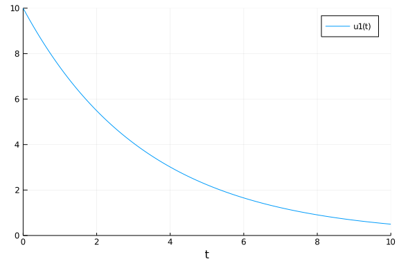
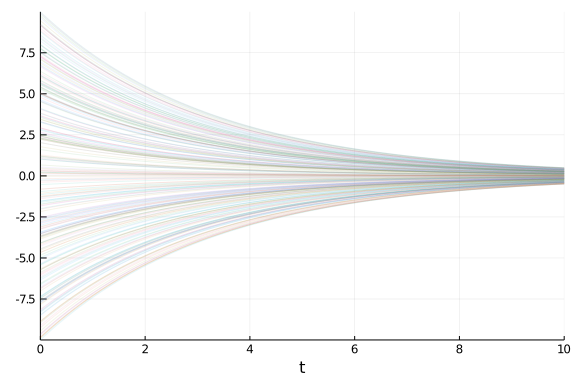
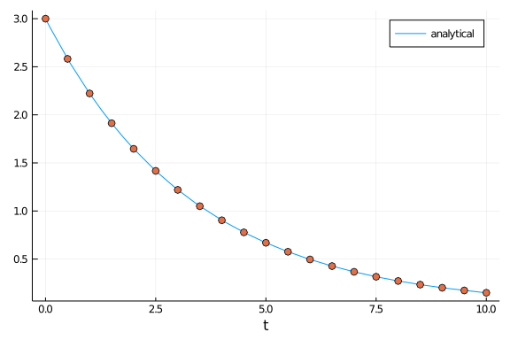
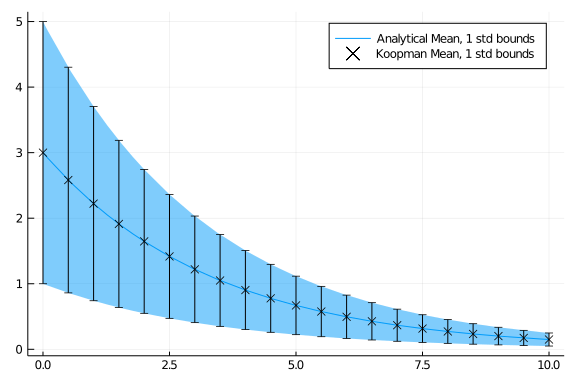

## System Model

First, lets consider the following linear model.

$$u' = p u$$

````julia

f(u,p,t) = p.*u
````


````
f (generic function with 1 method)
````


We then wish to solve this model on the timespan `t=0.0` to `t=10.0`, with an intial condition `u0=10.0` and parameter `p=-0.3`. We can then setup the differential equations, solve, and plot as follows

````julia

using DifferentialEquations, Plots
u0 = [10.0]
p = [-0.3]
tspan = (0.0,10.0)
prob = ODEProblem(f,u0,tspan,p)
sol = solve(prob)
plot(sol)
ylims!(0.0,10.0)
````





However, what if we wish to consider a random initial condition? Assume `u0` is distributed uniformly from `-10.0` to `10.0`, i.e.,

````julia

using Distributions
u0_dist = [Uniform(-10.0,10.0)]
````


````
1-element Array{Distributions.Uniform{Float64},1}:
 Distributions.Uniform{Float64}(a=-10.0, b=10.0)
````


We can then run a Monte Carlo simulation of 100,000 trajectories by solving an `EnsembleProblem`. 

````julia

prob_func(prob,i,repeat) = remake(prob, u0 = rand.(u0_dist))
ensemble_prob = EnsembleProblem(prob,prob_func=prob_func)

ensemblesol = solve(ensemble_prob,Tsit5(),EnsembleThreads(),trajectories=100000)
````


````
EnsembleSolution Solution of length 100000 with uType:
DiffEqBase.ODESolution{Float64,2,Array{Array{Float64,1},1},Nothing,Nothing,
Array{Float64,1},Array{Array{Array{Float64,1},1},1},DiffEqBase.ODEProblem{A
rray{Float64,1},Tuple{Float64,Float64},false,Array{Float64,1},DiffEqBase.OD
EFunction{false,typeof(Main.##WeaveSandBox#751.f),LinearAlgebra.UniformScal
ing{Bool},Nothing,Nothing,Nothing,Nothing,Nothing,Nothing,Nothing,Nothing,N
othing,Nothing,Nothing,Nothing},Base.Iterators.Pairs{Union{},Union{},Tuple{
},NamedTuple{(),Tuple{}}},DiffEqBase.StandardODEProblem},OrdinaryDiffEq.Tsi
t5,OrdinaryDiffEq.InterpolationData{DiffEqBase.ODEFunction{false,typeof(Mai
n.##WeaveSandBox#751.f),LinearAlgebra.UniformScaling{Bool},Nothing,Nothing,
Nothing,Nothing,Nothing,Nothing,Nothing,Nothing,Nothing,Nothing,Nothing,Not
hing},Array{Array{Float64,1},1},Array{Float64,1},Array{Array{Array{Float64,
1},1},1},OrdinaryDiffEq.Tsit5ConstantCache{Float64,Float64}},DiffEqBase.DES
tats}
````


Plotting the first 250 trajectories produces

````julia

plot(ensemblesol, vars = (0,1), lw=1,alpha=0.1, label=nothing, idxs = 1:250)
````





Given the ensemble solution, we can then compute the expectation of a function $g\left(\cdot\right)$ of the system state `u` at any time in the timespan, e.g. the state itself at `t=4.0` as

````julia

g(sol) = sol(4.0)
mean([g(sol) for sol in ensemblesol])
````


````
1-element Array{Float64,1}:
 -0.007573120887912955
````


Alternatively, DiffEqUncertainty.jl offers a convenient interface for this type of calculation, `expectation()`.

````julia

using DiffEqUncertainty
expectation(g, prob, u0_dist, p, MonteCarlo(), Tsit5(); trajectories=100000)
````


````
1-element Array{Float64,1}:
 -0.0037433989352062547
````


`expectation()` takes the function of interest $g$, an `ODEProblem`, the initial conditions and parameters, and an `AbstractExpectationAlgorithm`. Here we use `MonteCarlo()` to use the Monte Carlo algorithm. Note that the initial conditions and parameters can be arrays that freely mix numeric and continuous distribution types from Distributions.jl. Recall, that `u0_dist = [Uniform(-10.0,10.0)]`, while `p = [-0.3]`. From this specification, the expectation is solved as

$$\mathbb{E}\left[g\left(X\right)\vert X\sim Pf\right]$$

where $Pf$ is the "push-forward" density of the initial joint pdf $f$ on initial conditions and parameters. 

Alternatively, we could solve the same problem using the `Koopman()` algorithm. 

````julia

expectation(g, prob, u0_dist, p, Koopman(), Tsit5())
````


````
u: 1-element Array{Float64,1}:
 0.0
````


Being that this system is linear, we can analytically compute the solution as a deterministic ODE with its initial condition set to the expectation of the initial condition, i.e.,

$$e^{pt}\mathbb{E}\left[u_0\right]$$

````julia

exp(p[1]*4.0)*mean(u0_dist[1])
````


````
0.0
````


We see that for this case the `Koopman()` algorithm produces a more accurate solution than `MonteCarlo()`. Not only is it more accurate, it is also much faster

````julia

@time expectation(g, prob, u0_dist, p, MonteCarlo(), Tsit5(); trajectories=100000)
````


````
2.280767 seconds (79.32 M allocations: 7.160 GiB, 71.23% gc time)
1-element Array{Float64,1}:
 -0.0050382269528445305
````


````julia

@time expectation(g, prob, u0_dist, p, Koopman(), Tsit5())
````


````
0.000798 seconds (12.26 k allocations: 1.111 MiB)
u: 1-element Array{Float64,1}:
 0.0
````


Changing the distribution, we arrive at

````julia

u0_dist = [Uniform(0.0,10.0)]
@time expectation(g, prob, u0_dist, p, MonteCarlo(), Tsit5(); trajectories=100_000)
````


````
1.027060 seconds (79.30 M allocations: 7.160 GiB, 44.15% gc time)
1-element Array{Float64,1}:
 1.5059653813564504
````


and
````julia

@time expectation(g, prob, u0_dist, p, Koopman(), Tsit5())[1]
````


````
0.004259 seconds (14.02 k allocations: 1.221 MiB)
1.5059722133001539
````


where the analytical solution is 
````julia

exp(p[1]*4.0)*mean(u0_dist[1])
````


````
1.5059710595610105
````


Note that the `Koopman()` algorithm doesn't currently support infinite or semi-infinite integration domains, where the integration domain is determined by the extrema of the given distributions. So, trying to using a `Normal` distribution will produce `NaN`

````julia

u0_dist = [Normal(3.0,2.0)]
expectation(g, prob, u0_dist, p, Koopman(), Tsit5())
````


````
u: 1-element Array{Float64,1}:
 NaN
````


Here, the analytical solution is 

````julia

exp(p[1]*4.0)*mean(u0_dist[1])
````


````
0.9035826357366062
````


Using a truncated distribution will alleviate this problem. However, there is another gotcha. If a large majority of the probability mass of the distribution exists in a small region in the support, then the adaptive methods used to solve the expectation can "miss" the non-zero portions of the distribution and errantly return 0.0.

````julia

u0_dist = [truncated(Normal(3.0,2.0),-1000,1000)]
expectation(g, prob, u0_dist, p, Koopman(), Tsit5())
````


````
u: 1-element Array{Float64,1}:
 0.0
````


whereas truncating at $\pm 4\sigma$ produces the correct result
````julia

u0_dist = [truncated(Normal(3.0,2.0),-5,11)]
expectation(g, prob, u0_dist, p, Koopman(), Tsit5())
````


````
u: 1-element Array{Float64,1}:
 0.9035833577709517
````


If a large truncation is required, it is best practice to center the distribution on the truncated interval. This is because many of the underlying quadrature algorithms use the center of the interval as an evaluation point.

````julia

u0_dist = [truncated(Normal(3.0,2.0),3-1000,3+1000)]
expectation(g, prob, u0_dist, p, Koopman(), Tsit5())
````


````
u: 1-element Array{Float64,1}:
 0.903584360812248
````


## Vector-Valued Functions
`expectation()` can also handle vector-valued functions. Simply pass the vector-valued function and set the `nout` kwarg to the length of the vector the function returns.

Here, we demonstrate this by computing the expectation of `u` at `t=4.0s` and `t=6.0s`

````julia

g(sol) = [sol(4.0)[1], sol(6.0)[1]]
expectation(g, prob, u0_dist, p, Koopman(), Tsit5(); nout = 2)
````


````
u: 2-element Array{Float64,1}:
 0.903584360812248
 0.49589556820916314
````


with analytical solution
````julia

exp.(p.*[4.0,6.0])*mean(u0_dist[1])
````


````
2-element Array{Float64,1}:
 0.9035826357366062
 0.4958966646647597
````


this can be used to compute the expectation at a range of times simultaneously
````julia

saveat = tspan[1]:.5:tspan[2]
g(sol) = Matrix(sol)
mean_koop = expectation(g, prob, u0_dist, p, Koopman(), Tsit5(); nout = length(saveat), saveat=saveat)
````


````
u: 1×21 Array{Float64,2}:
 3.0  2.58213  2.22246  1.91289  1.64644  …  0.201619  0.173536  0.149364
````


We can then plot these values along with the analytical solution

````julia

plot(t->exp(p[1]*t)*mean(u0_dist[1]),tspan..., xlabel="t", label="analytical")
scatter!(collect(saveat),mean_koop.u[:],marker=:o, label=nothing)
````





### Benefits of Using Vector-Valued Functions
In the above examples we used vector-valued expectation calculations to compute the various expectations required. Alternatively, one could simply compute multiple scalar-valued expectations. However, in most cases it is more efficient to use the vector-valued form. This is especially true when the ODE to be solved is computationally expensive.

To demonstrate this, lets compute the expectation of $x$, $x^2$, and $x^3$ using both approaches while counting the number of times `g()` is evaluated. This is the same as the number of simulation runs required to arrive at the solution. First, consider the scalar-valued approach. Here, we follow the same method as before, but we add a counter to our function evaluation that stores the number of function calls for each expectation calculation to an array.

````julia

function g(sol, power, counter)
    counter[power] = counter[power] + 1
    sol(4.0)[1]^power
end

counters = [0,0,0]
x_koop = expectation(s->g(s,1,counters), prob, u0_dist, p, Koopman(), Tsit5())
x2_koop = expectation(s->g(s,2,counters), prob, u0_dist, p, Koopman(), Tsit5())
x3_koop = expectation(s->g(s,3,counters), prob, u0_dist, p, Koopman(), Tsit5())
counters
````


````
3-element Array{Int64,1}:
 375
 405
 375
````


Leading to a total of 1155 function evaluations.

Now, lets compare this to the vector-valued approach
````julia

function g(sol, counter) 
    counter[1] = counter[1] + 1
    v = sol(4.0)[1]
    [v, v^2, v^3]
end

counter = [0]
expectation(s->g(s,counter), prob, u0_dist, p, Koopman(), Tsit5(); nout = 3)
counter
````


````
1-element Array{Int64,1}:
 405
````


This is 35.06% the number of simulations required when using scalar-valued expectations. Note how the number of evaluations used in the vector-valued form is equivelent to the maximum number of evaluations for the 3 scalar-valued expectation calls.

## Higher-Order Moments
Leveraging this vector-valued capability, we can also efficiently compute higher-order central moments.

### Variance
The variance, or 2nd central moment, of a random variable $X$ is defined as

$$\mathrm{Var}\left(X\right)=\mathbb{E}\left[\left(X-\mu\right)^2\right]$$

where

$$\mu = \mathbb{E}\left[X\right]$$

The expression for the variance can be expanded to

$$\mathrm{Var}\left(X\right)=\mathbb{E}\left[X^2\right]-\mathbb{E}\left[X\right]^2$$

Using this, we define a function that returns the expectations of $X$ and $X^2$ as a vector-valued function and then compute the variance from these

````julia

function g(sol) 
    x = sol(4.0)[1]
    [x, x^2]
end

koop = expectation(g, prob, u0_dist, p, Koopman(), Tsit5(); nout = 2)
mean_koop = koop[1]
var_koop = koop[2] - mean_koop^2
````


````
0.36287237175498144
````


For a linear system, we can propagate the variance analytically as

$e^{2pt}\mathrm{Var}\left(u_0\right)$

````julia

exp(2*p[1]*4.0)*var(u0_dist[1])
````


````
0.36287181315765005
````


This can be computed at multiple time instances as well

````julia

saveat = tspan[1]:.5:tspan[2]
g(sol) = [Matrix(sol)'; (Matrix(sol).^2)']

koop = expectation(g, prob, u0_dist, p, Koopman(), Tsit5(); nout = length(saveat)*2, saveat=saveat)
μ = koop.u[1:length(saveat)]
σ = sqrt.(koop.u[length(saveat)+1:end] - μ.^2)

plot(t->exp(p[1]*t)*mean(u0_dist[1]),tspan..., ribbon = t->-sqrt(exp(2*p[1]*t)*var(u0_dist[1])), label="Analytical Mean, 1 std bounds")
scatter!(collect(saveat),μ,marker=:x, yerror = σ, c=:black, label = "Koopman Mean, 1 std bounds")
````





### Skewness
A similar approach can be used to compute skewness

````julia

function g(sol) 
    v = sol(4.0)[1]
    [v, v^2, v^3]
end

koop = expectation(g, prob, u0_dist, p, Koopman(), Tsit5(); nout = 3)
mean_koop = koop[1]
var_koop = koop[2] - mean_koop^2
(koop[3] - 3.0*mean_koop*var_koop - mean_koop^3) / var_koop^(3/2)
````


````
3.7952822389774445e-9
````


As the system is linear, we expect the skewness to be unchanged from the inital distribution. Becasue the distribution is a truncated Normal distribution centered on the mean, the true skewness is `0.0`.

### nth Central Moment
DiffEqUncertainty provides a convenience function `centralmoment` around this approach for higher-order central moments. It takes an integer for the number of central moments you wish to compute. While the rest of the arguments are the same as for  `expectation()`. The following will return central moments 1-5.

````julia

g(sol) = sol(4.0)[1]
centralmoment(5, g, prob, u0_dist, p, Koopman(), Tsit5(),
                ireltol = 1e-9, iabstol = 1e-9)
````


````
5-element Array{Float64,1}:
 0.0
 0.3628723692985327
 4.026725619610261e-10
 0.39502906894683987
 1.2523240222606091e-9
````


## Batch-Mode
It is also possible to solve the various simulations in parallel by using the `batch` kwarg and a batch-mode supported quadrature algorithm via the `quadalg` kwarg. To view the list of batch compatible quadrature algorithms, refer to [Quadrature.jl](https://github.com/SciML/Quadrature.jl). Note: Batch-mode operation is built on top of DifferentialEquation.jl's `EnsembleProblem`. See the [EnsembleProblem documentation](https://diffeq.sciml.ai/stable/features/ensemble/) for additional options.

The default quadtrature algorithm used by `expectation()` does not support batch-mode evaluation. So, we first load dependencies for additional quadrature algorithms

````julia
using Quadrature, Cuba
````


We then solve our expectation as before using a `batch=10` multi-thread parallelization via `EnsembleThreads()` of Cuba's SUAVE algorithm. However, in this case we introduce additional uncertainty in the model parameter.

````julia

u0_dist = [truncated(Normal(3.0,2.0),-5,11)]
p_dist = [truncated(Normal(-.7, .1), -1,0)]

g(sol) = sol(6.0)[1]

expectation(g, prob, u0_dist, p_dist, Koopman(), Tsit5(), EnsembleThreads(); 
                quadalg = CubaSUAVE(), batch=10)[1]
````


````
0.05397860786456136
````


Now, lets compare the performance of the batch and non-batch modes

````julia

using BenchmarkTools

@btime expectation(g, prob, u0_dist, p_dist, Koopman(), Tsit5(); 
                quadalg = CubaSUAVE())[1]
````


````
44.556 ms (1006187 allocations: 91.55 MiB)
0.05397860786456136
````


````julia

@btime expectation(g, prob, u0_dist, p_dist, Koopman(), Tsit5(), EnsembleThreads(); 
                quadalg = CubaSUAVE(), batch=10)[1]
````


````
21.936 ms (1019426 allocations: 93.00 MiB)
0.05397860786456136
````


It is also possible to parallelize across the GPU. However, one must be careful of the limitations of ensemble solutions with the GPU. Please refer to [DiffEqGPU.jl](https://github.com/SciML/DiffEqGPU.jl) for details.

Here we load `DiffEqGPU` and modify our problem to use Float32 and to put the ODE in the required GPU form

````julia

using DiffEqGPU

function f(du, u,p,t) 
    @inbounds begin
        du[1] = p[1]*u[1];
    end
    nothing
end

u0 = Float32[10.0]
p = Float32[-0.3]
tspan = (0.0f0,10.0f0)
prob = ODEProblem(f,u0,tspan,p)

g(sol) = sol(6.0)[1]

u0_dist = [truncated(Normal(3.0f0,2.0f0),-5f0,11f0)]
p_dist = [truncated(Normal(-.7f0, .1f0), -1f0,0f0)]

@btime expectation(g, prob, u0_dist, p_dist, Koopman(), Tsit5(), EnsembleGPUArray(); 
                   quadalg = CubaSUAVE(), batch=1000)[1]
````


````
6.861 ms (76204 allocations: 3.71 MiB)
0.056093966910433016
````


The performance gains realized by leveraging batch GPU processing is problem dependent. In this case, the number of batch evaluations required to overcome the overhead of using the GPU exceeds the number of simulations required to converge to the quadrature solution.


## Appendix

 This tutorial is part of the SciMLTutorials.jl repository, found at: <https://github.com/SciML/SciMLTutorials.jl>.
 For more information on doing scientific machine learning (SciML) with open source software, check out <https://sciml.ai/>.

To locally run this tutorial, do the following commands:
```
using SciMLTutorials
SciMLTutorials.weave_file("DiffEqUncertainty","01-expectation_introduction.jmd")
```

Computer Information:
```
Julia Version 1.4.2
Commit 44fa15b150* (2020-05-23 18:35 UTC)
Platform Info:
  OS: Linux (x86_64-pc-linux-gnu)
  CPU: Intel(R) Core(TM) i7-9700K CPU @ 3.60GHz
  WORD_SIZE: 64
  LIBM: libopenlibm
  LLVM: libLLVM-8.0.1 (ORCJIT, skylake)
Environment:
  JULIA_LOAD_PATH = /builds/JuliaGPU/DiffEqTutorials.jl:
  JULIA_DEPOT_PATH = /builds/JuliaGPU/DiffEqTutorials.jl/.julia
  JULIA_CUDA_MEMORY_LIMIT = 2147483648
  JULIA_NUM_THREADS = 8

```

Package Information:

```
Status `/builds/JuliaGPU/DiffEqTutorials.jl/tutorials/DiffEqUncertainty/Project.toml`
[6e4b80f9-dd63-53aa-95a3-0cdb28fa8baf] BenchmarkTools 0.5.0
[8a292aeb-7a57-582c-b821-06e4c11590b1] Cuba 2.1.0
[071ae1c0-96b5-11e9-1965-c90190d839ea] DiffEqGPU 1.6.0
[41bf760c-e81c-5289-8e54-58b1f1f8abe2] DiffEqSensitivity 6.31.1
[ef61062a-5684-51dc-bb67-a0fcdec5c97d] DiffEqUncertainty 1.5.0
[0c46a032-eb83-5123-abaf-570d42b7fbaa] DifferentialEquations 6.15.0
[31c24e10-a181-5473-b8eb-7969acd0382f] Distributions 0.23.8
[f6369f11-7733-5829-9624-2563aa707210] ForwardDiff 0.10.12
[76087f3c-5699-56af-9a33-bf431cd00edd] NLopt 0.6.0
[1dea7af3-3e70-54e6-95c3-0bf5283fa5ed] OrdinaryDiffEq 5.42.3
[91a5bcdd-55d7-5caf-9e0b-520d859cae80] Plots 1.6.0
[67601950-bd08-11e9-3c89-fd23fb4432d2] Quadrature 1.3.0
```
