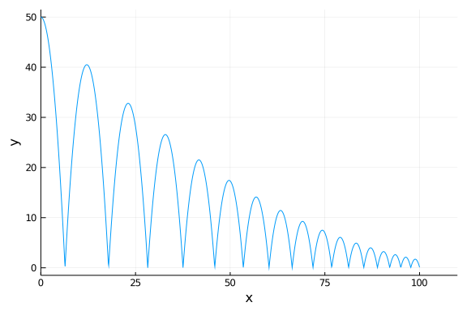
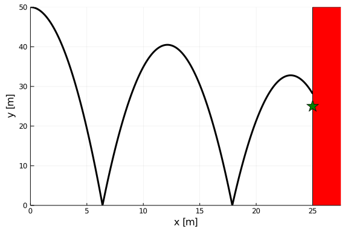
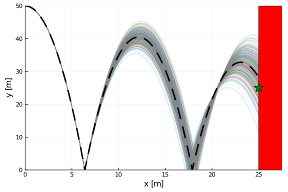
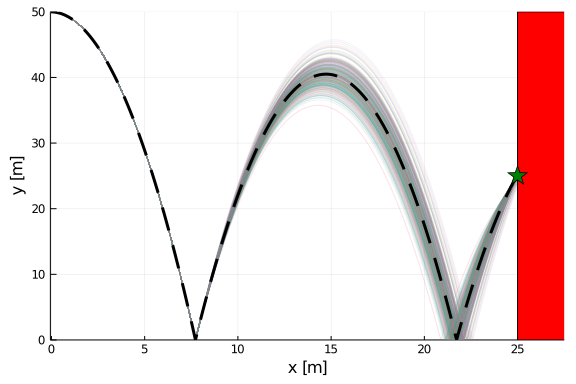
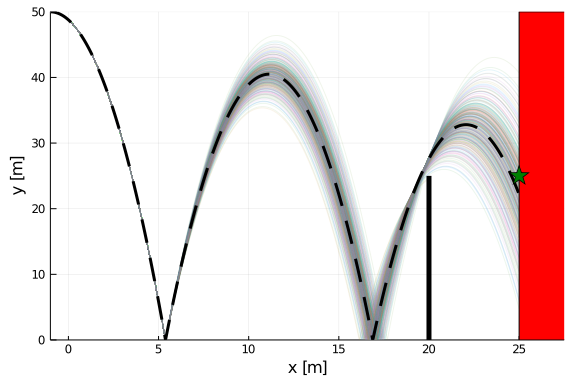
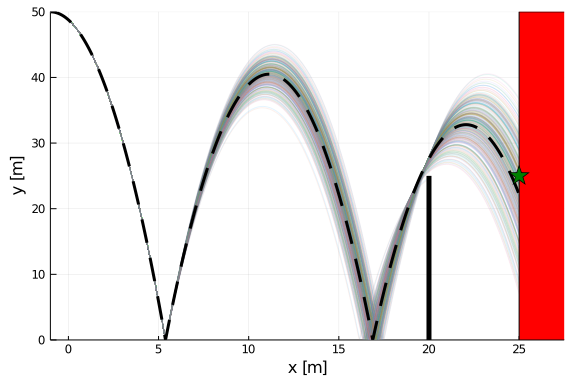

This tutorial gives and overview of how to leverage the efficient Koopman expectation method from DiffEqUncertainty to perform optimization under uncertainty. We demonstrate this by using a bouncing ball model with an uncertain model parameter. We also demonstrate its application to problems with probabilistic constraints, in particular a special class of constraints called chance constraints. 

## System Model
First lets consider a 2D bouncing ball, where the states are the horizontal position $x$, horizontal velocity $\dot{x}$, vertical position $y$, and vertical velocity $\dot{y}$. This model has two system parameters, acceleration due to gravity and coefficient of restitution (models energy loss when the ball impacts the ground). We can simulate such a system using `ContinuousCallback` as

````julia
using OrdinaryDiffEq, Plots

function ball!(du,u,p,t) 
    du[1] = u[2]
    du[2] = 0.0
    du[3] = u[4]
    du[4] = -p[1]
end

ground_condition(u,t,integrator) = u[3]
ground_affect!(integrator) = integrator.u[4] = -integrator.p[2] * integrator.u[4]
ground_cb = ContinuousCallback(ground_condition, ground_affect!)

u0 = [0.0,2.0,50.0,0.0]
tspan = (0.0,50.0)
p = [9.807, 0.9]

prob = ODEProblem(ball!,u0,tspan,p)
sol = solve(prob,Tsit5(),callback=ground_cb)
plot(sol, vars=(1,3), label = nothing, xlabel="x", ylabel="y")
````





For this particular problem, we wish to measure the impact distance from a point $y=25$ on a wall at $x=25$. So, we introduce an additional callback that terminates the simulation on wall impact. 

````julia
stop_condition(u,t,integrator) = u[1] - 25.0
stop_cb = ContinuousCallback(stop_condition, terminate!)
cbs = CallbackSet(ground_cb, stop_cb)

tspan = (0.0, 1500.0)
prob = ODEProblem(ball!,u0,tspan,p)
sol = solve(prob,Tsit5(),callback=cbs)
````


To help visualize this problem, we plot as follows, where the star indicates a desired impace location
````julia
rectangle(xc, yc, w, h) = Shape(xc .+ [-w,w,w,-w]./2.0, yc .+ [-h,-h,h,h]./2.0)

begin
    plot(sol, vars=(1,3), label=nothing, lw = 3, c=:black)
    xlabel!("x [m]")
    ylabel!("y [m]")
    plot!(rectangle(27.5, 25, 5, 50), c=:red, label = nothing)
    scatter!([25],[25],marker=:star, ms=10, label = nothing,c=:green)
    ylims!(0.0,50.0)
end
````





## Considering Uncertainty
We now wish to introduce uncertainty in `p[2]`, the coefficient of restitution. This is defined via a continuous univiate distribution from Distributions.jl. We can then run a Monte Carlo simulation of 100,000 trajectories via the `EnsembleProblem` interface.

````julia
using Distributions

cor_dist = truncated(Normal(0.9, 0.02), 0.9-3*0.02, 1.0)
trajectories = 100000

prob_func(prob,i,repeat) = remake(prob, p = [p[1], rand(cor_dist)])
ensemble_prob = EnsembleProblem(prob,prob_func=prob_func)
ensemblesol = solve(ensemble_prob,Tsit5(),EnsembleThreads(),trajectories=trajectories, callback=cbs)

begin # plot
    plot(ensemblesol, vars = (1,3), lw=1,alpha=0.2, label=nothing, idxs = 1:350)
    xlabel!("x [m]")
    ylabel!("y [m]")
    plot!(rectangle(27.5, 25, 5, 50), c=:red, label = nothing)
    scatter!([25],[25],marker=:star, ms=10, label = nothing, c=:green)
    plot!(sol, vars=(1,3), label=nothing, lw = 3, c=:black, ls=:dash)
    xlims!(0.0,27.5)
end
````





Here, we plot the first 350 Monte Carlo simulations along with the trajectory corrresponding to the mean of the distribution (dashed line).

We now wish to compute the expected squared impact distance from the star. This is called an "observation" of our system or an "observable" of interest. 

We define this observable as

````julia
obs(sol) = abs2(sol[3,end]-25)
````


````
obs (generic function with 1 method)
````


With the observable defined, we can compute the expected squared miss distance from our Monte Carlo simulation results as

````julia
mean_ensemble = mean([obs(sol) for sol in ensemblesol])
````


````
36.003264051459894
````


Alternatively, we can use the `Koopman()` algorithm in DiffEqUncertainty.jl to compute this expectation much more efficiently as

````julia
using DiffEqUncertainty

p_uncertain = [9.807, cor_dist]
expectation(obs, prob, u0, p_uncertain, Koopman(), Tsit5();
            ireltol = 1e-5, callback=cbs)
````


````
u: 36.008628214169704
````


## Optimization Under Uncertainty
We now wish to optimize the initial position ($x_0,y_0$) and horizontal velocity ($\dot{x}_0$) of the system to minimize the expected squared miss distance from the star, where $x_0\in\left[-100,0\right]$, $y_0\in\left[1,3\right]$, and $\dot{x}_0\in\left[10,50\right]$. We will demonstrate this using a gradient-based optimization approach from NLopt.jl using `ForwardDiff.jl` AD through the expectation calculation.

First, we load the required packages and define our loss function

````julia
using NLopt, DiffEqSensitivity, ForwardDiff

make_u0(θ) = [θ[1],θ[2],θ[3], 0.0]

function 𝔼_loss(θ)   # \bbE
    u0 = make_u0(θ)
    expectation(obs, prob, u0, p_uncertain, Koopman(), Tsit5();
                 ireltol = 1e-5, callback=cbs)[1]
end
````


````
𝔼_loss (generic function with 1 method)
````


NLopt requires that this loss function return the loss as above, but also do an inplace update of the gradient. So, we wrap this function to put it in the form required by NLopt. 

````julia
function 𝔼_loss_nlopt(x,∇)
    length(∇) > 0 ? ForwardDiff.gradient!(∇, 𝔼_loss,x) : nothing
    𝔼_loss(x)
end
````


````
𝔼_loss_nlopt (generic function with 1 method)
````


We then optimize using the [Method of Moving Asymptotes](https://nlopt.readthedocs.io/en/latest/NLopt_Algorithms/#mma-method-of-moving-asymptotes-and-ccsa) algorithm (`:LD_MMA`)

````julia
opt = Opt(:LD_MMA, 3)
opt.lower_bounds = [-100.0,1.0, 10.0]
opt.upper_bounds = [0.0,3.0, 50.0]
opt.xtol_rel = 1e-3
opt.min_objective = 𝔼_loss_nlopt
(minf,minx,ret) = NLopt.optimize(opt, [-1.0, 2.0, 50.0])
````


````
(0.0838151729557601, [-0.05713109086715892, 2.4366742783682063, 49.99835957
072762], :XTOL_REACHED)
````


Let's now visualize 350 Monte Carlo simulations

````julia
ensembleprob = EnsembleProblem(remake(prob,u0 = make_u0(minx)),prob_func=prob_func)
ensemblesol = solve(ensembleprob,Tsit5(),EnsembleThreads(), trajectories=100_000, callback=cbs)

begin
    plot(ensemblesol, vars = (1,3), lw=1,alpha=0.1, label=nothing, idxs = 1:350)
    plot!(solve(remake(prob, u0=make_u0(minx)),Tsit5(), callback=cbs), 
            vars=(1,3),label = nothing, c=:black, lw=3,ls=:dash)
    xlabel!("x [m]")
    ylabel!("y [m]")
    plot!(rectangle(27.5, 25, 5, 50), c=:red, label = nothing)
    scatter!([25],[25],marker=:star, ms=10, label = nothing,c=:green)
    ylims!(0.0,50.0)
    xlims!(minx[1], 27.5)
end
````





Looks pretty good! But, how long did it take? Let's benchmark.

````julia
using BenchmarkTools

@btime NLopt.optimize($opt, $[-1.0, 2.0, 50.0])
````


````
131.701 ms (851126 allocations: 63.07 MiB)
(0.0838151729557601, [-0.05713109086715892, 2.4366742783682063, 49.99835957
072762], :XTOL_REACHED)
````


Not bad for bound constrained optimization under uncertainty of a hybrid system!

## Probabilistic Constraints

With this approach we can also consider probabilistic constraints. Let us now consider a wall at $x=20$ with height 25.

````julia
constraint = [20.0, 25.0]
begin
    plot(rectangle(27.5, 25, 5, 50), c=:red, label = nothing)
    xlabel!("x [m]")
    ylabel!("y [m]")
    plot!([constraint[1], constraint[1]],[0.0,constraint[2]], lw=5, c=:black, label=nothing)
    scatter!([25],[25],marker=:star, ms=10, label = nothing,c=:green)
    ylims!(0.0,50.0)
    xlims!(minx[1], 27.5)
end
````


We now wish to minimize the same loss function as before, but introduce an inequality constraint such that the solution must have less than a 1% chance of colliding with the wall at $x=20$. This class of probabilistic constraints is called a chance constraint. 

To do this, we first introduce a new callback and solve the system using the previous optimal solution

````julia
constraint_condition(u,t,integrator) = u[1] - constraint[1]
constraint_affect!(integrator) = integrator.u[3] < constraint[2] ? terminate!(integrator) : nothing
constraint_cb = ContinuousCallback(constraint_condition, constraint_affect!, save_positions=(true,false));
constraint_cbs = CallbackSet(ground_cb, stop_cb, constraint_cb)

ensemblesol = solve(ensembleprob,Tsit5(),EnsembleThreads(), trajectories=350, callback=constraint_cbs, maxstep=0.1)

begin
    plot(ensemblesol, vars = (1,3), lw=1,alpha=0.1, label=nothing)
    plot!(solve(remake(prob, u0=make_u0(minx)),Tsit5(), callback=constraint_cbs), 
            vars=(1,3),label = nothing, c=:black, lw=3, ls=:dash)

    xlabel!("x [m]")
    ylabel!("y [m]")
    plot!(rectangle(27.5, 25, 5, 50), c=:red, label = nothing)
    plot!([constraint[1], constraint[1]],[0.0,constraint[2]], lw=5, c=:black)
    scatter!([25],[25],marker=:star, ms=10, label = nothing,c=:green)
    ylims!(0.0,50.0)
    xlims!(minx[1], 27.5)
end
````





That doesn't look good! 

We now need a second observable for the system. In order to compute a probability of impact, we use an indicator function for if a trajectory impacts the wall. In other words, this functions returns 1 if the trajectory hits the wall and 0 otherwise.

````julia
constraint_obs(sol) = sol[1,end] ≈ constraint[1] ? one(sol[1,end]) : zero(sol[1,end])
````


````
constraint_obs (generic function with 1 method)
````


Using the previously computed optimal initial conditions, lets compute the probability of hitting this wall

````julia
expectation(constraint_obs, prob, make_u0(minx), p_uncertain, Koopman(), Tsit5();
            ireltol= 1e-9, iabstol = 1e-9, callback=constraint_cbs)[1]
````


````
0.9910305871387488
````


We then setup the constraint function for NLopt just as before. 

````julia
function 𝔼_constraint(θ)
    u0 = [θ[1],θ[2],θ[3], 0.0]
    expectation(constraint_obs, prob, u0, p_uncertain, Koopman(), Tsit5(),
                ireltol= 1e-9, iabstol = 1e-9,callback=constraint_cbs)[1]
end

function 𝔼_constraint_nlopt(x,∇)
    length(∇) > 0 ? ForwardDiff.gradient!(∇, 𝔼_constraint,x) : nothing
    𝔼_constraint(x) - 0.01
end
````


````
𝔼_constraint_nlopt (generic function with 1 method)
````


Note that NLopt requires the constraint function to be of the form $g(x) \leq 0$. Hence, why we return `𝔼_constraint(x) - 0.01` for the 1% chance constraint.

The rest of the NLopt setup looks the same as before with the exception of adding the inequality constraint

````julia
opt = Opt(:LD_MMA, 3)
opt.lower_bounds = [-100.0, 1.0, 10.0]
opt.upper_bounds = [0.0, 3.0, 50.0]
opt.xtol_rel = 1e-3
opt.min_objective = 𝔼_loss_nlopt
inequality_constraint!(opt,𝔼_constraint_nlopt, 1e-5)
(minf2,minx2,ret2) = NLopt.optimize(opt, [-1.0, 2.0, 50.0])
````


````
(40.28996781875263, [-0.8176321801341233, 2.000952669391841, 50.0], :XTOL_R
EACHED)
````


The probability of impacting the wall is now

````julia
λ = 𝔼_constraint(minx2)
````


````
0.010004498174330818
````


We can check if this is within tolerance by
````julia
λ - 0.01 <= 1e-5
````


````
true
````


Again, we plot some Monte Carlo simulations from this result as follows

````julia
ensembleprob = EnsembleProblem(remake(prob,u0 = make_u0(minx2)),prob_func=prob_func)
ensemblesol = solve(ensembleprob,Tsit5(),EnsembleThreads(), 
                    trajectories=350, callback=constraint_cbs)

begin
    plot(ensemblesol, vars = (1,3), lw=1,alpha=0.1, label=nothing)
    plot!(solve(remake(prob, u0=make_u0(minx2)),Tsit5(), callback=constraint_cbs), 
            vars=(1,3),label = nothing, c=:black, lw=3, ls=:dash)
    plot!([constraint[1], constraint[1]],[0.0,constraint[2]], lw=5, c=:black)

    xlabel!("x [m]")
    ylabel!("y [m]")
    plot!(rectangle(27.5, 25, 5, 50), c=:red, label = nothing)
    scatter!([25],[25],marker=:star, ms=10, label = nothing,c=:green)
    ylims!(0.0,50.0)
    xlims!(minx[1], 27.5)
end
````





## Appendix

 This tutorial is part of the SciMLTutorials.jl repository, found at: <https://github.com/SciML/SciMLTutorials.jl>.
 For more information on doing scientific machine learning (SciML) with open source software, check out <https://sciml.ai/>.

To locally run this tutorial, do the following commands:
```
using SciMLTutorials
SciMLTutorials.weave_file("DiffEqUncertainty","02-AD_and_optimization.jmd")
```

Computer Information:
```
Julia Version 1.4.2
Commit 44fa15b150* (2020-05-23 18:35 UTC)
Platform Info:
  OS: Linux (x86_64-pc-linux-gnu)
  CPU: Intel(R) Core(TM) i7-9700K CPU @ 3.60GHz
  WORD_SIZE: 64
  LIBM: libopenlibm
  LLVM: libLLVM-8.0.1 (ORCJIT, skylake)
Environment:
  JULIA_LOAD_PATH = /builds/JuliaGPU/DiffEqTutorials.jl:
  JULIA_DEPOT_PATH = /builds/JuliaGPU/DiffEqTutorials.jl/.julia
  JULIA_CUDA_MEMORY_LIMIT = 2147483648
  JULIA_NUM_THREADS = 8

```

Package Information:

```
Status `/builds/JuliaGPU/DiffEqTutorials.jl/tutorials/DiffEqUncertainty/Project.toml`
[6e4b80f9-dd63-53aa-95a3-0cdb28fa8baf] BenchmarkTools 0.5.0
[8a292aeb-7a57-582c-b821-06e4c11590b1] Cuba 2.1.0
[071ae1c0-96b5-11e9-1965-c90190d839ea] DiffEqGPU 1.5.0
[41bf760c-e81c-5289-8e54-58b1f1f8abe2] DiffEqSensitivity 6.28.0
[ef61062a-5684-51dc-bb67-a0fcdec5c97d] DiffEqUncertainty 1.5.0
[0c46a032-eb83-5123-abaf-570d42b7fbaa] DifferentialEquations 6.15.0
[31c24e10-a181-5473-b8eb-7969acd0382f] Distributions 0.23.8
[f6369f11-7733-5829-9624-2563aa707210] ForwardDiff 0.10.12
[76087f3c-5699-56af-9a33-bf431cd00edd] NLopt 0.6.0
[1dea7af3-3e70-54e6-95c3-0bf5283fa5ed] OrdinaryDiffEq 5.42.1
[91a5bcdd-55d7-5caf-9e0b-520d859cae80] Plots 1.5.8
[67601950-bd08-11e9-3c89-fd23fb4432d2] Quadrature 1.3.0
```
