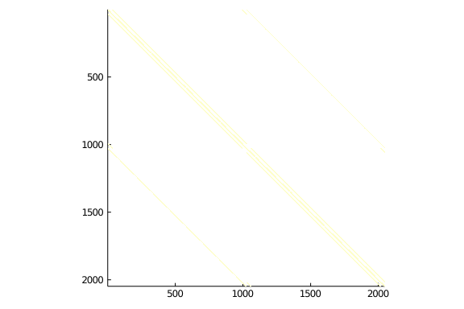
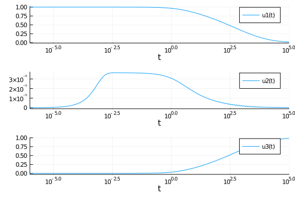

This tutorial is for getting into the extra features for solving stiff ordinary
differential equations in an efficient manner. Solving stiff ordinary
differential equations requires specializing the linear solver on properties of
the Jacobian in order to cut down on the O(n^3) linear solve and the O(n^2)
back-solves. Note that these same functions and controls also extend to stiff
SDEs, DDEs, DAEs, etc.

## Code Optimization for Differential Equations

### Writing Efficient Code

For a detailed tutorial on how to optimize one's DifferentialEquations.jl code,
please see the
[Optimizing DiffEq Code tutorial](http://tutorials.juliadiffeq.org/html/introduction/03-optimizing_diffeq_code.html).

### Choosing a Good Solver

Choosing a good solver is required for getting top notch speed. General
recommendations can be found on the solver page (for example, the
[ODE Solver Recommendations](https://docs.juliadiffeq.org/dev/solvers/ode_solve)).
The current recommendations can be simplified to a Rosenbrock method
(`Rosenbrock23` or `Rodas5`) for smaller (<50 ODEs) problems, ESDIRK methods
for slightly larger (`TRBDF2` or `KenCarp4` for <2000 ODEs), and Sundials
`CVODE_BDF` for even larger problems. `lsoda` from
[LSODA.jl](https://github.com/rveltz/LSODA.jl) is generally worth a try.

More details on the solver to choose can be found by benchmarking. See the
[DiffEqBenchmarks](https://github.com/JuliaDiffEq/DiffEqBenchmarks.jl) to
compare many solvers on many problems.

### Check Out the Speed FAQ

See [this FAQ](https://docs.juliadiffeq.org/latest/basics/faq/#faq_performance-1)
for information on common pitfalls and how to improve performance.

### Setting Up Your Julia Installation for Speed

Julia uses an underlying BLAS implementation for its matrix multiplications
and factorizations. This library is automatically multithreaded and accelerates
the internal linear algebra of DifferentialEquations.jl. However, for optimality,
you should make sure that the number of BLAS threads that you are using matches
the number of physical cores and not the number of logical cores. See
[this issue for more details](https://github.com/JuliaLang/julia/issues/33409).

To check the number of BLAS threads, use:

````julia
ccall((:openblas_get_num_threads64_, Base.libblas_name), Cint, ())
````


````
4
````


If I want to set this directly to 4 threads, I would use:

````julia
using LinearAlgebra
LinearAlgebra.BLAS.set_num_threads(4)
````


Additionally, in some cases Intel's MKL might be a faster BLAS than the standard
BLAS that ships with Julia (OpenBLAS). To switch your BLAS implementation, you
can use [MKL.jl](https://github.com/JuliaComputing/MKL.jl) which will accelerate
the linear algebra routines. Please see the package for the limitations.

### Use Accelerator Hardware

When possible, use GPUs. If your ODE system is small and you need to solve it
with very many different parameters, see the
[ensembles interface](https://docs.juliadiffeq.org/dev/features/ensemble)
and [DiffEqGPU.jl](https://github.com/JuliaDiffEq/DiffEqGPU.jl). If your problem
is large, consider using a [CuArray](https://github.com/JuliaGPU/CuArrays.jl)
for the state to allow for GPU-parallelism of the internal linear algebra.

## Speeding Up Jacobian Calculations

When one is using an implicit or semi-implicit differential equation solver,
the Jacobian must be built at many iterations and this can be one of the most
expensive steps. There are two pieces that must be optimized in order to reach
maximal efficiency when solving stiff equations: the sparsity pattern and the
construction of the Jacobian. The construction is filling the matrix
`J` with values, while the sparsity pattern is what `J` to use.

The sparsity pattern is given by a prototype matrix, the `jac_prototype`, which
will be copied to be used as `J`. The default is for `J` to be a `Matrix`,
i.e. a dense matrix. However, if you know the sparsity of your problem, then
you can pass a different matrix type. For example, a `SparseMatrixCSC` will
give a sparse matrix. Additionally, structured matrix types like `Tridiagonal`,
`BandedMatrix` (from
[BandedMatrices.jl](https://github.com/JuliaMatrices/BandedMatrices.jl)),
`BlockBandedMatrix` (from
[BlockBandedMatrices.jl](https://github.com/JuliaMatrices/BlockBandedMatrices.jl)),
and more can be given. DifferentialEquations.jl will internally use this matrix
type, making the factorizations faster by utilizing the specialized forms.

For the construction, there are 3 ways to fill `J`:

- The default, which uses normal finite/automatic differentiation
- A function `jac(J,u,p,t)` which directly computes the values of `J`
- A `colorvec` which defines a sparse differentiation scheme.

We will now showcase how to make use of this functionality with growing complexity.

### Declaring Jacobian Functions

Let's solve the Rosenbrock equations:

$$\begin{align}
dy_1 &= -0.04y₁ + 10^4 y_2 y_3 \\
dy_2 &= 0.04 y_1 - 10^4 y_2 y_3 - 3*10^7 y_{2}^2 \\
dy_3 &= 3*10^7 y_{3}^2 \\
\end{align}$$

In order to reduce the Jacobian construction cost, one can describe a Jacobian
function by using the `jac` argument for the `ODEFunction`. First, let's do
a standard `ODEProblem`:

````julia
using DifferentialEquations
function rober(du,u,p,t)
  y₁,y₂,y₃ = u
  k₁,k₂,k₃ = p
  du[1] = -k₁*y₁+k₃*y₂*y₃
  du[2] =  k₁*y₁-k₂*y₂^2-k₃*y₂*y₃
  du[3] =  k₂*y₂^2
  nothing
end
prob = ODEProblem(rober,[1.0,0.0,0.0],(0.0,1e5),(0.04,3e7,1e4))
sol = solve(prob,Rosenbrock23())

using Plots
plot(sol, xscale=:log10, tspan=(1e-6, 1e5), layout=(3,1))
````


````julia
using BenchmarkTools
@btime solve(prob)
````


````
310.245 μs (2779 allocations: 156.72 KiB)
retcode: Success
Interpolation: Automatic order switching interpolation
t: 115-element Array{Float64,1}:
      0.0
      0.0014148468219250373
      0.0020449182545311173
      0.0031082402716566307
      0.004077787050059496
      0.005515332443361059
      0.007190040962774541
      0.009125372578778032
      0.011053912492732977
      0.012779077276958607
      ⋮
  47335.56357690261
  52732.01292853374
  58693.72991412389
  65278.000210850696
  72548.20206513454
  80574.5643369749
  89435.05301092885
  99216.41264599326
 100000.0
u: 115-element Array{Array{Float64,1},1}:
 [1.0, 0.0, 0.0]
 [0.9999434113193613, 3.283958829839966e-5, 2.3749092340286502e-5]
 [0.9999182177783585, 3.55426801363446e-5, 4.6239541505020656e-5]
 [0.999875715036629, 3.6302469334849744e-5, 8.798249403609506e-5]
 [0.9998369766077329, 3.646280308115459e-5, 0.00012656058918590176]
 [0.9997795672444667, 3.646643085642237e-5, 0.0001839663246768369]
 [0.9997127287139348, 3.6447279992896e-5, 0.00025082400607228316]
 [0.9996355450022019, 3.6366816179962866e-5, 0.00032808818161818775]
 [0.9995586925734838, 3.6018927453312764e-5, 0.00040528849906290045]
 [0.9994899965196854, 3.468694637786026e-5, 0.000475316533936808]
 ⋮
 [0.03394368168613229, 1.404798439362035e-7, 0.9660561778340258]
 [0.031028975539652698, 1.280360743781007e-7, 0.9689708964242754]
 [0.02835436357223889, 1.1668209524677941e-7, 0.9716455197456683]
 [0.025901326001934923, 1.0632276689411095e-7, 0.9740985676753005]
 [0.023652545345805354, 9.687112514942483e-8, 0.9763473577830714]
 [0.021591862129552664, 8.824767963573306e-8, 0.9784080496227692]
 [0.019704225538717677, 8.037977048382674e-8, 0.9802956940815135]
 [0.017975641463053707, 7.320098240041474e-8, 0.9820242853359655]
 [0.017850566233695766, 7.268384360678819e-8, 0.9821493610824623]
````


Now we want to add the Jacobian. First we have to derive the Jacobian
$\frac{df_i}{du_j}$ which is `J[i,j]`. From this we get:

````julia
function rober_jac(J,u,p,t)
  y₁,y₂,y₃ = u
  k₁,k₂,k₃ = p
  J[1,1] = k₁ * -1
  J[2,1] = k₁
  J[3,1] = 0
  J[1,2] = y₃ * k₃
  J[2,2] = y₂ * k₂ * -2 + y₃ * k₃ * -1
  J[3,2] = y₂ * 2 * k₂
  J[1,3] = k₃ * y₂
  J[2,3] = k₃ * y₂ * -1
  J[3,3] = 0
  nothing
end
f = ODEFunction(rober, jac=rober_jac)
prob_jac = ODEProblem(f,[1.0,0.0,0.0],(0.0,1e5),(0.04,3e7,1e4))

@btime solve(prob_jac)
````


````
235.800 μs (2312 allocations: 147.88 KiB)
retcode: Success
Interpolation: Automatic order switching interpolation
t: 115-element Array{Float64,1}:
      0.0
      0.0014148468219250373
      0.0020449182545311173
      0.0031082402716566307
      0.004077787050059496
      0.005515332443361059
      0.007190040962774541
      0.009125372578778032
      0.011053912492732977
      0.012779077276958607
      ⋮
  45964.060340548356
  51219.40381376205
  57025.01899700374
  63436.021374561584
  70513.1073617524
  78323.14229130604
  86939.82338876331
  96444.41085674686
 100000.0
u: 115-element Array{Array{Float64,1},1}:
 [1.0, 0.0, 0.0]
 [0.9999434113193613, 3.283958829839966e-5, 2.3749092340286502e-5]
 [0.9999182177783585, 3.55426801363446e-5, 4.6239541505020656e-5]
 [0.999875715036629, 3.6302469334849744e-5, 8.798249403609506e-5]
 [0.9998369766077329, 3.646280308115459e-5, 0.00012656058918590176]
 [0.9997795672444667, 3.646643085642237e-5, 0.0001839663246768369]
 [0.9997127287139348, 3.6447279992896e-5, 0.00025082400607228316]
 [0.9996355450022019, 3.6366816179962866e-5, 0.00032808818161818775]
 [0.9995586925734838, 3.6018927453312764e-5, 0.00040528849906290045]
 [0.9994899965196854, 3.468694637786026e-5, 0.000475316533936808]
 ⋮
 [0.03478048133177493, 1.4406682005231008e-7, 0.9652193746014031]
 [0.03179591062189176, 1.313038656880417e-7, 0.9682039580742408]
 [0.029057356622057315, 1.1966100432939363e-7, 0.9709425237169371]
 [0.02654597011713668, 1.0904070990251299e-7, 0.9734539208421517]
 [0.024244118287194777, 9.935385522693504e-8, 0.9757557823589477]
 [0.022135344621501105, 9.05190025093182e-8, 0.9778645648594945]
 [0.02020432071854, 8.246174295748071e-8, 0.9797955968197154]
 [0.018436796681356796, 7.511410189106845e-8, 0.9815631282045397]
 [0.01785426048218692, 7.269900678199638e-8, 0.9821456668188047]
````


### Automatic Derivation of Jacobian Functions

But that was hard! If you want to take the symbolic Jacobian of numerical
code, we can make use of [ModelingToolkit.jl](https://github.com/JuliaDiffEq/ModelingToolkit.jl)
to symbolicify the numerical code and do the symbolic calculation and return
the Julia code for this.

````julia
using ModelingToolkit
de = modelingtoolkitize(prob)
````


````
Error: MethodError: no method matching size(::Tuple{Float64,Float64,Float64
})
Closest candidates are:
  size(::Tuple, !Matched::Integer) at tuple.jl:22
  size(!Matched::BitArray{1}) at bitarray.jl:99
  size(!Matched::BitArray{1}, !Matched::Integer) at bitarray.jl:103
  ...
````


````julia
ModelingToolkit.generate_jacobian(de...)[2] # Second is in-place
````


````
Error: UndefVarError: de not defined
````


which outputs:

````julia

:((##MTIIPVar#376, u, p, t)->begin
          #= C:\Users\accou\.julia\packages\ModelingToolkit\czHtj\src\utils.jl:65 =#
          #= C:\Users\accou\.julia\packages\ModelingToolkit\czHtj\src\utils.jl:66 =#
          let (x₁, x₂, x₃, α₁, α₂, α₃) = (u[1], u[2], u[3], p[1], p[2], p[3])
              ##MTIIPVar#376[1] = α₁ * -1
              ##MTIIPVar#376[2] = α₁
              ##MTIIPVar#376[3] = 0
              ##MTIIPVar#376[4] = x₃ * α₃
              ##MTIIPVar#376[5] = x₂ * α₂ * -2 + x₃ * α₃ * -1
              ##MTIIPVar#376[6] = x₂ * 2 * α₂
              ##MTIIPVar#376[7] = α₃ * x₂
              ##MTIIPVar#376[8] = α₃ * x₂ * -1
              ##MTIIPVar#376[9] = 0
          end
          #= C:\Users\accou\.julia\packages\ModelingToolkit\czHtj\src\utils.jl:67 =#
          nothing
      end)
````


Now let's use that to give the analytical solution Jacobian:

````julia
jac = eval(ModelingToolkit.generate_jacobian(de...)[2])
````


````
Error: UndefVarError: de not defined
````


````julia
f = ODEFunction(rober, jac=jac)
````


````
Error: UndefVarError: jac not defined
````


````julia
prob_jac = ODEProblem(f,[1.0,0.0,0.0],(0.0,1e5),(0.04,3e7,1e4))
````


````
ODEProblem with uType Array{Float64,1} and tType Float64. In-place: true
timespan: (0.0, 100000.0)
u0: [1.0, 0.0, 0.0]
````


### Declaring a Sparse Jacobian

Jacobian sparsity is declared by the `jac_prototype` argument in the `ODEFunction`.
Note that you should only do this if the sparsity is high, for example, 0.1%
of the matrix is non-zeros, otherwise the overhead of sparse matrices can be higher
than the gains from sparse differentiation!

But as a demonstration, let's build a sparse matrix for the Rober problem. We
can do this by gathering the `I` and `J` pairs for the non-zero components, like:

````julia
I = [1,2,1,2,3,1,2]
J = [1,1,2,2,2,3,3]
using SparseArrays
jac_prototype = sparse(I,J,1.0)
````


````
3×3 SparseArrays.SparseMatrixCSC{Float64,Int64} with 7 stored entries:
  [1, 1]  =  1.0
  [2, 1]  =  1.0
  [1, 2]  =  1.0
  [2, 2]  =  1.0
  [3, 2]  =  1.0
  [1, 3]  =  1.0
  [2, 3]  =  1.0
````


Now this is the sparse matrix prototype that we want to use in our solver, which
we then pass like:

````julia
f = ODEFunction(rober, jac=jac, jac_prototype=jac_prototype)
````


````
Error: UndefVarError: jac not defined
````


````julia
prob_jac = ODEProblem(f,[1.0,0.0,0.0],(0.0,1e5),(0.04,3e7,1e4))
````


````
ODEProblem with uType Array{Float64,1} and tType Float64. In-place: true
timespan: (0.0, 100000.0)
u0: [1.0, 0.0, 0.0]
````


### Automatic Sparsity Detection

One of the useful companion tools for DifferentialEquations.jl is
[SparsityDetection.jl](https://github.com/JuliaDiffEq/SparsityDetection.jl).
This allows for automatic declaration of Jacobian sparsity types. To see this
in action, let's look at the 2-dimensional Brusselator equation:

````julia
const N = 32
const xyd_brusselator = range(0,stop=1,length=N)
brusselator_f(x, y, t) = (((x-0.3)^2 + (y-0.6)^2) <= 0.1^2) * (t >= 1.1) * 5.
limit(a, N) = a == N+1 ? 1 : a == 0 ? N : a
function brusselator_2d_loop(du, u, p, t)
  A, B, alpha, dx = p
  alpha = alpha/dx^2
  @inbounds for I in CartesianIndices((N, N))
    i, j = Tuple(I)
    x, y = xyd_brusselator[I[1]], xyd_brusselator[I[2]]
    ip1, im1, jp1, jm1 = limit(i+1, N), limit(i-1, N), limit(j+1, N), limit(j-1, N)
    du[i,j,1] = alpha*(u[im1,j,1] + u[ip1,j,1] + u[i,jp1,1] + u[i,jm1,1] - 4u[i,j,1]) +
                B + u[i,j,1]^2*u[i,j,2] - (A + 1)*u[i,j,1] + brusselator_f(x, y, t)
    du[i,j,2] = alpha*(u[im1,j,2] + u[ip1,j,2] + u[i,jp1,2] + u[i,jm1,2] - 4u[i,j,2]) +
                A*u[i,j,1] - u[i,j,1]^2*u[i,j,2]
    end
end
p = (3.4, 1., 10., step(xyd_brusselator))
````


````
(3.4, 1.0, 10.0, 0.03225806451612903)
````


Given this setup, we can give and example `input` and `output` and call `sparsity!`
on our function with the example arguments and it will kick out a sparse matrix
with our pattern, that we can turn into our `jac_prototype`.

````julia
using SparsityDetection, SparseArrays
input = rand(32,32,2)
output = similar(input)
sparsity_pattern = jacobian_sparsity(brusselator_2d_loop,output,input,p,0.0)
````


````
Explored path: SparsityDetection.Path(Bool[], 1)
````


````julia
jac_sparsity = Float64.(sparse(sparsity_pattern))
````


````
2048×2048 SparseArrays.SparseMatrixCSC{Float64,Int64} with 12288 stored ent
ries:
  [1   ,    1]  =  1.0
  [2   ,    1]  =  1.0
  [32  ,    1]  =  1.0
  [33  ,    1]  =  1.0
  [993 ,    1]  =  1.0
  [1025,    1]  =  1.0
  [1   ,    2]  =  1.0
  [2   ,    2]  =  1.0
  [3   ,    2]  =  1.0
  ⋮
  [2015, 2047]  =  1.0
  [2046, 2047]  =  1.0
  [2047, 2047]  =  1.0
  [2048, 2047]  =  1.0
  [1024, 2048]  =  1.0
  [1056, 2048]  =  1.0
  [2016, 2048]  =  1.0
  [2017, 2048]  =  1.0
  [2047, 2048]  =  1.0
  [2048, 2048]  =  1.0
````


Let's double check what our sparsity pattern looks like:

````julia
using Plots
spy(jac_sparsity,markersize=1,colorbar=false,color=:deep)
````





That's neat, and would be tedius to build by hand! Now we just pass it to the
`ODEFunction` like as before:

````julia
f = ODEFunction(brusselator_2d_loop;jac_prototype=jac_sparsity)
````


````
(::DiffEqBase.ODEFunction{true,typeof(Main.##WeaveSandBox#1647.brusselator_
2d_loop),LinearAlgebra.UniformScaling{Bool},Nothing,Nothing,Nothing,Nothing
,Nothing,SparseArrays.SparseMatrixCSC{Float64,Int64},SparseArrays.SparseMat
rixCSC{Float64,Int64},Nothing,Nothing,Nothing,Nothing,Nothing}) (generic fu
nction with 7 methods)
````


Build the `ODEProblem`:

````julia
function init_brusselator_2d(xyd)
  N = length(xyd)
  u = zeros(N, N, 2)
  for I in CartesianIndices((N, N))
    x = xyd[I[1]]
    y = xyd[I[2]]
    u[I,1] = 22*(y*(1-y))^(3/2)
    u[I,2] = 27*(x*(1-x))^(3/2)
  end
  u
end
u0 = init_brusselator_2d(xyd_brusselator)
prob_ode_brusselator_2d = ODEProblem(brusselator_2d_loop,
                                     u0,(0.,11.5),p)

prob_ode_brusselator_2d_sparse = ODEProblem(f,
                                     u0,(0.,11.5),p)
````


````
ODEProblem with uType Array{Float64,3} and tType Float64. In-place: true
timespan: (0.0, 11.5)
u0: [0.0 0.12134432813715873 … 0.1213443281371586 0.0; 0.0 0.12134432813715
873 … 0.1213443281371586 0.0; … ; 0.0 0.12134432813715873 … 0.1213443281371
586 0.0; 0.0 0.12134432813715873 … 0.1213443281371586 0.0]

[0.0 0.0 … 0.0 0.0; 0.14892258453196755 0.14892258453196755 … 0.14892258453
196755 0.14892258453196755; … ; 0.14892258453196738 0.14892258453196738 … 0
.14892258453196738 0.14892258453196738; 0.0 0.0 … 0.0 0.0]
````


Now let's see how the version with sparsity compares to the version without:

````julia
@btime solve(prob_ode_brusselator_2d,save_everystep=false)
````


````
16.903 s (6967 allocations: 70.11 MiB)
````


````julia
@btime solve(prob_ode_brusselator_2d_sparse,save_everystep=false)
````


````
1.735 s (55514 allocations: 885.09 MiB)
retcode: Success
Interpolation: 1st order linear
t: 2-element Array{Float64,1}:
  0.0
 11.5
u: 2-element Array{Array{Float64,3},1}:
 [0.0 0.12134432813715873 … 0.1213443281371586 0.0; 0.0 0.12134432813715873
 … 0.1213443281371586 0.0; … ; 0.0 0.12134432813715873 … 0.1213443281371586
 0.0; 0.0 0.12134432813715873 … 0.1213443281371586 0.0]

[0.0 0.0 … 0.0 0.0; 0.14892258453196755 0.14892258453196755 … 0.14892258453
196755 0.14892258453196755; … ; 0.14892258453196738 0.14892258453196738 … 0
.14892258453196738 0.14892258453196738; 0.0 0.0 … 0.0 0.0]
 [3.218712247115586 3.2186849989704913 … 3.2188032694210102 3.2187518898482
153; 3.218761119356952 3.2187305976985656 … 3.218863751907632 3.21880568742
313; … ; 3.2186267569410933 3.2186048175289668 … 3.21869916357026 3.2186584
55631379; 3.2186669636363874 3.218642593203411 … 3.218747868627493 3.218702
296162964]

[2.3636594775399695 2.3636609356671334 … 2.3636547194657225 2.3636573846145
756; 2.363656571395619 2.363658137488537 … 2.3636514527471175 2.36365432167
35033; … ; 2.36366464664198 2.3636659226617596 … 2.3636604999355564 2.36366
2817589724; 2.3636622027643934 2.363663561622427 … 2.3636577729710235 2.363
660250902557]
````


### Declaring Color Vectors for Fast Construction

If you cannot directly define a Jacobian function, you can use the `colorvec`
to speed up the Jacobian construction. What the `colorvec` does is allows for
calculating multiple columns of a Jacobian simultaniously by using the sparsity
pattern. An explanation of matrix coloring can be found in the
[MIT 18.337 Lecture Notes](https://mitmath.github.io/18337/lecture9/stiff_odes).

To perform general matrix coloring, we can use
[SparseDiffTools.jl](https://github.com/JuliaDiffEq/SparseDiffTools.jl). For
example, for the Brusselator equation:

````julia
using SparseDiffTools
colorvec = matrix_colors(jac_sparsity)
@show maximum(colorvec)
````


````
maximum(colorvec) = 12
12
````


This means that we can now calculate the Jacobian in 12 function calls. This is
a nice reduction from 2048 using only automated tooling! To now make use of this
inside of the ODE solver, you simply need to declare the colorvec:

````julia
f = ODEFunction(brusselator_2d_loop;jac_prototype=jac_sparsity,
                                    colorvec=colorvec)
prob_ode_brusselator_2d_sparse = ODEProblem(f,
                                     init_brusselator_2d(xyd_brusselator),
                                     (0.,11.5),p)
@btime solve(prob_ode_brusselator_2d_sparse,save_everystep=false)
````


````
1.731 s (18646 allocations: 881.06 MiB)
retcode: Success
Interpolation: 1st order linear
t: 2-element Array{Float64,1}:
  0.0
 11.5
u: 2-element Array{Array{Float64,3},1}:
 [0.0 0.12134432813715873 … 0.1213443281371586 0.0; 0.0 0.12134432813715873
 … 0.1213443281371586 0.0; … ; 0.0 0.12134432813715873 … 0.1213443281371586
 0.0; 0.0 0.12134432813715873 … 0.1213443281371586 0.0]

[0.0 0.0 … 0.0 0.0; 0.14892258453196755 0.14892258453196755 … 0.14892258453
196755 0.14892258453196755; … ; 0.14892258453196738 0.14892258453196738 … 0
.14892258453196738 0.14892258453196738; 0.0 0.0 … 0.0 0.0]
 [3.218712247115586 3.2186849989704913 … 3.2188032694210102 3.2187518898482
153; 3.218761119356952 3.2187305976985656 … 3.218863751907632 3.21880568742
313; … ; 3.2186267569410933 3.2186048175289668 … 3.21869916357026 3.2186584
55631379; 3.2186669636363874 3.218642593203411 … 3.218747868627493 3.218702
296162964]

[2.3636594775399695 2.3636609356671334 … 2.3636547194657225 2.3636573846145
756; 2.363656571395619 2.363658137488537 … 2.3636514527471175 2.36365432167
35033; … ; 2.36366464664198 2.3636659226617596 … 2.3636604999355564 2.36366
2817589724; 2.3636622027643934 2.363663561622427 … 2.3636577729710235 2.363
660250902557]
````


Notice the massive speed enhancement!

## Defining Linear Solver Routines and Jacobian-Free Newton-Krylov

A completely different way to optimize the linear solvers for large sparse
matrices is to use a Krylov subpsace method. This requires choosing a linear
solver for changing to a Krylov method. Optionally, one can use a Jacobian-free
operator to reduce the memory requirements.

### Declaring a Jacobian-Free Newton-Krylov Implementation

To swap the linear solver out, we use the `linsolve` command and choose the
GMRES linear solver.

````julia
@btime solve(prob_ode_brusselator_2d,TRBDF2(linsolve=LinSolveGMRES()),save_everystep=false)
````


````
135.205 s (3643100 allocations: 238.68 MiB)
````


````julia
@btime solve(prob_ode_brusselator_2d_sparse,TRBDF2(linsolve=LinSolveGMRES()),save_everystep=false)
````


````
6.504 s (2475960 allocations: 110.74 MiB)
retcode: Success
Interpolation: 1st order linear
t: 2-element Array{Float64,1}:
  0.0
 11.5
u: 2-element Array{Array{Float64,3},1}:
 [0.0 0.12134432813715873 … 0.1213443281371586 0.0; 0.0 0.12134432813715873
 … 0.1213443281371586 0.0; … ; 0.0 0.12134432813715873 … 0.1213443281371586
 0.0; 0.0 0.12134432813715873 … 0.1213443281371586 0.0]

[0.0 0.0 … 0.0 0.0; 0.14892258453196755 0.14892258453196755 … 0.14892258453
196755 0.14892258453196755; … ; 0.14892258453196738 0.14892258453196738 … 0
.14892258453196738 0.14892258453196738; 0.0 0.0 … 0.0 0.0]
 [2.997636814008477 2.9976103645646455 … 2.997727615692982 2.99767600655612
43; 2.9976868662893406 2.9976572434719215 … 2.9977892076525436 2.9977309446
20071; … ; 2.997548960954002 2.9975276207825825 … 2.997621064621533 2.99758
0173739109; 2.9975900892933316 2.9975664239589053 … 2.997670784979206 2.997
625011669428]

[2.6544057713270286 2.654406471923432 … 2.654401253424087 2.654404088060075
7; 2.6544020579211898 2.6544026077239358 … 2.654397113895996 2.654400301185
655; … ; 2.6544136182837184 2.654414058114593 … 2.6544094285165065 2.654412
0908925266; 2.6544099189344394 2.654410538363953 … 2.654405597333565 2.6544
08396041643]
````


For more information on linear solver choices, see the
[linear solver documentation](https://docs.juliadiffeq.org/dev/features/linear_nonlinear).

On this problem, handling the sparsity correctly seemed to give much more of a
speedup than going to a Krylov approach, but that can be dependent on the problem
(and whether a good preconditioner is found).

We can also enhance this by using a Jacobian-Free implementation of `f'(x)*v`.
To define the Jacobian-Free operator, we can use
[DiffEqOperators.jl](https://github.com/JuliaDiffEq/DiffEqOperators.jl) to generate
an operator `JacVecOperator` such that `Jv*v` performs `f'(x)*v` without building
the Jacobian matrix.

````julia
using DiffEqOperators
Jv = JacVecOperator(brusselator_2d_loop,u0,p,0.0)
````


````
DiffEqOperators.JacVecOperator{Float64,typeof(Main.##WeaveSandBox#1647.brus
selator_2d_loop),Array{ForwardDiff.Dual{DiffEqOperators.JacVecTag,Float64,1
},3},Array{ForwardDiff.Dual{DiffEqOperators.JacVecTag,Float64,1},3},Array{F
loat64,3},NTuple{4,Float64},Float64,Bool}(Main.##WeaveSandBox#1647.brussela
tor_2d_loop, ForwardDiff.Dual{DiffEqOperators.JacVecTag,Float64,1}[Dual{Dif
fEqOperators.JacVecTag}(0.0,0.0) Dual{DiffEqOperators.JacVecTag}(0.12134432
813715873,0.12134432813715873) … Dual{DiffEqOperators.JacVecTag}(0.12134432
81371586,0.1213443281371586) Dual{DiffEqOperators.JacVecTag}(0.0,0.0); Dual
{DiffEqOperators.JacVecTag}(0.0,0.0) Dual{DiffEqOperators.JacVecTag}(0.1213
4432813715873,0.12134432813715873) … Dual{DiffEqOperators.JacVecTag}(0.1213
443281371586,0.1213443281371586) Dual{DiffEqOperators.JacVecTag}(0.0,0.0); 
… ; Dual{DiffEqOperators.JacVecTag}(0.0,0.0) Dual{DiffEqOperators.JacVecTag
}(0.12134432813715873,0.12134432813715873) … Dual{DiffEqOperators.JacVecTag
}(0.1213443281371586,0.1213443281371586) Dual{DiffEqOperators.JacVecTag}(0.
0,0.0); Dual{DiffEqOperators.JacVecTag}(0.0,0.0) Dual{DiffEqOperators.JacVe
cTag}(0.12134432813715873,0.12134432813715873) … Dual{DiffEqOperators.JacVe
cTag}(0.1213443281371586,0.1213443281371586) Dual{DiffEqOperators.JacVecTag
}(0.0,0.0)]

ForwardDiff.Dual{DiffEqOperators.JacVecTag,Float64,1}[Dual{DiffEqOperators.
JacVecTag}(0.0,0.0) Dual{DiffEqOperators.JacVecTag}(0.0,0.0) … Dual{DiffEqO
perators.JacVecTag}(0.0,0.0) Dual{DiffEqOperators.JacVecTag}(0.0,0.0); Dual
{DiffEqOperators.JacVecTag}(0.14892258453196755,0.14892258453196755) Dual{D
iffEqOperators.JacVecTag}(0.14892258453196755,0.14892258453196755) … Dual{D
iffEqOperators.JacVecTag}(0.14892258453196755,0.14892258453196755) Dual{Dif
fEqOperators.JacVecTag}(0.14892258453196755,0.14892258453196755); … ; Dual{
DiffEqOperators.JacVecTag}(0.14892258453196738,0.14892258453196738) Dual{Di
ffEqOperators.JacVecTag}(0.14892258453196738,0.14892258453196738) … Dual{Di
ffEqOperators.JacVecTag}(0.14892258453196738,0.14892258453196738) Dual{Diff
EqOperators.JacVecTag}(0.14892258453196738,0.14892258453196738); Dual{DiffE
qOperators.JacVecTag}(0.0,0.0) Dual{DiffEqOperators.JacVecTag}(0.0,0.0) … D
ual{DiffEqOperators.JacVecTag}(0.0,0.0) Dual{DiffEqOperators.JacVecTag}(0.0
,0.0)], ForwardDiff.Dual{DiffEqOperators.JacVecTag,Float64,1}[Dual{DiffEqOp
erators.JacVecTag}(0.0,0.0) Dual{DiffEqOperators.JacVecTag}(0.1213443281371
5873,0.12134432813715873) … Dual{DiffEqOperators.JacVecTag}(0.1213443281371
586,0.1213443281371586) Dual{DiffEqOperators.JacVecTag}(0.0,0.0); Dual{Diff
EqOperators.JacVecTag}(0.0,0.0) Dual{DiffEqOperators.JacVecTag}(0.121344328
13715873,0.12134432813715873) … Dual{DiffEqOperators.JacVecTag}(0.121344328
1371586,0.1213443281371586) Dual{DiffEqOperators.JacVecTag}(0.0,0.0); … ; D
ual{DiffEqOperators.JacVecTag}(0.0,0.0) Dual{DiffEqOperators.JacVecTag}(0.1
2134432813715873,0.12134432813715873) … Dual{DiffEqOperators.JacVecTag}(0.1
213443281371586,0.1213443281371586) Dual{DiffEqOperators.JacVecTag}(0.0,0.0
); Dual{DiffEqOperators.JacVecTag}(0.0,0.0) Dual{DiffEqOperators.JacVecTag}
(0.12134432813715873,0.12134432813715873) … Dual{DiffEqOperators.JacVecTag}
(0.1213443281371586,0.1213443281371586) Dual{DiffEqOperators.JacVecTag}(0.0
,0.0)]

ForwardDiff.Dual{DiffEqOperators.JacVecTag,Float64,1}[Dual{DiffEqOperators.
JacVecTag}(0.0,0.0) Dual{DiffEqOperators.JacVecTag}(0.0,0.0) … Dual{DiffEqO
perators.JacVecTag}(0.0,0.0) Dual{DiffEqOperators.JacVecTag}(0.0,0.0); Dual
{DiffEqOperators.JacVecTag}(0.14892258453196755,0.14892258453196755) Dual{D
iffEqOperators.JacVecTag}(0.14892258453196755,0.14892258453196755) … Dual{D
iffEqOperators.JacVecTag}(0.14892258453196755,0.14892258453196755) Dual{Dif
fEqOperators.JacVecTag}(0.14892258453196755,0.14892258453196755); … ; Dual{
DiffEqOperators.JacVecTag}(0.14892258453196738,0.14892258453196738) Dual{Di
ffEqOperators.JacVecTag}(0.14892258453196738,0.14892258453196738) … Dual{Di
ffEqOperators.JacVecTag}(0.14892258453196738,0.14892258453196738) Dual{Diff
EqOperators.JacVecTag}(0.14892258453196738,0.14892258453196738); Dual{DiffE
qOperators.JacVecTag}(0.0,0.0) Dual{DiffEqOperators.JacVecTag}(0.0,0.0) … D
ual{DiffEqOperators.JacVecTag}(0.0,0.0) Dual{DiffEqOperators.JacVecTag}(0.0
,0.0)], [0.0 0.12134432813715873 … 0.1213443281371586 0.0; 0.0 0.1213443281
3715873 … 0.1213443281371586 0.0; … ; 0.0 0.12134432813715873 … 0.121344328
1371586 0.0; 0.0 0.12134432813715873 … 0.1213443281371586 0.0]

[0.0 0.0 … 0.0 0.0; 0.14892258453196755 0.14892258453196755 … 0.14892258453
196755 0.14892258453196755; … ; 0.14892258453196738 0.14892258453196738 … 0
.14892258453196738 0.14892258453196738; 0.0 0.0 … 0.0 0.0], (3.4, 1.0, 10.0
, 0.03225806451612903), 0.0, true, false, true)
````


and then we can use this by making it our `jac_prototype`:

````julia
f = ODEFunction(brusselator_2d_loop;jac_prototype=Jv)
prob_ode_brusselator_2d_jacfree = ODEProblem(f,u0,(0.,11.5),p)
@btime solve(prob_ode_brusselator_2d_jacfree,TRBDF2(linsolve=LinSolveGMRES()),save_everystep=false)
````


````
4.723 s (4160636 allocations: 2.31 GiB)
retcode: Success
Interpolation: 1st order linear
t: 2-element Array{Float64,1}:
  0.0
 11.5
u: 2-element Array{Array{Float64,3},1}:
 [0.0 0.12134432813715873 … 0.1213443281371586 0.0; 0.0 0.12134432813715873
 … 0.1213443281371586 0.0; … ; 0.0 0.12134432813715873 … 0.1213443281371586
 0.0; 0.0 0.12134432813715873 … 0.1213443281371586 0.0]

[0.0 0.0 … 0.0 0.0; 0.14892258453196755 0.14892258453196755 … 0.14892258453
196755 0.14892258453196755; … ; 0.14892258453196738 0.14892258453196738 … 0
.14892258453196738 0.14892258453196738; 0.0 0.0 … 0.0 0.0]
 [2.910810200869072 2.9107830191826136 … 2.9109011255617094 2.9108497449365
22; 2.91085943620599 2.910829013177822 … 2.9109619073033266 2.9109038640634
84; … ; 2.910723488091636 2.9107015832723313 … 2.9107962135180534 2.9107552
239030645; 2.9107642737501567 2.9107400250523097 … 2.910845294312519 2.9107
99659221402]

[2.7521917083672385 2.7521931033245477 … 2.7521870210012 2.752189743479482;
 2.7521884150454006 2.7521898348439833 … 2.752183487104107 2.75218638537714
8; … ; 2.752198099929029 2.752199347453327 … 2.752193733335704 2.7521962890
26015; 2.75219506701217 2.752196336605043 … 2.7521905671245768 2.7521931032
194855]
````


### Adding a Preconditioner

The [linear solver documentation](https://docs.juliadiffeq.org/latest/features/linear_nonlinear/#iterativesolvers-jl-1)
shows how you can add a preconditioner to the GMRES. For example, you can
use packages like [AlgebraicMultigrid.jl](https://github.com/JuliaLinearAlgebra/AlgebraicMultigrid.jl)
to add an algebraic multigrid (AMG) or [IncompleteLU.jl](https://github.com/haampie/IncompleteLU.jl)
for an incomplete LU-factorization (iLU).

````julia
using AlgebraicMultigrid
pc = aspreconditioner(ruge_stuben(jac_sparsity))
@btime solve(prob_ode_brusselator_2d_jacfree,TRBDF2(linsolve=LinSolveGMRES(Pl=pc)),save_everystep=false)
````


````
392.980 ms (28395 allocations: 32.79 MiB)
retcode: Success
Interpolation: 1st order linear
t: 2-element Array{Float64,1}:
  0.0
 11.5
u: 2-element Array{Array{Float64,3},1}:
 [0.0 0.12134432813715873 … 0.1213443281371586 0.0; 0.0 0.12134432813715873
 … 0.1213443281371586 0.0; … ; 0.0 0.12134432813715873 … 0.1213443281371586
 0.0; 0.0 0.12134432813715873 … 0.1213443281371586 0.0]

[0.0 0.0 … 0.0 0.0; 0.14892258453196755 0.14892258453196755 … 0.14892258453
196755 0.14892258453196755; … ; 0.14892258453196738 0.14892258453196738 … 0
.14892258453196738 0.14892258453196738; 0.0 0.0 … 0.0 0.0]
 [-1.2108287667485832e6 5.657221179162638e6 … 9234.374974884955 13421.86842
407976; 2.500385660886147e7 -4.551105060212775e6 … 9234.400192189998 13421.
868424076521; … ; 13421.86842394815 9234.400192274632 … 9234.400192154579 1
3421.868424078115; 13421.868424082624 9234.374974920942 … 9234.374974925442
 13421.868424078013]

[406766.37995536596 -105401.87293034955 … 16462.92399278207 16458.179429550
29; 8940.441940609197 32581.402100187803 … 11331.237752548654 11326.5184065
49321; … ; 11326.518406553769 11331.23775254595 … 11331.23775255016 11326.5
18406549358; 16458.179429550168 16462.923992780678 … 16462.923992780485 164
58.179429550357]
````


## Using Structured Matrix Types

If your sparsity pattern follows a specific structure, for example a banded
matrix, then you can declare `jac_prototype` to be of that structure and then
additional optimizations will come for free. Note that in this case, it is
not necessary to provide a `colorvec` since the color vector will be analytically
derived from the structure of the matrix.

The matrices which are allowed are those which satisfy the
[ArrayInterface.jl](https://github.com/JuliaDiffEq/ArrayInterface.jl) interface
for automatically-colorable matrices. These include:

- Bidiagonal
- Tridiagonal
- SymTridiagonal
- BandedMatrix ([BandedMatrices.jl](https://github.com/JuliaMatrices/BandedMatrices.jl))
- BlockBandedMatrix ([BlockBandedMatrices.jl](https://github.com/JuliaMatrices/BlockBandedMatrices.jl))

Matrices which do not satisfy this interface can still be used, but the matrix
coloring will not be automatic, and an appropriate linear solver may need to
be given (otherwise it will default to attempting an LU-decomposition).

## Sundials-Specific Handling

While much of the setup makes the transition to using Sundials automatic, there
are some differences between the pure Julia implementations and the Sundials
implementations which must be taken note of. These are all detailed in the
[Sundials solver documentation](https://docs.juliadiffeq.org/latest/solvers/ode_solve/#ode_solve_sundials-1),
but here we will highlight the main details which one should make note of.

Defining a sparse matrix and a Jacobian for Sundials works just like any other
package. The core difference is in the choice of the linear solver. With Sundials,
the linear solver choice is done with a Symbol in the `linear_solver` from a
preset list. Particular choices of note are `:Band` for a banded matrix and
`:GMRES` for using GMRES. If you are using Sundials, `:GMRES` will not require
defining the JacVecOperator, and instead will always make use of a Jacobian-Free
Newton Krylov (with numerical differentiation). Thus on this problem we could do:

````julia
using Sundials
# Sparse Version
@btime solve(prob_ode_brusselator_2d_sparse,CVODE_BDF(),save_everystep=false)
````


````
23.746 s (51627 allocations: 3.20 MiB)
````


````julia
# GMRES Version: Doesn't require any extra stuff!
@btime solve(prob_ode_brusselator_2d,CVODE_BDF(linear_solver=:GMRES),save_everystep=false)
````


````
331.856 ms (51827 allocations: 3.06 MiB)
retcode: Success
Interpolation: 1st order linear
t: 2-element Array{Float64,1}:
  0.0
 11.5
u: 2-element Array{Array{Float64,3},1}:
 [0.0 0.12134432813715873 … 0.1213443281371586 0.0; 0.0 0.12134432813715873
 … 0.1213443281371586 0.0; … ; 0.0 0.12134432813715873 … 0.1213443281371586
 0.0; 0.0 0.12134432813715873 … 0.1213443281371586 0.0]

[0.0 0.0 … 0.0 0.0; 0.14892258453196755 0.14892258453196755 … 0.14892258453
196755 0.14892258453196755; … ; 0.14892258453196738 0.14892258453196738 … 0
.14892258453196738 0.14892258453196738; 0.0 0.0 … 0.0 0.0]
 [0.4600044604904646 0.46000760969029125 … 0.45999182582138043 0.4599989757
3428183; 0.4599659629455697 0.4599640927412894 … 0.4599696857510356 0.45996
767994378707; … ; 0.4600775454424496 0.4600899213951316 … 0.460037300477855
1 0.4600596372334679; 0.46004222989434745 0.4600503466505979 … 0.4600147824
342972 0.4600302264683908]

[5.118610975749127 5.118586897095471 … 5.118693565458013 5.118647046030523;
 5.118681937635693 5.1186595299603 … 5.118760080773841 5.118715970516442; …
 ; 5.118481939766668 5.118454362631649 … 5.1185727896038955 5.1185220528183
97; 5.118543530324403 5.11851768589604 … 5.118630223969688 5.11858148060673
65]
````


Details for setting up a preconditioner with Sundials can be found at the
[Sundials solver page](https://docs.juliadiffeq.org/latest/solvers/ode_solve/#ode_solve_sundials-1).

## Handling Mass Matrices

Instead of just defining an ODE as $u' = f(u,p,t)$, it can be common to express
the differential equation in the form with a mass matrix:

$$Mu' = f(u,p,t)$$

where $M$ is known as the mass matrix. Let's solve the Robertson equation.
At the top we wrote this equation as:

$$\begin{align}
dy_1 &= -0.04y₁ + 10^4 y_2 y_3 \\
dy_2 &= 0.04 y_1 - 10^4 y_2 y_3 - 3*10^7 y_{2}^2 \\
dy_3 &= 3*10^7 y_{3}^2 \\
\end{align}$$

But we can instead write this with a conservation relation:

$$\begin{align}
dy_1 &= -0.04y₁ + 10^4 y_2 y_3 \\
dy_2 &= 0.04 y_1 - 10^4 y_2 y_3 - 3*10^7 y_{2}^2 \\
1 &=  y_{1} + y_{2} + y_{3} \\
\end{align}$$

In this form, we can write this as a mass matrix ODE where $M$ is singular
(this is another form of a differential-algebraic equation (DAE)). Here, the
last row of `M` is just zero. We can implement this form as:

````julia
using DifferentialEquations
function rober(du,u,p,t)
  y₁,y₂,y₃ = u
  k₁,k₂,k₃ = p
  du[1] = -k₁*y₁+k₃*y₂*y₃
  du[2] =  k₁*y₁-k₂*y₂^2-k₃*y₂*y₃
  du[3] =  y₁ + y₂ + y₃ - 1
  nothing
end
M = [1. 0  0
     0  1. 0
     0  0  0]
f = ODEFunction(rober,mass_matrix=M)
prob_mm = ODEProblem(f,[1.0,0.0,0.0],(0.0,1e5),(0.04,3e7,1e4))
sol = solve(prob_mm,Rodas5())

plot(sol, xscale=:log10, tspan=(1e-6, 1e5), layout=(3,1))
````





Note that if your mass matrix is singular, i.e. your system is a DAE, then you
need to make sure you choose
[a solver that is compatible with DAEs](https://docs.juliadiffeq.org/latest/solvers/dae_solve/#dae_solve_full-1)


## Appendix

 This tutorial is part of the DiffEqTutorials.jl repository, found at: <https://github.com/JuliaDiffEq/DiffEqTutorials.jl>

To locally run this tutorial, do the following commands:
```
using DiffEqTutorials
DiffEqTutorials.weave_file("advanced","02-advanced_ODE_solving.jmd")
```

Computer Information:
```
Julia Version 1.4.2
Commit 44fa15b150* (2020-05-23 18:35 UTC)
Platform Info:
  OS: Linux (x86_64-pc-linux-gnu)
  CPU: Intel(R) Core(TM) i7-9700K CPU @ 3.60GHz
  WORD_SIZE: 64
  LIBM: libopenlibm
  LLVM: libLLVM-8.0.1 (ORCJIT, skylake)
Environment:
  JULIA_DEPOT_PATH = /builds/JuliaGPU/DiffEqTutorials.jl/.julia
  JULIA_CUDA_MEMORY_LIMIT = 2147483648
  JULIA_PROJECT = @.
  JULIA_NUM_THREADS = 4

```

Package Information:

```
Status `/builds/JuliaGPU/DiffEqTutorials.jl/tutorials/advanced/Project.toml`
[2169fc97-5a83-5252-b627-83903c6c433c] AlgebraicMultigrid 0.3.0
[6e4b80f9-dd63-53aa-95a3-0cdb28fa8baf] BenchmarkTools 0.5.0
[be33ccc6-a3ff-5ff2-a52e-74243cff1e17] CUDAnative 3.2.0
[3a865a2d-5b23-5a0f-bc46-62713ec82fae] CuArrays 2.2.2
[9fdde737-9c7f-55bf-ade8-46b3f136cc48] DiffEqOperators 4.10.0
[0c46a032-eb83-5123-abaf-570d42b7fbaa] DifferentialEquations 6.15.0
[587475ba-b771-5e3f-ad9e-33799f191a9c] Flux 0.10.4
[961ee093-0014-501f-94e3-6117800e7a78] ModelingToolkit 3.11.0
[2774e3e8-f4cf-5e23-947b-6d7e65073b56] NLsolve 4.4.0
[8faf48c0-8b73-11e9-0e63-2155955bfa4d] NeuralNetDiffEq 1.6.0
[1dea7af3-3e70-54e6-95c3-0bf5283fa5ed] OrdinaryDiffEq 5.41.0
[91a5bcdd-55d7-5caf-9e0b-520d859cae80] Plots 1.5.2
[47a9eef4-7e08-11e9-0b38-333d64bd3804] SparseDiffTools 1.9.0
[684fba80-ace3-11e9-3d08-3bc7ed6f96df] SparsityDetection 0.3.3
[789caeaf-c7a9-5a7d-9973-96adeb23e2a0] StochasticDiffEq 6.24.0
[c3572dad-4567-51f8-b174-8c6c989267f4] Sundials 4.2.5
[37e2e46d-f89d-539d-b4ee-838fcccc9c8e] LinearAlgebra
[2f01184e-e22b-5df5-ae63-d93ebab69eaf] SparseArrays
```
