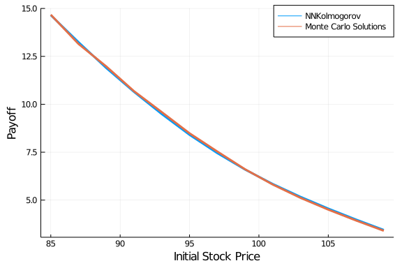

````julia
using Flux, StochasticDiffEq
using NeuralNetDiffEq
using Plots
using CuArrays
using CUDAnative
````


## Introduction on Backward Kolmogorov Equations

The backward Kolmogorov Equation deals with a terminal condtion.
The one dimensional backward kolmogorov equation that we are going to deal with is of the form :

$$
  \frac{\partial p}{\partial t} = -\mu(x)\frac{\partial p}{\partial x} - \frac{1}{2}{\sigma^2}(x)\frac{\partial^2 p}{\partial x^2} ,\hspace{0.5cm} p(T , x) = \varphi(x)
$$
for all $ t \in{ [0 , T] } $ and for all $ x \in R^d $

#### The Black Scholes Model

The Black-Scholes Model governs the price evolution of the European put or call option. In the below equation V is the price of some derivative , S is the Stock Price , r is the risk free interest
rate and σ the volatility of the stock returns. The payoff at a time T is known to us. And this makes it a terminal PDE. In case of an European put option the PDE is:
$$
  \frac{\partial V}{\partial t} + rS\frac{\partial V}{\partial S} + \frac{1}{2}{\sigma^2}{S^2}\frac{\partial^2 V}{\partial S^2} -rV = 0  ,\hspace{0.5cm} V(T , S) =  max\{\mathcal{K} - S , 0 \}
$$
for all $ t \in{ [0 , T] } $ and for all $ S \in R^d $

In order to make the above equation in the form of the Backward - Kolmogorov PDE we should substitute

$$
  V(S , t) = e^{r(t-T)}p(S , t)
$$
and thus we get
$$
  e^{r(t-T)}\frac{\partial p}{\partial t} + re^{r(t-T)}p(S , t)  = -\mu(x)\frac{\partial p}{\partial x}e^{r(t-T)} - \frac{1}{2}{\sigma^2}(x)\frac{\partial^2 p}{\partial x^2}e^{r(t-T)}
  + re^{r(t-T)}p(S , t)
$$
And the terminal condition
$$
  p(S , T) = max\{ \mathcal{K} - x , 0 \}
$$
We will train our model and the model itself will be the solution of the equation
## Defining the problem and the solver
We should start defining the terminal condition for our equation:
````julia
function phi(xi)
    y = Float64[]
    K = 100
    for x in eachcol(xi)
        val = max(K - maximum(x) , 0.00)
        y = push!(y , val)
    end
    y = reshape(y , 1 , size(y)[1] )
    return y
end
````


````
phi (generic function with 1 method)
````


Now we shall define the problem :
We will define the σ and μ by comparing it to the orignal equation. The xspan is the span of initial stock prices.
````julia
d = 1
r = 0.04
sigma = 0.2
xspan = (80.00 , 115.0)
tspan = (0.0 , 1.0)
σ(du , u , p , t) = du .= sigma.*u
μ(du , u , p , t) = du .= r.*u
prob = KolmogorovPDEProblem(μ , σ , phi , xspan , tspan, d)
````


````
KolmogorovPDEProblem
timespan: (0.0, 1.0)xspan: (80.0, 115.0)μ
Main.##WeaveSandBox#565.μSigma
Main.##WeaveSandBox#565.σ
````


Now once we have defined our problem it is necessary to define the parameters for the solver.
````julia
sdealg = EM()
ensemblealg = EnsembleThreads()
dt = 0.01
dx = 0.01
trajectories = 100000
````


````
100000
````


Now lets define our model m and the optimiser
````julia
m = Chain(Dense(d, 64, elu),Dense(64, 128, elu),Dense(128 , 16 , elu) , Dense(16 , 1))
use_gpu = false
if CUDAnative.functional() == true
  m = fmap(CuArrays.cu , m)
  use_gpu = true
end
opt = Flux.ADAM(0.0005)
````


````
Flux.Optimise.ADAM(0.0005, (0.9, 0.999), IdDict{Any,Any}())
````


And then finally call the solver
````julia
@time sol = solve(prob, NeuralNetDiffEq.NNKolmogorov(m, opt, sdealg, ensemblealg), verbose = true, dt = dt,
            dx = dx , trajectories = trajectories , abstol=1e-6, maxiters = 1000 , use_gpu = use_gpu)
````


````
Current loss is: 138.31642
Current loss is: 133.26782
Current loss is: 135.53445
Current loss is: 138.87248
Current loss is: 139.3275
Current loss is: 137.0173
Current loss is: 133.78084
Current loss is: 132.04922
Current loss is: 132.31348
Current loss is: 133.65202
Current loss is: 134.59161
Current loss is: 134.38979
Current loss is: 133.29378
Current loss is: 132.0191
Current loss is: 131.20583
Current loss is: 131.0896
Current loss is: 131.4356
Current loss is: 131.75337
Current loss is: 131.65526
Current loss is: 131.08699
Current loss is: 130.30574
Current loss is: 129.71654
Current loss is: 129.60341
Current loss is: 129.94992
Current loss is: 130.03015
Current loss is: 129.57042
Current loss is: 128.88905
Current loss is: 128.45918
Current loss is: 128.31546
Current loss is: 128.2588
Current loss is: 128.06352
Current loss is: 127.66247
Current loss is: 127.2313
Current loss is: 127.0443
Current loss is: 127.01429
Current loss is: 126.86272
Current loss is: 126.48646
Current loss is: 126.08622
Current loss is: 125.84038
Current loss is: 125.65362
Current loss is: 125.388885
Current loss is: 125.12447
Current loss is: 124.92323
Current loss is: 124.758736
Current loss is: 124.55569
Current loss is: 124.33495
Current loss is: 124.160706
Current loss is: 124.03334
Current loss is: 123.8759
Current loss is: 123.673744
Current loss is: 123.491165
Current loss is: 123.34016
Current loss is: 123.164215
Current loss is: 122.95451
Current loss is: 122.75777
Current loss is: 122.581406
Current loss is: 122.383064
Current loss is: 122.17326
Current loss is: 122.000565
Current loss is: 121.828064
Current loss is: 121.6281
Current loss is: 121.42743
Current loss is: 121.22983
Current loss is: 121.0182
Current loss is: 120.80722
Current loss is: 120.60042
Current loss is: 120.37794
Current loss is: 120.13794
Current loss is: 119.88834
Current loss is: 119.64825
Current loss is: 119.45227
Current loss is: 119.2603
Current loss is: 119.06515
Current loss is: 118.86796
Current loss is: 118.67054
Current loss is: 118.46957
Current loss is: 118.264534
Current loss is: 118.05791
Current loss is: 117.84872
Current loss is: 117.635666
Current loss is: 117.41877
Current loss is: 117.19607
Current loss is: 116.967896
Current loss is: 116.73545
Current loss is: 116.51659
Current loss is: 116.31052
Current loss is: 116.105545
Current loss is: 115.898895
Current loss is: 115.69266
Current loss is: 115.48584
Current loss is: 115.27475
Current loss is: 115.063385
Current loss is: 114.851
Current loss is: 114.63855
Current loss is: 114.426216
Current loss is: 114.21228
Current loss is: 114.00071
Current loss is: 113.790985
Current loss is: 113.581985
Current loss is: 113.372375
Current loss is: 113.16141
Current loss is: 112.951195
Current loss is: 112.7415
Current loss is: 112.53307
Current loss is: 112.325
Current loss is: 112.11819
Current loss is: 111.912125
Current loss is: 111.70734
Current loss is: 111.503395
Current loss is: 111.30096
Current loss is: 111.09985
Current loss is: 110.900566
Current loss is: 110.70263
Current loss is: 110.50638
Current loss is: 110.31183
Current loss is: 110.119606
Current loss is: 109.929276
Current loss is: 109.74097
Current loss is: 109.55485
Current loss is: 109.37127
Current loss is: 109.19044
Current loss is: 109.012215
Current loss is: 108.836754
Current loss is: 108.66407
Current loss is: 108.49425
Current loss is: 108.3275
Current loss is: 108.163925
Current loss is: 108.003716
Current loss is: 107.84705
Current loss is: 107.69388
Current loss is: 107.544174
Current loss is: 107.39804
Current loss is: 107.25554
Current loss is: 107.11677
Current loss is: 106.981834
Current loss is: 106.850845
Current loss is: 106.72382
Current loss is: 106.60071
Current loss is: 106.48146
Current loss is: 106.36606
Current loss is: 106.25449
Current loss is: 106.14685
Current loss is: 106.04313
Current loss is: 105.94334
Current loss is: 105.847466
Current loss is: 105.7555
Current loss is: 105.667336
Current loss is: 105.58301
Current loss is: 105.50254
Current loss is: 105.426315
Current loss is: 105.35586
Current loss is: 105.29722
Current loss is: 105.26149
Current loss is: 105.2523
Current loss is: 105.186584
Current loss is: 105.0522
Current loss is: 105.00156
Current loss is: 105.00387
Current loss is: 104.92012
Current loss is: 104.84434
Current loss is: 104.84212
Current loss is: 104.79084
Current loss is: 104.720924
Current loss is: 104.710014
Current loss is: 104.673355
Current loss is: 104.614555
Current loss is: 104.59875
Current loss is: 104.568306
Current loss is: 104.519684
Current loss is: 104.502144
Current loss is: 104.474724
Current loss is: 104.434975
Current loss is: 104.418015
Current loss is: 104.39267
Current loss is: 104.36059
Current loss is: 104.34494
Current loss is: 104.32111
Current loss is: 104.29493
Current loss is: 104.279854
Current loss is: 104.25728
Current loss is: 104.23529
Current loss is: 104.220535
Current loss is: 104.19977
Current loss is: 104.18111
Current loss is: 104.16716
Current loss is: 104.14882
Current loss is: 104.13283
Current loss is: 104.12006
Current loss is: 104.10416
Current loss is: 104.090126
Current loss is: 104.07848
Current loss is: 104.0646
Current loss is: 104.051895
Current loss is: 104.04116
Current loss is: 104.0289
Current loss is: 104.017235
Current loss is: 104.00727
Current loss is: 103.996414
Current loss is: 103.98571
Current loss is: 103.97644
Current loss is: 103.966835
Current loss is: 103.95708
Current loss is: 103.94845
Current loss is: 103.939896
Current loss is: 103.93106
Current loss is: 103.923
Current loss is: 103.915306
Current loss is: 103.90736
Current loss is: 103.89986
Current loss is: 103.89287
Current loss is: 103.88576
Current loss is: 103.878815
Current loss is: 103.87236
Current loss is: 103.865974
Current loss is: 103.859604
Current loss is: 103.85361
Current loss is: 103.847824
Current loss is: 103.84202
Current loss is: 103.83642
Current loss is: 103.831085
Current loss is: 103.82583
Current loss is: 103.82064
Current loss is: 103.815674
Current loss is: 103.810875
Current loss is: 103.80611
Current loss is: 103.801476
Current loss is: 103.797035
Current loss is: 103.79268
Current loss is: 103.78841
Current loss is: 103.784256
Current loss is: 103.78026
Current loss is: 103.77633
Current loss is: 103.77248
Current loss is: 103.768745
Current loss is: 103.76514
Current loss is: 103.76157
Current loss is: 103.75812
Current loss is: 103.75477
Current loss is: 103.751495
Current loss is: 103.74829
Current loss is: 103.745155
Current loss is: 103.74212
Current loss is: 103.73915
Current loss is: 103.736244
Current loss is: 103.73341
Current loss is: 103.73066
Current loss is: 103.727974
Current loss is: 103.72535
Current loss is: 103.72277
Current loss is: 103.720276
Current loss is: 103.717834
Current loss is: 103.71545
Current loss is: 103.713135
Current loss is: 103.71085
Current loss is: 103.70865
Current loss is: 103.7065
Current loss is: 103.704384
Current loss is: 103.702324
Current loss is: 103.700325
Current loss is: 103.69836
Current loss is: 103.696465
Current loss is: 103.694595
Current loss is: 103.69278
Current loss is: 103.69101
Current loss is: 103.68928
Current loss is: 103.6876
Current loss is: 103.685936
Current loss is: 103.684326
Current loss is: 103.68277
Current loss is: 103.68124
Current loss is: 103.67974
Current loss is: 103.678276
Current loss is: 103.67686
Current loss is: 103.675476
Current loss is: 103.67411
Current loss is: 103.672806
Current loss is: 103.67151
Current loss is: 103.67025
Current loss is: 103.669014
Current loss is: 103.66782
Current loss is: 103.66666
Current loss is: 103.665504
Current loss is: 103.6644
Current loss is: 103.663315
Current loss is: 103.66224
Current loss is: 103.66121
Current loss is: 103.66019
Current loss is: 103.65921
Current loss is: 103.65825
Current loss is: 103.657295
Current loss is: 103.65638
Current loss is: 103.65549
Current loss is: 103.65461
Current loss is: 103.65375
Current loss is: 103.6529
Current loss is: 103.652084
Current loss is: 103.6513
Current loss is: 103.650505
Current loss is: 103.64975
Current loss is: 103.648994
Current loss is: 103.64827
Current loss is: 103.64756
Current loss is: 103.64686
Current loss is: 103.64618
Current loss is: 103.64551
Current loss is: 103.64486
Current loss is: 103.64422
Current loss is: 103.6436
Current loss is: 103.64299
Current loss is: 103.64239
Current loss is: 103.64181
Current loss is: 103.641235
Current loss is: 103.640686
Current loss is: 103.64013
Current loss is: 103.63959
Current loss is: 103.63907
Current loss is: 103.63855
Current loss is: 103.63805
Current loss is: 103.63756
Current loss is: 103.63707
Current loss is: 103.63659
Current loss is: 103.63612
Current loss is: 103.635666
Current loss is: 103.635216
Current loss is: 103.63478
Current loss is: 103.634346
Current loss is: 103.63393
Current loss is: 103.63353
Current loss is: 103.63312
Current loss is: 103.632706
Current loss is: 103.63232
Current loss is: 103.631935
Current loss is: 103.63157
Current loss is: 103.63119
Current loss is: 103.63084
Current loss is: 103.630486
Current loss is: 103.630135
Current loss is: 103.62983
Current loss is: 103.62957
Current loss is: 103.629364
Current loss is: 103.629364
Current loss is: 103.629745
Current loss is: 103.630974
Current loss is: 103.63418
Current loss is: 103.64136
Current loss is: 103.657555
Current loss is: 103.685684
Current loss is: 103.73111
Current loss is: 103.747925
Current loss is: 103.720695
Current loss is: 103.64701
Current loss is: 103.62934
Current loss is: 103.67268
Current loss is: 103.68947
Current loss is: 103.65458
Current loss is: 103.62459
Current loss is: 103.646645
Current loss is: 103.669075
Current loss is: 103.6446
Current loss is: 103.62366
Current loss is: 103.638885
Current loss is: 103.650406
Current loss is: 103.63469
Current loss is: 103.62288
Current loss is: 103.63478
Current loss is: 103.64094
Current loss is: 103.62754
Current loss is: 103.622696
Current loss is: 103.632065
Current loss is: 103.63258
Current loss is: 103.623474
Current loss is: 103.62241
Current loss is: 103.628586
Current loss is: 103.62767
Current loss is: 103.6214
Current loss is: 103.62188
Current loss is: 103.6259
Current loss is: 103.62405
Current loss is: 103.620155
Current loss is: 103.621086
Current loss is: 103.623405
Current loss is: 103.62183
Current loss is: 103.61932
Current loss is: 103.62015
Current loss is: 103.6216
Current loss is: 103.62034
Current loss is: 103.618675
Current loss is: 103.61919
Current loss is: 103.62008
Current loss is: 103.61925
Current loss is: 103.618095
Current loss is: 103.61832
Current loss is: 103.61892
Current loss is: 103.618416
Current loss is: 103.61755
Current loss is: 103.61757
Current loss is: 103.617966
Current loss is: 103.61771
Current loss is: 103.61708
Current loss is: 103.61692
Current loss is: 103.61715
Current loss is: 103.617065
Current loss is: 103.61663
Current loss is: 103.61639
Current loss is: 103.616455
Current loss is: 103.61648
Current loss is: 103.61621
Current loss is: 103.61593
Current loss is: 103.615875
Current loss is: 103.615906
Current loss is: 103.615776
Current loss is: 103.61554
Current loss is: 103.61541
Current loss is: 103.615395
Current loss is: 103.61534
Current loss is: 103.61518
Current loss is: 103.61502
Current loss is: 103.61493
Current loss is: 103.6149
Current loss is: 103.61481
Current loss is: 103.61468
Current loss is: 103.61455
Current loss is: 103.61448
Current loss is: 103.614426
Current loss is: 103.614334
Current loss is: 103.614235
Current loss is: 103.61413
Current loss is: 103.61406
Current loss is: 103.614
Current loss is: 103.613914
Current loss is: 103.61383
Current loss is: 103.61374
Current loss is: 103.61368
Current loss is: 103.61361
Current loss is: 103.61354
Current loss is: 103.61345
Current loss is: 103.613365
Current loss is: 103.613304
Current loss is: 103.613235
Current loss is: 103.613174
Current loss is: 103.61312
Current loss is: 103.61304
Current loss is: 103.61296
Current loss is: 103.6129
Current loss is: 103.61283
Current loss is: 103.61278
Current loss is: 103.61271
Current loss is: 103.61265
Current loss is: 103.61259
Current loss is: 103.61252
Current loss is: 103.612465
Current loss is: 103.6124
Current loss is: 103.61235
Current loss is: 103.61229
Current loss is: 103.61223
Current loss is: 103.61219
Current loss is: 103.61213
Current loss is: 103.61207
Current loss is: 103.612015
Current loss is: 103.61195
Current loss is: 103.61191
Current loss is: 103.611855
Current loss is: 103.61181
Current loss is: 103.611755
Current loss is: 103.61171
Current loss is: 103.61165
Current loss is: 103.61162
Current loss is: 103.61156
Current loss is: 103.6115
Current loss is: 103.611465
Current loss is: 103.61142
Current loss is: 103.61137
Current loss is: 103.61133
Current loss is: 103.611275
Current loss is: 103.61124
Current loss is: 103.61119
Current loss is: 103.61114
Current loss is: 103.61111
Current loss is: 103.61107
Current loss is: 103.611015
Current loss is: 103.61097
Current loss is: 103.61092
Current loss is: 103.6109
Current loss is: 103.61085
Current loss is: 103.61081
Current loss is: 103.61077
Current loss is: 103.610725
Current loss is: 103.61069
Current loss is: 103.61065
Current loss is: 103.610596
Current loss is: 103.610565
Current loss is: 103.610535
Current loss is: 103.61049
Current loss is: 103.61046
Current loss is: 103.61042
Current loss is: 103.610374
Current loss is: 103.61034
Current loss is: 103.6103
Current loss is: 103.61027
Current loss is: 103.61023
Current loss is: 103.61018
Current loss is: 103.61016
Current loss is: 103.61011
Current loss is: 103.61008
Current loss is: 103.61005
Current loss is: 103.61001
Current loss is: 103.60998
Current loss is: 103.60994
Current loss is: 103.60992
Current loss is: 103.60987
Current loss is: 103.60984
Current loss is: 103.60982
Current loss is: 103.60978
Current loss is: 103.60975
Current loss is: 103.609695
Current loss is: 103.609665
Current loss is: 103.609634
Current loss is: 103.609604
Current loss is: 103.60958
Current loss is: 103.60955
Current loss is: 103.60953
Current loss is: 103.60949
Current loss is: 103.60946
Current loss is: 103.60944
Current loss is: 103.60942
Current loss is: 103.6094
Current loss is: 103.60939
Current loss is: 103.6094
Current loss is: 103.60944
Current loss is: 103.609535
Current loss is: 103.60973
Current loss is: 103.610115
Current loss is: 103.610916
Current loss is: 103.612434
Current loss is: 103.61547
Current loss is: 103.62108
Current loss is: 103.63235
Current loss is: 103.651146
Current loss is: 103.68586
Current loss is: 103.72381
Current loss is: 103.76732
Current loss is: 103.744225
Current loss is: 103.68523
Current loss is: 103.61925
Current loss is: 103.61757
Current loss is: 103.66354
Current loss is: 103.68462
Current loss is: 103.66021
Current loss is: 103.616714
Current loss is: 103.61365
Current loss is: 103.64307
Current loss is: 103.653046
Current loss is: 103.632286
Current loss is: 103.609825
Current loss is: 103.6168
Current loss is: 103.63511
Current loss is: 103.6318
Current loss is: 103.61477
Current loss is: 103.609215
Current loss is: 103.61982
Current loss is: 103.62662
Current loss is: 103.61805
Current loss is: 103.60905
Current loss is: 103.61158
Current loss is: 103.618546
Current loss is: 103.61814
Current loss is: 103.61111
Current loss is: 103.608635
Current loss is: 103.612724
Current loss is: 103.615326
Current loss is: 103.61246
Current loss is: 103.608696
Current loss is: 103.60936
Current loss is: 103.61222
Current loss is: 103.61232
Current loss is: 103.60975
Current loss is: 103.60831
Current loss is: 103.60956
Current loss is: 103.611
Current loss is: 103.610306
Current loss is: 103.60869
Current loss is: 103.60833
Current loss is: 103.60933
Current loss is: 103.60992
Current loss is: 103.609215
Current loss is: 103.6083
Current loss is: 103.6083
Current loss is: 103.608925
Current loss is: 103.60918
Current loss is: 103.60868
Current loss is: 103.60815
Current loss is: 103.6082
Current loss is: 103.60857
Current loss is: 103.60869
Current loss is: 103.6084
Current loss is: 103.60808
Current loss is: 103.60807
Current loss is: 103.60828
Current loss is: 103.60837
Current loss is: 103.608215
Current loss is: 103.60801
Current loss is: 103.60797
Current loss is: 103.60808
Current loss is: 103.608154
Current loss is: 103.608086
Current loss is: 103.607956
Current loss is: 103.607895
Current loss is: 103.60792
Current loss is: 103.60798
Current loss is: 103.60798
Current loss is: 103.60791
Current loss is: 103.607834
Current loss is: 103.60782
Current loss is: 103.60785
Current loss is: 103.607864
Current loss is: 103.60785
Current loss is: 103.607796
Current loss is: 103.60776
Current loss is: 103.60776
Current loss is: 103.607765
Current loss is: 103.607765
Current loss is: 103.60775
Current loss is: 103.60772
Current loss is: 103.6077
Current loss is: 103.60767
Current loss is: 103.60769
Current loss is: 103.60767
Current loss is: 103.60767
Current loss is: 103.60765
Current loss is: 103.60763
Current loss is: 103.60762
Current loss is: 103.60762
Current loss is: 103.607605
Current loss is: 103.60759
Current loss is: 103.60759
Current loss is: 103.607574
Current loss is: 103.60756
Current loss is: 103.60756
Current loss is: 103.607544
Current loss is: 103.60753
Current loss is: 103.60753
Current loss is: 103.60752
Current loss is: 103.607506
Current loss is: 103.607475
Current loss is: 103.607475
Current loss is: 103.60747
Current loss is: 103.60747
Current loss is: 103.60746
Current loss is: 103.607445
Current loss is: 103.60744
Current loss is: 103.60744
Current loss is: 103.607414
Current loss is: 103.60741
Current loss is: 103.6074
Current loss is: 103.60738
Current loss is: 103.607376
Current loss is: 103.607376
Current loss is: 103.60737
Current loss is: 103.60736
Current loss is: 103.607346
Current loss is: 103.60733
Current loss is: 103.60733
Current loss is: 103.60733
Current loss is: 103.607315
Current loss is: 103.6073
Current loss is: 103.607285
Current loss is: 103.60728
Current loss is: 103.60727
Current loss is: 103.607254
Current loss is: 103.607254
Current loss is: 103.60724
Current loss is: 103.60724
Current loss is: 103.60721
Current loss is: 103.60721
Current loss is: 103.6072
Current loss is: 103.607185
Current loss is: 103.60718
Current loss is: 103.60717
Current loss is: 103.607155
Current loss is: 103.60715
Current loss is: 103.60714
Current loss is: 103.60714
Current loss is: 103.60712
Current loss is: 103.60712
Current loss is: 103.60709
Current loss is: 103.60711
Current loss is: 103.60708
Current loss is: 103.60708
Current loss is: 103.607086
Current loss is: 103.60707
Current loss is: 103.607056
Current loss is: 103.60705
Current loss is: 103.60705
Current loss is: 103.60704
Current loss is: 103.607025
Current loss is: 103.60702
Current loss is: 103.60701
Current loss is: 103.606995
Current loss is: 103.606995
Current loss is: 103.60699
Current loss is: 103.60698
Current loss is: 103.60698
Current loss is: 103.60698
Current loss is: 103.60696
Current loss is: 103.60695
Current loss is: 103.60695
Current loss is: 103.60693
Current loss is: 103.60693
Current loss is: 103.60695
Current loss is: 103.60693
Current loss is: 103.60696
Current loss is: 103.606964
Current loss is: 103.60702
Current loss is: 103.607086
Current loss is: 103.60723
Current loss is: 103.6075
Current loss is: 103.60797
Current loss is: 103.60885
Current loss is: 103.61046
Current loss is: 103.61357
Current loss is: 103.61912
Current loss is: 103.63002
Current loss is: 103.64814
Current loss is: 103.68264
Current loss is: 103.726524
Current loss is: 103.79352
Current loss is: 103.81047
Current loss is: 103.7924
Current loss is: 103.687065
Current loss is: 103.61406
Current loss is: 103.6231
Current loss is: 103.680855
Current loss is: 103.71669
Current loss is: 103.67424
Current loss is: 103.620094
Current loss is: 103.61023
Current loss is: 103.64393
Current loss is: 103.66893
Current loss is: 103.64526
Current loss is: 103.61272
Current loss is: 103.61087
Current loss is: 103.63322
Current loss is: 103.64271
Current loss is: 103.62374
Current loss is: 103.60738
Current loss is: 103.61309
Current loss is: 103.62662
Current loss is: 103.62694
Current loss is: 103.61352
Current loss is: 103.606766
Current loss is: 103.613174
Current loss is: 103.61996
Current loss is: 103.61697
Current loss is: 103.60884
Current loss is: 103.60728
Current loss is: 103.61243
Current loss is: 103.615036
Current loss is: 103.61158
Current loss is: 103.607185
Current loss is: 103.607605
Current loss is: 103.61092
Current loss is: 103.61168
Current loss is: 103.60907
Current loss is: 103.60678
Current loss is: 103.60752
Current loss is: 103.60947
Current loss is: 103.60956
Current loss is: 103.60786
Current loss is: 103.606674
Current loss is: 103.607285
Current loss is: 103.60841
Current loss is: 103.60839
Current loss is: 103.60734
Current loss is: 103.60666
Current loss is: 103.60701
Current loss is: 103.60769
Current loss is: 103.60769
Current loss is: 103.607086
Current loss is: 103.606636
Current loss is: 103.6068
Current loss is: 103.6072
Current loss is: 103.60728
Current loss is: 103.60696
Current loss is: 103.606636
Current loss is: 103.60664
Current loss is: 103.60689
Current loss is: 103.60701
Current loss is: 103.606865
Current loss is: 103.60666
Current loss is: 103.60659
Current loss is: 103.6067
Current loss is: 103.606804
Current loss is: 103.60679
Current loss is: 103.60667
Current loss is: 103.606575
Current loss is: 103.60659
Current loss is: 103.60666
Current loss is: 103.6067
Current loss is: 103.60666
Current loss is: 103.60659
Current loss is: 103.606544
Current loss is: 103.60657
Current loss is: 103.60662
Current loss is: 103.60662
Current loss is: 103.60659
Current loss is: 103.60656
Current loss is: 103.60654
Current loss is: 103.60654
Current loss is: 103.60657
Current loss is: 103.60656
Current loss is: 103.60656
Current loss is: 103.60653
Current loss is: 103.60651
Current loss is: 103.606514
Current loss is: 103.60653
Current loss is: 103.60654
Current loss is: 103.606514
Current loss is: 103.606514
Current loss is: 103.6065
Current loss is: 103.6065
Current loss is: 103.606514
Current loss is: 103.6065
Current loss is: 103.60651
Current loss is: 103.6065
Current loss is: 103.60649
Current loss is: 103.60649
Current loss is: 103.60649
Current loss is: 103.60649
Current loss is: 103.606476
Current loss is: 103.606476
Current loss is: 103.606476
Current loss is: 103.60647
Current loss is: 103.606476
Current loss is: 103.606476
Current loss is: 103.60647
Current loss is: 103.60647
Current loss is: 103.60647
Current loss is: 103.60647
Current loss is: 103.606445
Current loss is: 103.60646
Current loss is: 103.60646
Current loss is: 103.60646
Current loss is: 103.60646
Current loss is: 103.606445
Current loss is: 103.606445
Current loss is: 103.60646
Current loss is: 103.606445
Current loss is: 103.60644
Current loss is: 103.60644
Current loss is: 103.60644
Current loss is: 103.60644
Current loss is: 103.60643
Current loss is: 103.60643
Current loss is: 103.60643
Current loss is: 103.60643
Current loss is: 103.606415
Current loss is: 103.60643
Current loss is: 103.60643
Current loss is: 103.60643
Current loss is: 103.60643
Current loss is: 103.60641
Current loss is: 103.60641
Current loss is: 103.60643
Current loss is: 103.60641
Current loss is: 103.60641
Current loss is: 103.6064
Current loss is: 103.60641
Current loss is: 103.6064
Current loss is: 103.60641
Current loss is: 103.60641
Current loss is: 103.60641
Current loss is: 103.6064
Current loss is: 103.606384
Current loss is: 103.606384
Current loss is: 103.6064
Current loss is: 103.606384
Current loss is: 103.606384
Current loss is: 103.606384
Current loss is: 103.606384
Current loss is: 103.606384
Current loss is: 103.606384
Current loss is: 103.606384
Current loss is: 103.60638
Current loss is: 103.60638
Current loss is: 103.60638
Current loss is: 103.60638
Current loss is: 103.60638
Current loss is: 103.60638
Current loss is: 103.60638
Current loss is: 103.60638
Current loss is: 103.60635
Current loss is: 103.60638
Current loss is: 103.60635
Current loss is: 103.60637
Current loss is: 103.60637
Current loss is: 103.60637
Current loss is: 103.60635
Current loss is: 103.60635
Current loss is: 103.60635
Current loss is: 103.60635
Current loss is: 103.60635
Current loss is: 103.606346
Current loss is: 103.606346
Current loss is: 103.606346
Current loss is: 103.606346
Current loss is: 103.606346
Current loss is: 103.606346
Current loss is: 103.606346
Current loss is: 103.606346
Current loss is: 103.60637
Current loss is: 103.60637
Current loss is: 103.606384
Current loss is: 103.6064
Current loss is: 103.60644
Current loss is: 103.606514
Current loss is: 103.60663
Current loss is: 103.60683
Current loss is: 103.607185
Current loss is: 103.60782
Current loss is: 103.608955
Current loss is: 103.61094
Current loss is: 103.614624
Current loss is: 103.62094
Current loss is: 103.63288
Current loss is: 103.65198
Current loss is: 103.68764
Current loss is: 103.73291
Current loss is: 103.80574
Current loss is: 103.83829
Current loss is: 103.850174
Current loss is: 103.74804
Current loss is: 103.64673
Current loss is: 103.607574
Current loss is: 103.65114
Current loss is: 103.71751
Current loss is: 103.71883
Current loss is: 103.67134
Current loss is: 103.61534
Current loss is: 103.612946
Current loss is: 103.65107
Current loss is: 103.67022
Current loss is: 103.651085
Current loss is: 103.61496
Current loss is: 103.609024
Current loss is: 103.63142
Current loss is: 103.64416
Current loss is: 103.63231
Current loss is: 103.611
Current loss is: 103.607925
Current loss is: 103.62147
Current loss is: 103.62928
Current loss is: 103.62204
Current loss is: 103.60921
Current loss is: 103.607216
Current loss is: 103.61528
Current loss is: 103.61992
Current loss is: 103.61536
Current loss is: 103.607864
Current loss is: 103.60691
Current loss is: 103.611755
Current loss is: 103.614555
Current loss is: 103.611916
Current loss is: 103.6074
Current loss is: 103.606544
Current loss is: 103.60926
Current loss is: 103.611145
Current loss is: 103.60984
Current loss is: 103.60714
Current loss is: 103.606346
Current loss is: 103.60783
Current loss is: 103.60913
Current loss is: 103.608604
Current loss is: 103.60702
Current loss is: 103.606255
Current loss is: 103.606926
Current loss is: 103.60783
Current loss is: 103.60783
Current loss is: 103.60693
Current loss is: 103.60628
Current loss is: 103.60644
Current loss is: 103.60701
Current loss is: 103.60724
Current loss is: 103.60685
Current loss is: 103.60635
Current loss is: 103.606255
Current loss is: 103.60651
Current loss is: 103.60679
Current loss is: 103.60672
Current loss is: 103.60643
Current loss is: 103.60624
Current loss is: 103.60627
Current loss is: 103.606445
Current loss is: 103.60654
Current loss is: 103.606445
Current loss is: 103.606285
Current loss is: 103.6062
Current loss is: 103.60625
Current loss is: 103.606346
Current loss is: 103.60638
Current loss is: 103.606316
 32.989624 seconds (120.32 M allocations: 122.214 GiB, 15.90% gc time)
(Float32[109.17 95.05 … 92.68 84.65], Float32[3.4453154 8.415019 … 9.712897
 14.975701])
````


## Analyzing the solution
Now let us find a Monte-Carlo Solution and plot the both:
````julia
monte_carlo_sol = []
x_out = collect(85:2.00:110.00)
for x in x_out
  u₀= [x]
  g_val(du , u , p , t) = du .= 0.2.*u
  f_val(du , u , p , t) = du .= 0.04.*u
  dt = 0.01
  tspan = (0.0,1.0)
  prob = SDEProblem(f_val,g_val,u₀,tspan)
  output_func(sol,i) = (sol[end],false)
  ensembleprob_val = EnsembleProblem(prob , output_func = output_func )
  sim_val = solve(ensembleprob_val, EM(), EnsembleThreads() , dt=0.01, trajectories=100000,adaptive=false)
  s = reduce(hcat , sim_val.u)
  mean_phi = sum(phi(s))/length(phi(s))
  global monte_carlo_sol = push!(monte_carlo_sol , mean_phi)
end
````


##Plotting the Solutions
We should reshape the inputs and outputs to make it compatible with our model. This is the most important part. The algorithm gives a distributed function over all initial prices in the xspan.
````julia
x_model = reshape(x_out, 1 , size(x_out)[1])
if use_gpu == true
  m = fmap(cpu , m)
end
y_out = m(x_model)
y_out = reshape(y_out , 13 , 1)
````


````
13×1 Array{Float32,2}:
 14.738842
 13.388734
 12.047083
 10.733801
  9.529136
  8.440933
  7.479356
  6.6369395
  5.876031
  5.1783876
  4.557423
  3.998632
  3.4869988
````


And now finally we can plot the solutions
````julia
plot(x_out , y_out , lw = 3 ,  xaxis="Initial Stock Price", yaxis="Payoff" , label = "NNKolmogorov")
plot!(x_out , monte_carlo_sol , lw = 3 ,  xaxis="Initial Stock Price", yaxis="Payoff" ,label = "Monte Carlo Solutions")
````



