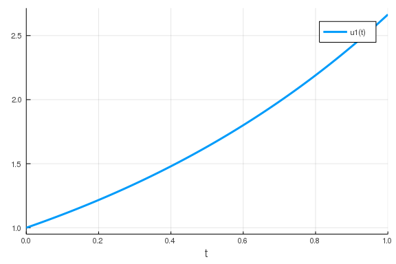
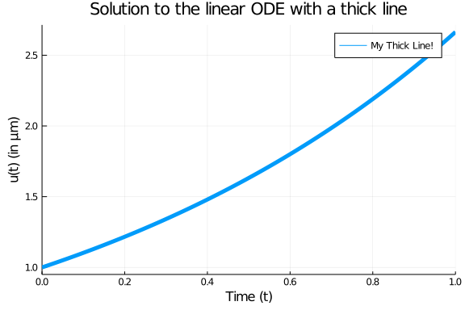
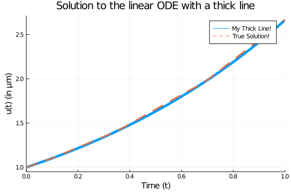
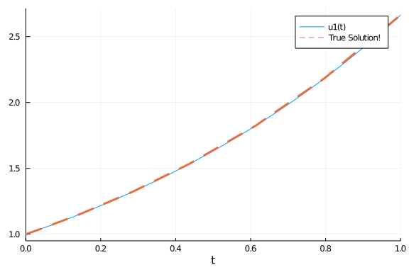
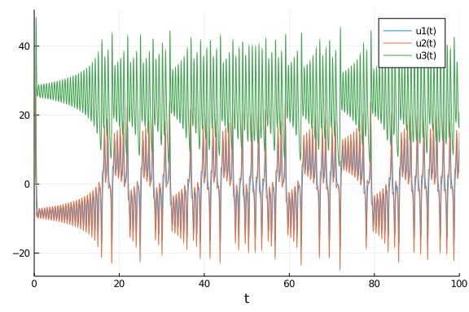
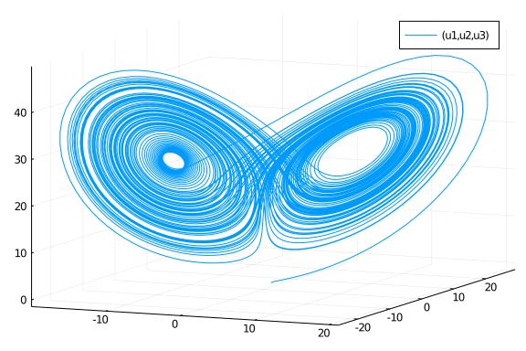
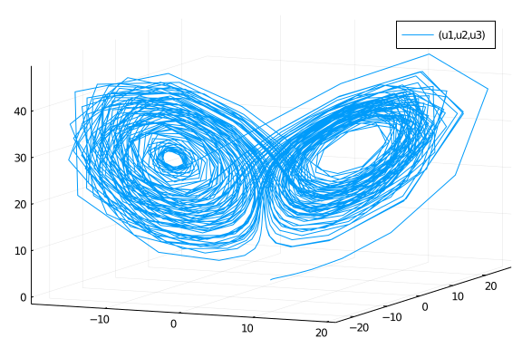
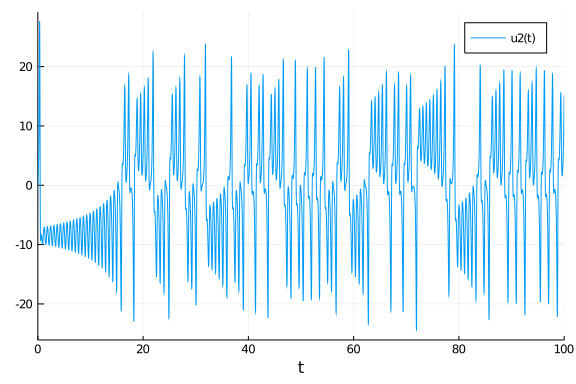

## Basic Introduction Via Ordinary Differential Equations

This notebook will get you started with DifferentialEquations.jl by introducing you to the functionality for solving ordinary differential equations (ODEs). The corresponding documentation page is the [ODE tutorial](https://docs.juliadiffeq.org/dev/tutorials/ode_example/). While some of the syntax may be different for other types of equations, the same general principles hold in each case. Our goal is to give a gentle and thorough introduction that highlights these principles in a way that will help you generalize what you have learned.

### Background

If you are new to the study of differential equations, it can be helpful to do a quick background read on [the definition of ordinary differential equations](https://en.wikipedia.org/wiki/Ordinary_differential_equation). We define an ordinary differential equation as an equation which describes the way that a variable $u$ changes, that is

$$u' = f(u,p,t)$$

where $p$ are the parameters of the model, $t$ is the time variable, and $f$ is the nonlinear model of how $u$ changes. The initial value problem also includes the information about the starting value:

$$u(t_0) = u_0$$

Together, if you know the starting value and you know how the value will change with time, then you know what the value will be at any time point in the future. This is the intuitive definition of a differential equation.

### First Model: Exponential Growth

Our first model will be the canonical exponential growth model. This model says that the rate of change is proportional to the current value, and is this:

$$u' = au$$

where we have a starting value $u(0)=u_0$. Let's say we put 1 dollar into Bitcoin which is increasing at a rate of $98\%$ per year. Then calling now $t=0$ and measuring time in years, our model is:

$$u' = 0.98u$$

and $u(0) = 1.0$. We encode this into Julia by noticing that, in this setup, we match the general form when

````julia
f(u,p,t) = 0.98u
````


````
f (generic function with 1 method)
````


with $ u_0 = 1.0 $. If we want to solve this model on a time span from `t=0.0` to `t=1.0`, then we define an `ODEProblem` by specifying this function `f`, this initial condition `u0`, and this time span as follows:

````julia
using DifferentialEquations
f(u,p,t) = 0.98u
u0 = 1.0
tspan = (0.0,1.0)
prob = ODEProblem(f,u0,tspan)
````


````
ODEProblem with uType Float64 and tType Float64. In-place: false
timespan: (0.0, 1.0)
u0: 1.0
````


To solve our `ODEProblem` we use the command `solve`.

````julia
sol = solve(prob)
````


````
retcode: Success
Interpolation: automatic order switching interpolation
t: 5-element Array{Float64,1}:
 0.0
 0.10042494449239292
 0.35218603951893646
 0.6934436028208104
 1.0
u: 5-element Array{Float64,1}:
 1.0
 1.1034222047865465
 1.4121908848175448
 1.9730384275622996
 2.664456142481451
````


and that's it: we have succesfully solved our first ODE!

#### Analyzing the Solution

Of course, the solution type is not interesting in and of itself. We want to understand the solution! The documentation page which explains in detail the functions for analyzing the solution is the [Solution Handling](https://docs.juliadiffeq.org/dev/basics/solution/) page. Here we will describe some of the basics. You can plot the solution using the plot recipe provided by [Plots.jl](http://docs.juliaplots.org/dev/):

````julia
using Plots; gr()
plot(sol)
````





From the picture we see that the solution is an exponential curve, which matches our intuition. As a plot recipe, we can annotate the result using any of the [Plots.jl attributes](http://docs.juliaplots.org/dev/attributes/). For example:

````julia
plot(sol,linewidth=5,title="Solution to the linear ODE with a thick line",
     xaxis="Time (t)",yaxis="u(t) (in μm)",label="My Thick Line!") # legend=false
````





Using the mutating `plot!` command we can add other pieces to our plot. For this ODE we know that the true solution is $u(t) = u_0 exp(at)$, so let's add some of the true solution to our plot:

````julia
plot!(sol.t, t->1.0*exp(0.98t),lw=3,ls=:dash,label="True Solution!")
````





In the previous command I demonstrated `sol.t`, which grabs the array of time points that the solution was saved at:

````julia
sol.t
````


````
5-element Array{Float64,1}:
 0.0
 0.10042494449239292
 0.35218603951893646
 0.6934436028208104
 1.0
````


We can get the array of solution values using `sol.u`:

````julia
sol.u
````


````
5-element Array{Float64,1}:
 1.0
 1.1034222047865465
 1.4121908848175448
 1.9730384275622996
 2.664456142481451
````


`sol.u[i]` is the value of the solution at time `sol.t[i]`. We can compute arrays of functions of the solution values using standard comprehensions, like:

````julia
[t+u for (u,t) in tuples(sol)]
````


````
5-element Array{Float64,1}:
 1.0
 1.2038471492789395
 1.7643769243364813
 2.66648203038311
 3.664456142481451
````


However, one interesting feature is that, by default, the solution is a continuous function. If we check the print out again:

````julia
sol
````


````
retcode: Success
Interpolation: automatic order switching interpolation
t: 5-element Array{Float64,1}:
 0.0
 0.10042494449239292
 0.35218603951893646
 0.6934436028208104
 1.0
u: 5-element Array{Float64,1}:
 1.0
 1.1034222047865465
 1.4121908848175448
 1.9730384275622996
 2.664456142481451
````


you see that it says that the solution has a order changing interpolation. The default algorithm automatically switches between methods in order to handle all types of problems. For non-stiff equations (like the one we are solving), it is a continuous function of 4th order accuracy. We can call the solution as a function of time `sol(t)`. For example, to get the value at `t=0.45`, we can use the command:

````julia
sol(0.45)
````


````
1.554261048055312
````


#### Controlling the Solver

DifferentialEquations.jl has a common set of solver controls among its algorithms which can be found [at the Common Solver Options](https://docs.juliadiffeq.org/dev/basics/common_solver_opts/) page. We will detail some of the most widely used options.

The most useful options are the tolerances `abstol` and `reltol`. These tell the internal adaptive time stepping engine how precise of a solution you want. Generally, `reltol` is the relative accuracy while `abstol` is the accuracy when `u` is near zero. These tolerances are local tolerances and thus are not global guarantees. However, a good rule of thumb is that the total solution accuracy is 1-2 digits less than the relative tolerances. Thus for the defaults `abstol=1e-6` and `reltol=1e-3`, you can expect a global accuracy of about 1-2 digits. If we want to get around 6 digits of accuracy, we can use the commands:

````julia
sol = solve(prob,abstol=1e-8,reltol=1e-8)
````


````
retcode: Success
Interpolation: automatic order switching interpolation
t: 9-element Array{Float64,1}:
 0.0
 0.04127492324135852
 0.14679917846877366
 0.28631546412766684
 0.4381941361169628
 0.6118924302028597
 0.7985659100883337
 0.9993516479536952
 1.0
u: 9-element Array{Float64,1}:
 1.0
 1.0412786454705882
 1.1547261252949712
 1.3239095703537043
 1.5363819257509728
 1.8214895157178692
 2.1871396448296223
 2.662763824115295
 2.664456241933517
````


Now we can see no visible difference against the true solution:


````julia
plot(sol)
plot!(sol.t, t->1.0*exp(0.98t),lw=3,ls=:dash,label="True Solution!")
````





Notice that by decreasing the tolerance, the number of steps the solver had to take was `9` instead of the previous `5`. There is a trade off between accuracy and speed, and it is up to you to determine what is the right balance for your problem.

Another common option is to use `saveat` to make the solver save at specific time points. For example, if we want the solution at an even grid of `t=0.1k` for integers `k`, we would use the command:

````julia
sol = solve(prob,saveat=0.1)
````


````
retcode: Success
Interpolation: 1st order linear
t: 11-element Array{Float64,1}:
 0.0
 0.1
 0.2
 0.3
 0.4
 0.5
 0.6
 0.7
 0.8
 0.9
 1.0
u: 11-element Array{Float64,1}:
 1.0
 1.102962785129292
 1.2165269512238264
 1.341783821227542
 1.4799379510586077
 1.632316207054161
 1.8003833264983584
 1.9857565541588758
 2.1902158127997695
 2.415725742084496
 2.664456142481451
````


Notice that when `saveat` is used the continuous output variables are no longer saved and thus `sol(t)`, the interpolation, is only first order. We can save at an uneven grid of points by passing a collection of values to `saveat`. For example:

````julia
sol = solve(prob,saveat=[0.2,0.7,0.9])
````


````
retcode: Success
Interpolation: 1st order linear
t: 3-element Array{Float64,1}:
 0.2
 0.7
 0.9
u: 3-element Array{Float64,1}:
 1.2165269512238264
 1.9857565541588758
 2.415725742084496
````


If we need to reduce the amount of saving, we can also turn off the continuous output directly via `dense=false`:

````julia
sol = solve(prob,dense=false)
````


````
retcode: Success
Interpolation: 1st order linear
t: 5-element Array{Float64,1}:
 0.0
 0.10042494449239292
 0.35218603951893646
 0.6934436028208104
 1.0
u: 5-element Array{Float64,1}:
 1.0
 1.1034222047865465
 1.4121908848175448
 1.9730384275622996
 2.664456142481451
````


and to turn off all intermediate saving we can use `save_everystep=false`:

````julia
sol = solve(prob,save_everystep=false)
````


````
retcode: Success
Interpolation: 1st order linear
t: 2-element Array{Float64,1}:
 0.0
 1.0
u: 2-element Array{Float64,1}:
 1.0
 2.664456142481451
````


If we want to solve and only save the final value, we can even set `save_start=false`.

````julia
sol = solve(prob,save_everystep=false,save_start = false)
````


````
retcode: Success
Interpolation: 1st order linear
t: 1-element Array{Float64,1}:
 1.0
u: 1-element Array{Float64,1}:
 2.664456142481451
````


Note that similarly on the other side there is `save_end=false`.

More advanced saving behaviors, such as saving functionals of the solution, are handled via the `SavingCallback` in the [Callback Library](https://docs.juliadiffeq.org/dev/features/callback_library/#saving_callback-1) which will be addressed later in the tutorial.

#### Choosing Solver Algorithms

There is no best algorithm for numerically solving a differential equation. When you call `solve(prob)`, DifferentialEquations.jl makes a guess at a good algorithm for your problem, given the properties that you ask for (the tolerances, the saving information, etc.). However, in many cases you may want more direct control. A later notebook will help introduce the various *algorithms* in DifferentialEquations.jl, but for now let's introduce the *syntax*.

The most crucial determining factor in choosing a numerical method is the stiffness of the model. Stiffness is roughly characterized by a Jacobian `f` with large eigenvalues. That's quite mathematical, and we can think of it more intuitively: if you have big numbers in `f` (like parameters of order `1e5`), then it's probably stiff. Or, as the creator of the MATLAB ODE Suite, Lawrence Shampine, likes to define it, if the standard algorithms are slow, then it's stiff. We will go into more depth about diagnosing stiffness in a later tutorial, but for now note that if you believe your model may be stiff, you can hint this to the algorithm chooser via `alg_hints = [:stiff]`.

````julia
sol = solve(prob,alg_hints=[:stiff])
````


````
retcode: Success
Interpolation: specialized 3rd order "free" stiffness-aware interpolation
t: 8-element Array{Float64,1}:
 0.0
 0.05653299582822294
 0.17270731152826024
 0.3164602871490142
 0.5057500163821153
 0.7292241858994543
 0.9912975001018789
 1.0
u: 8-element Array{Float64,1}:
 1.0
 1.0569657840332976
 1.1844199383303913
 1.3636037723365293
 1.6415399686182572
 2.0434491434754793
 2.641825616057761
 2.6644526430553817
````


Stiff algorithms have to solve implicit equations and linear systems at each step so they should only be used when required.

If we want to choose an algorithm directly, you can pass the algorithm type after the problem as `solve(prob,alg)`. For example, let's solve this problem using the `Tsit5()` algorithm, and just for show let's change the relative tolerance to `1e-6` at the same time:

````julia
sol = solve(prob,Tsit5(),reltol=1e-6)
````


````
retcode: Success
Interpolation: specialized 4th order "free" interpolation
t: 10-element Array{Float64,1}:
 0.0
 0.028970819746309166
 0.10049147151547619
 0.19458908698515082
 0.3071725081673423
 0.43945421453622546
 0.5883434923759523
 0.7524873357619015
 0.9293021330536031
 1.0
u: 10-element Array{Float64,1}:
 1.0
 1.0287982807225062
 1.1034941463604806
 1.2100931078233779
 1.351248605624241
 1.538280340326815
 1.7799346012651116
 2.090571742234628
 2.486102171447025
 2.6644562434913377
````


### Systems of ODEs: The Lorenz Equation

Now let's move to a system of ODEs. The [Lorenz equation](https://en.wikipedia.org/wiki/Lorenz_system) is the famous "butterfly attractor" that spawned chaos theory. It is defined by the system of ODEs:

$$
\begin{align}
\frac{dx}{dt} &= \sigma (y - x)\\
\frac{dy}{dt} &= x (\rho - z) -y\\
\frac{dz}{dt} &= xy - \beta z
\end{align}
$$

To define a system of differential equations in DifferentialEquations.jl, we define our `f` as a vector function with a vector initial condition. Thus, for the vector `u = [x,y,z]'`, we have the derivative function:

````julia
function lorenz!(du,u,p,t)
    σ,ρ,β = p
    du[1] = σ*(u[2]-u[1])
    du[2] = u[1]*(ρ-u[3]) - u[2]
    du[3] = u[1]*u[2] - β*u[3]
end
````


````
lorenz! (generic function with 1 method)
````


Notice here we used the in-place format which writes the output to the preallocated vector `du`. For systems of equations the in-place format is faster. We use the initial condition $u_0 = [1.0,0.0,0.0]$ as follows:

````julia
u0 = [1.0,0.0,0.0]
````


````
3-element Array{Float64,1}:
 1.0
 0.0
 0.0
````


Lastly, for this model we made use of the parameters `p`. We need to set this value in the `ODEProblem` as well. For our model we want to solve using the parameters $\sigma = 10$, $\rho = 28$, and $\beta = 8/3$, and thus we build the parameter collection:

````julia
p = (10,28,8/3) # we could also make this an array, or any other type!
````


````
(10, 28, 2.6666666666666665)
````


Now we generate the `ODEProblem` type. In this case, since we have parameters, we add the parameter values to the end of the constructor call. Let's solve this on a time span of `t=0` to `t=100`:

````julia
tspan = (0.0,100.0)
prob = ODEProblem(lorenz!,u0,tspan,p)
````


````
ODEProblem with uType Array{Float64,1} and tType Float64. In-place: true
timespan: (0.0, 100.0)
u0: [1.0, 0.0, 0.0]
````


Now, just as before, we solve the problem:

````julia
sol = solve(prob)
````


````
retcode: Success
Interpolation: automatic order switching interpolation
t: 1294-element Array{Float64,1}:
   0.0
   3.5678604836301404e-5
   0.0003924646531993154
   0.0032624077544510573
   0.009058075635317072
   0.01695646895607931
   0.0276899566248403
   0.041856345938267966
   0.06024040228733675
   0.08368539694547242
   ⋮
  99.39403070915297
  99.47001147494375
  99.54379656909015
  99.614651558349
  99.69093823148101
  99.78733023233721
  99.86114450046736
  99.96115759510786
 100.0
u: 1294-element Array{Array{Float64,1},1}:
 [1.0, 0.0, 0.0]
 [0.9996434557625105, 0.0009988049817849058, 1.781434788799208e-8]
 [0.9961045497425811, 0.010965399721242457, 2.146955365838907e-6]
 [0.9693591634199452, 0.08977060667778931, 0.0001438018342266937]
 [0.9242043615038835, 0.24228912482984957, 0.0010461623302512404]
 [0.8800455868998046, 0.43873645009348244, 0.0034242593451028745]
 [0.8483309877783048, 0.69156288756671, 0.008487623500490047]
 [0.8495036595681027, 1.0145425335433382, 0.01821208597613427]
 [0.9139069079152129, 1.4425597546855036, 0.03669381053327124]
 [1.0888636764765296, 2.052326153029042, 0.07402570506414284]
 ⋮
 [12.999157033749652, 14.10699925404482, 31.74244844521858]
 [11.646131422021162, 7.2855792145502845, 35.365000488215486]
 [7.777555445486692, 2.5166095828739574, 32.030953593541675]
 [4.739741627223412, 1.5919220588229062, 27.249779003951755]
 [3.2351668945618774, 2.3121727966182695, 22.724936101772805]
 [3.310411964698304, 4.28106626744641, 18.435441144016366]
 [4.527117863517627, 6.895878639772805, 16.58544600757436]
 [8.043672261487556, 12.711555298531689, 18.12537420595938]
 [9.97537965430362, 15.143884806010783, 21.00643286956427]
````


The same solution handling features apply to this case. Thus `sol.t` stores the time points and `sol.u` is an array storing the solution at the corresponding time points.

However, there are a few extra features which are good to know when dealing with systems of equations. First of all, `sol` also acts like an array. `sol[i]` returns the solution at the `i`th time point.

````julia
sol.t[10],sol[10]
````


````
(0.08368539694547242, [1.0888636764765296, 2.052326153029042, 0.07402570506
414284])
````


Additionally, the solution acts like a matrix where `sol[j,i]` is the value of the `j`th variable at time `i`:

````julia
sol[2,10]
````


````
2.052326153029042
````


We can get a real matrix by performing a conversion:

````julia
A = Array(sol)
````


````
3×1294 Array{Float64,2}:
 1.0  0.999643     0.996105    0.969359     …   4.52712   8.04367   9.97538
 0.0  0.000998805  0.0109654   0.0897706        6.89588  12.7116   15.1439
 0.0  1.78143e-8   2.14696e-6  0.000143802     16.5854   18.1254   21.0064
````


This is the same as sol, i.e. `sol[i,j] = A[i,j]`, but now it's a true matrix. Plotting will by default show the time series for each variable:

````julia
plot(sol)
````





If we instead want to plot values against each other, we can use the `vars` command. Let's plot variable `1` against variable `2` against variable `3`:

````julia
plot(sol,vars=(1,2,3))
````





This is the classic Lorenz attractor plot, where the `x` axis is `u[1]`, the `y` axis is `u[2]`, and the `z` axis is `u[3]`. Note that the plot recipe by default uses the interpolation, but we can turn this off:

````julia
plot(sol,vars=(1,2,3),denseplot=false)
````





Yikes! This shows how calculating the continuous solution has saved a lot of computational effort by computing only a sparse solution and filling in the values! Note that in vars, `0=time`, and thus we can plot the time series of a single component like:

````julia
plot(sol,vars=(0,2))
````





## Internal Types

The last basic user-interface feature to explore is the choice of types. DifferentialEquations.jl respects your input types to determine the internal types that are used. Thus since in the previous cases, when we used `Float64` values for the initial condition, this meant that the internal values would be solved using `Float64`. We made sure that time was specified via `Float64` values, meaning that time steps would utilize 64-bit floats as well. But, by simply changing these types we can change what is used internally.

As a quick example, let's say we want to solve an ODE defined by a matrix. To do this, we can simply use a matrix as input.

````julia
A  = [1. 0  0 -5
      4 -2  4 -3
     -4  0  0  1
      5 -2  2  3]
u0 = rand(4,2)
tspan = (0.0,1.0)
f(u,p,t) = A*u
prob = ODEProblem(f,u0,tspan)
sol = solve(prob)
````


````
retcode: Success
Interpolation: automatic order switching interpolation
t: 10-element Array{Float64,1}:
 0.0
 0.04391849892224981
 0.11616653082165809
 0.19658120398062442
 0.2952629698711988
 0.41733702034155395
 0.5506712825781492
 0.7166461355644652
 0.8883937134768247
 1.0
u: 10-element Array{Array{Float64,2},1}:
 [0.19547760575940165 0.47247399507044374; 0.9947932470272081 0.15631428237
218148; 0.3573489500076166 0.23763371724112692; 0.03808030495696069 0.31982
31726743066]
 [0.1967588904438102 0.4049692637996855; 0.9971930547885663 0.2018872361416
5527; 0.32439425488809615 0.17741325228186972; 0.02792721637674083 0.470989
78156002314]
 [0.20539607624568004 0.21469182945001108; 0.9933207532448118 0.17931771064
2172; 0.2676854653186985 0.12814765402639164; 0.0026932230530117354 0.70609
82198891923]
 [0.22908519743536082 -0.11156461673042634; 0.9826081603369168 0.0274918524
95605457; 0.19700705908618227 0.17463789252360576; -0.035781566166134156 0.
9339463609707335]
 [0.28559261346488707 -0.6637539057836184; 0.9671250650391829 -0.2944838280
7270324; 0.09025850576027471 0.42558522498464146; -0.09262120131943437 1.13
79397125539228]
 [0.4060667968976291 -1.5276892713937908; 0.9493118233141383 -0.77656521243
56482; -0.09198482510918725 1.1005046932277391; -0.16460909725367076 1.2243
954837465991]
 [0.6033391768554422 -2.57278044905076; 0.9220470903483592 -1.1706998836767
41; -0.38443862821019276 2.3476929618145768; -0.2211142385015843 1.03543600
71645454]
 [0.9160020947639793 -3.6864769046682495; 0.8208246732749581 -0.97882022715
92469; -0.9237891497332187 4.56751278018785; -0.21007136743282612 0.2769593
8201657266]
 [1.2214963278777484 -4.021425675138098; 0.5093406799523311 0.6643799209382
052; -1.6874968552130294 7.215322945108149; -0.03812101279378505 -1.1961215
559740883]
 [1.327290834745476 -3.422361319155158; 0.10870253255667689 2.7861791915498
078; -2.2531847418271047 8.702214410706276; 0.18892900683270336 -2.50756160
184843]
````


There is no real difference from what we did before, but now in this case `u0` is a `4x2` matrix. Because of that, the solution at each time point is matrix:

````julia
sol[3]
````


````
4×2 Array{Float64,2}:
 0.205396    0.214692
 0.993321    0.179318
 0.267685    0.128148
 0.00269322  0.706098
````


In DifferentialEquations.jl, you can use any type that defines `+`, `-`, `*`, `/`, and has an appropriate `norm`. For example, if we want arbitrary precision floating point numbers, we can change the input to be a matrix of `BigFloat`:

````julia
big_u0 = big.(u0)
````


````
4×2 Array{BigFloat,2}:
 0.195478   0.472474
 0.994793   0.156314
 0.357349   0.237634
 0.0380803  0.319823
````


and we can solve the `ODEProblem` with arbitrary precision numbers by using that initial condition:

````julia
prob = ODEProblem(f,big_u0,tspan)
sol = solve(prob)
````


````
retcode: Success
Interpolation: automatic order switching interpolation
t: 5-element Array{Float64,1}:
 0.0
 0.16431365291680158
 0.42772799694479635
 0.7429273250346953
 1.0
u: 5-element Array{Array{BigFloat,2},1}:
 [0.195477605759401651397411114885471761226654052734375 0.47247399507044374
189490554272197186946868896484375; 0.99479324702720806072875348036177456378
936767578125 0.1563142823721814789195150297018699347972869873046875; 0.3573
4895000761657257726255920715630054473876953125 0.23763371724112691829589039
11639936268329620361328125; 0.038080304956960686624256595678161829710006713
8671875 0.3198231726743065994611470159725286066532135009765625]
 [0.21746939763416644311886702990490457438056793139365604565977432851584022
0188873 0.03349398675327235331798139109873074860835685788898948561969461532
122681513727456; 0.98737531785888929705076260141428359263482566934954521331
93100034090610720956314 0.1027997330772849330151490008905087668681419755981
918140931354630639022747637303; 0.22667660661065426372076382090828513309464
87676759050540724178350670025819556932 0.1410295061275566483908684033669054
582106239483348127642296304420940218638297132; -0.0192254051050915513591330
5169413289551524369010795169572022332740993937492951599 0.84791531545859543
26664749500300867931914637225874429879613196477041843547523393]
 [0.41905191313768292149009920528532677060812808044591601896908136409470131
0354188 -1.6075187967574359289833783260979188319595060764152936813752814864
34888816721967; 0.947751027979894436136920365932184352504813102178653436625
5743823926468491152301 -0.8159457733980226103236316026837868174791405995857
218835654097287641698886215526; -0.1108707919631021985435209579693289549625
166096419510822915722707605370324830736 1.178366872972281365677770320400929
144784272176323380452012842118107149734575554; -0.1702147975515618594321899
652571729742670159958039949336929499820284365283016945 1.221301403105736841
730683052880334951406517984164141956463097952055000076796101]
 [0.96747876295681267886112696091663810343103010773946109775641662997996390
19709929 -3.809820690706210251482426803249758823265049978641746585432331372
678901341827983; 0.79092869621676766708797986169214332027583877209760845130
92736281564036537462045 -0.838895816361969932474367384661644762814740288116
5227472180728140578766386258325; -1.028141230645929044327885160930426992821
769026253128198400626076287665631305504 4.966681812128891506993444774241240
01419238486879741160101671239727052556225463; -0.19600798255877244632288902
18995307137628399176768369382345035194959374446721225 0.0975410926106817946
0997044065474665955596688167341843947515276845093994928158256]
 [1.32729326241134006287635767311000464401606204689510237934020374199800825
9469066 -3.4223601333714531089671639954023511016040980682317218542666375014
39773870896201; 0.108698691255617172263659937892566078017278539155819006244
037210103529069167236 2.786202813391037818359936976347279706879791521774288
863680011651198991729051208; -2.2531929692789063074567968481220780504014682
51957243224323051431841301561602982 8.7022373460083854198385569651104452783
58232039893859938841147476377781683039161; 0.188931257809458908993136336202
8892142683421865168275312074040879641080749853423 -2.5075752950901654872209
05037893847063468506431249839324076778500700819963307878]
````


````julia
sol[1,3]
````


````
0.4190519131376829214900992052853267706081280804459160189690813640947013103
54188
````


To really make use of this, we would want to change `abstol` and `reltol` to be small! Notice that the type for "time" is different than the type for the dependent variables, and this can be used to optimize the algorithm via keeping multiple precisions. We can convert time to be arbitrary precision as well by defining our time span with `BigFloat` variables:

````julia
prob = ODEProblem(f,big_u0,big.(tspan))
sol = solve(prob)
````


````
retcode: Success
Interpolation: automatic order switching interpolation
t: 5-element Array{BigFloat,1}:
 0.0
 0.164313652916801585626492896583952165578411155101951286067465557611047203
1138849
 0.427727996944796294527843944757292385903083568773961565170119276588554755
9741266
 0.742927325034695136401447040365724856273947169914597190904776231270937791
2250609
 1.0
u: 5-element Array{Array{BigFloat,2},1}:
 [0.195477605759401651397411114885471761226654052734375 0.47247399507044374
189490554272197186946868896484375; 0.99479324702720806072875348036177456378
936767578125 0.1563142823721814789195150297018699347972869873046875; 0.3573
4895000761657257726255920715630054473876953125 0.23763371724112691829589039
11639936268329620361328125; 0.038080304956960686624256595678161829710006713
8671875 0.3198231726743065994611470159725286066532135009765625]
 [0.21746939763416644376028897994687188511260869292885097048731281510799964
91915872 0.0334939867532723447149696941540386086295229618138888775876927864
1831320272712896; 0.9873753178588892967634071919783426754542902773423918316
928466917372104506015506 0.102799733077284928819572772814938695031176758751
1154232973013046532051862081368; 0.2266766066106542619022157277607749164053
687643596912226759244701286622692061032 0.141029506127556649851141379547861
1971293866900392893318880486142799636419781839; -0.019225405105091552364897
9236156406529876148559906686791230148990820289614488362 0.84791531545859543
83683136045799032352944121838773485053199700514480665472364188]
 [0.41905191313768288442717047966928815363489221469500844858937138709387433
15824701 -1.607518796757435703884128919391270867957082290193408024858832206
575622185740664; 0.94775102797989444057624595765629245124625766646068868717
35077718103869753871461 -0.815945773398022500936961401263939748486667325016
465306901390045631255681315238; -0.1108707919631021446639605860933258634237
133293601140913457325972899065891927881 1.178366872972281142406654609052736
021362284528383450003396549515142655146263395; -0.1702147975515618438898170
734362088867517847349335103749046754083788935620780988 1.221301403105736852
967064671496775106057578344982845053951258145636561962572404]
 [0.96747876295681257316180527259121333542932710575857212772740577482966089
5562663 -3.8098206907062100182391890678767883527401249894627890198115433889
15674770062803; 0.790928696216767734196696328367374011755454505848846771326
9668448801409001429685 -0.8388958163619702588020252947702870536122297424464
150882065018779534633838330612; -1.0281412306459288236546045801390046565046
78206438145595278274964994484625470806 4.9666818121288906746050580045248936
3083458854717026121841844071991204144380748; -0.196007982558772479496696254
0685288604846133832860236083107591084403132548498308 0.09754109261068218241
424080204937089362898727370318886651500308268935613813062462]
 [1.32729326241134009473729119383123162906909567782678095071089021205217968
2879939 -3.4223601333714523499479740294823141308942481859279460784346289160
41779415048734; 0.108698691255616798580082746990476355754390152450214892872
3511786860842125377951 2.78620281339103973930908667389844392818958923470920
7369001012163869895613773576; -2.253192969278906733802575017310885364302372
826646261931733149401512713203984502 8.702237346008386350915901958643353084
280821640119173339345533706381427717014159; 0.18893125780945911545104970108
41252970547558183373656262026927812003675526130454 -2.507575295090166553239
637180652369270880869599031441813099243322060728415495143]
````


Let's end by showing a more complicated use of types. For small arrays, it's usually faster to do operations on static arrays via the package [StaticArrays.jl](https://github.com/JuliaArrays/StaticArrays.jl). The syntax is similar to that of normal arrays, but for these special arrays we utilize the `@SMatrix` macro to indicate we want to create a static array.

````julia
using StaticArrays
A  = @SMatrix [ 1.0  0.0 0.0 -5.0
                4.0 -2.0 4.0 -3.0
               -4.0  0.0 0.0  1.0
                5.0 -2.0 2.0  3.0]
u0 = @SMatrix rand(4,2)
tspan = (0.0,1.0)
f(u,p,t) = A*u
prob = ODEProblem(f,u0,tspan)
sol = solve(prob)
````


````
retcode: Success
Interpolation: automatic order switching interpolation
t: 10-element Array{Float64,1}:
 0.0
 0.044869042977834686
 0.12047218467423944
 0.2070300915623275
 0.31503114913992514
 0.43779140558809754
 0.575815544150443
 0.7266748899317822
 0.8810312961677973
 1.0
u: 10-element Array{StaticArrays.SArray{Tuple{4,2},Float64,2,8},1}:
 [0.4520230126339584 0.6680268714046109; 0.2368659623450058 0.7924440732034
83; 0.7620755122991452 0.6781378044136375; 0.3435749209054344 0.69061940762
27987]
 [0.37201258585921493 0.514220246730995; 0.3567220622025925 0.8323975712094
936; 0.70716699474354 0.6072926012645857; 0.5347450815707021 0.916571942815
2984]
 [0.13231654140001026 0.12666717046882936; 0.42658141445512027 0.7415553632
985512; 0.6795310365018049 0.5889502442558292; 0.8323524898084189 1.2576502
664321256]
 [-0.29751254646045877 -0.5021177507444233; 0.32951655665886415 0.437385065
69164215; 0.7883053652050243 0.7713551773106111; 1.1133248314957096 1.56100
3336327043]
 [-1.0354381534450656 -1.515623185783018; 0.02489663619642557 -0.1224110615
8104331; 1.202648044838969 1.3806948030956114; 1.330924476849903 1.75784699
5640528]
 [-2.0563188091682374 -2.850692116825032; -0.3870142281921569 -0.7539286188
02889; 2.1230304621864518 2.662083951089823; 1.3314529882288728 1.658053699
6231647]
 [-3.229259238424727 -4.309781058826721; -0.5954576201395906 -1.01886010124
72134; 3.7487439363241064 4.841695838848294; 0.9283975265347764 1.032035150
0376173]
 [-4.150006301664626 -5.348462541236869; -0.003884115166779778 -0.133020076
2828313; 6.077973947112321 7.860695646513079; -0.08921447611666489 -0.36892
328153197584]
 [-4.125149934653158 -5.084176300502514; 2.045146402537434 2.70530792575870
65; 8.563827643197406 10.95309478080606; -1.7790493688595437 -2.58548636531
9851]
 [-3.0152622751531912 -3.443740195116914; 4.873727763649718 6.4960585364530
665; 9.998639475680433 12.608225285564842; -3.464284909772859 -4.7349967607
28366]
````


````julia
sol[3]
````


````
4×2 StaticArrays.SArray{Tuple{4,2},Float64,2,8} with indices SOneTo(4)×SOne
To(2):
 0.132317  0.126667
 0.426581  0.741555
 0.679531  0.58895
 0.832352  1.25765
````


## Conclusion

These are the basic controls in DifferentialEquations.jl. All equations are defined via a problem type, and the `solve` command is used with an algorithm choice (or the default) to get a solution. Every solution acts the same, like an array `sol[i]` with `sol.t[i]`, and also like a continuous function `sol(t)` with a nice plot command `plot(sol)`. The Common Solver Options can be used to control the solver for any equation type. Lastly, the types used in the numerical solving are determined by the input types, and this can be used to solve with arbitrary precision and add additional optimizations (this can be used to solve via GPUs for example!). While this was shown on ODEs, these techniques generalize to other types of equations as well.


## Appendix

 This tutorial is part of the SciMLTutorials.jl repository, found at: <https://github.com/SciML/SciMLTutorials.jl>.
 For more information on doing scientific machine learning (SciML) with open source software, check out <https://sciml.ai/>.

To locally run this tutorial, do the following commands:
```
using SciMLTutorials
SciMLTutorials.weave_file("introduction","01-ode_introduction.jmd")
```

Computer Information:
```
Julia Version 1.4.2
Commit 44fa15b150* (2020-05-23 18:35 UTC)
Platform Info:
  OS: Linux (x86_64-pc-linux-gnu)
  CPU: Intel(R) Core(TM) i7-9700K CPU @ 3.60GHz
  WORD_SIZE: 64
  LIBM: libopenlibm
  LLVM: libLLVM-8.0.1 (ORCJIT, skylake)
Environment:
  JULIA_LOAD_PATH = /builds/JuliaGPU/DiffEqTutorials.jl:
  JULIA_DEPOT_PATH = /builds/JuliaGPU/DiffEqTutorials.jl/.julia
  JULIA_CUDA_MEMORY_LIMIT = 2147483648
  JULIA_NUM_THREADS = 8

```

Package Information:

```
Status `/builds/JuliaGPU/DiffEqTutorials.jl/tutorials/introduction/Project.toml`
[6e4b80f9-dd63-53aa-95a3-0cdb28fa8baf] BenchmarkTools 0.5.0
[0c46a032-eb83-5123-abaf-570d42b7fbaa] DifferentialEquations 6.15.0
[65888b18-ceab-5e60-b2b9-181511a3b968] ParameterizedFunctions 5.4.0
[91a5bcdd-55d7-5caf-9e0b-520d859cae80] Plots 1.5.6
[90137ffa-7385-5640-81b9-e52037218182] StaticArrays 0.12.4
[c3572dad-4567-51f8-b174-8c6c989267f4] Sundials 4.2.5
[37e2e46d-f89d-539d-b4ee-838fcccc9c8e] LinearAlgebra
```
