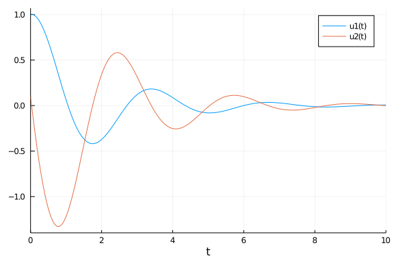
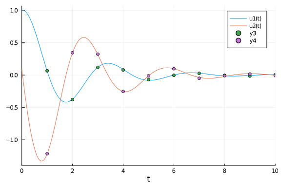
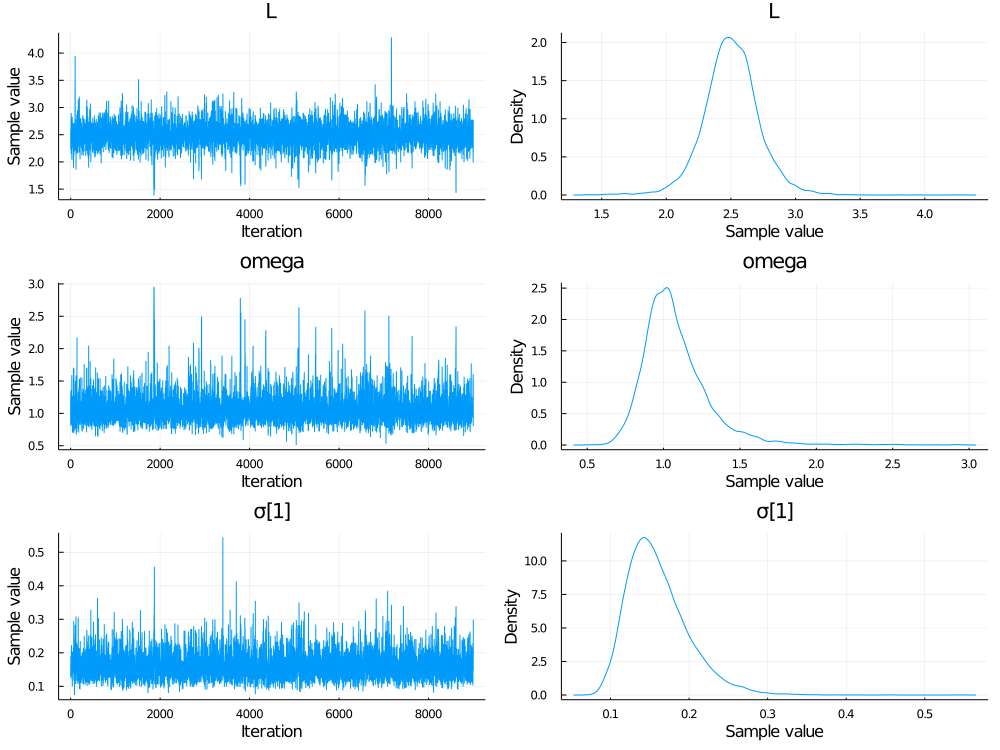
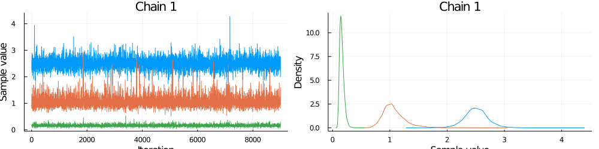

### Set up simple pendulum problem

```julia
using DiffEqBayes, OrdinaryDiffEq, RecursiveArrayTools, Distributions, Plots, StatsPlots, BenchmarkTools, TransformVariables, CmdStan, DynamicHMC
```


Let's define our simple pendulum problem. Here our pendulum has a drag term `ω`
and a length `L`.


We get first order equations by defining the first term as the velocity and the
second term as the position, getting:

```julia
function pendulum(du,u,p,t)
    ω,L = p
    x,y = u
    du[1] = y
    du[2] = - ω*y -(9.8/L)*sin(x)
end

u0 = [1.0,0.1]
tspan = (0.0,10.0)
prob1 = ODEProblem(pendulum,u0,tspan,[1.0,2.5])
```

```
ODEProblem with uType Array{Float64,1} and tType Float64. In-place: true
timespan: (0.0, 10.0)
u0: [1.0, 0.1]
```


### Solve the model and plot

To understand the model and generate data, let's solve and visualize the solution
with the known parameters:

```julia
sol = solve(prob1,Tsit5())
plot(sol)
```




It's the pendulum, so you know what it looks like. It's periodic, but since we
have not made a small angle assumption it's not exactly `sin` or `cos`. Because
the true dampening parameter `ω` is 1, the solution does not decay over time,
nor does it increase. The length `L` determines the period.

### Create some dummy data to use for estimation

We now generate some dummy data to use for estimation

```julia
t = collect(range(1,stop=10,length=10))
randomized = VectorOfArray([(sol(t[i]) + .01randn(2)) for i in 1:length(t)])
data = convert(Array,randomized)
```

```
2×10 Array{Float64,2}:
  0.0669231  -0.377851  0.119404   0.0795968  …  -0.01553     0.00535298
 -1.21411     0.344681  0.323712  -0.253243       0.0164092  -0.00897403
```


Let's see what our data looks like on top of the real solution

```julia
scatter!(data')
```




This data captures the non-dampening effect and the true period, making it
perfect to attempting a Bayesian inference.

### Perform Bayesian Estimation

Now let's fit the pendulum to the data. Since we know our model is correct,
this should give us back the parameters that we used to generate the data!
Define priors on our parameters. In this case, let's assume we don't have much
information, but have a prior belief that ω is between 0.1 and 3.0, while the
length of the pendulum L is probably around 3.0:

```julia
priors = [Uniform(0.1,3.0), Normal(3.0,1.0)]
```

```
2-element Array{Distributions.Distribution{Distributions.Univariate,Distrib
utions.Continuous},1}:
 Distributions.Uniform{Float64}(a=0.1, b=3.0)
 Distributions.Normal{Float64}(μ=3.0, σ=1.0)
```


Finally let's run the estimation routine from DiffEqBayes.jl with the Turing.jl backend to check if we indeed recover the parameters!

```julia
bayesian_result = turing_inference(prob1,Tsit5(),t,data,priors;num_samples=10_000,
                                   syms = [:omega,:L])
```

```
Chains MCMC chain (9000×15×1 Array{Float64,3}):

Iterations        = 1:9000
Thinning interval = 1
Chains            = 1
Samples per chain = 9000
parameters        = L, omega, σ[1]
internals         = acceptance_rate, hamiltonian_energy, hamiltonian_energy
_error, is_accept, log_density, lp, max_hamiltonian_energy_error, n_steps, 
nom_step_size, numerical_error, step_size, tree_depth

Summary Statistics
  parameters      mean       std   naive_se      mcse         ess      rhat
  
      Symbol   Float64   Float64    Float64   Float64     Float64   Float64
  
                                                                           
  
           L    2.5036    0.2148     0.0023    0.0035   3703.0703    1.0000
  
       omega    1.0777    0.2217     0.0023    0.0048   2000.0506    1.0008
  
        σ[1]    0.1603    0.0390     0.0004    0.0007   3326.8139    0.9999
  

Quantiles
  parameters      2.5%     25.0%     50.0%     75.0%     97.5%  
      Symbol   Float64   Float64   Float64   Float64   Float64  
                                                                
           L    2.0761    2.3766    2.5024    2.6302    2.9287  
       omega    0.7670    0.9384    1.0395    1.1706    1.6059  
        σ[1]    0.1018    0.1325    0.1540    0.1812    0.2529
```


Notice that while our guesses had the wrong means, the learned parameters converged
to the correct means, meaning that it learned good posterior distributions for the
parameters. To look at these posterior distributions on the parameters, we can
examine the chains:

```julia
plot(bayesian_result)
```




As a diagnostic, we will also check the parameter chains. The chain is the MCMC
sampling process. The chain should explore parameter space and converge reasonably
well, and we should be taking a lot of samples after it converges (it is these
samples that form the posterior distribution!)

```julia
plot(bayesian_result, colordim = :parameter)
```




Notice that after awhile these chains converge to a "fuzzy line", meaning it
found the area with the most likelihood and then starts to sample around there,
which builds a posterior distribution around the true mean.

DiffEqBayes.jl allows the choice of using Stan.jl, Turing.jl and DynamicHMC.jl for MCMC, you can also use ApproxBayes.jl for Approximate Bayesian computation algorithms.
Let's compare the timings across the different MCMC backends. We'll stick with the default arguments and 10,000 samples in each since there is a lot of room for micro-optimization
specific to each package and algorithm combinations, you might want to do your own experiments for specific problems to get better understanding of the performance.

```julia
@btime bayesian_result = turing_inference(prob1,Tsit5(),t,data,priors;syms = [:omega,:L],num_samples=10_000)
```

```
2.710 s (23598867 allocations: 1.50 GiB)
Chains MCMC chain (9000×15×1 Array{Float64,3}):

Iterations        = 1:9000
Thinning interval = 1
Chains            = 1
Samples per chain = 9000
parameters        = L, omega, σ[1]
internals         = acceptance_rate, hamiltonian_energy, hamiltonian_energy
_error, is_accept, log_density, lp, max_hamiltonian_energy_error, n_steps, 
nom_step_size, numerical_error, step_size, tree_depth

Summary Statistics
  parameters      mean       std   naive_se      mcse         ess      rhat
  
      Symbol   Float64   Float64    Float64   Float64     Float64   Float64
  
                                                                           
  
           L    2.5019    0.2081     0.0022    0.0034   3767.3721    1.0000
  
       omega    1.0773    0.2137     0.0023    0.0040   2973.1493    1.0001
  
        σ[1]    0.1593    0.0371     0.0004    0.0006   4173.1326    1.0004
  

Quantiles
  parameters      2.5%     25.0%     50.0%     75.0%     97.5%  
      Symbol   Float64   Float64   Float64   Float64   Float64  
                                                                
           L    2.0844    2.3770    2.5029    2.6269    2.9178  
       omega    0.7660    0.9383    1.0424    1.1743    1.6056  
        σ[1]    0.1032    0.1325    0.1538    0.1793    0.2468
```


```julia
@btime bayesian_result = stan_inference(prob1,t,data,priors;num_samples=10_000,printsummary=false)
```

```
Error: MethodError: no method matching iterate(::ModelingToolkit.ODESystem)
Closest candidates are:
  iterate(!Matched::Core.SimpleVector) at essentials.jl:603
  iterate(!Matched::Core.SimpleVector, !Matched::Any) at essentials.jl:603
  iterate(!Matched::ExponentialBackOff) at error.jl:253
  ...
```


```julia
@btime bayesian_result = dynamichmc_inference(prob1,Tsit5(),t,data,priors;num_samples = 10_000)
```

```
6.027 s (40540072 allocations: 3.52 GiB)
(posterior = NamedTuple{(:parameters, :σ),Tuple{Array{Float64,1},Array{Floa
t64,1}}}[(parameters = [0.9925322562437633, 2.499846186491921], σ = [0.0059
66804814045917, 0.008177933301622841]), (parameters = [0.9963837443808898, 
2.502334158254934], σ = [0.006778656235910425, 0.009222937077381753]), (par
ameters = [1.0036593578298718, 2.5036585671312954], σ = [0.0052096129327429
53, 0.009389702547257326]), (parameters = [1.012182569162702, 2.49418373759
8965], σ = [0.009352843917833122, 0.006784007433840137]), (parameters = [0.
9776075654162109, 2.506917713604719], σ = [0.00819375792385741, 0.008509449
758223278]), (parameters = [0.9711538245294002, 2.52311064587977], σ = [0.0
08075286197741678, 0.008380689150424841]), (parameters = [1.030127379473760
4, 2.4900769004417103], σ = [0.005671628576862689, 0.009404135319949877]), 
(parameters = [1.027662532372297, 2.47639876182845], σ = [0.005769289829077
621, 0.010107438192968452]), (parameters = [1.02159465396289, 2.47247053938
56765], σ = [0.005902386622399507, 0.009452950393124696]), (parameters = [1
.022343560476168, 2.4776243412273726], σ = [0.0058799594731072675, 0.009630
482440656476])  …  (parameters = [0.99920993073967, 2.507790860320399], σ =
 [0.011498727162582899, 0.009257041097492019]), (parameters = [1.0033967451
562795, 2.5151332738328414], σ = [0.009519097562008954, 0.00920901544856593
2]), (parameters = [0.9976601690281769, 2.507783954703131], σ = [0.00947878
0454357206, 0.008575044597729732]), (parameters = [0.9944432965906622, 2.50
63137783766347], σ = [0.006264533060570234, 0.00805770806170044]), (paramet
ers = [0.995789590567554, 2.507352981860877], σ = [0.005952805608239749, 0.
008806071695367526]), (parameters = [1.0082385919204935, 2.497953403941628]
, σ = [0.005182367418104671, 0.008522531747426976]), (parameters = [0.99962
84152075758, 2.5189801260651614], σ = [0.009705763622756209, 0.010744838454
615106]), (parameters = [1.0119656370109682, 2.494765752066562], σ = [0.004
729975947126395, 0.007155123027207663]), (parameters = [1.0046646904759642,
 2.4934723249796953], σ = [0.005248078221127134, 0.008421618259762318]), (p
arameters = [1.005881733899965, 2.5009460269940513], σ = [0.005481409918559
183, 0.008388170512741225])], chain = [[-0.007495766955188785, 0.9162292045
781582, -5.121543701879515, -4.8063158129028745], [-0.0036228100779651584, 
0.9172239595836579, -4.993976391966563, -4.686061737110957], [0.00365267866
93412507, 0.917753088961152, -5.257249719116282, -4.66814166387209], [0.012
108958905343204, 0.913961516396238, -4.6720748195944335, -4.993187284703021
], [-0.022646951830213737, 0.9190539959828018, -4.804382643391568, -4.76657
7996745424], [-0.029270404566869655, 0.9254925235842713, -4.818946968056696
, -4.781825130348601], [0.029682463987115947, 0.9123135937112545, -5.172278
975524333, -4.666605758791736], [0.02728683723620924, 0.9068053926743036, -
5.155206285919641, -4.5944836714353015], [0.021364792718281282, 0.905217869
1295568, -5.132398497592392, -4.6614283752915044], [0.022097600140248842, 0
.9073001741472317, -5.13620540942405, -4.64282195674715]  …  [-0.0007903815
295350864, 0.9194022302666618, -4.465518931253114, -4.682370817294514], [0.
0033909892480041516, 0.9223257937313328, -4.654455228578712, -4.68757233469
34475], [-0.0023425726538614036, 0.9193994765973328, -4.65869961504571, -4.
7588990850422315], [-0.0055721993164947236, 0.9188130594802799, -5.07285122
4845033, -4.821126122491971], [-0.004219298165150283, 0.9192276077735035, -
5.123892639763714, -4.732313830031988], [0.008204839974368702, 0.9154717581
833844, -5.262493296595247, -4.765041828828386], [-0.0003716538471601385, 0
.9238541077264724, -4.63503538201953, -4.533329783471124], [0.0118946147660
13212, 0.914194837848557, -5.353835161665349, -4.939926671543258], [0.00465
384452294309, 0.9136762470772759, -5.249893322511043, -4.776953276823668], 
[0.0058645040311212536, 0.9166690710924666, -5.20639292670556, -4.780932837
9729665]], tree_statistics = DynamicHMC.TreeStatisticsNUTS[DynamicHMC.TreeS
tatisticsNUTS(50.56734359829101, 3, turning at positions -2:5, 0.9755240439
296025, 7, DynamicHMC.Directions(0x60136a7d)), DynamicHMC.TreeStatisticsNUT
S(53.21141797289948, 4, turning at positions -15:-30, 0.9303977362255577, 3
1, DynamicHMC.Directions(0xf1231261)), DynamicHMC.TreeStatisticsNUTS(54.360
60487933965, 4, turning at positions -1:14, 0.9893416328240263, 15, Dynamic
HMC.Directions(0xe900c27e)), DynamicHMC.TreeStatisticsNUTS(52.0483617779477
5, 5, turning at positions -21:10, 0.9309817421978657, 31, DynamicHMC.Direc
tions(0xe9e3438a)), DynamicHMC.TreeStatisticsNUTS(49.87055132316347, 3, tur
ning at positions 11:14, 0.8572610926819243, 15, DynamicHMC.Directions(0x29
4e978e)), DynamicHMC.TreeStatisticsNUTS(49.19262263342683, 2, turning at po
sitions -2:1, 0.9759539124756529, 3, DynamicHMC.Directions(0xdbea4a09)), Dy
namicHMC.TreeStatisticsNUTS(48.43198128487201, 3, turning at positions -7:0
, 0.981239057221168, 7, DynamicHMC.Directions(0x6fcc3a70)), DynamicHMC.Tree
StatisticsNUTS(47.63166261616587, 2, turning at positions -3:0, 0.995085735
1314513, 3, DynamicHMC.Directions(0xe54734a8)), DynamicHMC.TreeStatisticsNU
TS(46.56863924159915, 3, turning at positions -5:-12, 0.905437436880739, 15
, DynamicHMC.Directions(0xea3a9733)), DynamicHMC.TreeStatisticsNUTS(49.6833
97905049375, 1, turning at positions -1:0, 1.0, 1, DynamicHMC.Directions(0x
1fab498e))  …  DynamicHMC.TreeStatisticsNUTS(51.65316234412242, 4, turning 
at positions 3:18, 0.9415872806438115, 31, DynamicHMC.Directions(0xa9468a12
)), DynamicHMC.TreeStatisticsNUTS(51.711606238318794, 3, turning at positio
ns -1:6, 0.8623986191786585, 7, DynamicHMC.Directions(0x51644e36)), Dynamic
HMC.TreeStatisticsNUTS(51.919656641254015, 4, turning at positions -8:-23, 
0.9084259271209352, 31, DynamicHMC.Directions(0x3319ca68)), DynamicHMC.Tree
StatisticsNUTS(53.202536402977834, 3, turning at positions 6:13, 0.96705305
01687453, 15, DynamicHMC.Directions(0x5012713d)), DynamicHMC.TreeStatistics
NUTS(52.73931670212959, 3, turning at positions -4:-11, 0.9929665212170776,
 15, DynamicHMC.Directions(0x6329d9e4)), DynamicHMC.TreeStatisticsNUTS(54.1
31036067725944, 3, turning at positions -4:-11, 0.9888188927167221, 15, Dyn
amicHMC.Directions(0x8b23b0b4)), DynamicHMC.TreeStatisticsNUTS(51.488325981
24062, 4, turning at positions 0:15, 0.6147719493975838, 15, DynamicHMC.Dir
ections(0xfc3d19af)), DynamicHMC.TreeStatisticsNUTS(49.47067467051124, 4, t
urning at positions -13:2, 0.9105644910181027, 15, DynamicHMC.Directions(0x
cd45ce02)), DynamicHMC.TreeStatisticsNUTS(48.9855447707631, 3, turning at p
ositions -2:5, 0.5761761677703705, 7, DynamicHMC.Directions(0xd968714d)), D
ynamicHMC.TreeStatisticsNUTS(54.41136057897444, 3, turning at positions -3:
4, 0.9945976434248669, 7, DynamicHMC.Directions(0x77185434))], κ = Gaussian
 kinetic energy (Diagonal), √diag(M⁻¹): [0.022077917058954552, 0.0202796088
43069858, 0.2918638996850573, 0.24966858752333757], ϵ = 0.17395099027012478
)
```


