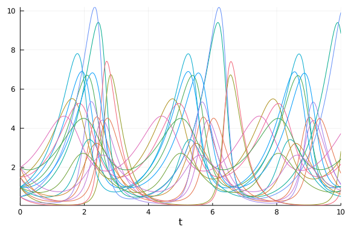

First you want to create a problem which solves multiple problems at the same time. This is the Monte Carlo Problem. When the parameter estimation tools say it will take any DEProblem, it really means ANY DEProblem!

So, let's get a Monte Carlo problem setup that solves with 10 different initial conditions.

````julia

using DifferentialEquations, DiffEqParamEstim, Plots, Optim

# Monte Carlo Problem Set Up for solving set of ODEs with different initial conditions

# Set up Lotka-Volterra system
function pf_func(du,u,p,t)
  du[1] = p[1] * u[1] - p[2] * u[1]*u[2]
  du[2] = -3 * u[2] + u[1]*u[2]
end
p = [1.5,1.0]
prob = ODEProblem(pf_func,[1.0,1.0],(0.0,10.0),p)
````


````
ODEProblem with uType Array{Float64,1} and tType Float64. In-place: true
timespan: (0.0, 10.0)
u0: [1.0, 1.0]
````


Now for a MonteCarloProblem we have to take this problem and tell it what to do N times via the prob_func. So let's generate N=10 different initial conditions, and tell it to run the same problem but with these 10 different initial conditions each time:

````julia

# Setting up to solve the problem N times (for the N different initial conditions)
N = 10;
initial_conditions = [[1.0,1.0], [1.0,1.5], [1.5,1.0], [1.5,1.5], [0.5,1.0], [1.0,0.5], [0.5,0.5], [2.0,1.0], [1.0,2.0], [2.0,2.0]]
function prob_func(prob,i,repeat)
  ODEProblem(prob.f,initial_conditions[i],prob.tspan,prob.p)
end
monte_prob = MonteCarloProblem(prob,prob_func=prob_func)
````


````
EnsembleProblem with problem ODEProblem
````


We can check this does what we want by solving it:

````julia

# Check above does what we want
sim = solve(monte_prob,Tsit5(),num_monte=N)
plot(sim)
````





num_monte=N means "run N times", and each time it runs the problem returned by the prob_func, which is always the same problem but with the ith initial condition.

Now let's generate a dataset from that. Let's get data points at every t=0.1 using saveat, and then convert the solution into an array.

````julia

# Generate a dataset from these runs
data_times = 0.0:0.1:10.0
sim = solve(monte_prob,Tsit5(),num_monte=N,saveat=data_times)
data = Array(sim)
````


````
2×101×10 Array{Float64,3}:
[:, :, 1] =
 1.0  1.06108   1.14403   1.24917   1.37764   …  0.956979  0.983561  1.0337
6
 1.0  0.821084  0.679053  0.566893  0.478813     1.35559   1.10629   0.9063
7

[:, :, 2] =
 1.0  1.01413  1.05394  1.11711   …  1.05324  1.01309  1.00811  1.03162
 1.5  1.22868  1.00919  0.833191     2.08023  1.70818  1.39972  1.14802

[:, :, 3] =
 1.5  1.58801   1.70188   1.84193   2.00901   …  2.0153    2.21084   2.4358
9
 1.0  0.864317  0.754624  0.667265  0.599149     0.600943  0.549793  0.5136
8

[:, :, 4] =
 1.5  1.51612  1.5621   1.63555   1.73531   …  1.83822   1.98545   2.15958
 1.5  1.29176  1.11592  0.969809  0.850159     0.771088  0.691421  0.630025

[:, :, 5] =
 0.5  0.531705  0.576474  0.634384  0.706139  …  9.05366   9.4006   8.8391
 1.0  0.77995   0.610654  0.480565  0.380645     0.809383  1.51708  2.82619

[:, :, 6] =
 1.0  1.11027   1.24238   1.39866   1.58195   …  0.753107  0.748814  0.7682
84
 0.5  0.411557  0.342883  0.289812  0.249142     1.73879   1.38829   1.1093
2

[:, :, 7] =
 0.5  0.555757  0.623692  0.705084  0.80158   …  8.11213   9.10669   9.9216
9
 0.5  0.390449  0.30679   0.24286   0.193966     0.261294  0.455928  0.8787
92

[:, :, 8] =
 2.0  2.11239   2.24921   2.41003   2.59433   …  3.22292   3.47356   3.7301
1
 1.0  0.909749  0.838025  0.783532  0.745339     0.739406  0.765524  0.8130
04

[:, :, 9] =
 1.0  0.969326  0.971358  1.00017  …  1.25065  1.1012   1.01733  0.979304
 2.0  1.63445   1.33389   1.09031     3.02672  2.52063  2.07503  1.69808

[:, :, 10] =
 2.0  1.92148  1.88215  1.87711  1.90264  …  2.15079  2.27937   2.43105
 2.0  1.80195  1.61405  1.4426   1.2907      0.95722  0.884825  0.829478
````


Here, data[i,j,k] is the same as sim[i,j,k] which is the same as sim[k][i,j] (where sim[k] is the kth solution). So data[i,j,k] is the jth timepoint of the ith variable in the kth trajectory.

Now let's build a loss function. A loss function is some loss(sol) that spits out a scalar for how far from optimal we are. In the documentation I show that we normally do loss = L2Loss(t,data), but we can bootstrap off of this. Instead lets build an array of N loss functions, each one with the correct piece of data.

````julia

# Building a loss function
losses = [L2Loss(data_times,data[:,:,i]) for i in 1:N]
````


````
10-element Array{DiffEqParamEstim.L2Loss{StepRangeLen{Float64,Base.TwicePre
cision{Float64},Base.TwicePrecision{Float64}},Array{Float64,2},Nothing,Noth
ing,Nothing},1}:
 DiffEqParamEstim.L2Loss{StepRangeLen{Float64,Base.TwicePrecision{Float64},
Base.TwicePrecision{Float64}},Array{Float64,2},Nothing,Nothing,Nothing}(0.0
:0.1:10.0, [1.0 1.0610780673356452 … 0.9835609175876878 1.03375813933372; 1
.0 0.821084277588617 … 1.1062868012281115 0.9063703701433561], nothing, not
hing, nothing, nothing)
 DiffEqParamEstim.L2Loss{StepRangeLen{Float64,Base.TwicePrecision{Float64},
Base.TwicePrecision{Float64}},Array{Float64,2},Nothing,Nothing,Nothing}(0.0
:0.1:10.0, [1.0 1.0141312263418634 … 1.0081060199159142 1.0316172446513838;
 1.5 1.228683152066521 … 1.399724197709348 1.1480244766323144], nothing, no
thing, nothing, nothing)
 DiffEqParamEstim.L2Loss{StepRangeLen{Float64,Base.TwicePrecision{Float64},
Base.TwicePrecision{Float64}},Array{Float64,2},Nothing,Nothing,Nothing}(0.0
:0.1:10.0, [1.5 1.5880106683980333 … 2.2108390928827633 2.4358900204179257;
 1.0 0.8643172923598123 … 0.5497934554116727 0.5136795231383728], nothing, 
nothing, nothing, nothing)
 DiffEqParamEstim.L2Loss{StepRangeLen{Float64,Base.TwicePrecision{Float64},
Base.TwicePrecision{Float64}},Array{Float64,2},Nothing,Nothing,Nothing}(0.0
:0.1:10.0, [1.5 1.5161205353418132 … 1.98544815023441 2.159582376155923; 1.
5 1.291763682858893 … 0.6914210407725863 0.6300249062168604], nothing, noth
ing, nothing, nothing)
 DiffEqParamEstim.L2Loss{StepRangeLen{Float64,Base.TwicePrecision{Float64},
Base.TwicePrecision{Float64}},Array{Float64,2},Nothing,Nothing,Nothing}(0.0
:0.1:10.0, [0.5 0.5317050732862075 … 9.40059681475263 8.839104135554038; 1.
0 0.7799498910330318 … 1.5170828246557035 2.8261900619627034], nothing, not
hing, nothing, nothing)
 DiffEqParamEstim.L2Loss{StepRangeLen{Float64,Base.TwicePrecision{Float64},
Base.TwicePrecision{Float64}},Array{Float64,2},Nothing,Nothing,Nothing}(0.0
:0.1:10.0, [1.0 1.1102743524476706 … 0.7488135727436903 0.7682835552381805;
 0.5 0.41155721428049064 … 1.3882945275734764 1.1093238617250127], nothing,
 nothing, nothing, nothing)
 DiffEqParamEstim.L2Loss{StepRangeLen{Float64,Base.TwicePrecision{Float64},
Base.TwicePrecision{Float64}},Array{Float64,2},Nothing,Nothing,Nothing}(0.0
:0.1:10.0, [0.5 0.5557572700553828 … 9.106689672020078 9.92168798092248; 0.
5 0.390449424650402 … 0.4559279494700062 0.8787916230455673], nothing, noth
ing, nothing, nothing)
 DiffEqParamEstim.L2Loss{StepRangeLen{Float64,Base.TwicePrecision{Float64},
Base.TwicePrecision{Float64}},Array{Float64,2},Nothing,Nothing,Nothing}(0.0
:0.1:10.0, [2.0 2.112390154025954 … 3.47356127269175 3.7301053632038483; 1.
0 0.9097494017873065 … 0.7655239702477202 0.8130037985322804], nothing, not
hing, nothing, nothing)
 DiffEqParamEstim.L2Loss{StepRangeLen{Float64,Base.TwicePrecision{Float64},
Base.TwicePrecision{Float64}},Array{Float64,2},Nothing,Nothing,Nothing}(0.0
:0.1:10.0, [1.0 0.9693256296130462 … 1.0173287701631242 0.9793042434753583;
 2.0 1.634450182452438 … 2.075029652563485 1.6980752053964283], nothing, no
thing, nothing, nothing)
 DiffEqParamEstim.L2Loss{StepRangeLen{Float64,Base.TwicePrecision{Float64},
Base.TwicePrecision{Float64}},Array{Float64,2},Nothing,Nothing,Nothing}(0.0
:0.1:10.0, [2.0 1.9214830168796073 … 2.279371218479859 2.4310471044470905; 
2.0 1.8019540594630474 … 0.8848252408869255 0.8294783000181652], nothing, n
othing, nothing, nothing)
````


So losses[i] is a function which computes the loss of a solution against the data of the ith trajectory. So to build our true loss function, we sum the losses:

````julia

loss(sim) = sum(losses[i](sim[i]) for i in 1:N)
````


````
loss (generic function with 1 method)
````


As a double check, make sure that loss(sim) outputs zero (since we generated the data from sim). Now we generate data with other parameters:

````julia

prob = ODEProblem(pf_func,[1.0,1.0],(0.0,10.0),[1.2,0.8])
function prob_func(prob,i,repeat)
  ODEProblem(prob.f,initial_conditions[i],prob.tspan,prob.p)
end
monte_prob = MonteCarloProblem(prob,prob_func=prob_func)
sim = solve(monte_prob,Tsit5(),num_monte=N,saveat=data_times)
loss(sim)
````


````
10108.69418531734
````


and get a non-zero loss. So we now have our problem, our data, and our loss function... we have what we need.

Put this into build_loss_objective.

````julia

obj = build_loss_objective(monte_prob,Tsit5(),loss,num_monte=N,
                           saveat=data_times)
````


````
(::DiffEqParamEstim.DiffEqObjective{DiffEqParamEstim.var"#43#48"{Nothing,Bo
ol,Int64,typeof(DiffEqParamEstim.STANDARD_PROB_GENERATOR),Base.Iterators.Pa
irs{Symbol,Any,Tuple{Symbol,Symbol},NamedTuple{(:num_monte, :saveat),Tuple{
Int64,StepRangeLen{Float64,Base.TwicePrecision{Float64},Base.TwicePrecision
{Float64}}}}},DiffEqBase.EnsembleProblem{DiffEqBase.ODEProblem{Array{Float6
4,1},Tuple{Float64,Float64},true,Array{Float64,1},DiffEqBase.ODEFunction{tr
ue,typeof(Main.##WeaveSandBox#293.pf_func),LinearAlgebra.UniformScaling{Boo
l},Nothing,Nothing,Nothing,Nothing,Nothing,Nothing,Nothing,Nothing,Nothing,
Nothing,Nothing,Nothing},Base.Iterators.Pairs{Union{},Union{},Tuple{},Named
Tuple{(),Tuple{}}},DiffEqBase.StandardODEProblem},typeof(Main.##WeaveSandBo
x#293.prob_func),typeof(DiffEqBase.DEFAULT_OUTPUT_FUNC),typeof(DiffEqBase.D
EFAULT_REDUCTION),Nothing},OrdinaryDiffEq.Tsit5,typeof(Main.##WeaveSandBox#
293.loss),Nothing,Tuple{}},DiffEqParamEstim.var"#47#53"{DiffEqParamEstim.va
r"#43#48"{Nothing,Bool,Int64,typeof(DiffEqParamEstim.STANDARD_PROB_GENERATO
R),Base.Iterators.Pairs{Symbol,Any,Tuple{Symbol,Symbol},NamedTuple{(:num_mo
nte, :saveat),Tuple{Int64,StepRangeLen{Float64,Base.TwicePrecision{Float64}
,Base.TwicePrecision{Float64}}}}},DiffEqBase.EnsembleProblem{DiffEqBase.ODE
Problem{Array{Float64,1},Tuple{Float64,Float64},true,Array{Float64,1},DiffE
qBase.ODEFunction{true,typeof(Main.##WeaveSandBox#293.pf_func),LinearAlgebr
a.UniformScaling{Bool},Nothing,Nothing,Nothing,Nothing,Nothing,Nothing,Noth
ing,Nothing,Nothing,Nothing,Nothing,Nothing},Base.Iterators.Pairs{Union{},U
nion{},Tuple{},NamedTuple{(),Tuple{}}},DiffEqBase.StandardODEProblem},typeo
f(Main.##WeaveSandBox#293.prob_func),typeof(DiffEqBase.DEFAULT_OUTPUT_FUNC)
,typeof(DiffEqBase.DEFAULT_REDUCTION),Nothing},OrdinaryDiffEq.Tsit5,typeof(
Main.##WeaveSandBox#293.loss),Nothing,Tuple{}}}}) (generic function with 2 
methods)
````


Notice that I added the kwargs for solve into this. They get passed to an internal solve command, so then the loss is computed on N trajectories at data_times.

Thus we take this objective function over to any optimization package. I like to do quick things in Optim.jl. Here, since the Lotka-Volterra equation requires positive parameters, I use Fminbox to make sure the parameters stay positive. I start the optimization with [1.3,0.9], and Optim spits out that the true parameters are:

````julia

lower = zeros(2)
upper = fill(2.0,2)
result = optimize(obj, lower, upper, [1.3,0.9], Fminbox(BFGS()))
````


````
* Status: success

 * Candidate solution
    Final objective value:     3.530023e-13

 * Found with
    Algorithm:     Fminbox with BFGS

 * Convergence measures
    |x - x'|               = 0.00e+00 ≤ 0.0e+00
    |x - x'|/|x'|          = 0.00e+00 ≤ 0.0e+00
    |f(x) - f(x')|         = 0.00e+00 ≤ 0.0e+00
    |f(x) - f(x')|/|f(x')| = 0.00e+00 ≤ 0.0e+00
    |g(x)|                 = 1.09e-05 ≰ 1.0e-08

 * Work counters
    Seconds run:   61  (vs limit Inf)
    Iterations:    9
    f(x) calls:    46080
    ∇f(x) calls:   46080
````


````julia

result
````


````
* Status: success

 * Candidate solution
    Final objective value:     3.530023e-13

 * Found with
    Algorithm:     Fminbox with BFGS

 * Convergence measures
    |x - x'|               = 0.00e+00 ≤ 0.0e+00
    |x - x'|/|x'|          = 0.00e+00 ≤ 0.0e+00
    |f(x) - f(x')|         = 0.00e+00 ≤ 0.0e+00
    |f(x) - f(x')|/|f(x')| = 0.00e+00 ≤ 0.0e+00
    |g(x)|                 = 1.09e-05 ≰ 1.0e-08

 * Work counters
    Seconds run:   61  (vs limit Inf)
    Iterations:    9
    f(x) calls:    46080
    ∇f(x) calls:   46080
````


Optim finds one but not the other parameter.

I would run a test on synthetic data for your problem before using it on real data. Maybe play around with different optimization packages, or add regularization. You may also want to decrease the tolerance of the ODE solvers via

````julia

obj = build_loss_objective(monte_prob,Tsit5(),loss,num_monte=N,
                           abstol=1e-8,reltol=1e-8,
                           saveat=data_times)
result = optimize(obj, lower, upper, [1.3,0.9], Fminbox(BFGS()))
````


````
* Status: success

 * Candidate solution
    Final objective value:     4.155346e-02

 * Found with
    Algorithm:     Fminbox with BFGS

 * Convergence measures
    |x - x'|               = 3.84e-14 ≰ 0.0e+00
    |x - x'|/|x'|          = 2.13e-14 ≰ 0.0e+00
    |f(x) - f(x')|         = 0.00e+00 ≤ 0.0e+00
    |f(x) - f(x')|/|f(x')| = 0.00e+00 ≤ 0.0e+00
    |g(x)|                 = 2.92e-09 ≤ 1.0e-08

 * Work counters
    Seconds run:   1  (vs limit Inf)
    Iterations:    5
    f(x) calls:    46
    ∇f(x) calls:   46
````


````julia

result
````


````
* Status: success

 * Candidate solution
    Final objective value:     4.155346e-02

 * Found with
    Algorithm:     Fminbox with BFGS

 * Convergence measures
    |x - x'|               = 3.84e-14 ≰ 0.0e+00
    |x - x'|/|x'|          = 2.13e-14 ≰ 0.0e+00
    |f(x) - f(x')|         = 0.00e+00 ≤ 0.0e+00
    |f(x) - f(x')|/|f(x')| = 0.00e+00 ≤ 0.0e+00
    |g(x)|                 = 2.92e-09 ≤ 1.0e-08

 * Work counters
    Seconds run:   1  (vs limit Inf)
    Iterations:    5
    f(x) calls:    46
    ∇f(x) calls:   46
````


if you suspect error is the problem. However, if you're having problems it's most likely not the ODE solver tolerance and mostly because parameter inference is a very hard optimization problem.


## Appendix

 This tutorial is part of the SciMLTutorials.jl repository, found at: <https://github.com/SciML/SciMLTutorials.jl>.
 For more information on doing scientific machine learning (SciML) with open source software, check out <https://sciml.ai/>.

To locally run this tutorial, do the following commands:
```
using SciMLTutorials
SciMLTutorials.weave_file("model_inference","02-monte_carlo_parameter_estim.jmd")
```

Computer Information:
```
Julia Version 1.4.2
Commit 44fa15b150* (2020-05-23 18:35 UTC)
Platform Info:
  OS: Linux (x86_64-pc-linux-gnu)
  CPU: Intel(R) Core(TM) i7-9700K CPU @ 3.60GHz
  WORD_SIZE: 64
  LIBM: libopenlibm
  LLVM: libLLVM-8.0.1 (ORCJIT, skylake)
Environment:
  JULIA_LOAD_PATH = /builds/JuliaGPU/DiffEqTutorials.jl:
  JULIA_DEPOT_PATH = /builds/JuliaGPU/DiffEqTutorials.jl/.julia
  JULIA_CUDA_MEMORY_LIMIT = 2147483648
  JULIA_NUM_THREADS = 8

```

Package Information:

```
Status `/builds/JuliaGPU/DiffEqTutorials.jl/tutorials/model_inference/Project.toml`
[6e4b80f9-dd63-53aa-95a3-0cdb28fa8baf] BenchmarkTools 0.5.0
[593b3428-ca2f-500c-ae53-031589ec8ddd] CmdStan 6.0.8
[ebbdde9d-f333-5424-9be2-dbf1e9acfb5e] DiffEqBayes 2.17.0
[1130ab10-4a5a-5621-a13d-e4788d82bd4c] DiffEqParamEstim 1.17.0
[0c46a032-eb83-5123-abaf-570d42b7fbaa] DifferentialEquations 6.15.0
[31c24e10-a181-5473-b8eb-7969acd0382f] Distributions 0.23.12
[bbc10e6e-7c05-544b-b16e-64fede858acb] DynamicHMC 2.2.0
[429524aa-4258-5aef-a3af-852621145aeb] Optim 1.2.0
[1dea7af3-3e70-54e6-95c3-0bf5283fa5ed] OrdinaryDiffEq 5.42.8
[91a5bcdd-55d7-5caf-9e0b-520d859cae80] Plots 1.6.5
[731186ca-8d62-57ce-b412-fbd966d074cd] RecursiveArrayTools 2.7.0
[f3b207a7-027a-5e70-b257-86293d7955fd] StatsPlots 0.14.13
[84d833dd-6860-57f9-a1a7-6da5db126cff] TransformVariables 0.3.10
```
