If you're getting some cold feet to jump in to DiffEq land, here are some handcrafted differential equations mini problems to hold your hand along the beginning of your journey.

## First order linear ODE

#### Radioactive Decay of Carbon-14

$$f(t,u) = \frac{du}{dt}$$

The Radioactive decay problem is the first order linear ODE problem of an exponential with a negative coefficient, which represents the half-life of the process in question. Should the coefficient be positive, this would represent a population growth equation.

````julia
using OrdinaryDiffEq, Plots
gr()

#Half-life of Carbon-14 is 5,730 years.
C₁ = 5.730

#Setup
u₀ = 1.0
tspan = (0.0, 1.0)

#Define the problem
radioactivedecay(u,p,t) = -C₁*u

#Pass to solver
prob = ODEProblem(radioactivedecay,u₀,tspan)
sol = solve(prob,Tsit5())

#Plot
plot(sol,linewidth=2,title ="Carbon-14 half-life", xaxis = "Time in thousands of years", yaxis = "Percentage left", label = "Numerical Solution")
plot!(sol.t, t->exp(-C₁*t),lw=3,ls=:dash,label="Analytical Solution")
````


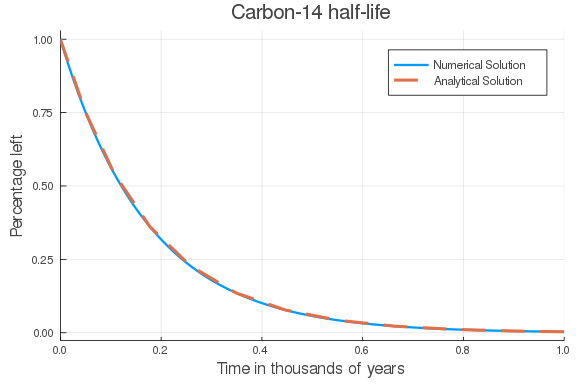


## Second Order Linear ODE

#### Simple Harmonic Oscillator

Another classical example is the harmonic oscillator, given by
$$
\ddot{x} + \omega^2 x = 0
$$
with the known analytical solution
$$
\begin{align*}
x(t) &= A\cos(\omega t - \phi) \\
v(t) &= -A\omega\sin(\omega t - \phi),
\end{align*}
$$
where
$$
A = \sqrt{c_1 + c_2} \qquad\text{and}\qquad \tan \phi = \frac{c_2}{c_1}
$$
with $c_1, c_2$ constants determined by the initial conditions such that
$c_1$ is the initial position and $\omega c_2$ is the initial velocity.

Instead of transforming this to a system of ODEs to solve with `ODEProblem`,
we can use `SecondOrderODEProblem` as follows.

````julia
# Simple Harmonic Oscillator Problem
using OrdinaryDiffEq, Plots

#Parameters
ω = 1

#Initial Conditions
x₀ = [0.0]
dx₀ = [π/2]
tspan = (0.0, 2π)

ϕ = atan((dx₀[1]/ω)/x₀[1])
A = √(x₀[1]^2 + dx₀[1]^2)

#Define the problem
function harmonicoscillator(ddu,du,u,ω,t)
    ddu .= -ω^2 * u
end

#Pass to solvers
prob = SecondOrderODEProblem(harmonicoscillator, dx₀, x₀, tspan, ω)
sol = solve(prob, DPRKN6())

#Plot
plot(sol, vars=[2,1], linewidth=2, title ="Simple Harmonic Oscillator", xaxis = "Time", yaxis = "Elongation", label = ["x" "dx"])
plot!(t->A*cos(ω*t-ϕ), lw=3, ls=:dash, label="Analytical Solution x")
plot!(t->-A*ω*sin(ω*t-ϕ), lw=3, ls=:dash, label="Analytical Solution dx")
````


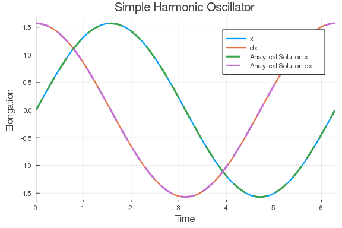


Note that the order of the variables (and initial conditions) is `dx`, `x`.
Thus, if we want the first series to be `x`, we have to flip the order with `vars=[2,1]`.

## Second Order Non-linear ODE

#### Simple Pendulum

We will start by solving the pendulum problem. In the physics class, we often solve this problem by small angle approximation, i.e. $ sin(\theta) \approx \theta$, because otherwise, we get an elliptic integral which doesn't have an analytic solution. The linearized form is

$$\ddot{\theta} + \frac{g}{L}{\theta} = 0$$

But we have numerical ODE solvers! Why not solve the *real* pendulum?

$$\ddot{\theta} + \frac{g}{L}{\sin(\theta)} = 0$$

Notice that now we have a second order ODE.
In order to use the same method as above, we nee to transform it into a system
of first order ODEs by employing the notation $d\theta = \dot{\theta}$.

$$
\begin{align*}
&\dot{\theta} = d{\theta} \\
&\dot{d\theta} = - \frac{g}{L}{\sin(\theta)}
\end{align*}
$$

````julia
# Simple Pendulum Problem
using OrdinaryDiffEq, Plots

#Constants
const g = 9.81
L = 1.0

#Initial Conditions
u₀ = [0,π/2]
tspan = (0.0,6.3)

#Define the problem
function simplependulum(du,u,p,t)
    θ = u[1]
    dθ = u[2]
    du[1] = dθ
    du[2] = -(g/L)*sin(θ)
end

#Pass to solvers
prob = ODEProblem(simplependulum, u₀, tspan)
sol = solve(prob,Tsit5())

#Plot
plot(sol,linewidth=2,title ="Simple Pendulum Problem", xaxis = "Time", yaxis = "Height", label = ["\\theta" "d\\theta"])
````


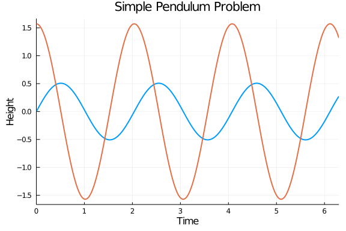


So now we know that behaviour of the position versus time. However, it will be useful to us to look at the phase space of the pendulum, i.e., and representation of all possible states of the system in question (the pendulum) by looking at its velocity and position. Phase space analysis is ubiquitous in the analysis of dynamical systems, and thus we will provide a few facilities for it.

````julia
p = plot(sol,vars = (1,2), xlims = (-9,9), title = "Phase Space Plot", xaxis = "Velocity", yaxis = "Position", leg=false)
function phase_plot(prob, u0, p, tspan=2pi)
    _prob = ODEProblem(prob.f,u0,(0.0,tspan))
    sol = solve(_prob,Vern9()) # Use Vern9 solver for higher accuracy
    plot!(p,sol,vars = (1,2), xlims = nothing, ylims = nothing)
end
for i in -4pi:pi/2:4π
    for j in -4pi:pi/2:4π
        phase_plot(prob, [j,i], p)
    end
end
plot(p,xlims = (-9,9))
````


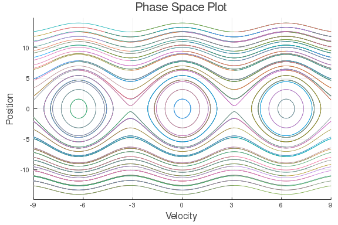


#### Double Pendulum

A more complicated example is given by the double pendulum. The equations governing
its motion are given by the following (taken from this [StackOverflow question](https://mathematica.stackexchange.com/questions/40122/help-to-plot-poincar%C3%A9-section-for-double-pendulum))

$$\frac{d}{dt}
\begin{pmatrix}
\alpha \\ l_\alpha \\ \beta \\ l_\beta
\end{pmatrix}=
\begin{pmatrix}
2\frac{l_\alpha - (1+\cos\beta)l_\beta}{3-\cos 2\beta} \\
-2\sin\alpha - \sin(\alpha + \beta) \\
2\frac{-(1+\cos\beta)l_\alpha + (3+2\cos\beta)l_\beta}{3-\cos2\beta}\\
-\sin(\alpha+\beta) - 2\sin(\beta)\frac{(l_\alpha-l_\beta)l_\beta}{3-\cos2\beta} + 2\sin(2\beta)\frac{l_\alpha^2-2(1+\cos\beta)l_\alpha l_\beta + (3+2\cos\beta)l_\beta^2}{(3-\cos2\beta)^2}
\end{pmatrix}$$

````julia
#Double Pendulum Problem
using OrdinaryDiffEq, Plots

#Constants and setup
const m₁, m₂, L₁, L₂ = 1, 2, 1, 2
initial = [0, π/3, 0, 3pi/5]
tspan = (0.,50.)

#Convenience function for transforming from polar to Cartesian coordinates
function polar2cart(sol;dt=0.02,l1=L₁,l2=L₂,vars=(2,4))
    u = sol.t[1]:dt:sol.t[end]

    p1 = l1*map(x->x[vars[1]], sol.(u))
    p2 = l2*map(y->y[vars[2]], sol.(u))

    x1 = l1*sin.(p1)
    y1 = l1*-cos.(p1)
    (u, (x1 + l2*sin.(p2),
     y1 - l2*cos.(p2)))
end

#Define the Problem
function double_pendulum(xdot,x,p,t)
    xdot[1]=x[2]
    xdot[2]=-((g*(2*m₁+m₂)*sin(x[1])+m₂*(g*sin(x[1]-2*x[3])+2*(L₂*x[4]^2+L₁*x[2]^2*cos(x[1]-x[3]))*sin(x[1]-x[3])))/(2*L₁*(m₁+m₂-m₂*cos(x[1]-x[3])^2)))
    xdot[3]=x[4]
    xdot[4]=(((m₁+m₂)*(L₁*x[2]^2+g*cos(x[1]))+L₂*m₂*x[4]^2*cos(x[1]-x[3]))*sin(x[1]-x[3]))/(L₂*(m₁+m₂-m₂*cos(x[1]-x[3])^2))
end

#Pass to Solvers
double_pendulum_problem = ODEProblem(double_pendulum, initial, tspan)
sol = solve(double_pendulum_problem, Vern7(), abs_tol=1e-10, dt=0.05);
````


````julia
#Obtain coordinates in Cartesian Geometry
ts, ps = polar2cart(sol, l1=L₁, l2=L₂, dt=0.01)
plot(ps...)
````


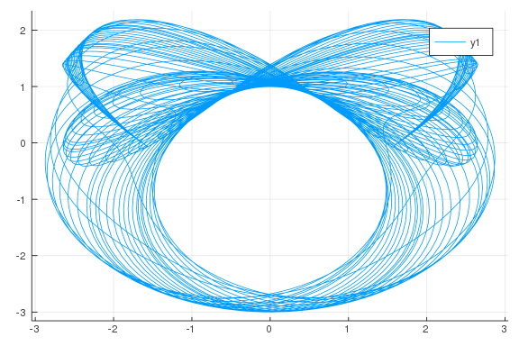


##### Poincaré section

In this case the phase space is 4 dimensional and it cannot be easily visualized.
Instead of looking at the full phase space, we can look at Poincaré sections,
which are sections through a higher-dimensional phase space diagram.
This helps to understand the dynamics of interactions and is wonderfully pretty.

The Poincaré section in this is given by the collection of $(β,l_β)$ when $α=0$ and $\frac{dα}{dt}>0$.

````julia
#Constants and setup
using OrdinaryDiffEq
initial2 = [0.01, 0.005, 0.01, 0.01]
tspan2 = (0.,500.)

#Define the problem
function double_pendulum_hamiltonian(udot,u,p,t)
    α  = u[1]
    lα = u[2]
    β  = u[3]
    lβ = u[4]
    udot .=
    [2(lα-(1+cos(β))lβ)/(3-cos(2β)),
    -2sin(α) - sin(α+β),
    2(-(1+cos(β))lα + (3+2cos(β))lβ)/(3-cos(2β)),
    -sin(α+β) - 2sin(β)*(((lα-lβ)lβ)/(3-cos(2β))) + 2sin(2β)*((lα^2 - 2(1+cos(β))lα*lβ + (3+2cos(β))lβ^2)/(3-cos(2β))^2)]
end

# Construct a ContiunousCallback
condition(u,t,integrator) = u[1]
affect!(integrator) = nothing
cb = ContinuousCallback(condition,affect!,nothing,
                        save_positions = (true,false))

# Construct Problem
poincare = ODEProblem(double_pendulum_hamiltonian, initial2, tspan2)
sol2 = solve(poincare, Vern9(), save_everystep = false, save_start=false, save_end=false, callback=cb, abstol=1e-16, reltol=1e-16,)

function poincare_map(prob, u₀, p; callback=cb)
    _prob = ODEProblem(prob.f, u₀, prob.tspan)
    sol = solve(_prob, Vern9(), save_everystep = false, save_start=false, save_end=false, callback=cb, abstol=1e-16, reltol=1e-16)
    scatter!(p, sol, vars=(3,4), markersize = 3, msw=0)
end
````


````
poincare_map (generic function with 1 method)
````


````julia
lβrange = -0.02:0.0025:0.02
p = scatter(sol2, vars=(3,4), leg=false, markersize = 3, msw=0)
for lβ in lβrange
    poincare_map(poincare, [0.01, 0.01, 0.01, lβ], p)
end
plot(p, xlabel="\\beta", ylabel="l_\\beta", ylims=(0, 0.03))
````


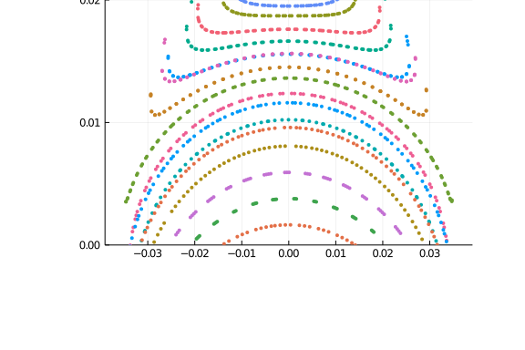


#### Hénon-Heiles System

The Hénon-Heiles potential occurs when non-linear motion of a star around a galactic center with the motion restricted to a plane.

$$
\begin{align}
\frac{d^2x}{dt^2}&=-\frac{\partial V}{\partial x}\\
\frac{d^2y}{dt^2}&=-\frac{\partial V}{\partial y}
\end{align}
$$

where

$$V(x,y)={\frac {1}{2}}(x^{2}+y^{2})+\lambda \left(x^{2}y-{\frac {y^{3}}{3}}\right).$$

We pick $\lambda=1$ in this case, so

$$V(x,y) = \frac{1}{2}(x^2+y^2+2x^2y-\frac{2}{3}y^3).$$

Then the total energy of the system can be expressed by

$$E = T+V = V(x,y)+\frac{1}{2}(\dot{x}^2+\dot{y}^2).$$

The total energy should conserve as this system evolves.

````julia
using OrdinaryDiffEq, Plots

#Setup
initial = [0.,0.1,0.5,0]
tspan = (0,100.)

#Remember, V is the potential of the system and T is the Total Kinetic Energy, thus E will
#the total energy of the system.
V(x,y) = 1//2 * (x^2 + y^2 + 2x^2*y - 2//3 * y^3)
E(x,y,dx,dy) = V(x,y) + 1//2 * (dx^2 + dy^2);

#Define the function
function Hénon_Heiles(du,u,p,t)
    x  = u[1]
    y  = u[2]
    dx = u[3]
    dy = u[4]
    du[1] = dx
    du[2] = dy
    du[3] = -x - 2x*y
    du[4] = y^2 - y -x^2
end

#Pass to solvers
prob = ODEProblem(Hénon_Heiles, initial, tspan)
sol = solve(prob, Vern9(), abs_tol=1e-16, rel_tol=1e-16);
````


````julia
# Plot the orbit
plot(sol, vars=(1,2), title = "The orbit of the Hénon-Heiles system", xaxis = "x", yaxis = "y", leg=false)
````


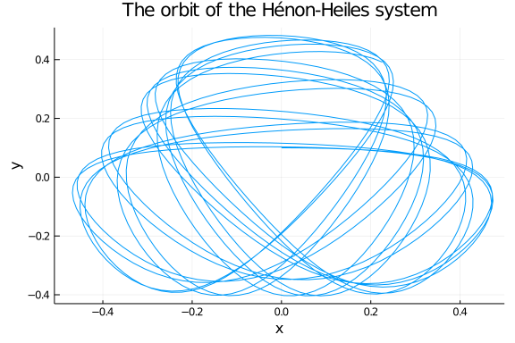

````julia
#Optional Sanity check - what do you think this returns and why?
@show sol.retcode
````


````
sol.retcode = :Success
````


````julia

#Plot -
plot(sol, vars=(1,3), title = "Phase space for the Hénon-Heiles system", xaxis = "Position", yaxis = "Velocity")
plot!(sol, vars=(2,4), leg = false)
````


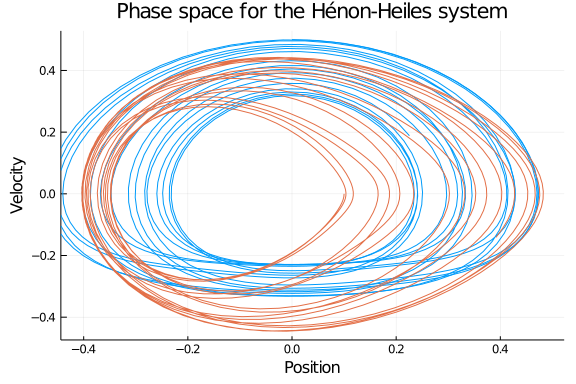

````julia
#We map the Total energies during the time intervals of the solution (sol.u here) to a new vector
#pass it to the plotter a bit more conveniently
energy = map(x->E(x...), sol.u)

#We use @show here to easily spot erratic behaviour in our system by seeing if the loss in energy was too great.
@show ΔE = energy[1]-energy[end]
````


````
ΔE = energy[1] - energy[end] = -3.0986034517260785e-5
````


````julia

#Plot
plot(sol.t, energy .- energy[1], title = "Change in Energy over Time", xaxis = "Time in iterations", yaxis = "Change in Energy")
````


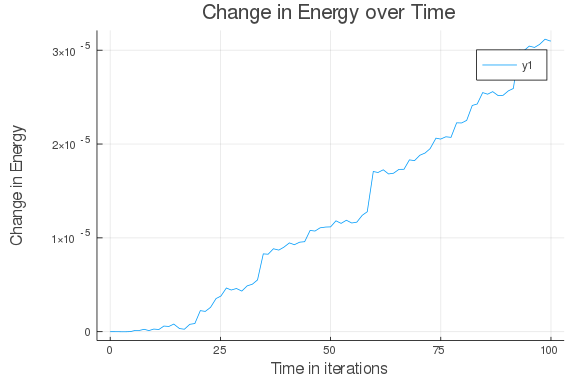


##### Symplectic Integration

To prevent energy drift, we can instead use a symplectic integrator. We can directly define and solve the `SecondOrderODEProblem`:

````julia
function HH_acceleration!(dv,v,u,p,t)
    x,y  = u
    dx,dy = dv
    dv[1] = -x - 2x*y
    dv[2] = y^2 - y -x^2
end
initial_positions = [0.0,0.1]
initial_velocities = [0.5,0.0]
prob = SecondOrderODEProblem(HH_acceleration!,initial_velocities,initial_positions,tspan)
sol2 = solve(prob, KahanLi8(), dt=1/10);
````


Notice that we get the same results:

````julia
# Plot the orbit
plot(sol2, vars=(3,4), title = "The orbit of the Hénon-Heiles system", xaxis = "x", yaxis = "y", leg=false)
````


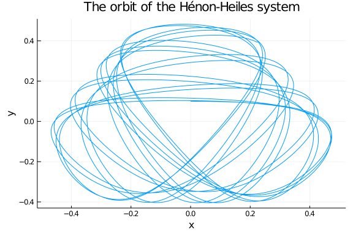

````julia
plot(sol2, vars=(3,1), title = "Phase space for the Hénon-Heiles system", xaxis = "Position", yaxis = "Velocity")
plot!(sol2, vars=(4,2), leg = false)
````


but now the energy change is essentially zero:

````julia
energy = map(x->E(x[3], x[4], x[1], x[2]), sol2.u)
#We use @show here to easily spot erratic behaviour in our system by seeing if the loss in energy was too great.
@show ΔE = energy[1]-energy[end]
````


````
ΔE = energy[1] - energy[end] = 9.020562075079397e-15
````


````julia

#Plot
plot(sol2.t, energy .- energy[1], title = "Change in Energy over Time", xaxis = "Time in iterations", yaxis = "Change in Energy")
````


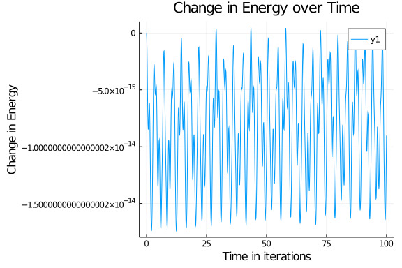


And let's try to use a Runge-Kutta-Nyström solver to solve this. Note that Runge-Kutta-Nyström isn't symplectic.

````julia
sol3 = solve(prob, DPRKN6());
energy = map(x->E(x[3], x[4], x[1], x[2]), sol3.u)
@show ΔE = energy[1]-energy[end]
````


````
ΔE = energy[1] - energy[end] = -8.836874152734486e-6
````


````julia
gr()
plot(sol3.t, energy .- energy[1], title = "Change in Energy over Time", xaxis = "Time in iterations", yaxis = "Change in Energy")
````


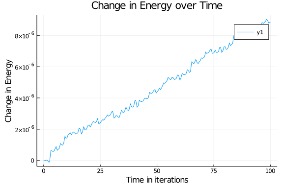


Note that we are using the `DPRKN6` sovler at `reltol=1e-3` (the default), yet it has a smaller energy variation than `Vern9` at `abs_tol=1e-16, rel_tol=1e-16`. Therefore, using specialized solvers to solve its particular problem is very efficient.


## Appendix

 This tutorial is part of the DiffEqTutorials.jl repository, found at: <https://github.com/JuliaDiffEq/DiffEqTutorials.jl>

To locally run this tutorial, do the following commands:
```
using DiffEqTutorials
DiffEqTutorials.weave_file("models","01-classical_physics.jmd")
```

Computer Information:
```
Julia Version 1.4.0
Commit b8e9a9ecc6 (2020-03-21 16:36 UTC)
Platform Info:
  OS: Windows (x86_64-w64-mingw32)
  CPU: Intel(R) Core(TM) i7-4720HQ CPU @ 2.60GHz
  WORD_SIZE: 64
  LIBM: libopenlibm
  LLVM: libLLVM-8.0.1 (ORCJIT, haswell)
Environment:
  JULIA_EDITOR = "C:\Users\sebastian\AppData\Local\atom\app-1.45.0\atom.exe"  -a
  JULIA_NUM_THREADS = 4

```

Package Information:

```
Status `~\.julia\dev\DiffEqTutorials\Project.toml`
[2169fc97-5a83-5252-b627-83903c6c433c] AlgebraicMultigrid 0.2.2
[7e558dbc-694d-5a72-987c-6f4ebed21442] ArbNumerics 1.0.2
[6e4b80f9-dd63-53aa-95a3-0cdb28fa8baf] BenchmarkTools 0.5.0
[be33ccc6-a3ff-5ff2-a52e-74243cff1e17] CUDAnative 3.0.1
[159f3aea-2a34-519c-b102-8c37f9878175] Cairo 1.0.2
[3a865a2d-5b23-5a0f-bc46-62713ec82fae] CuArrays 2.0.1
[55939f99-70c6-5e9b-8bb0-5071ed7d61fd] DecFP 0.4.10
[abce61dc-4473-55a0-ba07-351d65e31d42] Decimals 0.4.1
[ebbdde9d-f333-5424-9be2-dbf1e9acfb5e] DiffEqBayes 2.1.1
[eb300fae-53e8-50a0-950c-e21f52c2b7e0] DiffEqBiological 4.2.0
[459566f4-90b8-5000-8ac3-15dfb0a30def] DiffEqCallbacks 2.12.1
[f3b72e0c-5b89-59e1-b016-84e28bfd966d] DiffEqDevTools 2.18.0
[9fdde737-9c7f-55bf-ade8-46b3f136cc48] DiffEqOperators 4.8.1
[1130ab10-4a5a-5621-a13d-e4788d82bd4c] DiffEqParamEstim 1.13.0
[055956cb-9e8b-5191-98cc-73ae4a59e68a] DiffEqPhysics 3.5.0
[0c46a032-eb83-5123-abaf-570d42b7fbaa] DifferentialEquations 6.12.0
[31c24e10-a181-5473-b8eb-7969acd0382f] Distributions 0.23.1
[497a8b3b-efae-58df-a0af-a86822472b78] DoubleFloats 1.1.6
[f6369f11-7733-5829-9624-2563aa707210] ForwardDiff 0.10.9
[7073ff75-c697-5162-941a-fcdaad2a7d2a] IJulia 1.21.1
[23fbe1c1-3f47-55db-b15f-69d7ec21a316] Latexify 0.12.3
[c7f686f2-ff18-58e9-bc7b-31028e88f75d] MCMCChains 3.0.7
[eff96d63-e80a-5855-80a2-b1b0885c5ab7] Measurements 2.1.1
[961ee093-0014-501f-94e3-6117800e7a78] ModelingToolkit 1.4.2
[2774e3e8-f4cf-5e23-947b-6d7e65073b56] NLsolve 4.3.0
[429524aa-4258-5aef-a3af-852621145aeb] Optim 0.20.1
[1dea7af3-3e70-54e6-95c3-0bf5283fa5ed] OrdinaryDiffEq 5.32.0
[65888b18-ceab-5e60-b2b9-181511a3b968] ParameterizedFunctions 5.0.3
[91a5bcdd-55d7-5caf-9e0b-520d859cae80] Plots 0.29.8
[d330b81b-6aea-500a-939a-2ce795aea3ee] PyPlot 2.8.2
[731186ca-8d62-57ce-b412-fbd966d074cd] RecursiveArrayTools 2.1.0
[47a9eef4-7e08-11e9-0b38-333d64bd3804] SparseDiffTools 1.4.0
[684fba80-ace3-11e9-3d08-3bc7ed6f96df] SparsityDetection 0.1.2
[90137ffa-7385-5640-81b9-e52037218182] StaticArrays 0.12.1
[f3b207a7-027a-5e70-b257-86293d7955fd] StatsPlots 0.14.2
[c3572dad-4567-51f8-b174-8c6c989267f4] Sundials 3.9.0
[1986cc42-f94f-5a68-af5c-568840ba703d] Unitful 1.0.0
[44d3d7a6-8a23-5bf8-98c5-b353f8df5ec9] Weave 0.9.2
[b77e0a4c-d291-57a0-90e8-8db25a27a240] InteractiveUtils
[37e2e46d-f89d-539d-b4ee-838fcccc9c8e] LinearAlgebra
[44cfe95a-1eb2-52ea-b672-e2afdf69b78f] Pkg
```
