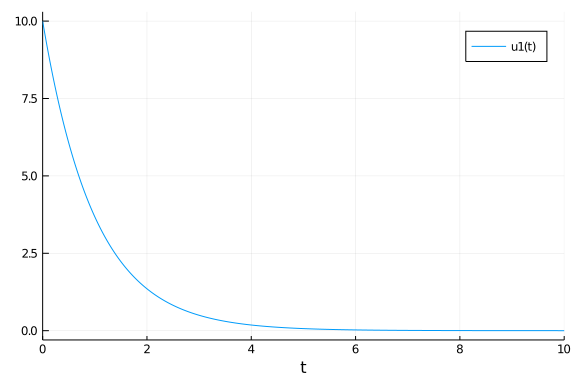
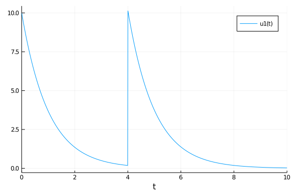
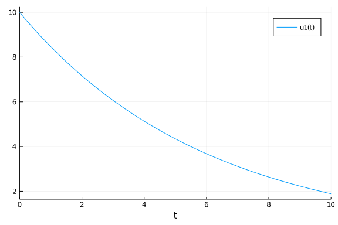

In this example we will show how to model a conditional dosing using the `DiscreteCallbacks`. The problem is as follows. The patient has a drug `A(t)` in their system. The concentration of the drug is given as `C(t)=A(t)/V` for some volume constant `V`. At `t=4`, the patient goes to the clinic and is checked. If the concentration of the drug in their body is below `4`, then they will receive a new dose.

For our model, we will use the simple decay equation. We will write this in the in-place form to make it easy to extend to more complicated examples:

````julia
using DifferentialEquations
function f(du,u,p,t)
    du[1] = -u[1]
end
u0 = [10.0]
const V = 1
prob = ODEProblem(f,u0,(0.0,10.0))
````


````
ODEProblem with uType Array{Float64,1} and tType Float64. In-place: true
timespan: (0.0, 10.0)
u0: [10.0]
````


Let's see what the solution looks like without any events.

````julia
sol = solve(prob,Tsit5())
using Plots; gr()
plot(sol)
````





We see that at time `t=4`, the patient should receive a dose. Let's code up that event. We need to check at `t=4` if the concentration `u[1]/4` is `<4`, and if so, add `10` to `u[1]`. We do this with the following:

````julia
condition(u,t,integrator) = t==4 && u[1]/V<4
affect!(integrator) = integrator.u[1] += 10
cb = DiscreteCallback(condition,affect!)
````


````
DiffEqBase.DiscreteCallback{typeof(Main.##WeaveSandBox#263.condition),typeo
f(Main.##WeaveSandBox#263.affect!),typeof(DiffEqBase.INITIALIZE_DEFAULT)}(M
ain.##WeaveSandBox#263.condition, Main.##WeaveSandBox#263.affect!, DiffEqBa
se.INITIALIZE_DEFAULT, Bool[1, 1])
````


Now we will give this callback to the solver, and tell it to stop at `t=4` so that way the condition can be checked:

````julia
sol = solve(prob,Tsit5(),tstops=[4.0],callback=cb)
using Plots; gr()
plot(sol)
````





Let's show that it actually added 10 instead of setting the value to 10. We could have set the value using `affect!(integrator) = integrator.u[1] = 10`

````julia
println(sol(4.00000))
````


````
[0.18316389222022983]
````


````julia
println(sol(4.000000000001))
````


````
[10.183163892210045]
````


Now let's model a patient whose decay rate for the drug is lower:

````julia
function f(du,u,p,t)
    du[1] = -u[1]/6
end
u0 = [10.0]
const V = 1
prob = ODEProblem(f,u0,(0.0,10.0))
````


````
ODEProblem with uType Array{Float64,1} and tType Float64. In-place: true
timespan: (0.0, 10.0)
u0: [10.0]
````


````julia
sol = solve(prob,Tsit5())
using Plots; gr()
plot(sol)
````





Under the same criteria, with the same event, this patient will not receive a second dose:

````julia
sol = solve(prob,Tsit5(),tstops=[4.0],callback=cb)
using Plots; gr()
plot(sol)
````


## Appendix

 This tutorial is part of the DiffEqTutorials.jl repository, found at: <https://github.com/JuliaDiffEq/DiffEqTutorials.jl>

To locally run this tutorial, do the following commands:
```
using DiffEqTutorials
DiffEqTutorials.weave_file("models","02-conditional_dosing.jmd")
```

Computer Information:
```
Julia Version 1.4.2
Commit 44fa15b150* (2020-05-23 18:35 UTC)
Platform Info:
  OS: Linux (x86_64-pc-linux-gnu)
  CPU: Intel(R) Core(TM) i7-9700K CPU @ 3.60GHz
  WORD_SIZE: 64
  LIBM: libopenlibm
  LLVM: libLLVM-8.0.1 (ORCJIT, skylake)
Environment:
  JULIA_DEPOT_PATH = /builds/JuliaGPU/DiffEqTutorials.jl/.julia
  JULIA_CUDA_MEMORY_LIMIT = 536870912
  JULIA_PROJECT = @.
  JULIA_NUM_THREADS = 4

```

Package Information:

```
Status `/builds/JuliaGPU/DiffEqTutorials.jl/tutorials/models/Project.toml`
[eb300fae-53e8-50a0-950c-e21f52c2b7e0] DiffEqBiological 4.3.0
[f3b72e0c-5b89-59e1-b016-84e28bfd966d] DiffEqDevTools 2.22.0
[055956cb-9e8b-5191-98cc-73ae4a59e68a] DiffEqPhysics 3.2.0
[0c46a032-eb83-5123-abaf-570d42b7fbaa] DifferentialEquations 6.14.0
[31c24e10-a181-5473-b8eb-7969acd0382f] Distributions 0.23.4
[587475ba-b771-5e3f-ad9e-33799f191a9c] Flux 0.10.4
[f6369f11-7733-5829-9624-2563aa707210] ForwardDiff 0.10.11
[23fbe1c1-3f47-55db-b15f-69d7ec21a316] Latexify 0.13.5
[961ee093-0014-501f-94e3-6117800e7a78] ModelingToolkit 3.11.0
[2774e3e8-f4cf-5e23-947b-6d7e65073b56] NLsolve 4.4.0
[8faf48c0-8b73-11e9-0e63-2155955bfa4d] NeuralNetDiffEq 1.6.0
[429524aa-4258-5aef-a3af-852621145aeb] Optim 0.21.0
[1dea7af3-3e70-54e6-95c3-0bf5283fa5ed] OrdinaryDiffEq 5.41.0
[91a5bcdd-55d7-5caf-9e0b-520d859cae80] Plots 1.4.4
[731186ca-8d62-57ce-b412-fbd966d074cd] RecursiveArrayTools 2.5.0
[789caeaf-c7a9-5a7d-9973-96adeb23e2a0] StochasticDiffEq 6.23.1
[37e2e46d-f89d-539d-b4ee-838fcccc9c8e] LinearAlgebra
[2f01184e-e22b-5df5-ae63-d93ebab69eaf] SparseArrays
```
