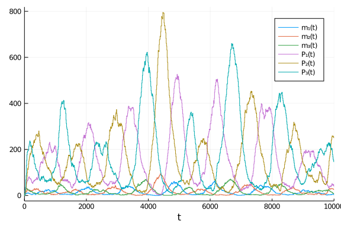
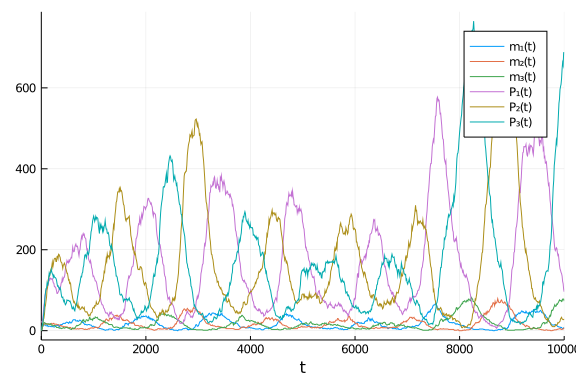
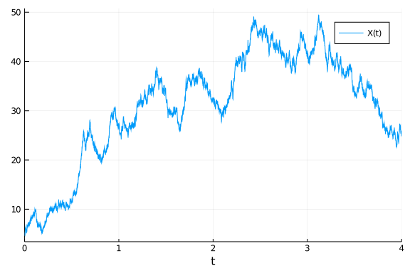

DiffEqBiological.jl is a domain specific language (DSL) for writing chemical
reaction networks in Julia. The generated chemical reaction network model can
then be translated into a variety of mathematical models which can be solved
using components of the broader
[DifferentialEquations.jl](http://juliadiffeq.org/) ecosystem.

In this tutorial we'll provide an introduction to using DiffEqBiological to
specify chemical reaction networks, and then to solve ODE, jump, tau-leaping and
SDE models generated from them. Let's start by using the DiffEqBiological
`reaction_network` macro to specify a simply chemical reaction network; the
well-known Repressilator.

We first import the basic packages we'll need, and use Plots.jl for making
figures:

````julia
# If not already installed, first hit "]" within a Julia REPL. Then type:
# add DifferentialEquations DiffEqBiological PyPlot Plots Latexify

using DifferentialEquations, DiffEqBiological, Plots, Latexify
pyplot(fmt=:svg);
````


````
Error: ArgumentError: Package PyPlot not found in current path:
- Run `import Pkg; Pkg.add("PyPlot")` to install the PyPlot package.
````


We now construct the reaction network. The basic types of arrows and predefined
rate laws one can use are discussed in detail within the DiffEqBiological
[Chemical Reaction Models
documentation](https://docs.juliadiffeq.org/dev/models/biological). Here
we use a mix of first order, zero order and repressive Hill function rate laws.
Note, $\varnothing$ corresponds to the empty state, and is used for zeroth order
production and first order degradation reactions:

````julia
repressilator = @reaction_network begin
    hillr(P₃,α,K,n), ∅ --> m₁
    hillr(P₁,α,K,n), ∅ --> m₂
    hillr(P₂,α,K,n), ∅ --> m₃
    (δ,γ), m₁ ↔ ∅
    (δ,γ), m₂ ↔ ∅
    (δ,γ), m₃ ↔ ∅
    β, m₁ --> m₁ + P₁
    β, m₂ --> m₂ + P₂
    β, m₃ --> m₃ + P₃
    μ, P₁ --> ∅
    μ, P₂ --> ∅
    μ, P₃ --> ∅
end α K n δ γ β μ;
````


````
(::Main.##WeaveSandBox#356.reaction_network) (generic function with 2 metho
ds)
````


We can use Latexify to look at the corresponding reactions and understand the
generated rate laws for each reaction

````julia
latexify(repressilator; env=:chemical)
````


````
"\n\\begin{align*}\n\\require{mhchem}\n\\ce{ \\varnothing &->[\\frac{\\alph
a \\cdot K^{n}}{K^{n} + P_3^{n}}] m_{1}}\\\\\n\\ce{ \\varnothing &->[\\frac
{\\alpha \\cdot K^{n}}{K^{n} + P_1^{n}}] m_{2}}\\\\\n\\ce{ \\varnothing &->
[\\frac{\\alpha \\cdot K^{n}}{K^{n} + P_2^{n}}] m_{3}}\\\\\n\\ce{ m_{1} &<=
>[\\delta][\\gamma] \\varnothing}\\\\\n\\ce{ m_{2} &<=>[\\delta][\\gamma] \
\varnothing}\\\\\n\\ce{ m_{3} &<=>[\\delta][\\gamma] \\varnothing}\\\\\n\\c
e{ m_{1} &->[\\beta] m_{1} + P_{1}}\\\\\n\\ce{ m_{2} &->[\\beta] m_{2} + P_
{2}}\\\\\n\\ce{ m_{3} &->[\\beta] m_{3} + P_{3}}\\\\\n\\ce{ P_{1} &->[\\mu]
 \\varnothing}\\\\\n\\ce{ P_{2} &->[\\mu] \\varnothing}\\\\\n\\ce{ P_{3} &-
>[\\mu] \\varnothing}\n\\end{align*}\n"
````


\begin{align*}
\require{mhchem}
\ce{ \varnothing &->[\frac{\alpha \cdot K^{n}}{K^{n} + P_3^{n}}] m_{1}}\\
\ce{ \varnothing &->[\frac{\alpha \cdot K^{n}}{K^{n} + P_1^{n}}] m_{2}}\\
\ce{ \varnothing &->[\frac{\alpha \cdot K^{n}}{K^{n} + P_2^{n}}] m_{3}}\\
\ce{ m_{1} &<=>[\delta][\gamma] \varnothing}\\
\ce{ m_{2} &<=>[\delta][\gamma] \varnothing}\\
\ce{ m_{3} &<=>[\delta][\gamma] \varnothing}\\
\ce{ m_{1} &->[\beta] m_{1} + P_{1}}\\
\ce{ m_{2} &->[\beta] m_{2} + P_{2}}\\
\ce{ m_{3} &->[\beta] m_{3} + P_{3}}\\
\ce{ P_{1} &->[\mu] \varnothing}\\
\ce{ P_{2} &->[\mu] \varnothing}\\
\ce{ P_{3} &->[\mu] \varnothing}
\end{align*}


We can also use Latexify to look at the corresponding ODE model for the chemical
system

````julia
latexify(repressilator, cdot=false)
````


````
"\n\\begin{align*}\n\\frac{dm_{1}(t)}{dt} =& \\frac{\\alpha K^{n}}{K^{n} + 
P_3^{n}} - \\delta m_1 + \\gamma \\\\\n\\frac{dm_{2}(t)}{dt} =& \\frac{\\al
pha K^{n}}{K^{n} + P_1^{n}} - \\delta m_2 + \\gamma \\\\\n\\frac{dm_{3}(t)}
{dt} =& \\frac{\\alpha K^{n}}{K^{n} + P_2^{n}} - \\delta m_3 + \\gamma \\\\
\n\\frac{dP_{1}(t)}{dt} =& \\beta m_1 - \\mu P_1 \\\\\n\\frac{dP_{2}(t)}{dt
} =& \\beta m_2 - \\mu P_2 \\\\\n\\frac{dP_{3}(t)}{dt} =& \\beta m_3 - \\mu
 P_3\n\\end{align*}\n"
````


\begin{align*}
\frac{dm_{1}(t)}{dt} =& \frac{\alpha K^{n}}{K^{n} + P_3^{n}} - \delta m_1 + \gamma \\
\frac{dm_{2}(t)}{dt} =& \frac{\alpha K^{n}}{K^{n} + P_1^{n}} - \delta m_2 + \gamma \\
\frac{dm_{3}(t)}{dt} =& \frac{\alpha K^{n}}{K^{n} + P_2^{n}} - \delta m_3 + \gamma \\
\frac{dP_{1}(t)}{dt} =& \beta m_1 - \mu P_1 \\
\frac{dP_{2}(t)}{dt} =& \beta m_2 - \mu P_2 \\
\frac{dP_{3}(t)}{dt} =& \beta m_3 - \mu P_3
\end{align*}


To solve the ODEs we need to specify the values of the parameters in the model,
the initial condition, and the time interval to solve the model on. To do this
it helps to know the orderings of the parameters and the species. Parameters are
ordered in the same order they appear after the `end` statement in the
`@reaction_network` macro. Species are ordered in the order they first appear
within the `@reaction_network` macro. We can see these orderings using the
`speciesmap` and `paramsmap` functions:

````julia
speciesmap(repressilator)
````


````
OrderedCollections.OrderedDict{Symbol,Int64} with 6 entries:
  :m₁ => 1
  :m₂ => 2
  :m₃ => 3
  :P₁ => 4
  :P₂ => 5
  :P₃ => 6
````


````julia
paramsmap(repressilator)
````


````
OrderedCollections.OrderedDict{Symbol,Int64} with 7 entries:
  :α => 1
  :K => 2
  :n => 3
  :δ => 4
  :γ => 5
  :β => 6
  :μ => 7
````


## Solving the ODEs:
Knowing these orderings, we can create parameter and initial condition vectors,
and setup the `ODEProblem` we want to solve:

````julia
# parameters [α,K,n,δ,γ,β,μ]
p = (.5, 40, 2, log(2)/120, 5e-3, 20*log(2)/120, log(2)/60)

# initial condition [m₁,m₂,m₃,P₁,P₂,P₃]
u₀ = [0.,0.,0.,20.,0.,0.]

# time interval to solve on
tspan = (0., 10000.)

# create the ODEProblem we want to solve
oprob = ODEProblem(repressilator, u₀, tspan, p)
````


````
ODEProblem with uType Array{Float64,1} and tType Float64. In-place: true
timespan: (0.0, 10000.0)
u0: [0.0, 0.0, 0.0, 20.0, 0.0, 0.0]
````


At this point we are all set to solve the ODEs. We can now use any ODE solver
from within the DiffEq package. We'll just use the default DifferentialEquations
solver for now, and then plot the solutions:

````julia
sol = solve(oprob, saveat=10.)
plot(sol, fmt=:svg)
````


We see the well-known oscillatory behavior of the repressilator! For more on
choices of ODE solvers, see the JuliaDiffEq
[documentation](https://docs.juliadiffeq.org/dev/solvers/ode_solve).

---

## Stochastic Simulation Algorithms (SSAs) for Stochastic Chemical Kinetics
Let's now look at a stochastic chemical kinetics model of the repressilator,
modeling it with jump processes. Here we will construct a DiffEqJump
`JumpProblem` that uses Gillespie's `Direct` method, and then solve it to
generate one realization of the jump process:

````julia
# first we redefine the initial condition to be integer valued
u₀ = [0,0,0,20,0,0]

# next we create a discrete problem to encode that our species are integer valued:
dprob = DiscreteProblem(repressilator, u₀, tspan, p)

# now we create a JumpProblem, and specify Gillespie's Direct Method as the solver:
jprob = JumpProblem(dprob, Direct(), repressilator, save_positions=(false,false))

# now let's solve and plot the jump process:
sol = solve(jprob, SSAStepper(), saveat=10.)
plot(sol, fmt=:svg)
````





Here we see that oscillations remain, but become much noiser. Note, in
constructing the `JumpProblem` we could have used any of the SSAs that are part
of DiffEqJump instead of the `Direct` method, see the list of SSAs (i.e.
constant rate jump aggregators) in the
[documentation](https://docs.juliadiffeq.org/latest/types/jump_types/#Constant-Rate-Jump-Aggregators-1).

---
## $\tau$-leaping Methods:
While SSAs generate exact realizations for stochastic chemical kinetics jump
process models, [$\tau$-leaping](https://en.wikipedia.org/wiki/Tau-leaping)
methods offer a performant alternative by discretizing in time the underlying
time-change representation of the stochastic process. The DiffEqJump package has
limited support for $\tau$-leaping methods in the form of the basic Euler's
method type approximation proposed by Gillespie. We can simulate a $\tau$-leap
approximation to the repressilator by using the  `RegularJump` representation of
the network to construct a `JumpProblem`:

````julia
rjs = regularjumps(repressilator)
lprob = JumpProblem(dprob, Direct(), rjs)
lsol = solve(lprob, SimpleTauLeaping(), dt=.1)
plot(lsol, plotdensity=1000, fmt=:svg)
````





---
## Chemical Langevin Equation (CLE) Stochastic Differential Equation (SDE) Models:
At an intermediary physical scale between macroscopic ODE models and microscopic
stochastic chemical kinetic models lies the CLE, a SDE version of the model. The
SDEs add to each ODE above a noise term. As the repressilator has species that
get very close to zero in size, it is not a good candidate to model with the CLE
(where solutions can then go negative and become unphysical). Let's create a
simpler reaction network for a birth-death process that will stay non-negative:

````julia
bdp = @reaction_network begin
  c₁, X --> 2X
  c₂, X --> 0
  c₃, 0 --> X
end c₁ c₂ c₃
p = (1.0,2.0,50.)
u₀ = [5.]
tspan = (0.,4.);
````


````
(0.0, 4.0)
````


The corresponding Chemical Langevin Equation SDE is then

````julia
latexify(bdp, noise=true, cdot=false)
````


````
"\n\\begin{align*}\n\\mathrm{dX}\\left( t \\right) =& \\left( c_1 X - c_2 X
 + c_3 \\right) dt + \\sqrt{\\left\\|c_1 X\\right\\|} dW_{1(t)} + \\left(  
- \\sqrt{\\left\\|c_2 X\\right\\|} \\right) dW_{2(t)} + \\sqrt{\\left\\|c_3
\\right\\|} dW_{3(t)}\n\\end{align*}\n"
````


\begin{align*}
\mathrm{dX}\left( t \right) =& \left( c_1 X - c_2 X + c_3 \right) dt + \sqrt{\left\|c_1 X\right\|} dW_{1(t)} + \left(  - \sqrt{\left\|c_2 X\right\|} \right) dW_{2(t)} + \sqrt{\left\|c_3\right\|} dW_{3(t)}
\end{align*}


where each $W_i(t)$ denotes an independent Brownian Motion. We can solve the CLE
SDE model by creating an `SDEProblem` and solving it similar to what we did for
ODEs above:

````julia
# SDEProblem for CLE
sprob = SDEProblem(bdp, u₀, tspan, p)

# solve and plot, tstops is used to specify enough points
# that the plot looks well-resolved
sol = solve(sprob, tstops=range(0., step=4e-3, length=1001))
plot(sol, fmt=:svg)
````





We again have complete freedom to select any of the
StochasticDifferentialEquations.jl SDE solvers, see the
[documentation](https://docs.juliadiffeq.org/dev/solvers/sde_solve).

---
## What information can be queried from the reaction_network:
The generated `reaction_network` contains a lot of basic information. For example
- `f=oderhsfun(repressilator)` is a function `f(du,u,p,t)` that given the current
  state vector `u` and time `t` fills `du` with the time derivatives of `u`
  (i.e. the right hand side of the ODEs).
- `jac=jacfun(repressilator)` is a function `jac(J,u,p,t)` that evaluates and
  returns the Jacobian of the ODEs in `J`. A corresponding Jacobian matrix of
  expressions can be accessed using the `jacobianexprs` function:
````julia
latexify(jacobianexprs(repressilator), cdot=false)
````


````
"\n\\begin{equation*}\n\\left[\n\\begin{array}{cccccc}\n - \\delta & 0 & 0 
& 0 & 0 & \\frac{\\left(  - K^{n} \\right) n \\alpha P_3^{-1 + n}}{\\left( 
K^{n} + P_3^{n} \\right)^{2}} \\\\\n0 &  - \\delta & 0 & \\frac{\\left(  - 
K^{n} \\right) n \\alpha P_1^{-1 + n}}{\\left( K^{n} + P_1^{n} \\right)^{2}
} & 0 & 0 \\\\\n0 & 0 &  - \\delta & 0 & \\frac{\\left(  - K^{n} \\right) n
 \\alpha P_2^{-1 + n}}{\\left( K^{n} + P_2^{n} \\right)^{2}} & 0 \\\\\n\\be
ta & 0 & 0 &  - \\mu & 0 & 0 \\\\\n0 & \\beta & 0 & 0 &  - \\mu & 0 \\\\\n0
 & 0 & \\beta & 0 & 0 &  - \\mu \\\\\n\\end{array}\n\\right]\n\\end{equatio
n*}\n"
````


\begin{equation*}
\left[
\begin{array}{cccccc}
 - \delta & 0 & 0 & 0 & 0 & \frac{\left(  - K^{n} \right) n \alpha P_3^{-1 + n}}{\left( K^{n} + P_3^{n} \right)^{2}} \\
0 &  - \delta & 0 & \frac{\left(  - K^{n} \right) n \alpha P_1^{-1 + n}}{\left( K^{n} + P_1^{n} \right)^{2}} & 0 & 0 \\
0 & 0 &  - \delta & 0 & \frac{\left(  - K^{n} \right) n \alpha P_2^{-1 + n}}{\left( K^{n} + P_2^{n} \right)^{2}} & 0 \\
\beta & 0 & 0 &  - \mu & 0 & 0 \\
0 & \beta & 0 & 0 &  - \mu & 0 \\
0 & 0 & \beta & 0 & 0 &  - \mu \\
\end{array}
\right]
\end{equation*}


- `pjac = paramjacfun(repressilator)` is a function `pjac(pJ,u,p,t)` that
  evaluates and returns the Jacobian, `pJ`, of the ODEs *with respect to the
  parameters*. This allows `reaction_network`s to be used in the
  DifferentialEquations.jl local sensitivity analysis package
  [DiffEqSensitivity](https://docs.juliadiffeq.org/dev/analysis/sensitivity).


By default, generated `ODEProblems` will be passed the corresponding Jacobian
function, which will then be used within implicit ODE/SDE methods.

The [DiffEqBiological API
documentation](https://docs.juliadiffeq.org/dev/apis/diffeqbio) provides
a thorough description of the many query functions that are provided to access
network properties and generated functions. In DiffEqBiological Tutorial II
we'll explore the API.

---
## Getting Help
Have a question related to DiffEqBiological or this tutorial? Feel free to ask
in the DifferentialEquations.jl [Gitter](https://gitter.im/JuliaDiffEq/Lobby).
If you think you've found a bug in DiffEqBiological, or would like to
request/discuss new functionality, feel free to open an issue on
[Github](https://github.com/JuliaDiffEq/DiffEqBiological.jl) (but please check
there is no related issue already open). If you've found a bug in this tutorial,
or have a suggestion, feel free to open an issue on the [DiffEqTutorials Github
site](https://github.com/JuliaDiffEq/DiffEqTutorials.jl). Or, submit a pull
request to DiffEqTutorials updating the tutorial!

---

## Appendix

 This tutorial is part of the DiffEqTutorials.jl repository, found at: <https://github.com/JuliaDiffEq/DiffEqTutorials.jl>

To locally run this tutorial, do the following commands:
```
using DiffEqTutorials
DiffEqTutorials.weave_file("models","03-diffeqbio_I_introduction.jmd")
```

Computer Information:
```
Julia Version 1.4.2
Commit 44fa15b150* (2020-05-23 18:35 UTC)
Platform Info:
  OS: Linux (x86_64-pc-linux-gnu)
  CPU: Intel(R) Core(TM) i7-9700K CPU @ 3.60GHz
  WORD_SIZE: 64
  LIBM: libopenlibm
  LLVM: libLLVM-8.0.1 (ORCJIT, skylake)
Environment:
  JULIA_DEPOT_PATH = /builds/JuliaGPU/DiffEqTutorials.jl/.julia
  JULIA_CUDA_MEMORY_LIMIT = 536870912
  JULIA_PROJECT = @.
  JULIA_NUM_THREADS = 4

```

Package Information:

```
Status `/builds/JuliaGPU/DiffEqTutorials.jl/tutorials/models/Project.toml`
[eb300fae-53e8-50a0-950c-e21f52c2b7e0] DiffEqBiological 4.3.0
[f3b72e0c-5b89-59e1-b016-84e28bfd966d] DiffEqDevTools 2.22.0
[055956cb-9e8b-5191-98cc-73ae4a59e68a] DiffEqPhysics 3.2.0
[0c46a032-eb83-5123-abaf-570d42b7fbaa] DifferentialEquations 6.14.0
[31c24e10-a181-5473-b8eb-7969acd0382f] Distributions 0.23.4
[587475ba-b771-5e3f-ad9e-33799f191a9c] Flux 0.10.4
[f6369f11-7733-5829-9624-2563aa707210] ForwardDiff 0.10.11
[23fbe1c1-3f47-55db-b15f-69d7ec21a316] Latexify 0.13.5
[961ee093-0014-501f-94e3-6117800e7a78] ModelingToolkit 3.11.0
[2774e3e8-f4cf-5e23-947b-6d7e65073b56] NLsolve 4.4.0
[8faf48c0-8b73-11e9-0e63-2155955bfa4d] NeuralNetDiffEq 1.6.0
[429524aa-4258-5aef-a3af-852621145aeb] Optim 0.21.0
[1dea7af3-3e70-54e6-95c3-0bf5283fa5ed] OrdinaryDiffEq 5.41.0
[91a5bcdd-55d7-5caf-9e0b-520d859cae80] Plots 1.4.4
[731186ca-8d62-57ce-b412-fbd966d074cd] RecursiveArrayTools 2.5.0
[789caeaf-c7a9-5a7d-9973-96adeb23e2a0] StochasticDiffEq 6.23.1
[37e2e46d-f89d-539d-b4ee-838fcccc9c8e] LinearAlgebra
[2f01184e-e22b-5df5-ae63-d93ebab69eaf] SparseArrays
```
