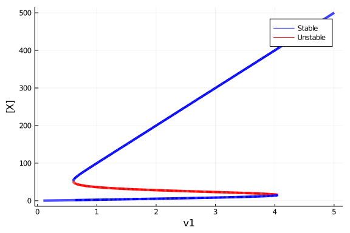
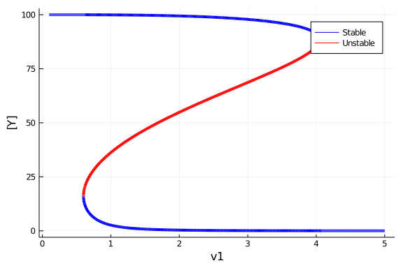
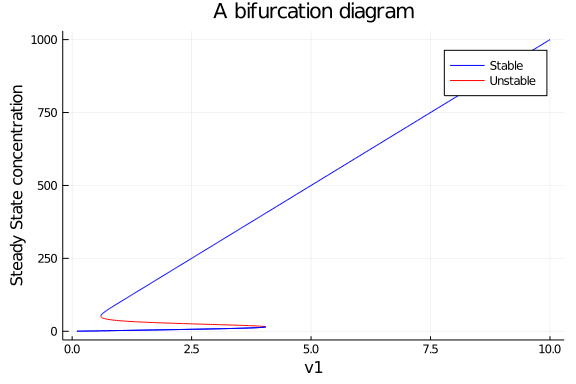
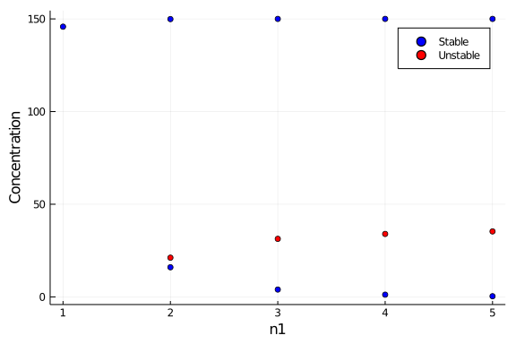
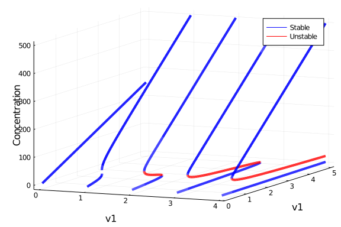
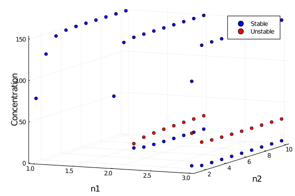
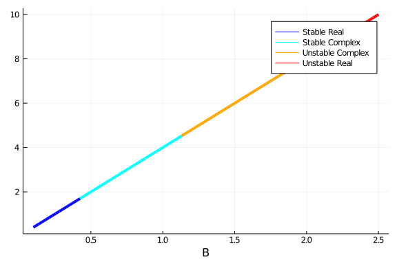
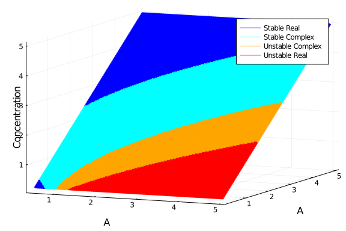

Several types of steady state analysis can be performed for networks defined
with DiffEqBiological by utilizing homotopy continuation. This allows for
finding the steady states and bifurcations within a large class of systems. In
this tutorial we'll go through several examples of using this functionality.

We start by loading the necessary packages:
````julia
using DiffEqBiological, Plots
gr(); default(fmt = :png);
````


### Steady states and stability of a biochemical reaction network.
Bistable switches are well known biological motifs, characterised by the
presence of two different stable steady states.

````julia
bistable_switch = @reaction_network begin
    d,    (X,Y) → ∅
    hillR(Y,v1,K1,n1), ∅ → X
    hillR(X,v2,K2,n2), ∅ → Y
end d v1 K1 n1 v2 K2 n2
d = 0.01;
v1 = 1.5; K1 = 30; n1 = 3;
v2 = 1.; K2 = 30; n2 = 3;
bistable_switch_p = [d, v1 ,K1, n1, v2, K2, n2];
````


````
7-element Array{Float64,1}:
  0.01
  1.5
 30.0
  3.0
  1.0
 30.0
  3.0
````


The steady states can be found using the `steady_states` function (which takes a reaction network and a set of parameter values as input). The stability of these steady states can be found using the `stability` function.

````julia
ss = steady_states(bistable_switch, bistable_switch_p)
````


````
3-element Array{Array{Float64,1},1}:
 [31.322504001213236, 46.76905072408724]
 [3.9702833966366473, 99.76874280256098]
 [149.9972223365578, 0.7936945352275889]
````


````julia
stability(ss,bistable_switch, bistable_switch_p)
````


````
3-element Array{Bool,1}:
 0
 1
 1
````


Since the equilibration methodology is based on homotopy continuation, it is not
able to handle systems with non-integer exponents, or non polynomial reaction
rates. Neither of the following two systems will work.

This system contains a non-integer exponent:
````julia
rn1 = @reaction_network begin
    p, ∅ → X
    hill(X,v,K,n), X → ∅
end p v K n
p1 = [1.,2.5,1.5,1.5]
steady_states(rn1,p1)
````


````
Error: MethodError: no method matching ^(::DynamicPolynomials.PolyVar{true}
, ::Float64)
Closest candidates are:
  ^(!Matched::Missing, ::Number) at missing.jl:115
  ^(!Matched::Float64, ::Float64) at math.jl:870
  ^(!Matched::Irrational{:ℯ}, ::Number) at mathconstants.jl:91
  ...
````


This system contains a logarithmic reaction rate:
````julia
rn2 = @reaction_network begin
    p, ∅ → X
    log(X), X → ∅
end p
p2 = [1.]
steady_states(rn2,p2)
````


````
Error: This reaction network does not correspond to a polynomial system. So
me of the reaction rate must contain non polynomial terms.
````


### Bifurcation diagrams for biochemical reaction networks
Bifurcation diagrams illustrate how the steady states of a system depend on one
or more parameters. They can be computed with the `bifurcations` function. It
takes the same arguments as `steady_states`, with the addition of the parameter
one wants to vary, and an interval over which to vary it:

````julia
bif = bifurcations(bistable_switch, bistable_switch_p, :v1, (.1,5.))
plot(bif,ylabel="[X]",label="")
plot!([[],[]],color=[:blue :red],label = ["Stable" "Unstable"])
````





The values for the second variable in the system can also be displayed, by
giving that as an additional input to `plot` (it is the second argument, directly
after the bifurcation diagram object):

````julia
plot(bif,2,ylabel="[Y]")
plot!([[],[]],color=[:blue :red],label = ["Stable" "Unstable"])
````





The `plot` function also accepts all other arguments which the Plots.jl `plot` function accepts.

````julia
bif = bifurcations(bistable_switch, bistable_switch_p,:v1,(.1,10.))
plot(bif,linewidth=1.,title="A bifurcation diagram",ylabel="Steady State concentration")
plot!([[],[]],color=[:blue :red],label = ["Stable" "Unstable"])
````





Certain parameters, like `n1`, cannot be sensibly varied over a continuous
interval. Instead, a discrete bifurcation diagram can be calculated with the
`bifurcation_grid` function. Instead of an interval, the last argument is a
range of numbers:

````julia
bif = bifurcation_grid(bistable_switch, bistable_switch_p,:n1,1.:5.)
plot(bif)
scatter!([[],[]],color=[:blue :red],label = ["Stable" "Unstable"])
````





### Bifurcation diagrams over two dimensions
In addition to the bifurcation diagrams illustrated above, where only a single
variable is varied, it is also possible to investigate the steady state
properties of s system as two different parameters are varied. Due to the nature
of the underlying bifurcation algorithm it is not possible to continuously vary
both parameters. Instead, a set of discrete values are selected for the first
parameter, and a continuous interval for the second. Next, for each discrete
value of the first parameter, a normal bifurcation diagram is created over the
interval given for the second parameter.

````julia
bif = bifurcation_grid_diagram(bistable_switch, bistable_switch_p,:n1,0.:4.,:v1,(.1,5.))
plot(bif)
plot!([[],[]],color=[:blue :red],label = ["Stable" "Unstable"])
````





In the single variable case we could use a `bifurcation_grid` to investigate the
behavior of a parameter which could only attain discrete values. In the same
way, if we are interested in two parameters, both of which require integer
values, we can use `bifrucation_grid_2d`. In our case, this is required if we
want to vary both the parameters `n1` and `n2`:

````julia
bif = bifurcation_grid_2d(bistable_switch, bistable_switch_p,:n1,1.:3.,:n2,1.:10.)
plot(bif)
scatter!([[],[]],color=[:blue :red],label = ["Stable" "Unstable"])
````





### The Brusselator
The Brusselator is a well know reaction network, which may or may not oscillate,
depending on parameter values.

````julia
brusselator = @reaction_network begin
    A, ∅ → X
    1, 2X + Y → 3X
    B, X → Y
    1, X → ∅
end A B;
A = 0.5; B = 4.;
brusselator_p = [A, B];
````


````
2-element Array{Float64,1}:
 0.5
 4.0
````


The system has only one steady state, for $(X,Y)=(A,B/A)$ This fixed point
becomes unstable when $B > 1+A^2$, leading to oscillations. Bifurcation diagrams
can be used to determine the system's stability, and hence look for where oscillations might appear in the Brusselator:

````julia
bif = bifurcations(brusselator,brusselator_p,:B,(0.1,2.5))
plot(bif,2)
plot!([[],[],[],[]],color=[:blue :cyan :orange :red],label = ["Stable Real" "Stable Complex" "Unstable Complex" "Unstable Real"])
````





Here red and yellow colors label unstable steady-states, while blue and cyan
label stable steady-states. (In addition, yellow and cyan correspond to points
where at least one eigenvalue of the Jacobian is imaginary, while red and blue
correspond to points with real-valued eigenvalues.)

Given `A=0.5`, the point at which the system should become unstable is `B=1.25`. We can confirm this in the bifurcation diagram.

We can also investigate the behavior when we vary both parameters of the system:

````julia
bif = bifurcation_grid_diagram(brusselator,brusselator_p,:B,0.5:0.02:5.0,:A,(0.2,5.0))
plot(bif)
plot!([[],[],[],[]],color=[:blue :cyan :orange :red],label = ["Stable Real" "Stable Complex" "Unstable Complex" "Unstable Real"])
````





---
## Getting Help
Have a question related to DiffEqBiological or this tutorial? Feel free to ask
in the DifferentialEquations.jl [Gitter](https://gitter.im/JuliaDiffEq/Lobby).
If you think you've found a bug in DiffEqBiological, or would like to
request/discuss new functionality, feel free to open an issue on
[Github](https://github.com/JuliaDiffEq/DiffEqBiological.jl) (but please check
there is no related issue already open). If you've found a bug in this tutorial,
or have a suggestion, feel free to open an issue on the [DiffEqTutorials Github
site](https://github.com/JuliaDiffEq/DiffEqTutorials.jl). Or, submit a pull
request to DiffEqTutorials updating the tutorial!

---

## Appendix

 This tutorial is part of the DiffEqTutorials.jl repository, found at: <https://github.com/JuliaDiffEq/DiffEqTutorials.jl>

To locally run this tutorial, do the following commands:
```
using DiffEqTutorials
DiffEqTutorials.weave_file("models","04b-diffeqbio_III_steadystates.jmd")
```

Computer Information:
```
Julia Version 1.4.2
Commit 44fa15b150* (2020-05-23 18:35 UTC)
Platform Info:
  OS: Linux (x86_64-pc-linux-gnu)
  CPU: Intel(R) Core(TM) i7-9700K CPU @ 3.60GHz
  WORD_SIZE: 64
  LIBM: libopenlibm
  LLVM: libLLVM-8.0.1 (ORCJIT, skylake)
Environment:
  JULIA_DEPOT_PATH = /builds/JuliaGPU/DiffEqTutorials.jl/.julia
  JULIA_CUDA_MEMORY_LIMIT = 536870912
  JULIA_PROJECT = @.
  JULIA_NUM_THREADS = 4

```

Package Information:

```
Status `/builds/JuliaGPU/DiffEqTutorials.jl/tutorials/models/Project.toml`
[eb300fae-53e8-50a0-950c-e21f52c2b7e0] DiffEqBiological 4.3.0
[f3b72e0c-5b89-59e1-b016-84e28bfd966d] DiffEqDevTools 2.22.0
[055956cb-9e8b-5191-98cc-73ae4a59e68a] DiffEqPhysics 3.2.0
[0c46a032-eb83-5123-abaf-570d42b7fbaa] DifferentialEquations 6.14.0
[31c24e10-a181-5473-b8eb-7969acd0382f] Distributions 0.23.4
[587475ba-b771-5e3f-ad9e-33799f191a9c] Flux 0.10.4
[f6369f11-7733-5829-9624-2563aa707210] ForwardDiff 0.10.11
[23fbe1c1-3f47-55db-b15f-69d7ec21a316] Latexify 0.13.5
[961ee093-0014-501f-94e3-6117800e7a78] ModelingToolkit 3.11.0
[2774e3e8-f4cf-5e23-947b-6d7e65073b56] NLsolve 4.4.0
[8faf48c0-8b73-11e9-0e63-2155955bfa4d] NeuralNetDiffEq 1.6.0
[429524aa-4258-5aef-a3af-852621145aeb] Optim 0.21.0
[1dea7af3-3e70-54e6-95c3-0bf5283fa5ed] OrdinaryDiffEq 5.41.0
[91a5bcdd-55d7-5caf-9e0b-520d859cae80] Plots 1.4.4
[731186ca-8d62-57ce-b412-fbd966d074cd] RecursiveArrayTools 2.5.0
[789caeaf-c7a9-5a7d-9973-96adeb23e2a0] StochasticDiffEq 6.23.1
[37e2e46d-f89d-539d-b4ee-838fcccc9c8e] LinearAlgebra
[2f01184e-e22b-5df5-ae63-d93ebab69eaf] SparseArrays
```
