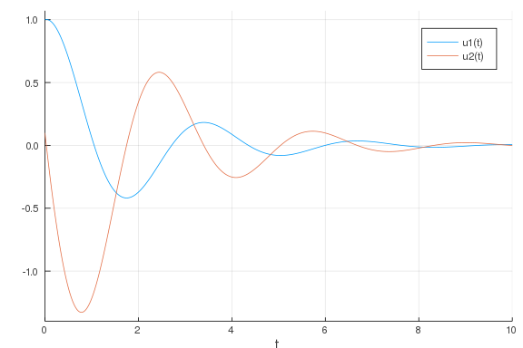
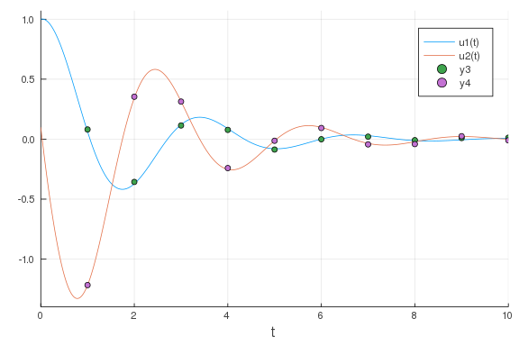
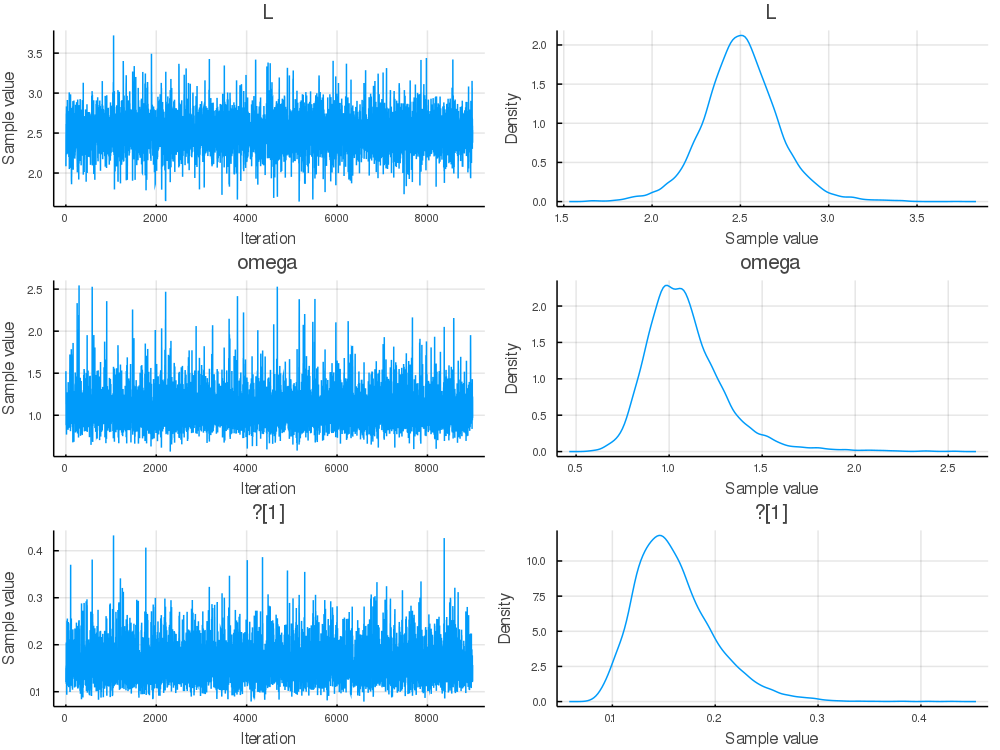
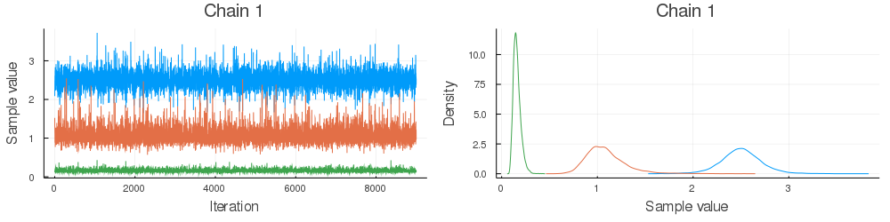

### Set up simple pendulum problem

````julia
using DiffEqBayes, OrdinaryDiffEq, RecursiveArrayTools, Distributions, Plots, StatsPlots, BenchmarkTools, TransformVariables, CmdStan, DynamicHMC
````


Let's define our simple pendulum problem. Here our pendulum has a drag term `ω`
and a length `L`.


We get first order equations by defining the first term as the velocity and the
second term as the position, getting:

````julia
function pendulum(du,u,p,t)
    ω,L = p
    x,y = u
    du[1] = y
    du[2] = - ω*y -(9.8/L)*sin(x)
end

u0 = [1.0,0.1]
tspan = (0.0,10.0)
prob1 = ODEProblem(pendulum,u0,tspan,[1.0,2.5])
````


````
ODEProblem with uType Array{Float64,1} and tType Float64. In-place: true
timespan: (0.0, 10.0)
u0: [1.0, 0.1]
````


### Solve the model and plot

To understand the model and generate data, let's solve and visualize the solution
with the known parameters:

````julia
sol = solve(prob1,Tsit5())
plot(sol)
````





It's the pendulum, so you know what it looks like. It's periodic, but since we
have not made a small angle assumption it's not exactly `sin` or `cos`. Because
the true dampening parameter `ω` is 1, the solution does not decay over time,
nor does it increase. The length `L` determines the period.

### Create some dummy data to use for estimation

We now generate some dummy data to use for estimation

````julia
t = collect(range(1,stop=10,length=10))
randomized = VectorOfArray([(sol(t[i]) + .01randn(2)) for i in 1:length(t)])
data = convert(Array,randomized)
````


````
2×10 Array{Float64,2}:
  0.0807273  -0.356589  0.113997   0.0772524  …  0.00941461   0.0120346
 -1.21663     0.353703  0.31338   -0.24121       0.0245262   -0.00969822
````


Let's see what our data looks like on top of the real solution

````julia
scatter!(data')
````





This data captures the non-dampening effect and the true period, making it
perfect to attempting a Bayesian inference.

### Perform Bayesian Estimation

Now let's fit the pendulum to the data. Since we know our model is correct,
this should give us back the parameters that we used to generate the data!
Define priors on our parameters. In this case, let's assume we don't have much
information, but have a prior belief that ω is between 0.1 and 3.0, while the
length of the pendulum L is probably around 3.0:

````julia
priors = [Uniform(0.1,3.0), Normal(3.0,1.0)]
````


````
2-element Array{Distribution{Univariate,Continuous},1}:
 Uniform{Float64}(a=0.1, b=3.0)
 Normal{Float64}(μ=3.0, σ=1.0)
````


Finally let's run the estimation routine from DiffEqBayes.jl with the Turing.jl backend to check if we indeed recover the parameters!

````julia
bayesian_result = turing_inference(prob1,Tsit5(),t,data,priors;num_samples=10_000,
                                   syms = [:omega,:L])
````


````
Object of type Chains, with data of type 9000×15×1 Array{Float64,3}

Iterations        = 1:9000
Thinning interval = 1
Chains            = 1
Samples per chain = 9000
internals         = acceptance_rate, hamiltonian_energy, hamiltonian_energy
_error, is_accept, log_density, lp, max_hamiltonian_energy_error, n_steps, 
nom_step_size, numerical_error, step_size, tree_depth
parameters        = L, omega, σ[1]

2-element Array{MCMCChains.ChainDataFrame,1}

Summary Statistics
  parameters    mean     std  naive_se    mcse        ess   r_hat
  ──────────  ──────  ──────  ────────  ──────  ─────────  ──────
           L  2.5035  0.2147    0.0023  0.0032  4462.4691  0.9999
       omega  1.0874  0.2135    0.0023  0.0035  3666.7413  0.9999
        σ[1]  0.1606  0.0388    0.0004  0.0006  4112.4964  1.0000

Quantiles
  parameters    2.5%   25.0%   50.0%   75.0%   97.5%
  ──────────  ──────  ──────  ──────  ──────  ──────
           L  2.0786  2.3730  2.5007  2.6305  2.9464
       omega  0.7759  0.9470  1.0578  1.1881  1.5950
        σ[1]  0.1016  0.1333  0.1547  0.1815  0.2525
````


Notice that while our guesses had the wrong means, the learned parameters converged
to the correct means, meaning that it learned good posterior distributions for the
parameters. To look at these posterior distributions on the parameters, we can
examine the chains:

````julia
plot(bayesian_result)
````





As a diagnostic, we will also check the parameter chains. The chain is the MCMC
sampling process. The chain should explore parameter space and converge reasonably
well, and we should be taking a lot of samples after it converges (it is these
samples that form the posterior distribution!)

````julia
plot(bayesian_result, colordim = :parameter)
````





Notice that after awhile these chains converge to a "fuzzy line", meaning it
found the area with the most likelihood and then starts to sample around there,
which builds a posterior distribution around the true mean.

DiffEqBayes.jl allows the choice of using Stan.jl, Turing.jl and DynamicHMC.jl for MCMC, you can also use ApproxBayes.jl for Approximate Bayesian computation algorithms.
Let's compare the timings across the different MCMC backends. We'll stick with the default arguments and 10,000 samples in each since there is a lot of room for micro-optimization
specific to each package and algorithm combinations, you might want to do your own experiments for specific problems to get better understanding of the performance.

````julia
@btime bayesian_result = turing_inference(prob1,Tsit5(),t,data,priors;syms = [:omega,:L],num_samples=10_000)
````


````
6.932 s (39047510 allocations: 2.70 GiB)
Object of type Chains, with data of type 9000×15×1 Array{Float64,3}

Iterations        = 1:9000
Thinning interval = 1
Chains            = 1
Samples per chain = 9000
internals         = acceptance_rate, hamiltonian_energy, hamiltonian_energy
_error, is_accept, log_density, lp, max_hamiltonian_energy_error, n_steps, 
nom_step_size, numerical_error, step_size, tree_depth
parameters        = L, omega, σ[1]

2-element Array{MCMCChains.ChainDataFrame,1}

Summary Statistics
  parameters    mean     std  naive_se    mcse        ess   r_hat
  ──────────  ──────  ──────  ────────  ──────  ─────────  ──────
           L  2.4944  0.2166    0.0023  0.0034  3565.7424  1.0006
       omega  1.0943  0.2214    0.0023  0.0044  2585.1249  0.9999
        σ[1]  0.1607  0.0382    0.0004  0.0006  4085.6802  0.9999

Quantiles
  parameters    2.5%   25.0%   50.0%   75.0%   97.5%
  ──────────  ──────  ──────  ──────  ──────  ──────
           L  2.0487  2.3655  2.4931  2.6248  2.9304
       omega  0.7720  0.9482  1.0589  1.1971  1.6228
        σ[1]  0.1030  0.1339  0.1554  0.1810  0.2489
````


````julia
@btime bayesian_result = stan_inference(prob1,t,data,priors;num_samples=10_000,printsummary=false)
````


````
File /Users/vaibhav/tmp/parameter_estimation_model.stan will be updated.


File /Users/vaibhav/tmp/parameter_estimation_model.stan will be updated.

ProcessFailedException(Base.Process[Process(`/Users/vaibhav/Downloads/cmdst
an-2.18.0/bin/stansummary --csv_file=parameter_estimation_model_summary.csv
 parameter_estimation_model_samples_1.csv`, ProcessSignaled(6))])
Stan.jl caught above exception in Stan's 'stansummary' program.
This is a usually caused by the setting:
  Sample(save_warmup=true, thin=n)
in the call to stanmodel() with n > 1.


File /Users/vaibhav/tmp/parameter_estimation_model.stan will be updated.

ProcessFailedException(Base.Process[Process(`/Users/vaibhav/Downloads/cmdst
an-2.18.0/bin/stansummary --csv_file=parameter_estimation_model_summary.csv
 parameter_estimation_model_samples_1.csv`, ProcessSignaled(6))])
Stan.jl caught above exception in Stan's 'stansummary' program.
This is a usually caused by the setting:
  Sample(save_warmup=true, thin=n)
in the call to stanmodel() with n > 1.


File /Users/vaibhav/tmp/parameter_estimation_model.stan will be updated.

  77.192 s (1071407 allocations: 43.16 MiB)
DiffEqBayes.StanModel{Stanmodel,Int64,Array{Float64,3},Array{String,1}}(  n
ame =                    "parameter_estimation_model"
  nchains =                 1
  num_samples =             10000
  num_warmup =                1000
  thin =                    1
  monitors =                String[]
  model_file =              "parameter_estimation_model.stan"
  data_file =               "parameter_estimation_model_1.data.R"
  output =                  Output()
    file =                    "parameter_estimation_model_samples_1.csv"
    diagnostics_file =        ""
    refresh =                 100
  pdir =                   "/Users/vaibhav"
  tmpdir =                 "/Users/vaibhav/tmp"
  output_format =           :array
  method =                  Sample()
    num_samples =             10000
    num_warmup =              1000
    save_warmup =             false
    thin =                    1
    algorithm =               HMC()
      engine =                  NUTS()
        max_depth =               10
      metric =                  CmdStan.diag_e
      stepsize =                1.0
      stepsize_jitter =         1.0
    adapt =                   Adapt()
      gamma =                   0.05
      delta =                   0.8
      kappa =                   0.75
      t0 =                      10.0
      init_buffer =             75
      term_buffer =             50
      window =                  25
, 0, [-26.0647 0.998527 … 2.39161 -0.423634; -26.9877 0.578717 … 2.8513 -0.
449266; … ; -27.8539 0.964852 … 1.95842 -0.482894; -25.1687 1.0 … 2.90479 -
0.443428], ["lp__", "accept_stat__", "stepsize__", "treedepth__", "n_leapfr
og__", "divergent__", "energy__", "sigma1.1", "sigma1.2", "theta1", "theta2
", "theta.1", "theta.2"])
````


````julia
@btime bayesian_result = dynamichmc_inference(prob1,Tsit5(),t,data,priors;num_samples = 10_000)
````


````
10.628 s (40934373 allocations: 3.47 GiB)
(posterior = NamedTuple{(:parameters, :σ),Tuple{Array{Float64,1},Array{Floa
t64,1}}}[(parameters = [0.9937673893016048, 2.5005535296105244], σ = [0.012
973787513496517, 0.010832191756521831]), (parameters = [0.9956886693030583,
 2.5015566896847177], σ = [0.009688768219573618, 0.009338491254104088]), (p
arameters = [1.0186651870549313, 2.4991839587144784], σ = [0.00940410895024
4166, 0.009984040034688443]), (parameters = [0.9994641635089779, 2.51062943
72666342], σ = [0.012724630215347877, 0.012863165817197429]), (parameters =
 [1.0000729841413913, 2.485452079164335], σ = [0.013027329439760212, 0.0127
35524810194226]), (parameters = [1.0276891897008198, 2.475864238349108], σ 
= [0.008195032901933668, 0.009118928106177012]), (parameters = [1.021762859
798494, 2.4946864950522123], σ = [0.00916980376807148, 0.013218102351103968
]), (parameters = [1.0409017798846611, 2.4745466307482316], σ = [0.00939066
5689641427, 0.018269594887516706]), (parameters = [1.0601617463261483, 2.48
00181714400615], σ = [0.009118784117071795, 0.02468004200406415]), (paramet
ers = [1.0399611526557968, 2.476248571931102], σ = [0.008329169669838928, 0
.020343661199843276])  …  (parameters = [0.9936539235900121, 2.485129131768
284], σ = [0.02267451645020077, 0.011583856419009997]), (parameters = [0.99
8283024646821, 2.4947228372075863], σ = [0.009851490150421914, 0.0101505134
82789449]), (parameters = [1.01605994632212, 2.491159579246948], σ = [0.009
635499189797895, 0.007666489364115992]), (parameters = [1.0052196574686003,
 2.4848190754531374], σ = [0.009383651012159207, 0.007277962814160631]), (p
arameters = [1.0158554911385396, 2.478795797771769], σ = [0.009366852886398
366, 0.009261450351604545]), (parameters = [1.003134202061562, 2.4828177419
808206], σ = [0.013335959861696955, 0.008226667113913573]), (parameters = [
1.015601521609034, 2.484708094101636], σ = [0.008741906551217688, 0.0105107
28440234558]), (parameters = [1.025937115228624, 2.512625428695601], σ = [0
.00722588179863281, 0.011266316731144106]), (parameters = [1.03155754714889
94, 2.480040505205018], σ = [0.007343122640003254, 0.010238358335829655]), 
(parameters = [1.015279140773784, 2.497185514880402], σ = [0.00786665942361
5615, 0.011644490799975642])], chain = [[-0.006252114498413703, 0.916512119
2103799, -4.344824302196788, -4.525232860188091], [-0.004320651282194804, 0
.9169132139658583, -4.636787979882785, -4.6736105757528845], [0.01849313013
667822, 0.9159642620744802, -4.666608562849928, -4.606767457478445], [-0.00
053598010269849, 0.9205334935250719, -4.364215776665405, -4.35338741494809]
, [7.298147817840373e-5, 0.9104545662075364, -4.340705863589756, -4.3633599
61333536], [0.027312776668607142, 0.9065895222807486, -4.804227051915372, -
4.697403014020782], [0.021529429434911866, 0.91416306802276, -4.69183939228
063, -4.326167998651405], [0.04008743348561988, 0.9060571997455767, -4.6680
39094809248, -4.002517082482466], [0.058421487356897395, 0.9082658873436202
, -4.697418804280378, -3.7017603779989043], [0.03918335924005266, 0.9067447
423241887, -4.787991507262841, -3.8949859045674833]  …  [-0.006366298351610
806, 0.9103246226927637, -3.7865136084475393, -4.458142838183376], [-0.0017
18451044753403, 0.9141776357412833, -4.620132550933663, -4.590230985336559]
, [0.015932349701275085, 0.9127482965512828, -4.642301168411415, -4.8708964
7840817], [0.005206082274640269, 0.9101998502393615, -4.668786357990119, -4
.922904289153857], [0.015731105908840397, 0.9077728768372205, -4.6705781103
980275, -4.681894617145278], [0.0031293006888718023, 0.9093941014883374, -4
.317291143308948, -4.800374314247554], [0.01548106908380792, 0.910155185486
4651, -4.739626972232364, -4.55535878724343], [0.025606453670024024, 0.9213
281940080351, -4.930086004177247, -4.485937825009533], [0.03106984174408740
7, 0.9082748927874719, -4.9139910990311, -4.581613990989838], [0.0151635902
24582886, 0.9151643036441797, -4.845121776345935, -4.4529221035254]], tree_
statistics = DynamicHMC.TreeStatisticsNUTS[DynamicHMC.TreeStatisticsNUTS(46
.90268168740056, 4, turning at positions -3:12, 0.9311702711880429, 15, Dyn
amicHMC.Directions(0xefc274cc)), DynamicHMC.TreeStatisticsNUTS(43.921913772
161304, 3, turning at positions 7:14, 0.8848562840393204, 15, DynamicHMC.Di
rections(0x23a6708e)), DynamicHMC.TreeStatisticsNUTS(47.30193892009162, 3, 
turning at positions 5:12, 0.9341968768687102, 15, DynamicHMC.Directions(0x
c272e0cc)), DynamicHMC.TreeStatisticsNUTS(46.67865734298306, 3, turning at 
positions 7:14, 0.9866167991817291, 15, DynamicHMC.Directions(0x4c7595de)),
 DynamicHMC.TreeStatisticsNUTS(44.69420042512069, 2, turning at positions -
6:-7, 0.8413890282241976, 7, DynamicHMC.Directions(0xb74ebd20)), DynamicHMC
.TreeStatisticsNUTS(45.47284301004227, 3, turning at positions -8:-15, 0.97
23913119858852, 15, DynamicHMC.Directions(0x37975b90)), DynamicHMC.TreeStat
isticsNUTS(45.69786261446481, 4, turning at positions -10:5, 0.998409895158
1778, 15, DynamicHMC.Directions(0x6404f285)), DynamicHMC.TreeStatisticsNUTS
(46.17201580322804, 3, turning at positions -2:-9, 0.9873926661031363, 15, 
DynamicHMC.Directions(0x1bfebcf6)), DynamicHMC.TreeStatisticsNUTS(40.166291
486415446, 4, turning at positions -8:7, 0.9745987025109192, 15, DynamicHMC
.Directions(0x4e68c267)), DynamicHMC.TreeStatisticsNUTS(43.94674396391397, 
3, turning at positions -6:1, 0.9960162295360913, 7, DynamicHMC.Directions(
0x4394fe09))  …  DynamicHMC.TreeStatisticsNUTS(43.98122427770005, 4, turnin
g at positions -12:3, 0.9605856535842056, 15, DynamicHMC.Directions(0x7dd96
823)), DynamicHMC.TreeStatisticsNUTS(43.60098837164094, 4, turning at posit
ions -1:14, 0.9514675104322041, 15, DynamicHMC.Directions(0xe05991ee)), Dyn
amicHMC.TreeStatisticsNUTS(47.369063913612074, 4, turning at positions -14:
1, 0.994312705186071, 15, DynamicHMC.Directions(0x33496581)), DynamicHMC.Tr
eeStatisticsNUTS(47.040502723955335, 2, turning at positions 3:6, 0.8009457
476026782, 7, DynamicHMC.Directions(0xfa676dfe)), DynamicHMC.TreeStatistics
NUTS(47.65913975182596, 3, turning at positions -1:6, 1.0, 7, DynamicHMC.Di
rections(0xe27ac05e)), DynamicHMC.TreeStatisticsNUTS(46.91801035099738, 4, 
turning at positions -11:4, 0.9847335051019767, 15, DynamicHMC.Directions(0
x6b58a274)), DynamicHMC.TreeStatisticsNUTS(45.25822102991321, 4, turning at
 positions -4:-19, 0.745230297725052, 31, DynamicHMC.Directions(0xb36bcecc)
), DynamicHMC.TreeStatisticsNUTS(44.89115540631475, 3, turning at positions
 -8:-11, 0.7013378152472259, 15, DynamicHMC.Directions(0x282cb7e4)), Dynami
cHMC.TreeStatisticsNUTS(44.389693849737554, 4, turning at positions 18:21, 
0.9842823937949022, 27, DynamicHMC.Directions(0x93f8bb59)), DynamicHMC.Tree
StatisticsNUTS(47.148325901867835, 2, turning at positions -1:-4, 0.9802016
471973313, 7, DynamicHMC.Directions(0x113e23b3))], κ = Gaussian kinetic ene
rgy (LinearAlgebra.Diagonal), √diag(M⁻¹): [0.02378236047638218, 0.019721399
97850411, 0.23723393103193158, 0.30030400010783337], ϵ = 0.1936479845750313
2)
````


