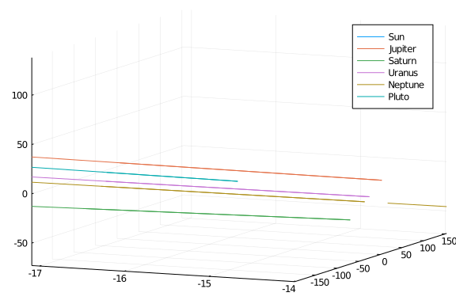

## Data

The chosen units are: masses relative to the sun, so that the sun has mass $1$. We have taken $m_0 = 1.00000597682$ to take account of the inner planets. Distances are in astronomical units , times in earth days, and the gravitational constant is thus $G = 2.95912208286 \cdot 10^{-4}$.

| planet | mass | initial position | initial velocity |
| --- | --- | --- | --- |
| Jupiter | $m_1 = 0.000954786104043$ | <ul><li>-3.5023653</li><li>-3.8169847</li><li>-1.5507963</li></ul> | <ul><li>0.00565429</li><li>-0.00412490</li><li>-0.00190589</li></ul>
| Saturn | $m_2 = 0.000285583733151$ | <ul><li>9.0755314</li><li>-3.0458353</li><li>-1.6483708</li></ul> | <ul><li>0.00168318</li><li>0.00483525</li><li>0.00192462</li></ul>
| Uranus | $m_3 = 0.0000437273164546$ | <ul><li>8.3101420</li><li>-16.2901086</li><li>-7.2521278</li></ul> | <ul><li>0.00354178</li><li>0.00137102</li><li>0.00055029</li></ul>
| Neptune | $m_4 = 0.0000517759138449$ | <ul><li>11.4707666</li><li>-25.7294829</li><li>-10.8169456</li></ul> | <ul><li>0.00288930</li><li>0.00114527</li><li>0.00039677</li></ul>
| Pluto | $ m_5 = 1/(1.3 \cdot 10^8 )$ | <ul><li>-15.5387357</li><li>-25.2225594</li><li>-3.1902382</li></ul> | <ul><li>0.00276725</li><li>-0.00170702</li><li>-0.00136504</li></ul>

The data is taken from the book "Geometric Numerical Integration" by E. Hairer, C. Lubich and G. Wanner.

````julia
using Plots, OrdinaryDiffEq, DiffEqPhysics, RecursiveArrayTools
gr()

G = 2.95912208286e-4
M = [1.00000597682, 0.000954786104043, 0.000285583733151, 0.0000437273164546, 0.0000517759138449, 1/1.3e8]
planets = ["Sun", "Jupiter", "Saturn", "Uranus", "Neptune", "Pluto"]

pos_x = [0.0,-3.5023653,9.0755314,8.3101420,11.4707666,-15.5387357]
pos_y = [0.0,-3.8169847,-3.0458353,-16.2901086,-25.7294829,-25.2225594]
pos_z = [0.0,-1.5507963,-1.6483708,-7.2521278,-10.8169456,-3.1902382]
pos = ArrayPartition(pos_x,pos_y,pos_z)

vel_x = [0.0,0.00565429,0.00168318,0.00354178,0.00288930,0.00276725]
vel_y = [0.0,-0.00412490,0.00483525,0.00137102,0.00114527,-0.00170702]
vel_z = [0.0,-0.00190589,0.00192462,0.00055029,0.00039677,-0.00136504]
vel = ArrayPartition(vel_x,vel_y,vel_z)

tspan = (0.,200_000)
````


````
(0.0, 200000)
````


The N-body problem's Hamiltonian is

$$H(p,q) = \frac{1}{2}\sum_{i=0}^{N}\frac{p_{i}^{T}p_{i}}{m_{i}} - G\sum_{i=1}^{N}\sum_{j=0}^{i-1}\frac{m_{i}m_{j}}{\left\lVert q_{i}-q_{j} \right\rVert}$$

Here, we want to solve for the motion of the five outer planets relative to the sun, namely, Jupiter, Saturn, Uranus, Neptune and Pluto.

````julia
const ∑ = sum
const N = 6
potential(p, t, x, y, z, M) = -G*∑(i->∑(j->(M[i]*M[j])/sqrt((x[i]-x[j])^2 + (y[i]-y[j])^2 + (z[i]-z[j])^2), 1:i-1), 2:N)
````


````
potential (generic function with 1 method)
````


## Hamiltonian System

`NBodyProblem` constructs a second order ODE problem under the hood. We know that a Hamiltonian system has the form of

$$\dot{p} = -H_{q}(p,q)\quad \dot{q}=H_{p}(p,q)$$

For an N-body system, we can symplify this as:

$$\dot{p} = -\nabla{V}(q)\quad \dot{q}=M^{-1}p.$$

Thus $\dot{q}$ is defined by the masses. We only need to define $\dot{p}$, and this is done internally by taking the gradient of $V$. Therefore, we only need to pass the potential function and the rest is taken care of.

````julia
nprob = NBodyProblem(potential, M, pos, vel, tspan)
sol = solve(nprob,Yoshida6(), dt=100);
````


````
retcode: Success
Interpolation: 3rd order Hermite
t: 2001-element Array{Float64,1}:
      0.0
    100.0
    200.0
    300.0
    400.0
    500.0
    600.0
    700.0
    800.0
    900.0
      ⋮
 199200.0
 199300.0
 199400.0
 199500.0
 199600.0
 199700.0
 199800.0
 199900.0
 200000.0
u: 2001-element Array{RecursiveArrayTools.ArrayPartition{Float64,Tuple{Recu
rsiveArrayTools.ArrayPartition{Float64,Tuple{Array{Float64,1},Array{Float64
,1},Array{Float64,1}}},RecursiveArrayTools.ArrayPartition{Float64,Tuple{Arr
ay{Float64,1},Array{Float64,1},Array{Float64,1}}}}},1}:
 [0.0, -3.5023653, 9.0755314, 8.310142, 11.4707666, -15.5387357][0.0, -3.81
69847, -3.0458353, -16.2901086, -25.7294829, -25.2225594][0.0, -1.5507963, 
-1.6483708, -7.2521278, -10.8169456, -3.1902382][0.0, 0.00565429, 0.0016831
8, 0.00354178, 0.0028893, 0.00276725][0.0, -0.0041249, 0.00483525, 0.001371
02, 0.00114527, -0.00170702][0.0, -0.00190589, 0.00192462, 0.00055029, 0.00
039677, -0.00136504]
 [-1.483871610102359e-9, -3.5023634989633905, 9.07553059436388, 8.310141911
106724, 11.470766565988393, -15.538735652147562][-1.963086254571838e-9, -3.
816982736849483, -3.045835029881919, -16.29010842579049, -25.72948282371913
, -25.222559322340082][-8.083510491645781e-10, -1.5507955023889497, -1.6483
706537867144, -7.252127722442367, -10.816945567932297, -3.1902381901858483]
[-1.279096797383359e-7, -350.2307204605348, 907.5547537336427, 831.01773411
72944, 1147.0795463681109, -1553.8707986250054][-1.6921965162614675e-7, -38
1.7024256747193, -304.57867146578957, -1629.0094739629606, -2572.9471381543
976, -2522.257640325523][-6.968055703705806e-8, -155.0814671351988, -164.83
514277637912, -725.2122230244519, -1081.6941604656831, -319.02518419399485]
 [-1.5108710607174555e-9, -3.5023634661938394, 9.07553057970773, 8.31014190
9489595, 11.470766565369651, -15.538735651276994][-1.9987962761478577e-9, -
3.816982701138643, -3.0458350249671686, -16.290108422621167, -25.7294828223
31395, -25.222559320927264][-8.230554023584375e-10, -1.5507954878801313, -1
.6483706511264864, -7.252127721031393, -10.816945567348904, -3.190238190007
311][-2.779532699111564e-7, -700.4670683464248, 1815.1078122708132, 1662.03
19251287049, 2294.156202928921, -3107.744363786258][-3.677191079547623e-7, 
-763.4006971687634, -609.1621741524409, -3258.0203163474725, -5145.89542044
1018, -5044.513572472703][-1.5141778276282272e-7, -310.16101648395977, -329
.6722079918343, -1450.4249951820807, -2163.3887172230566, -638.049003201607
2]
 [-1.5198723878076704e-9, -3.502363455268833, 9.075530574821558, 8.31014190
8950465, 11.470766565163371, -15.538735650986757][-2.0107015005196292e-9, -
3.8169826892331495, -3.045835023328645, -16.290108421564554, -25.7294828218
6874, -25.22255932045625][-8.279576270497117e-10, -1.5507954830430977, -1.6
483706502395972, -7.252127720560989, -10.81694556715441, -3.190238189947789
][-4.295509261899468e-7, -1050.7034143461276, 2722.6608699643903, 2493.0461
16047035, 3441.2328594541173, -4661.617928897402][-5.682739936618671e-7, -1
145.0989666073315, -913.7456765562033, -4887.031158549561, -7718.8437026477
63, -7566.769504538563][-2.340013746247101e-7, -465.24056499760945, -494.50
92730541691, -2175.637767258495, -3245.0832739468506, -957.0728221989431]
 [-1.5243730892149275e-9, -3.502363449806286, 9.07553057237846, 8.310141908
680897, 11.47076656506023, -15.538735650841637][-2.0166541414590845e-9, -3.
8169826832803757, -3.045835022509377, -16.290108421036248, -25.729482821637
408, -25.22255932022074][-8.304087508435109e-10, -1.5507954806245696, -1.64
83706497961494, -7.252127720325786, -10.81694556705716, -3.1902381899180274
][-5.817847189331772e-7, -1400.939759573745, 3630.213927312656, 3324.060306
927264, 4588.3095159647355, -6215.491493988034][-7.696702368283515e-7, -152
6.7972352045233, -1218.329178844169, -6516.042000676976, -10291.79198482181
2, -10089.025436571133][-3.169314129584271e-7, -620.32011316942, -659.34633
80538262, -2900.8505393016653, -4326.777830656899, -1276.0966411920726]
 [-1.5270735152323784e-9, -3.5023634465287516, 9.075530570912598, 8.3101419
08519158, 11.470766564998344, -15.538735650754566][-2.0202257260404522e-9, 
-3.816982679708712, -3.0458350220178154, -16.290108420719264, -25.729482821
498614, -25.222559320079437][-8.318794250017069e-10, -1.5507954791734533, -
1.6483706495300803, -7.2521277201846654, -10.816945566998811, -3.1902381899
0017][-7.343670753338474e-7, -1751.176104378307, 4537.766984471711, 4155.07
4497786616, 5735.386172467367, -7769.365059067428][-9.715274908733896e-7, -
1908.495503340694, -1522.9126810686855, -8145.052842763477, -12864.74026697
7946, -12611.281368585465][-4.000512821078823e-7, -775.3996611539241, -824.
1834030191399, -3626.0633113266204, -5408.472387359415, -1595.1204601828974
]
 [-1.5288738008504454e-9, -3.502363444343727, 9.07553056993536, 8.310141908
411333, 11.470766564957088, -15.538735650696518][-2.0226067817090917e-9, -3
.816982677327603, -3.0458350216901073, -16.290108420507938, -25.72948282140
6084, -25.222559319985233][-8.328598740922247e-10, -1.5507954782060427, -1.
6483706493527008, -7.252127720090585, -10.816945566959916, -3.1902381898882
66][-8.871699055390057e-7, -2101.4124489152778, 5445.320041511089, 4986.088
6886327635, 6882.462828964945, -9323.23862413971][-1.1736763434902029e-6, -
2290.1937711852597, -1827.4961832530687, -9774.0636848241, -15437.688549122
744, -15133.537300588261][-4.832912230246068e-7, -930.479209019953, -989.02
04679627305, -4351.276083340053, -6490.166944057168, -1914.1442791722639]
 [-1.530159719861209e-9, -3.5023634427829946, 9.075530569237332, 8.31014190
8334318, 11.470766564927622, -15.538735650655056][-2.024307535307154e-9, -3
.816982675626812, -3.04583502145603, -16.290108420356994, -25.7294828213399
9, -25.22255931991795][-8.335601946598818e-10, -1.5507954775150354, -1.6483
706492260013, -7.252127720023385, -10.816945566932134, -3.190238189879763][
-1.0401248826946516e-6, -2451.648793267586, 6352.873098467877, 5817.1028794
697995, 8029.539485459035, -10877.11218920709][-1.376026425404653e-6, -2671
.892038828591, -2132.079685409756, -11403.074526866858, -18010.636831259722
, -17655.793232583095][-5.666140242796445e-7, -1085.5587568042235, -1153.85
75328913307, -5076.488855345536, -7571.861500751634, -2233.168098160624]
 [-1.5311241594944412e-9, -3.5023634416124447, 9.07553056871381, 8.31014190
8276556, 11.470766564905523, -15.538735650623961][-2.0255831002401447e-9, -
3.8169826743512187, -3.045835021280472, -16.29010842024378, -25.72948282129
0414, -25.222559319867482][-8.34085434962282e-10, -1.5507954769967802, -1.6
483706491309766, -7.252127719972983, -10.816945566911297, -3.19023818987338
54][-1.193191221762034e-6, -2801.885137484733, 7260.4261553642145, 6648.117
070300165, 9176.616141950577, -12430.985754270878][-1.5785237942896725e-6, 
-3053.5903063246324, -2436.663187546172, -13032.085368896549, -20583.585113
39098, -20178.0491645721][-6.499974739987397e-7, -1240.6383045286523, -1318
.6945978089584, -5801.701627345198, -8653.556057443695, -2552.1919171482477
]
 [-1.531874279428033e-9, -3.502363440702018, 9.075530568306629, 8.310141908
231628, 11.470766564888335, -15.538735650599774][-2.02657520613718e-9, -3.8
169826733590906, -3.0458350211439265, -16.29010842015573, -25.7294828212518
6, -25.22255931982823][-8.344939551224991e-10, -1.5507954765936924, -1.6483
706490570684, -7.252127719933783, -10.816945566895088, -3.1902381898684253]
[-1.3463426155469982e-6, -3152.121481598649, 8167.979212214382, 7479.131261
125436, 10323.692798440168, -13984.859319331921][-1.7811336562605256e-6, -3
435.288573708179, -2741.246689667106, -14661.096210916256, -23156.533395517
86, -22700.305096556654][-7.334272450773306e-7, -1395.7178522073757, -1483.
5316627182058, -6526.914399340416, -9735.250614133918, -2871.2157361353097]
 ⋮
 [-1.5378481328814894e-9, -3.5023634334514964, 9.075530565064035, 8.3101419
07874717, 11.47076656475238, -15.538735650408134][-2.0344761888959455e-9, -
3.8169826654579078, -3.045835020056491, -16.29010841945644, -25.72948282094
672, -25.222559319517455][-8.377473482281193e-10, -1.5507954733835758, -1.6
4837064846846, -7.252127719621716, -10.81694556676692, -3.1902381898291527]
[-0.0003062778409023999, -697670.7903638665, 1.8078456902773208e6, 1.655380
2715938871e6, 2.2849767025890695e6, -3.0953161387955747e6][-0.0004051863021
193222, -760342.9511654247, -606730.3311711524, -3.244989595790577e6, -5.12
5312976789378e6, -5.024333818158665e6][-0.00016684577217800217, -308918.460
2369364, -328355.4312563468, -1.4446238412015676e6, -2.154735556504403e6, -
635495.4487793581]
 [-1.5378481464855168e-9, -3.50236343345148, 9.07553056506403, 8.3101419078
7472, 11.47076656475238, -15.538735650408134][-2.0344762068885213e-9, -3.81
69826654578896, -3.0458350200564897, -16.290108419456445, -25.7294828209467
2, -25.222559319517455][-8.377473556369343e-10, -1.5507954733835685, -1.648
3706484684586, -7.252127719621715, -10.81694556676692, -3.1902381898291527]
[-0.0003064316257163683, -698021.0267072119, 1.8087532433338277e6, 1.656211
2857846746e6, 2.286123779245544e6, -3.096870012360615e6][-0.000405389749739
11165, -760724.6494319704, -607034.9146731582, -3.2466186066325223e6, -5.12
788592507147e6, -5.026856074090616e6][-0.0001669295469131955, -309073.53978
42747, -328520.2683211936, -1.44534905397353e6, -2.1558172510610796e6, -635
814.4725983411]
 [-1.5378481600758993e-9, -3.5023634334514635, 9.075530565064025, 8.3101419
07874721, 11.47076656475238, -15.538735650408134][-2.034476224863051e-9, -3
.8169826654578713, -3.0458350200564883, -16.29010841945645, -25.72948282094
672, -25.222559319517455][-8.377473630383182e-10, -1.5507954733835612, -1.6
483706484684573, -7.252127719621714, -10.81694556676692, -3.190238189829152
7][-0.0003065854105316965, -698371.2630505572, 1.8096607963903346e6, 1.6570
42299975462e6, 2.287270855902019e6, -3.0984238859256557e6][-0.0004055931973
6069933, -761106.3476985162, -607339.498175164, -3.2482476174744675e6, -5.1
30458873353563e6, -5.029378330022567e6][-0.00016701332164912932, -309228.61
9331613, -328685.10538604035, -1.4460742667454924e6, -2.1568989456177563e6,
 -636133.4964173241]
 [-1.5378481736526573e-9, -3.502363433451447, 9.07553056506402, 8.310141907
874723, 11.47076656475238, -15.538735650408134][-2.0344762428195613e-9, -3.
816982665457853, -3.045835020056487, -16.290108419456452, -25.7294828209467
2, -25.222559319517455][-8.377473704322821e-10, -1.5507954733835538, -1.648
370648468456, -7.252127719621713, -10.81694556676692, -3.1902381898291527][
-0.000306739195348383, -698721.4993939025, 1.8105683494468415e6, 1.65787331
41662495e6, 2.2884179325584937e6, -3.0999777594906962e6][-0.000405796644984
0836, -761488.045965062, -607644.0816771698, -3.2498766283164127e6, -5.1330
31821635656e6, -5.031900585954518e6][-0.0001670970963858029, -309383.698878
9513, -328849.9424508871, -1.4467994795174547e6, -2.157980640174433e6, -636
452.520236307]
 [-1.5378481872158114e-9, -3.5023634334514306, 9.075530565064014, 8.3101419
07874725, 11.47076656475238, -15.538735650408134][-2.0344762607580793e-9, -
3.816982665457835, -3.0458350200564857, -16.290108419456455, -25.7294828209
4672, -25.222559319517455][-8.377473778188375e-10, -1.5507954733835465, -1.
6483706484684546, -7.252127719621712, -10.81694556676692, -3.19023818982915
27][-0.0003068929801664266, -699071.7357372476, 1.8114759025033484e6, 1.658
704328357037e6, 2.2895650092149684e6, -3.101531633055737e6][-0.000406000092
60926255, -761869.7442316078, -607948.6651791756, -3.251505639158358e6, -5.
135604769917749e6, -5.034422841886469e6][-0.0001671808711232155, -309538.77
84262896, -329014.7795157339, -1.4475246922894171e6, -2.15906233473111e6, -
636771.54405529]
 [-1.5378482007653816e-9, -3.502363433451414, 9.075530565064009, 8.31014190
7874726, 11.47076656475238, -15.538735650408134][-2.034476278678632e-9, -3.
8169826654578167, -3.0458350200564843, -16.29010841945646, -25.729482820946
72, -25.222559319517455][-8.377473851979952e-10, -1.5507954733835392, -1.64
83706484684533, -7.252127719621711, -10.81694556676692, -3.1902381898291527
][-0.0003070467649858257, -699421.9720805928, 1.8123834555598553e6, 1.65953
53425478244e6, 2.290712085871443e6, -3.1030855066207773e6][-0.0004062035402
362345, -762251.4424981535, -608253.2486811813, -3.253134650000303e6, -5.13
8177718199842e6, -5.03694509781842e6][-0.0001672646458613664, -309693.85797
36279, -329179.61658058065, -1.4482499050613795e6, -2.1601440292877867e6, -
637090.567874273]
 [-1.537848214301389e-9, -3.502363433451398, 9.075530565064003, 8.310141907
874728, 11.47076656475238, -15.538735650408134][-2.034476296581246e-9, -3.8
16982665457798, -3.045835020056483, -16.290108419456462, -25.72948282094672
, -25.222559319517455][-8.377473925697661e-10, -1.5507954733835319, -1.6483
70648468452, -7.25212771962171, -10.81694556676692, -3.1902381898291527][-0
.0003072005498065792, -699772.2084239379, 1.8132910086163622e6, 1.660366356
7386118e6, 2.291859162527918e6, -3.104639380185818e6][-0.000406406987864997
65, -762633.1407646993, -608557.8321831871, -3.2547636608422482e6, -5.14075
06664819345e6, -5.039467353750371e6][-0.00016734842060025484, -309848.93752
09662, -329344.4536454274, -1.448975117833342e6, -2.1612257238444635e6, -63
7409.591693256]
 [-1.5378482278238537e-9, -3.5023634334513813, 9.075530565063998, 8.3101419
0787473, 11.47076656475238, -15.538735650408134][-2.034476314465948e-9, -3.
81698266545778, -3.0458350200564817, -16.290108419456466, -25.7294828209467
2, -25.222559319517455][-8.377473999341618e-10, -1.5507954733835245, -1.648
3706484684506, -7.2521277196217095, -10.81694556676692, -3.1902381898291527
][-0.00030735433462868557, -700122.444767283, 1.8141985616728691e6, 1.66119
73709293993e6, 2.2930062391843926e6, -3.1061932537508584e6][-0.000406610435
4955502, -763014.8390312451, -608862.4156851929, -3.2563926716841934e6, -5.
143323614764027e6, -5.0419896096823225e6][-0.0001674321953398801, -310004.0
170683045, -329509.2907102742, -1.4497003306053043e6, -2.1623074184011403e6
, -637728.615512239]
 [-1.5378482413327958e-9, -3.502363433451364, 9.075530565063993, 8.31014190
7874732, 11.47076656475238, -15.538735650408134][-2.0344763323327653e-9, -3
.8169826654577617, -3.0458350200564803, -16.29010841945647, -25.72948282094
672, -25.222559319517455][-8.377474072911929e-10, -1.550795473383517, -1.64
83706484684493, -7.252127719621709, -10.81694556676692, -3.1902381898291527
][-0.0003075081194521435, -700472.6811106282, 1.815106114729376e6, 1.662028
3851201867e6, 2.2941533158408673e6, -3.107747127315899e6][-0.00040681388312
789027, -763396.5372977909, -609166.9991871987, -3.2580216825261386e6, -5.1
4589656304612e6, -5.044511865614274e6][-0.00016751597008024142, -310159.096
61564283, -329674.12777512096, -1.4504255433772667e6, -2.163389112957817e6,
 -638047.639331222]
````


````julia
orbitplot(sol,body_names=planets)
````





## Appendix

 This tutorial is part of the DiffEqTutorials.jl repository, found at: <https://github.com/JuliaDiffEq/DiffEqTutorials.jl>

To locally run this tutorial, do the following commands:
```
using DiffEqTutorials
DiffEqTutorials.weave_file("models","07-outer_solar_system.jmd")
```

Computer Information:
```
Julia Version 1.4.2
Commit 44fa15b150* (2020-05-23 18:35 UTC)
Platform Info:
  OS: Linux (x86_64-pc-linux-gnu)
  CPU: Intel(R) Core(TM) i7-9700K CPU @ 3.60GHz
  WORD_SIZE: 64
  LIBM: libopenlibm
  LLVM: libLLVM-8.0.1 (ORCJIT, skylake)
Environment:
  JULIA_DEPOT_PATH = /builds/JuliaGPU/DiffEqTutorials.jl/.julia
  JULIA_CUDA_MEMORY_LIMIT = 536870912
  JULIA_PROJECT = @.
  JULIA_NUM_THREADS = 4

```

Package Information:

```
Status `/builds/JuliaGPU/DiffEqTutorials.jl/tutorials/models/Project.toml`
[eb300fae-53e8-50a0-950c-e21f52c2b7e0] DiffEqBiological 4.3.0
[f3b72e0c-5b89-59e1-b016-84e28bfd966d] DiffEqDevTools 2.22.0
[055956cb-9e8b-5191-98cc-73ae4a59e68a] DiffEqPhysics 3.2.0
[0c46a032-eb83-5123-abaf-570d42b7fbaa] DifferentialEquations 6.14.0
[31c24e10-a181-5473-b8eb-7969acd0382f] Distributions 0.23.4
[587475ba-b771-5e3f-ad9e-33799f191a9c] Flux 0.10.4
[f6369f11-7733-5829-9624-2563aa707210] ForwardDiff 0.10.11
[23fbe1c1-3f47-55db-b15f-69d7ec21a316] Latexify 0.13.5
[961ee093-0014-501f-94e3-6117800e7a78] ModelingToolkit 3.11.0
[2774e3e8-f4cf-5e23-947b-6d7e65073b56] NLsolve 4.4.0
[8faf48c0-8b73-11e9-0e63-2155955bfa4d] NeuralNetDiffEq 1.6.0
[429524aa-4258-5aef-a3af-852621145aeb] Optim 0.21.0
[1dea7af3-3e70-54e6-95c3-0bf5283fa5ed] OrdinaryDiffEq 5.41.0
[91a5bcdd-55d7-5caf-9e0b-520d859cae80] Plots 1.4.4
[731186ca-8d62-57ce-b412-fbd966d074cd] RecursiveArrayTools 2.5.0
[789caeaf-c7a9-5a7d-9973-96adeb23e2a0] StochasticDiffEq 6.23.1
[37e2e46d-f89d-539d-b4ee-838fcccc9c8e] LinearAlgebra
[2f01184e-e22b-5df5-ae63-d93ebab69eaf] SparseArrays
```
