This is an introduction to spiking neural systems with Julia's DifferentialEquations package.
We will cover three different models: leaky integrate-and-fire, Izhikevich, and Hodgkin-Huxley.
Finally we will also learn about two mechanisms that simulate synaptic inputs like
real neurons receive them. The alpha synapse and the Tsodyks-Markram synapse. Let's get started
with the leaky integrate-and-fire (LIF) model.
## The Leaky Integrate-and-Fire Model
The LIF model is an extension of the integrate-and-fire (IF) model. While the IF
model simply integrates input until it fires, the LIF model integrates input but
also decays towards an equilibrium potential. This means that inputs that arrive
in quick succession have a much higher chance to make the cell spike as opposed
to inputs that are further apart in time. The LIF is a more realistic neuron
model than the IF, because it is known from real neurons that the timing of
inputs is extremely relevant for their spiking.

The LIF model has five parameters, `gL, EL, C, Vth, I` and we define it in the `lif(u, p, t)` function.

````julia

using DifferentialEquations
using Plots
gr()

function lif(u,p,t);
    gL, EL, C, Vth, I = p
    (-gL*(u-EL)+I)/C
end
````


````
lif (generic function with 1 method)
````


Our system is described by one differential equation: `(-gL*(u-EL)+I)/C`, where
`u` is the voltage, `I` is the input, `gL` is the leak conductance, `EL` is the
equilibrium potential of the leak conductance and `C` is the membrane capacitance.
Generally, any change of the voltage is slowed down (filtered) by the membrane
capacitance. That's why we divide the whole equation by `C`. Without any external
input, the voltage always converges towards `EL`. If `u` is larger than `EL`,
`u` decreases until it is at `EL`. If `u` is smaller than `EL`, `u` increases
until it is at `EL`. The only other thing that can change the voltage is the
external input `I`.

Our `lif` function requires a certain parameter structure because it will need
to be compatible with the `DifferentialEquations` interface. The input signature
is `lif(u, p, t)` where `u` is the voltage, `p` is the collection of the parameters
that describe the equation and `t` is time. You might wonder why time does not
show up in our equation, although we need to calculate the change in voltage
with respect to time. The ODE solver will take care of time for us. One of
the advantages of the ODE solver as opposed to calculating the change of
`u` in a for loop is that many ODE solver algorithms can dynamically adjust the
time step in a way that is efficient and accurate.

One crucial thing is still missing however. This is supposed to be a model of
neural spiking, right? So we need a mechanism that recognizes the spike and
hyperpolarizes `u` in response. For this purpose we will use callbacks.
They can make discontinuous changes to the model when certain conditions are met.

````julia

function thr(u,t,integrator)
    integrator.u > integrator.p[4]
end

function reset!(integrator)
    integrator.u = integrator.p[2]
end

threshold = DiscreteCallback(thr,reset!)
current_step= PresetTimeCallback([2,15],integrator -> integrator.p[5] += 210.0)
cb = CallbackSet(current_step,threshold)
````


````
DiffEqBase.CallbackSet{Tuple{},Tuple{DiffEqBase.DiscreteCallback{DiffEqCall
backs.var"#61#64"{Array{Int64,1}},DiffEqCallbacks.var"#62#65"{Main.##WeaveS
andBox#337.var"#1#2"},DiffEqCallbacks.var"#63#66"{typeof(DiffEqBase.INITIAL
IZE_DEFAULT),Bool,Array{Int64,1},Main.##WeaveSandBox#337.var"#1#2"}},DiffEq
Base.DiscreteCallback{typeof(Main.##WeaveSandBox#337.thr),typeof(Main.##Wea
veSandBox#337.reset!),typeof(DiffEqBase.INITIALIZE_DEFAULT)}}}((), (DiffEqB
ase.DiscreteCallback{DiffEqCallbacks.var"#61#64"{Array{Int64,1}},DiffEqCall
backs.var"#62#65"{Main.##WeaveSandBox#337.var"#1#2"},DiffEqCallbacks.var"#6
3#66"{typeof(DiffEqBase.INITIALIZE_DEFAULT),Bool,Array{Int64,1},Main.##Weav
eSandBox#337.var"#1#2"}}(DiffEqCallbacks.var"#61#64"{Array{Int64,1}}([2, 15
]), DiffEqCallbacks.var"#62#65"{Main.##WeaveSandBox#337.var"#1#2"}(Main.##W
eaveSandBox#337.var"#1#2"()), DiffEqCallbacks.var"#63#66"{typeof(DiffEqBase
.INITIALIZE_DEFAULT),Bool,Array{Int64,1},Main.##WeaveSandBox#337.var"#1#2"}
(DiffEqBase.INITIALIZE_DEFAULT, true, [2, 15], Main.##WeaveSandBox#337.var"
#1#2"()), Bool[1, 1]), DiffEqBase.DiscreteCallback{typeof(Main.##WeaveSandB
ox#337.thr),typeof(Main.##WeaveSandBox#337.reset!),typeof(DiffEqBase.INITIA
LIZE_DEFAULT)}(Main.##WeaveSandBox#337.thr, Main.##WeaveSandBox#337.reset!,
 DiffEqBase.INITIALIZE_DEFAULT, Bool[1, 1])))
````


Our condition is `thr(u,t,integrator)` and the condition kicks in when `integrator.u > integrator.p[4]` where `p[4]` is our threshold parameter `Vth`. Our effect of the condition is `reset!(integrator)`. It sets `u` back to the equilibrium potential `p[2]`. We then wrap both the condition and the effect into a `DiscreteCallback` called threshold. There is one more callback called `PresetTimeCallback` that is particularly useful. This one increases the input `p[5]` at `t=2` and `t=15` by `210.0`. Both callbacks are then combined into a `CallbackSet`. We are almost done to simulate our system we just need to put numbers on our initial voltage and parameters.

````julia

u0 = -75
tspan = (0.0, 40.0)
# p = (gL, EL, C, Vth, I)
p = [10.0, -75.0, 5.0, -55.0, 0]

prob = ODEProblem(lif, u0, tspan, p, callback=cb)
````


````
ODEProblem with uType Int64 and tType Float64. In-place: false
timespan: (0.0, 40.0)
u0: -75
````


Our initial voltage is `u0 = - 75`, which will be the same as our equilibrium potential, so we start at a stable point. Then we define the timespan we want to simulate. The time scale of the LIF as it is defined conforms roughly to milliseconds. Then we define our parameters as `p = [10.0, -75.0, 5.0, -55.0, 0]`. Remember that `gL, EL, C, Vth, I = p`. Finally we wrap everything into a call to `ODEProblem`. Can't forget the `CallbackSet`. With that our model is defined. Now we just need to solve it with a quick call to `solve`.

````julia

sol = solve(prob)
````


````
retcode: Success
Interpolation: automatic order switching interpolation
t: 153-element Array{Float64,1}:
  0.0
  9.999999999999999e-5
  0.0010999999999999998
  0.011099999999999997
  0.11109999999999996
  1.1110999999999995
  2.0
  2.0
  2.6300346673750097
  2.9226049547524595
  ⋮
 38.34157935968204
 38.78215179003683
 38.78215179003683
 39.222724173706894
 39.222724173706894
 39.6632965982261
 39.6632965982261
 40.0
 40.0
u: 153-element Array{Float64,1}:
 -75.0
 -75.0
 -75.0
 -75.0
 -75.0
 -75.0
 -75.0
 -75.0
 -59.978080111690375
 -57.32999167299642
   ⋮
 -75.0
 -50.40489310815222
 -75.0
 -50.404894730067554
 -75.0
 -50.404893310891545
 -75.0
 -54.419318668318546
 -75.0
````


First of all the `solve` output tells us if solving the system generally worked. In this case we know it worked because the return code (`retcode`) says `Success`. Then we get the numbers for the timestep and the solution to `u`. The raw numbers are not super interesting to let's plot our solution.

````julia

plot(sol)
````


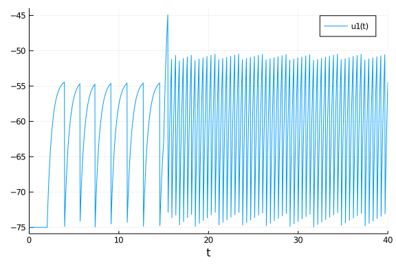


We see that the model is resting at `-75` while there is no input. At `t=2` the input increases by `210` and the model starts to spike. Spiking does not start immediately because the input first has to charge the membrane capacitance. Notice how once spiking starts it very quickly becomes extremely regular. Increasing the input again at `t=15` increases firing as we would expect but it is still extremely regular. This is one of the features of the LIF. The firing frequency is regular for constant input and a linear function of the input strength. There are ways to make LIF models less regular. For example we could use certain noise types at the input. We could also simulate a large number of LIF models and connect them synaptically. Instead of going into those topics, we will move on to the Izhikevich model, which is known for its ability to generate a large variety of spiking dynamics during constant inputs.

## The Izhikevich Model
[The Izhikevich model](https://www.izhikevich.org/publications/spikes.htm) is a two-dimensional model of neuronal spiking. It was derived from a bifurcation analysis of a cortical neuron. Because it is two-dimensional it can generate much more complex spike dynamics than the LIF model. The kind of dynamics depend on the four parameters and the input `a, b, c, d, I = p`. All the concepts are the same as above, expect for some minor changes to our function definitions to accomodate for the second dimension.

````julia

#Izhikevichch Model
using DifferentialEquations
using Plots

function izh!(du,u,p,t);
    a, b, c, d, I = p

    du[1] = 0.04*u[1]^2+5*u[1]+140-u[2]+I
    du[2] = a*(b*u[1]-u[2])
end
````


````
izh! (generic function with 1 method)
````


This is our Izhikevich model. There are two important changes here. First of all, note the additional input parameter `du`. This is a sequence of differences. `du[1]` corresponds to the voltage (the first dimension of the system) and `du[2]` corresponds to the second dimension. This second dimension is called `u` in the original Izhikevich work amnd it makes the notation a little annoying. In this tutorial I will generally stick to Julia and `DifferentialEquations` conventions as opposed to conventions of the specific models and `du` is commonly used. We will never define `du` ourselves outside of the function but the ODE solver will use it internally. The other change here is the `!` after our function name. This signifies that `du` will be preallocated before integration and then updated in-place, which saves a lot of allocation time. Now we just need our callbacks to take care of spikes and increase the input.

````julia

function thr(u,t,integrator)
    integrator.u[1] >= 30
end

function reset!(integrator)
    integrator.u[1] = integrator.p[3]
    integrator.u[2] += integrator.p[4]
end

threshold = DiscreteCallback(thr,reset!)
current_step= PresetTimeCallback(50,integrator -> integrator.p[5] += 10)
cb = CallbackSet(current_step,threshold)
````


````
DiffEqBase.CallbackSet{Tuple{},Tuple{DiffEqBase.DiscreteCallback{DiffEqCall
backs.var"#61#64"{Int64},DiffEqCallbacks.var"#62#65"{Main.##WeaveSandBox#33
7.var"#3#4"},DiffEqCallbacks.var"#63#66"{typeof(DiffEqBase.INITIALIZE_DEFAU
LT),Bool,Int64,Main.##WeaveSandBox#337.var"#3#4"}},DiffEqBase.DiscreteCallb
ack{typeof(Main.##WeaveSandBox#337.thr),typeof(Main.##WeaveSandBox#337.rese
t!),typeof(DiffEqBase.INITIALIZE_DEFAULT)}}}((), (DiffEqBase.DiscreteCallba
ck{DiffEqCallbacks.var"#61#64"{Int64},DiffEqCallbacks.var"#62#65"{Main.##We
aveSandBox#337.var"#3#4"},DiffEqCallbacks.var"#63#66"{typeof(DiffEqBase.INI
TIALIZE_DEFAULT),Bool,Int64,Main.##WeaveSandBox#337.var"#3#4"}}(DiffEqCallb
acks.var"#61#64"{Int64}(50), DiffEqCallbacks.var"#62#65"{Main.##WeaveSandBo
x#337.var"#3#4"}(Main.##WeaveSandBox#337.var"#3#4"()), DiffEqCallbacks.var"
#63#66"{typeof(DiffEqBase.INITIALIZE_DEFAULT),Bool,Int64,Main.##WeaveSandBo
x#337.var"#3#4"}(DiffEqBase.INITIALIZE_DEFAULT, true, 50, Main.##WeaveSandB
ox#337.var"#3#4"()), Bool[1, 1]), DiffEqBase.DiscreteCallback{typeof(Main.#
#WeaveSandBox#337.thr),typeof(Main.##WeaveSandBox#337.reset!),typeof(DiffEq
Base.INITIALIZE_DEFAULT)}(Main.##WeaveSandBox#337.thr, Main.##WeaveSandBox#
337.reset!, DiffEqBase.INITIALIZE_DEFAULT, Bool[1, 1])))
````


One key feature of the Izhikevich model is that each spike increases our second dimension `u[2]` by a preset amount `p[4]`. Between spikes `u[2]` decays to a value that depends on `p[1]` and `p[2]` and the equilibrium potential `p[3]`. Otherwise the code is not too different from the LIF model. We will again need to define our parameters and we are ready to simulate.

````julia

p = [0.02, 0.2, -50, 2, 0]
u0 = [-65, p[2]*-65]
tspan = (0.0, 300)

prob = ODEProblem(izh!, u0, tspan, p, callback=cb)
````


````
ODEProblem with uType Array{Float64,1} and tType Float64. In-place: true
timespan: (0.0, 300.0)
u0: [-65.0, -13.0]
````


````julia

sol = solve(prob);
plot(sol, vars=1)
````


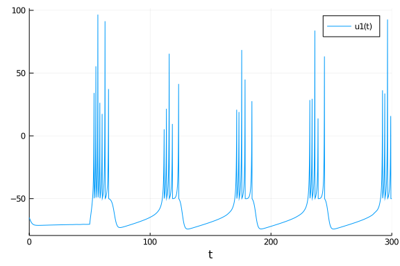


This spiking type is called chattering. It fires with intermittent periods of silence. Note that the input starts at `t=50` and remain constant for the duration of the simulation. One of mechanisms that sustains this type of firing is the spike induced hyperpolarization coming from our second dimension, so let's look at this variable.

````julia

plot(sol, vars=2)
````


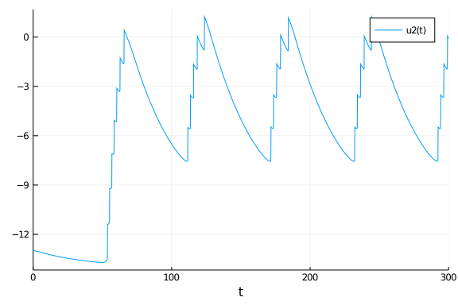


Our second dimension `u[2]` increases with every spike. When it becomes too large, the system cannot generate another spike until `u[2]` has decayed to a value small enough that spiking can resume. This process repeats. In this model, spiking is no longer regular like it was in the LIF. Here we have two frequencies, the frequency during the spiking state and the frequency between spiking states. The LIF model was dominated by one single frequency that was a function of the input strength. Let's see if we can generate another spiking type by changing the parameters.

````julia

p = [0.02, 0.2, -65, 8, 0]
u0 = [-65, p[2]*-65]
tspan = (0.0, 300)

prob = ODEProblem(izh!, u0, tspan, p, callback=cb)
sol = solve(prob);
plot(sol, vars=1)
````


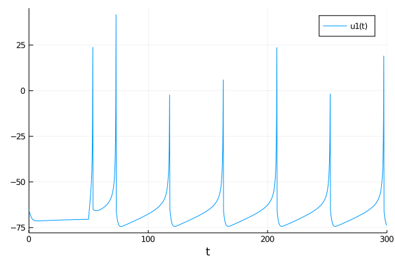


This type is called regularly spiking and we created it just by lowering `p[3]` and increasing `p[4]`. Note that the type is called regularly spiking but it is not instantaneously regular. The instantenous frequency is higher in the beginning. This is called spike frequency adaptation and is a common property of real neurons. There are many more spike types that can be generated. Check out the [original Izhikevich work](https://www.izhikevich.org/publications/spikes.htm) and create your own favorite neuron!

## Hodgkin-Huxley Model
The Hodgkin-Huxley (HH) model is our first biophysically realistic model. This means that all parameters and mechanisms of the model represent biological mechanisms. Specifically, the HH model simulates the ionic currents that depolarize and hyperpolarize a neuron during an action potential. This makes the HH model four-dimensional. Let's see how it looks.

````julia

using DifferentialEquations
using Plots

# Potassium ion-channel rate functions
alpha_n(v) = (0.02 * (v - 25.0)) / (1.0 - exp((-1.0 * (v - 25.0)) / 9.0))
beta_n(v) = (-0.002 * (v - 25.0)) / (1.0 - exp((v - 25.0) / 9.0))

# Sodium ion-channel rate functions
alpha_m(v) = (0.182*(v + 35.0)) / (1.0 - exp((-1.0 * (v + 35.0)) / 9.0))
beta_m(v) = (-0.124 * (v + 35.0)) / (1.0 - exp((v + 35.0) / 9.0))

alpha_h(v) = 0.25 * exp((-1.0 * (v + 90.0)) / 12.0)
beta_h(v) = (0.25 * exp((v + 62.0) / 6.0)) / exp((v + 90.0) / 12.0)

function HH!(du,u,p,t);
    gK, gNa, gL, EK, ENa, EL, C, I = p
    v, n, m, h = u

    du[1] = (-(gK * (n^4.0) * (v - EK)) - (gNa * (m ^ 3.0) * h * (v - ENa)) - (gL * (v - EL)) + I) / C
    du[2] = (alpha_n(v) * (1.0 - n)) - (beta_n(v) * n)
    du[3] = (alpha_m(v) * (1.0 - m)) - (beta_m(v) * m)
    du[4] = (alpha_h(v) * (1.0 - h)) - (beta_h(v) * h)
end
````


````
HH! (generic function with 1 method)
````


We have three different types of ionic conductances. Potassium, sodium and the leak. The potassium and sodium conducance are voltage gated. They increase or decrease depending on the voltage. In ion channel terms, open channels can transition to the closed state and closed channels can transition to the open state. It's probably easiest to start with the potassium current described by `gK * (n^4.0) * (EK - v)`. Here `gK` is the total possible conductance that we could reach if all potassium channels were open. If all channels were open, `n` would equal 1 which is usually not the case. The transition from open state to closed state is modeled in `alpha_n(v)` while the transition from closed to open is in `beta_n(v)`. Because potassium conductance is voltage gated, these transitions depend on `v`. The numbers in `alpha_n; beta_n` were calculated by Hodgkin and Huxley based on their extensive experiments on the squid giant axon. They also determined, that `n` needs to be taken to the power of 4 to correctly model the amount of open channels.

The sodium current is not very different but it has two gating variables, `m, h` instead of one. The leak conductance gL has no gating variables because it is not voltage gated. Let's move on to the parameters. If you want all the details on the HH model you can find a great description [here](https://neuronaldynamics.epfl.ch/online/Ch2.S2.html).

````julia

current_step= PresetTimeCallback(100,integrator -> integrator.p[8] += 1)

# n, m & h steady-states
n_inf(v) = alpha_n(v) / (alpha_n(v) + beta_n(v))
m_inf(v) = alpha_m(v) / (alpha_m(v) + beta_m(v))
h_inf(v) = alpha_h(v) / (alpha_h(v) + beta_h(v))

p = [35.0, 40.0, 0.3, -77.0, 55.0, -65.0, 1, 0]
u0 = [-60, n_inf(-60), m_inf(-60), h_inf(-60)]
tspan = (0.0, 1000)

prob = ODEProblem(HH!, u0, tspan, p, callback=current_step)
````


````
ODEProblem with uType Array{Float64,1} and tType Float64. In-place: true
timespan: (0.0, 1000.0)
u0: [-60.0, 0.0007906538330645915, 0.08362733690208038, 0.41742979353768533
]
````


For the HH model we need only one callback. The PresetTimeCallback that starts our input current. We don't need to reset the voltage when it reaches threshold because the HH model has its own repolarization mechanism. That is the potassium current, which activates at large voltages and makes the voltage more negative. The three functions `n_inf; m_inf; h_inf` help us to find good initial values for the gating variables. Those functions tell us that the steady-state gating values should be for the initial voltage. The parameters were chosen in a way that the properties of the model roughly resemble that of a cortical pyramidal cell instead of the giant axon Hodgkin and Huxley were originally working on.

````julia

sol = solve(prob);
plot(sol, vars=1)
````


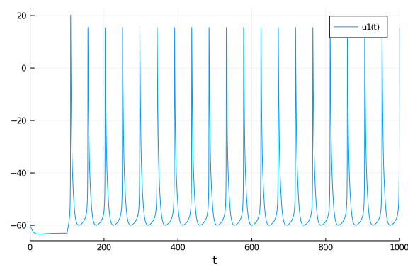


That's some good regular voltage spiking. One of the cool things about a biophysically realistic model is that the gating variables tell us something about the mechanisms behind the action potential. You might have seen something like the following plot in a biology textbook.

````julia

plot(sol, vars=[2,3,4], tspan=(105.0,130.0))
````


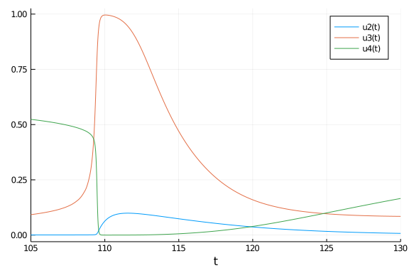


So far we have only given our neurons very simple step inputs by simply changing
the number `I`. Actual neurons recieve their inputs mostly from chemical synapses.
They produce conductance changes with very complex structures. In the next
chapter we will try to incorporate a synapse into our HH model.

## Alpha Synapse
One of the most simple synaptic mechanisms used in computational neuroscience
is the alpha synapse. When this mechanism is triggered, it causes an
instantanouse rise in conductance followed by an exponential decay. Let's
incorporate that into our HH model.

````julia

function gSyn(max_gsyn, tau, tf, t);
    if t-tf >= 0
        return max_gsyn * exp(-(t-tf)/tau)
    else
        return 0.0
    end
end
function HH!(du,u,p,t);
    gK, gNa, gL, EK, ENa, EL, C, I, max_gSyn, ESyn, tau, tf = p
    v, n, m, h = u

    ISyn = gSyn(max_gSyn, tau, tf, t) * (v - ESyn)

    du[1] = (-(gK * (n^4.0) * (v - EK)) - (gNa * (m ^ 3.0) * h * (v - ENa)) - (gL * (v - EL)) + I - ISyn) / C
    du[2] = (alpha_n(v) * (1.0 - n)) - (beta_n(v) * n)
    du[3] = (alpha_m(v) * (1.0 - m)) - (beta_m(v) * m)
    du[4] = (alpha_h(v) * (1.0 - h)) - (beta_h(v) * h)
end
````


````
HH! (generic function with 1 method)
````


`gSyn` models the step to the maximum conductance and the following exponential decay with time constant `tau`. Of course we only want to integrate the conductance at and after time `tf`, the onset of the synaptic response. Before `tf`, `gSyn` returns zero. To convert the conductance to a current, we multiply by the difference between the current voltage and the synapses equilibrium voltage: `ISyn = gSyn(max_gSyn, tau, tf, t) * (v - ESyn)`. Later we will set the parameter `ESyn` to 0, making this synapse an excitatory synapse. Excitatory synapses have equilibrium potentials far above the resting potential. Let's see what our synapse does to the voltage of the cell.

````julia

p = [35.0, 40.0, 0.3, -77.0, 55.0, -65.0, 1, 0, 0.008, 0, 20, 100]
tspan = (0.0, 200)
prob = ODEProblem(HH!, u0, tspan, p)
sol = solve(prob);
plot(sol, vars=1)
````


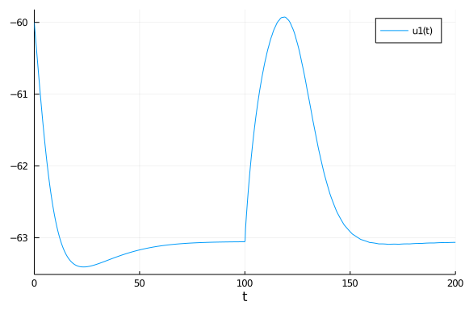


What you see here is called an excitatory postsynaptic potential (EPSP). It is the voltage response to a synaptic current. While our synaptic conductance rises instantly, the voltage response rises at a slower time course that is given by the membrane capacitance `C`. This particular voltage response is not strong enough to evoke spiking, so we say it is subthreshold. To get a suprathreshold response that evokes spiking we simply increase the parameter `max_gSyn` to increase the maximum conductance.

````julia

p = [35.0, 40.0, 0.3, -77.0, 55.0, -65.0, 1, 0, 0.01, 0, 20, 100]
tspan = (0.0, 200)
prob = ODEProblem(HH!, u0, tspan, p)
sol = solve(prob);
plot!(sol, vars=1)
````


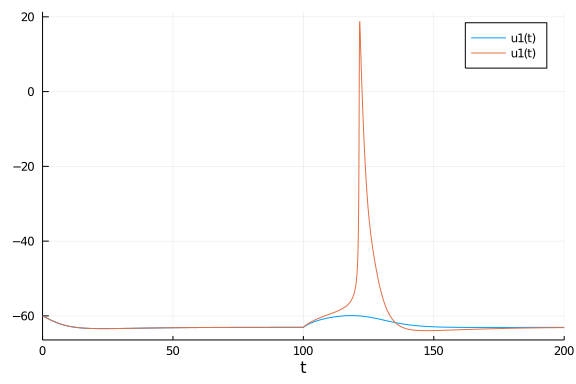


This plot shows both the subthreshold EPSP from above as well as the suprathreshold EPSP. Alpha synapses are nice because of their simplicity. Real synapses however, are extremely complex structures. One of the most important features of real synapses is that their maximum conductance is not the same on every event. The number and frequency of synaptic events changes the size of the maximum conductance in a dynamic way. While we usually avoid anatomical and biophysical details of real synapses, there is a widely used phenomenological way to capture those dynamics called the Tsodyks-Markram synapse.

## Tsodyks-Markram Synapse
The Tsodyks-Markram synapse (TMS) is a dynamic system that models the changes of maximum conductance that occur between EPSPs at different frequencies. The single response is similar to the alpha synapse in that it rises instantaneously and decays exponentially. The maximum conductance it reaches depends on the event history. To simulate the TMS we need to incorporate three more dimensions, `u, R, gsyn` into our system. `u` decays towards 0, R decays towards 1 and gsyn decays towards 0 as it did with the alpha synapse. The crucial part of the TMS is in `epsp!`, where we handle the discontinuities when a synaptic event occurs. Instead of just setting `gsyn` to the maximum conductance `gmax`, we increment `gsyn` by a fraction of gmax that depends on the other two dynamic parameters. The frequency dependence comes from the size of the time constants `tau_u` and `tau_R`. Enough talk, let's simulate it.

````julia

function HH!(du,u,p,t);
    gK, gNa, gL, EK, ENa, EL, C, I, tau, tau_u, tau_R, u0, gmax, Esyn  = p
    v, n, m, h, u, R, gsyn = u

    du[1] = ((gK * (n^4.0) * (EK - v)) + (gNa * (m ^ 3.0) * h * (ENa - v)) + (gL * (EL - v)) + I + gsyn * (Esyn - v)) / C
    du[2] = (alpha_n(v) * (1.0 - n)) - (beta_n(v) * n)
    du[3] = (alpha_m(v) * (1.0 - m)) - (beta_m(v) * m)
    du[4] = (alpha_h(v) * (1.0 - h)) - (beta_h(v) * h)

    # Synaptic variables
    du[5] = -(u/tau_u)
    du[6] = (1-R)/tau_R
    du[7] = -(gsyn/tau)
end

function epsp!(integrator);
    integrator.u[5] += integrator.p[12] * (1 - integrator.u[5])
    integrator.u[7] += integrator.p[13] * integrator.u[5] * integrator.u[6]
    integrator.u[6] -= integrator.u[5] * integrator.u[6]

end

epsp_ts= PresetTimeCallback(100:100:500, epsp!)

p = [35.0, 40.0, 0.3, -77.0, 55.0, -65.0, 1, 0, 30, 1000, 50, 0.5, 0.005, 0]
u0 = [-60, n_inf(-60), m_inf(-60), h_inf(-60), 0.0, 1.0, 0.0]
tspan = (0.0, 700)
prob = ODEProblem(HH!, u0, tspan, p, callback=epsp_ts)
sol = solve(prob);
plot(sol, vars=1)
````


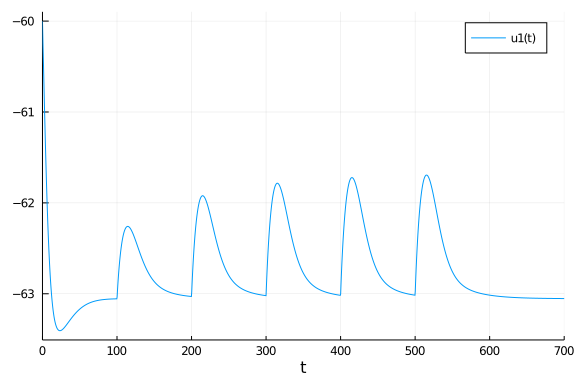

````julia

plot(sol, vars=7)
````


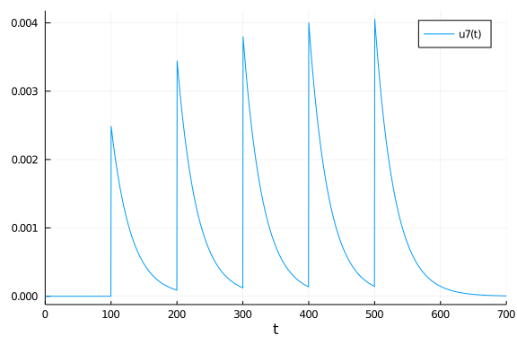


Both the voltage response as well as the conductances show what is called short-term facilitation. An increase in peak conductance over multiple synaptic events. Here the first event has a conductance of around 0.0025 and the last one of 0.004. We can plot the other two varialbes to see what underlies those dynamics

````julia

plot(sol, vars=[5,6])
````


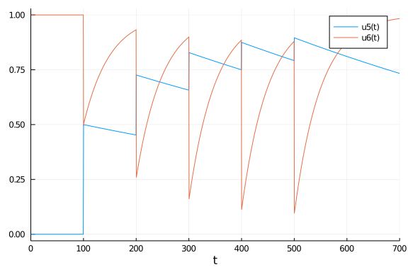


Because of the time courses at play here, this facilitation is frequency dependent. If we increase the period between these events, facilitation does not occur.

````julia

epsp_ts= PresetTimeCallback(100:1000:5100, epsp!)

p = [35.0, 40.0, 0.3, -77.0, 55.0, -65.0, 1, 0, 30, 500, 50, 0.5, 0.005, 0]
u0 = [-60, n_inf(-60), m_inf(-60), h_inf(-60), 0.0, 1.0, 0.0]
tspan = (0.0, 5300)
prob = ODEProblem(HH!, u0, tspan, p, callback=epsp_ts)
sol = solve(prob);
plot(sol, vars=7)
````


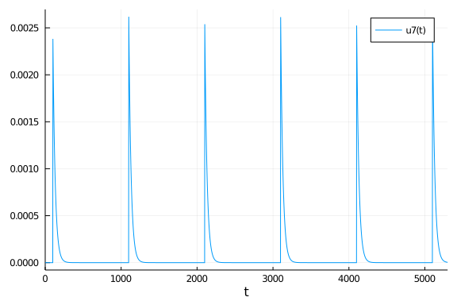

````julia

plot(sol, vars=[5,6])
````


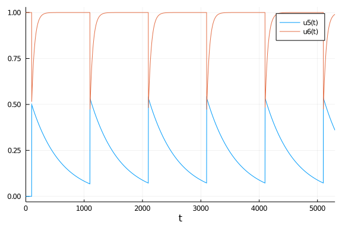


We can also change these time constants such that the dynamics show short-term depression instead of facilitation.

````julia

epsp_ts= PresetTimeCallback(100:100:500, epsp!)

p = [35.0, 40.0, 0.3, -77.0, 55.0, -65.0, 1, 0, 30, 100, 1000, 0.5, 0.005, 0]
u0 = [-60, n_inf(-60), m_inf(-60), h_inf(-60), 0.0, 1.0, 0.0]
tspan = (0.0, 700)
prob = ODEProblem(HH!, u0, tspan, p, callback=epsp_ts)
sol = solve(prob);
plot(sol, vars=7)
````


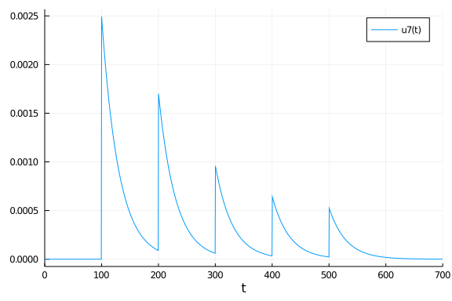

````julia

plot(sol, vars=[5,6])
````


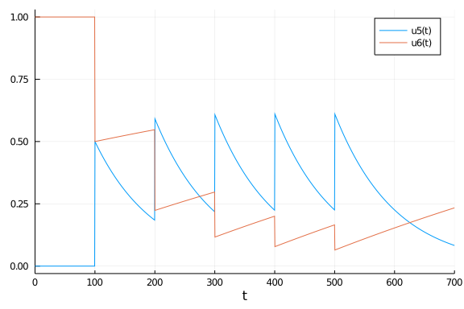


Just changing those two time constants has changed the dynamics to short-term depression. This is still frequency dependent. Changing these parameters can generate a variety of different short-term dynamics.

## Summary
That's it for now. Thanks for making it this far. If you want to learn more about neuronal dynamics, [this is a great resource](https://neuronaldynamics.epfl.ch/online/index.html). If you want to learn more about Julia check out the [official website](https://julialang.org/) and to learn more about the DifferentialEquations package you are in the right place, because this chapter is part of a [larger tutorial series about just that](https://github.com/SciML/SciMLTutorials.jl).


## Appendix

 This tutorial is part of the SciMLTutorials.jl repository, found at: <https://github.com/SciML/SciMLTutorials.jl>.
 For more information on doing scientific machine learning (SciML) with open source software, check out <https://sciml.ai/>.

To locally run this tutorial, do the following commands:
```
using SciMLTutorials
SciMLTutorials.weave_file("models","08-spiking_neural_systems.jmd")
```

Computer Information:
```
Julia Version 1.4.2
Commit 44fa15b150* (2020-05-23 18:35 UTC)
Platform Info:
  OS: Linux (x86_64-pc-linux-gnu)
  CPU: Intel(R) Core(TM) i7-9700K CPU @ 3.60GHz
  WORD_SIZE: 64
  LIBM: libopenlibm
  LLVM: libLLVM-8.0.1 (ORCJIT, skylake)
Environment:
  JULIA_LOAD_PATH = /builds/JuliaGPU/DiffEqTutorials.jl:
  JULIA_DEPOT_PATH = /builds/JuliaGPU/DiffEqTutorials.jl/.julia
  JULIA_CUDA_MEMORY_LIMIT = 2147483648
  JULIA_NUM_THREADS = 8

```

Package Information:

```
Status `/builds/JuliaGPU/DiffEqTutorials.jl/tutorials/models/Project.toml`
[479239e8-5488-4da2-87a7-35f2df7eef83] Catalyst 5.0.0
[459566f4-90b8-5000-8ac3-15dfb0a30def] DiffEqCallbacks 2.14.1
[f3b72e0c-5b89-59e1-b016-84e28bfd966d] DiffEqDevTools 2.27.0
[055956cb-9e8b-5191-98cc-73ae4a59e68a] DiffEqPhysics 3.6.0
[0c46a032-eb83-5123-abaf-570d42b7fbaa] DifferentialEquations 6.15.0
[31c24e10-a181-5473-b8eb-7969acd0382f] Distributions 0.23.12
[587475ba-b771-5e3f-ad9e-33799f191a9c] Flux 0.11.1
[f6369f11-7733-5829-9624-2563aa707210] ForwardDiff 0.10.12
[23fbe1c1-3f47-55db-b15f-69d7ec21a316] Latexify 0.14.0
[961ee093-0014-501f-94e3-6117800e7a78] ModelingToolkit 3.20.0
[2774e3e8-f4cf-5e23-947b-6d7e65073b56] NLsolve 4.4.1
[315f7962-48a3-4962-8226-d0f33b1235f0] NeuralPDE 2.3.0
[429524aa-4258-5aef-a3af-852621145aeb] Optim 1.2.0
[1dea7af3-3e70-54e6-95c3-0bf5283fa5ed] OrdinaryDiffEq 5.42.8
[91a5bcdd-55d7-5caf-9e0b-520d859cae80] Plots 1.6.5
[731186ca-8d62-57ce-b412-fbd966d074cd] RecursiveArrayTools 2.7.0
[789caeaf-c7a9-5a7d-9973-96adeb23e2a0] StochasticDiffEq 6.26.0
[37e2e46d-f89d-539d-b4ee-838fcccc9c8e] LinearAlgebra
[2f01184e-e22b-5df5-ae63-d93ebab69eaf] SparseArrays
```
