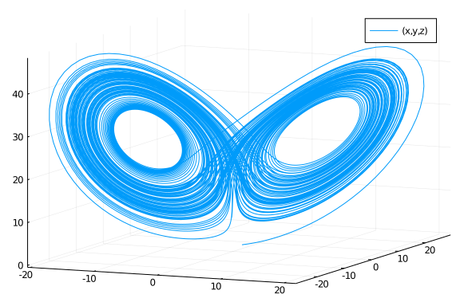

A lot of people are building modeling languages for their specific domains. However, while the syntax my vary greatly between these domain-specific languages (DSLs), the internals of modeling frameworks are surprisingly similar: building differential equations, calculating Jacobians, etc.

#### ModelingToolkit.jl is metamodeling systemitized

After building our third modeling interface, we realized that this problem can be better approached by having a reusable internal structure which DSLs can target. This internal is ModelingToolkit.jl: an Intermediate Representation (IR) with a well-defined interface for defining system transformations and compiling to Julia functions for use in numerical libraries. Now a DSL can easily be written by simply defining the translation to ModelingToolkit.jl's primatives and querying for the mathematical quantities one needs.

### Basic usage: defining differential equation systems, with performance!

Let's explore the IR itself. ModelingToolkit.jl is friendly to use, and can used as a symbolic DSL in its own right. Let's define and solve the Lorenz differential equation system using ModelingToolkit to generate the functions:

````julia

using ModelingToolkit

### Define a differential equation system

@parameters t σ ρ β
@variables x(t) y(t) z(t)
@derivatives D'~t

eqs = [D(x) ~ σ*(y-x),
       D(y) ~ x*(ρ-z)-y,
       D(z) ~ x*y - β*z]
de = ODESystem(eqs, t, [x,y,z], [σ,ρ,β])
ode_f = ODEFunction(de)

### Use in DifferentialEquations.jl

using OrdinaryDiffEq
u₀ = ones(3)
tspan = (0.0,100.0)
p = [10.0,28.0,10/3]
prob = ODEProblem(ode_f,u₀,tspan,p)
sol = solve(prob,Tsit5())

using Plots
plot(sol,vars=(1,2,3))
````





### ModelingToolkit is a compiler for mathematical systems

At its core, ModelingToolkit is a compiler. It's IR is its type system, and its output are Julia functions (it's a compiler for Julia code to Julia code, written in Julia).

DifferentialEquations.jl wants a function `f(u,p,t)` or `f(du,u,p,t)` for defining an ODE system,
so ModelingToolkit.jl builds both. First the out of place version:

````julia

generate_function(de)[1]
````


````
:((var"##MTKArg#487", var"##MTKArg#488", var"##MTKArg#489")->begin
          @inbounds begin
                  let (x, y, z, σ, ρ, β, t) = (var"##MTKArg#487"[1], var"##MTKArg#487"[2], var"##MTKArg#487"[3], var"##MTKArg#488"
[1], var"##MTKArg#488"[2], var"##MTKArg#488"[3], var"##MTKArg#489")
                      if false || typeof(var"##MTKArg#487") <: Union{ModelingToolkit.StaticArrays.SArray, ModelingToolkit.Labelled
Arrays.SLArray}
                          var"##MTK#492" = ModelingToolkit.StaticArrays.@SArray([(getproperty(Base, :*))(σ, (getproperty(Base, :-)
)(y, x)), (getproperty(Base, :-))((getproperty(Base, :*))(x, (getproperty(Base, :-))(ρ, z)), y), (getproperty(Base, :-))((getprope
rty(Base, :*))(x, y), (getproperty(Base, :*))(β, z))])
                          if true && (!(typeof(var"##MTKArg#487") <: Number) && true)
                              return (similar_type(var"##MTKArg#487", eltype(var"##MTK#492")))(var"##MTK#492")
                          else
                              return var"##MTK#492"
                          end
                      else
                          var"##MTK#492" = [(getproperty(Base, :*))(σ, (getproperty(Base, :-))(y, x)), (getproperty(Base, :-))((ge
tproperty(Base, :*))(x, (getproperty(Base, :-))(ρ, z)), y), (getproperty(Base, :-))((getproperty(Base, :*))(x, y), (getproperty(Ba
se, :*))(β, z))]
                          if true && true
                              if !(typeof(var"##MTKArg#487") <: Array) && (!(typeof(var"##MTKArg#487") <: Number) && eltype(var"##
MTKArg#487") <: eltype(var"##MTK#492"))
                                  return convert(typeof(var"##MTKArg#487"), var"##MTK#492")
                              elseif typeof(var"##MTKArg#487") <: ModelingToolkit.LabelledArrays.LArray
                                  return ModelingToolkit.LabelledArrays.LArray{(getproperty(ModelingToolkit.LabelledArrays, :symna
mes))(typeof(var"##MTKArg#487"))}(var"##MTK#492")
                              else
                                  return var"##MTK#492"
                              end
                          else
                              return var"##MTK#492"
                          end
                      end
                  end
              end
      end)
````


and the in-place:

````julia

generate_function(de)[2]
````


````
:((var"##MTIIPVar#498", var"##MTKArg#494", var"##MTKArg#495", var"##MTKArg#496")->begin
          @inbounds begin
                  begin
                      (ModelingToolkit.fill_array_with_zero!)(var"##MTIIPVar#498")
                      let (x, y, z, σ, ρ, β, t) = (var"##MTKArg#494"[1], var"##MTKArg#494"[2], var"##MTKArg#494"[3], var"##MTKArg#
495"[1], var"##MTKArg#495"[2], var"##MTKArg#495"[3], var"##MTKArg#496")
                          var"##MTIIPVar#498"[1] = (getproperty(Base, :*))(σ, (getproperty(Base, :-))(y, x))
                          var"##MTIIPVar#498"[2] = (getproperty(Base, :-))((getproperty(Base, :*))(x, (getproperty(Base, :-))(ρ, z
)), y)
                          var"##MTIIPVar#498"[3] = (getproperty(Base, :-))((getproperty(Base, :*))(x, y), (getproperty(Base, :*))(
β, z))
                      end
                  end
              end
          nothing
      end)
````


ModelingToolkit.jl can be used to calculate the Jacobian of the differential equation system:

````julia

jac = calculate_jacobian(de)
````


````
3×3 Array{ModelingToolkit.Expression,2}:
           -1σ             σ  Constant(0)
 -1 * z(t) + ρ  Constant(-1)    -1 * x(t)
          y(t)          x(t)          -1β
````


It will automatically generate functions for using this Jacobian within the stiff ODE solvers for faster solving:

````julia

jac_expr = generate_jacobian(de)
````


````
(:((var"##MTKArg#501", var"##MTKArg#502", var"##MTKArg#503")->begin
          @inbounds begin
                  let (x, y, z, σ, ρ, β, t) = (var"##MTKArg#501"[1], var"##MTKArg#501"[2], var"##MTKArg#501"[3], var"##MTKArg#502"
[1], var"##MTKArg#502"[2], var"##MTKArg#502"[3], var"##MTKArg#503")
                      if false || typeof(var"##MTKArg#501") <: Union{ModelingToolkit.StaticArrays.SArray, ModelingToolkit.Labelled
Arrays.SLArray}
                          var"##MTK#506" = ModelingToolkit.StaticArrays.@SArray([(getproperty(Base, :*))(-1, σ) σ 0; (getproperty(
Base, :+))((getproperty(Base, :*))(-1, z), ρ) -1 (getproperty(Base, :*))(-1, x); y x (getproperty(Base, :*))(-1, β)])
                          if true && (!(typeof(var"##MTKArg#501") <: Number) && false)
                              return (similar_type(var"##MTKArg#501", eltype(var"##MTK#506")))(var"##MTK#506")
                          else
                              return var"##MTK#506"
                          end
                      else
                          var"##MTK#506" = [(getproperty(Base, :*))(-1, σ) σ 0; (getproperty(Base, :+))((getproperty(Base, :*))(-1
, z), ρ) -1 (getproperty(Base, :*))(-1, x); y x (getproperty(Base, :*))(-1, β)]
                          if true && false
                              if !(typeof(var"##MTKArg#501") <: Array) && (!(typeof(var"##MTKArg#501") <: Number) && eltype(var"##
MTKArg#501") <: eltype(var"##MTK#506"))
                                  return convert(typeof(var"##MTKArg#501"), var"##MTK#506")
                              elseif typeof(var"##MTKArg#501") <: ModelingToolkit.LabelledArrays.LArray
                                  return ModelingToolkit.LabelledArrays.LArray{(getproperty(ModelingToolkit.LabelledArrays, :symna
mes))(typeof(var"##MTKArg#501"))}(var"##MTK#506")
                              else
                                  return var"##MTK#506"
                              end
                          else
                              return var"##MTK#506"
                          end
                      end
                  end
              end
      end), :((var"##MTIIPVar#505", var"##MTKArg#501", var"##MTKArg#502", var"##MTKArg#503")->begin
          @inbounds begin
                  begin
                      (ModelingToolkit.fill_array_with_zero!)(var"##MTIIPVar#505")
                      let (x, y, z, σ, ρ, β, t) = (var"##MTKArg#501"[1], var"##MTKArg#501"[2], var"##MTKArg#501"[3], var"##MTKArg#
502"[1], var"##MTKArg#502"[2], var"##MTKArg#502"[3], var"##MTKArg#503")
                          var"##MTIIPVar#505"[1] = (getproperty(Base, :*))(-1, σ)
                          var"##MTIIPVar#505"[2] = (getproperty(Base, :+))((getproperty(Base, :*))(-1, z), ρ)
                          var"##MTIIPVar#505"[3] = y
                          var"##MTIIPVar#505"[4] = σ
                          var"##MTIIPVar#505"[5] = -1
                          var"##MTIIPVar#505"[6] = x
                          var"##MTIIPVar#505"[8] = (getproperty(Base, :*))(-1, x)
                          var"##MTIIPVar#505"[9] = (getproperty(Base, :*))(-1, β)
                      end
                  end
              end
          nothing
      end))
````


It can even do fancy linear algebra. Stiff ODE solvers need to perform an LU-factorization which is their most expensive part. But ModelingToolkit.jl can skip this operation and instead generate the analytical solution to a matrix factorization, and build a Julia function for directly computing the factorization, which is then optimized in LLVM compiler passes.

````julia

ModelingToolkit.generate_factorized_W(de)[1]
````


````
Error: MethodError: no method matching generate_factorized_W(::ModelingToolkit.ODESystem)
````


### Solving Nonlinear systems

ModelingToolkit.jl is not just for differential equations. It can be used for any mathematical target that is representable by its IR. For example, let's solve a rootfinding problem `F(x)=0`. What we do is define a nonlinear system and generate a function for use in NLsolve.jl

````julia

@variables x y z
@parameters σ ρ β

# Define a nonlinear system
eqs = [0 ~ σ*(y-x),
       0 ~ x*(ρ-z)-y,
       0 ~ x*y - β*z]
ns = NonlinearSystem(eqs, [x,y,z], [σ,ρ,β])
nlsys_func = generate_function(ns)
````


````
(:((var"##MTKArg#509", var"##MTKArg#510")->begin
          @inbounds begin
                  let (x, y, z, σ, ρ, β) = (var"##MTKArg#509"[1], var"##MTKArg#509"[2], var"##MTKArg#509"[3], var"##MTKArg#510"[1]
, var"##MTKArg#510"[2], var"##MTKArg#510"[3])
                      if false || typeof(var"##MTKArg#509") <: Union{ModelingToolkit.StaticArrays.SArray, ModelingToolkit.Labelled
Arrays.SLArray}
                          var"##MTK#513" = ModelingToolkit.StaticArrays.@SArray([(*)(σ, (-)(y, x)), (-)((*)(x, (-)(ρ, z)), y), (-)
((*)(x, y), (*)(β, z))])
                          if true && (!(typeof(var"##MTKArg#509") <: Number) && true)
                              return (similar_type(var"##MTKArg#509", eltype(var"##MTK#513")))(var"##MTK#513")
                          else
                              return var"##MTK#513"
                          end
                      else
                          var"##MTK#513" = [(*)(σ, (-)(y, x)), (-)((*)(x, (-)(ρ, z)), y), (-)((*)(x, y), (*)(β, z))]
                          if true && true
                              if !(typeof(var"##MTKArg#509") <: Array) && (!(typeof(var"##MTKArg#509") <: Number) && eltype(var"##
MTKArg#509") <: eltype(var"##MTK#513"))
                                  return convert(typeof(var"##MTKArg#509"), var"##MTK#513")
                              elseif typeof(var"##MTKArg#509") <: ModelingToolkit.LabelledArrays.LArray
                                  return ModelingToolkit.LabelledArrays.LArray{(getproperty(ModelingToolkit.LabelledArrays, :symna
mes))(typeof(var"##MTKArg#509"))}(var"##MTK#513")
                              else
                                  return var"##MTK#513"
                              end
                          else
                              return var"##MTK#513"
                          end
                      end
                  end
              end
      end), :((var"##MTIIPVar#512", var"##MTKArg#509", var"##MTKArg#510")->begin
          @inbounds begin
                  begin
                      (ModelingToolkit.fill_array_with_zero!)(var"##MTIIPVar#512")
                      let (x, y, z, σ, ρ, β) = (var"##MTKArg#509"[1], var"##MTKArg#509"[2], var"##MTKArg#509"[3], var"##MTKArg#510
"[1], var"##MTKArg#510"[2], var"##MTKArg#510"[3])
                          var"##MTIIPVar#512"[1] = (*)(σ, (-)(y, x))
                          var"##MTIIPVar#512"[2] = (-)((*)(x, (-)(ρ, z)), y)
                          var"##MTIIPVar#512"[3] = (-)((*)(x, y), (*)(β, z))
                      end
                  end
              end
          nothing
      end))
````


We can then tell ModelingToolkit.jl to compile this function for use in NLsolve.jl, and then numerically solve the rootfinding problem:

````julia

nl_f = @eval eval(nlsys_func[2])
# Make a closure over the parameters for for NLsolve.jl
f2 = (du,u) -> nl_f(du,u,(10.0,26.0,2.33))

using NLsolve
nlsolve(f2,ones(3))
````


````
Results of Nonlinear Solver Algorithm
 * Algorithm: Trust-region with dogleg and autoscaling
 * Starting Point: [1.0, 1.0, 1.0]
 * Zero: [2.2228042243306243e-10, 2.2228042243645056e-10, -9.990339599422887e-11]
 * Inf-norm of residuals: 0.000000
 * Iterations: 3
 * Convergence: true
   * |x - x'| < 0.0e+00: false
   * |f(x)| < 1.0e-08: true
 * Function Calls (f): 4
 * Jacobian Calls (df/dx): 4
````


### Library of transformations on mathematical systems

The reason for using ModelingToolkit is not just for defining performant Julia functions for solving systems, but also for performing mathematical transformations which may be required in order to numerically solve the system. For example, let's solve a third order ODE. The way this is done is by transforming the third order ODE into a first order ODE, and then solving the resulting ODE. This transformation is given by the `ode_order_lowering` function.

````julia

@derivatives D3'''~t
@derivatives D2''~t
@variables u(t), x(t)
eqs = [D3(u) ~ 2(D2(u)) + D(u) + D(x) + 1
       D2(x) ~ D(x) + 2]
de = ODESystem(eqs, t, [u,x], [])
de1 = ode_order_lowering(de)
````


````
ModelingToolkit.ODESystem(ModelingToolkit.Equation[ModelingToolkit.Equation(derivative(uˍtt(t), t), ((2 * uˍtt(t) + uˍt(t)) + xˍt(
t)) + 1), ModelingToolkit.Equation(derivative(xˍt(t), t), xˍt(t) + 2), ModelingToolkit.Equation(derivative(uˍt(t), t), uˍtt(t)), M
odelingToolkit.Equation(derivative(u(t), t), uˍt(t)), ModelingToolkit.Equation(derivative(x(t), t), xˍt(t))], t, ModelingToolkit.V
ariable[uˍtt, xˍt, uˍt, u, x], ModelingToolkit.Variable[], ModelingToolkit.Variable[], ModelingToolkit.Equation[], Base.RefValue{A
rray{ModelingToolkit.Expression,1}}(ModelingToolkit.Expression[]), Base.RefValue{Any}(Array{ModelingToolkit.Expression}(undef,0,0)
), Base.RefValue{Array{ModelingToolkit.Expression,2}}(Array{ModelingToolkit.Expression}(undef,0,0)), Base.RefValue{Array{ModelingT
oolkit.Expression,2}}(Array{ModelingToolkit.Expression}(undef,0,0)), Symbol("##ODESystem#516"), ModelingToolkit.ODESystem[])
````


````julia

de1.eqs
````


````
5-element Array{ModelingToolkit.Equation,1}:
 ModelingToolkit.Equation(derivative(uˍtt(t), t), ((2 * uˍtt(t) + uˍt(t)) + xˍt(t)) + 1)
 ModelingToolkit.Equation(derivative(xˍt(t), t), xˍt(t) + 2)
 ModelingToolkit.Equation(derivative(uˍt(t), t), uˍtt(t))
 ModelingToolkit.Equation(derivative(u(t), t), uˍt(t))
 ModelingToolkit.Equation(derivative(x(t), t), xˍt(t))
````


This has generated a system of 5 first order ODE systems which can now be used in the ODE solvers.

### Linear Algebra... for free?

Let's take a look at how to extend ModelingToolkit.jl in new directions. Let's define a Jacobian just by using the derivative primatives by hand:

````julia

@parameters t σ ρ β
@variables x(t) y(t) z(t)
@derivatives D'~t Dx'~x Dy'~y Dz'~z
eqs = [D(x) ~ σ*(y-x),
       D(y) ~ x*(ρ-z)-y,
       D(z) ~ x*y - β*z]
J = [Dx(eqs[1].rhs) Dy(eqs[1].rhs) Dz(eqs[1].rhs)
 Dx(eqs[2].rhs) Dy(eqs[2].rhs) Dz(eqs[2].rhs)
 Dx(eqs[3].rhs) Dy(eqs[3].rhs) Dz(eqs[3].rhs)]
````


````
3×3 Array{ModelingToolkit.Operation,2}:
        derivative(σ * (y(t) - x(t)), x(t))  …         derivative(σ * (y(t) - x(t)), z(t))
 derivative(x(t) * (ρ - z(t)) - y(t), x(t))     derivative(x(t) * (ρ - z(t)) - y(t), z(t))
   derivative(x(t) * y(t) - β * z(t), x(t))       derivative(x(t) * y(t) - β * z(t), z(t))
````


Notice that this writes the derivatives in a "lazy" manner. If we want to actually compute the derivatives, we can expand out those expressions:

````julia

J = expand_derivatives.(J)
````


````
3×3 Array{ModelingToolkit.Expression,2}:
           -1σ             σ  Constant(0)
 -1 * z(t) + ρ  Constant(-1)    -1 * x(t)
          y(t)          x(t)          -1β
````


Here's the magic of ModelingToolkit.jl: **Julia treats ModelingToolkit expressions like a Number, and so generic numerical functions are directly usable on ModelingToolkit expressions!** Let's compute the LU-factorization of this Jacobian we defined using Julia's Base linear algebra library.

````julia

using LinearAlgebra
luJ = lu(J,Val(false))
````


````
LinearAlgebra.LU{ModelingToolkit.Expression,Array{ModelingToolkit.Expression,2}}
L factor:
3×3 Array{ModelingToolkit.Expression,2}:
                Constant(1)  …  Constant(0)
 (-1 * z(t) + ρ) * inv(-1σ)     Constant(0)
            y(t) * inv(-1σ)     Constant(1)
U factor:
3×3 Array{ModelingToolkit.Expression,2}:
         -1σ  …                                                                                                                   
                                  Constant(0)
 Constant(0)                                                                                                                      
 -1 * x(t) - ((-1 * z(t) + ρ) * inv(-1σ)) * 0
 Constant(0)     (-1β - (y(t) * inv(-1σ)) * 0) - ((x(t) - (y(t) * inv(-1σ)) * σ) * inv(-1 - ((-1 * z(t) + ρ) * inv(-1σ)) * σ)) * (
-1 * x(t) - ((-1 * z(t) + ρ) * inv(-1σ)) * 0)
````


````julia

luJ.L
````


````
3×3 Array{ModelingToolkit.Expression,2}:
                Constant(1)  …  Constant(0)
 (-1 * z(t) + ρ) * inv(-1σ)     Constant(0)
            y(t) * inv(-1σ)     Constant(1)
````


and the inverse?

````julia

invJ = inv(luJ)
````


````
3×3 Array{ModelingToolkit.Expression,2}:
 (-1σ) \ ((true - 0 * (((-1β - (y(t) * inv(-1σ)) * 0) - ((x(t) - (y(t) * inv(-1σ)) * σ) * inv(-1 - ((-1 * z(t) + ρ) * inv(-1σ)) * 
σ)) * (-1 * x(t) - ((-1 * z(t) + ρ) * inv(-1σ)) * 0)) \ ((0 - (y(t) * inv(-1σ)) * true) - ((x(t) - (y(t) * inv(-1σ)) * σ) * inv(-1
 - ((-1 * z(t) + ρ) * inv(-1σ)) * σ)) * (0 - ((-1 * z(t) + ρ) * inv(-1σ)) * true)))) - σ * ((-1 - ((-1 * z(t) + ρ) * inv(-1σ)) * σ
) \ ((0 - ((-1 * z(t) + ρ) * inv(-1σ)) * true) - (-1 * x(t) - ((-1 * z(t) + ρ) * inv(-1σ)) * 0) * (((-1β - (y(t) * inv(-1σ)) * 0) 
- ((x(t) - (y(t) * inv(-1σ)) * σ) * inv(-1 - ((-1 * z(t) + ρ) * inv(-1σ)) * σ)) * (-1 * x(t) - ((-1 * z(t) + ρ) * inv(-1σ)) * 0)) 
\ ((0 - (y(t) * inv(-1σ)) * true) - ((x(t) - (y(t) * inv(-1σ)) * σ) * inv(-1 - ((-1 * z(t) + ρ) * inv(-1σ)) * σ)) * (0 - ((-1 * z(
t) + ρ) * inv(-1σ)) * true))))))  …  (-1σ) \ ((0 - 0 * (((-1β - (y(t) * inv(-1σ)) * 0) - ((x(t) - (y(t) * inv(-1σ)) * σ) * inv(-1 
- ((-1 * z(t) + ρ) * inv(-1σ)) * σ)) * (-1 * x(t) - ((-1 * z(t) + ρ) * inv(-1σ)) * 0)) \ ((true - (y(t) * inv(-1σ)) * 0) - ((x(t) 
- (y(t) * inv(-1σ)) * σ) * inv(-1 - ((-1 * z(t) + ρ) * inv(-1σ)) * σ)) * (0 - ((-1 * z(t) + ρ) * inv(-1σ)) * 0)))) - σ * ((-1 - ((
-1 * z(t) + ρ) * inv(-1σ)) * σ) \ ((0 - ((-1 * z(t) + ρ) * inv(-1σ)) * 0) - (-1 * x(t) - ((-1 * z(t) + ρ) * inv(-1σ)) * 0) * (((-1
β - (y(t) * inv(-1σ)) * 0) - ((x(t) - (y(t) * inv(-1σ)) * σ) * inv(-1 - ((-1 * z(t) + ρ) * inv(-1σ)) * σ)) * (-1 * x(t) - ((-1 * z
(t) + ρ) * inv(-1σ)) * 0)) \ ((true - (y(t) * inv(-1σ)) * 0) - ((x(t) - (y(t) * inv(-1σ)) * σ) * inv(-1 - ((-1 * z(t) + ρ) * inv(-
1σ)) * σ)) * (0 - ((-1 * z(t) + ρ) * inv(-1σ)) * 0))))))
                                                                                                                                  
                                                                                                                                  
                                                                                              (-1 - ((-1 * z(t) + ρ) * inv(-1σ)) *
 σ) \ ((0 - ((-1 * z(t) + ρ) * inv(-1σ)) * true) - (-1 * x(t) - ((-1 * z(t) + ρ) * inv(-1σ)) * 0) * (((-1β - (y(t) * inv(-1σ)) * 0
) - ((x(t) - (y(t) * inv(-1σ)) * σ) * inv(-1 - ((-1 * z(t) + ρ) * inv(-1σ)) * σ)) * (-1 * x(t) - ((-1 * z(t) + ρ) * inv(-1σ)) * 0)
) \ ((0 - (y(t) * inv(-1σ)) * true) - ((x(t) - (y(t) * inv(-1σ)) * σ) * inv(-1 - ((-1 * z(t) + ρ) * inv(-1σ)) * σ)) * (0 - ((-1 * 
z(t) + ρ) * inv(-1σ)) * true))))                                                                                                  
                                                                                                                                  
                                                                                                                            (-1 - 
((-1 * z(t) + ρ) * inv(-1σ)) * σ) \ ((0 - ((-1 * z(t) + ρ) * inv(-1σ)) * 0) - (-1 * x(t) - ((-1 * z(t) + ρ) * inv(-1σ)) * 0) * (((
-1β - (y(t) * inv(-1σ)) * 0) - ((x(t) - (y(t) * inv(-1σ)) * σ) * inv(-1 - ((-1 * z(t) + ρ) * inv(-1σ)) * σ)) * (-1 * x(t) - ((-1 *
 z(t) + ρ) * inv(-1σ)) * 0)) \ ((true - (y(t) * inv(-1σ)) * 0) - ((x(t) - (y(t) * inv(-1σ)) * σ) * inv(-1 - ((-1 * z(t) + ρ) * inv
(-1σ)) * σ)) * (0 - ((-1 * z(t) + ρ) * inv(-1σ)) * 0))))
                                                                                                                                  
                                                                                                                                  
                                                                                                                                  
                                                                                                       ((-1β - (y(t) * inv(-1σ)) *
 0) - ((x(t) - (y(t) * inv(-1σ)) * σ) * inv(-1 - ((-1 * z(t) + ρ) * inv(-1σ)) * σ)) * (-1 * x(t) - ((-1 * z(t) + ρ) * inv(-1σ)) * 
0)) \ ((0 - (y(t) * inv(-1σ)) * true) - ((x(t) - (y(t) * inv(-1σ)) * σ) * inv(-1 - ((-1 * z(t) + ρ) * inv(-1σ)) * σ)) * (0 - ((-1 
* z(t) + ρ) * inv(-1σ)) * true))                                                                                                  
                                                                                                                                  
                                                                                                                                  
                                                                                                                                  
((-1β - (y(t) * inv(-1σ)) * 0) - ((x(t) - (y(t) * inv(-1σ)) * σ) * inv(-1 - ((-1 * z(t) + ρ) * inv(-1σ)) * σ)) * (-1 * x(t) - ((-1
 * z(t) + ρ) * inv(-1σ)) * 0)) \ ((true - (y(t) * inv(-1σ)) * 0) - ((x(t) - (y(t) * inv(-1σ)) * σ) * inv(-1 - ((-1 * z(t) + ρ) * i
nv(-1σ)) * σ)) * (0 - ((-1 * z(t) + ρ) * inv(-1σ)) * 0))
````


#### Thus ModelingToolkit.jl can utilize existing numerical code on symbolic codes

Let's follow this thread a little deeper.

### Automatically convert numerical codes to symbolic

Let's take someone's code written to numerically solve the Lorenz equation:

````julia

function lorenz(du,u,p,t)
 du[1] = p[1]*(u[2]-u[1])
 du[2] = u[1]*(p[2]-u[3]) - u[2]
 du[3] = u[1]*u[2] - p[3]*u[3]
end
````


````
lorenz (generic function with 1 method)
````


Since ModelingToolkit can trace generic numerical functions in Julia, let's trace it with Operations. When we do this, it'll spit out a symbolic representation of their numerical code:

````julia

u = [x,y,z]
du = similar(u)
p = [σ,ρ,β]
lorenz(du,u,p,t)
du
````


````
3-element Array{ModelingToolkit.Operation,1}:
        σ * (y(t) - x(t))
 x(t) * (ρ - z(t)) - y(t)
   x(t) * y(t) - β * z(t)
````


We can then perform symbolic manipulations on their numerical code, and build a new numerical code that optimizes/fixes their original function!

````julia

J = [Dx(du[1]) Dy(du[1]) Dz(du[1])
     Dx(du[2]) Dy(du[2]) Dz(du[2])
     Dx(du[3]) Dy(du[3]) Dz(du[3])]
J = expand_derivatives.(J)
````


````
3×3 Array{ModelingToolkit.Expression,2}:
           -1σ             σ  Constant(0)
 -1 * z(t) + ρ  Constant(-1)    -1 * x(t)
          y(t)          x(t)          -1β
````


### Automated Sparsity Detection

In many cases one has to speed up large modeling frameworks by taking into account sparsity. While ModelingToolkit.jl can be used to compute Jacobians, we can write a standard Julia function in order to get a spase matrix of expressions which automatically detects and utilizes the sparsity of their function.

````julia

using SparseArrays
function SparseArrays.SparseMatrixCSC(M::Matrix{T}) where {T<:ModelingToolkit.Expression}
    idxs = findall(!iszero, M)
    I = [i[1] for i in idxs]
    J = [i[2] for i in idxs]
    V = [M[i] for i in idxs]
    return SparseArrays.sparse(I, J, V, size(M)...)
end
sJ = SparseMatrixCSC(J)
````


````
3×3 SparseArrays.SparseMatrixCSC{ModelingToolkit.Expression,Int64} with 8 stored entries:
  [1, 1]  =  -1σ
  [2, 1]  =  -1 * z(t) + ρ
  [3, 1]  =  y(t)
  [1, 2]  =  σ
  [2, 2]  =  Constant(-1)
  [3, 2]  =  x(t)
  [2, 3]  =  -1 * x(t)
  [3, 3]  =  -1β
````


### Dependent Variables, Functions, Chain Rule

"Variables" are overloaded. When you are solving a differential equation, the variable `u(t)` is actually a function of time. In order to handle these kinds of variables in a mathematically correct and extensible manner, the ModelingToolkit IR actually treats variables as functions, and constant variables are simply 0-ary functions (`t()`).

We can utilize this idea to have parameters that are also functions. For example, we can have a parameter σ which acts as a function of 1 argument, and then utilize this function within our differential equations:

````julia

@parameters σ(..)
eqs = [D(x) ~ σ(t-1)*(y-x),
       D(y) ~ x*(σ(t^2)-z)-y,
       D(z) ~ x*y - β*z]
````


````
3-element Array{ModelingToolkit.Equation,1}:
 ModelingToolkit.Equation(derivative(x(t), t), σ(t - 1) * (y(t) - x(t)))
 ModelingToolkit.Equation(derivative(y(t), t), x(t) * (σ(t ^ 2) - z(t)) - y(t))
 ModelingToolkit.Equation(derivative(z(t), t), x(t) * y(t) - β * z(t))
````


Notice that when we calculate the derivative with respect to `t`, the chain rule is automatically handled:

````julia

@derivatives Dₜ'~t
Dₜ(x*(σ(t^2)-z)-y)
expand_derivatives(Dₜ(x*(σ(t^2)-z)-y))
````


````
derivative(x(t), t) * (σ(t ^ 2) + -1 * z(t)) + -1 * derivative(y(t), t) + x(t) * (derivative(σ(t ^ 2), t) + -1 * derivative(z(t), 
t))
````


### Hackability: Extend directly from the language

ModelingToolkit.jl is written in Julia, and thus it can be directly extended from Julia itself. Let's define a normal Julia function and call it with a variable:

````julia

_f(x) = 2x + x^2
_f(x)
````


````
2 * x(t) + x(t) ^ 2
````


Recall that when we do that, it will automatically trace this function and then build a symbolic expression. But what if we wanted our function to be a primative in the symbolic framework? This can be done by registering the function.

````julia

f(x) = 2x + x^2
@register f(x)
````


````
f (generic function with 2 methods)
````


Now this function is a new primitive:

````julia

f(x)
````


````
f(x(t))
````


and we can now define derivatives of our function:

````julia

function ModelingToolkit.derivative(::typeof(f), args::NTuple{1,Any}, ::Val{1})
    2 + 2args[1]
end
expand_derivatives(Dx(f(x)))
````


````
2 + 2 * x(t)
````


## Appendix

 This tutorial is part of the SciMLTutorials.jl repository, found at: <https://github.com/SciML/SciMLTutorials.jl>.
 For more information on doing scientific machine learning (SciML) with open source software, check out <https://sciml.ai/>.

To locally run this tutorial, do the following commands:
```
using SciMLTutorials
SciMLTutorials.weave_file("ode_extras","01-ModelingToolkit.jmd")
```

Computer Information:
```
Julia Version 1.4.2
Commit 44fa15b150* (2020-05-23 18:35 UTC)
Platform Info:
  OS: Linux (x86_64-pc-linux-gnu)
  CPU: Intel(R) Core(TM) i7-9700K CPU @ 3.60GHz
  WORD_SIZE: 64
  LIBM: libopenlibm
  LLVM: libLLVM-8.0.1 (ORCJIT, skylake)
Environment:
  JULIA_LOAD_PATH = /builds/JuliaGPU/DiffEqTutorials.jl:
  JULIA_DEPOT_PATH = /builds/JuliaGPU/DiffEqTutorials.jl/.julia
  JULIA_CUDA_MEMORY_LIMIT = 2147483648
  JULIA_NUM_THREADS = 8

```

Package Information:

```
Status `/builds/JuliaGPU/DiffEqTutorials.jl/tutorials/ode_extras/Project.toml`
[f3b72e0c-5b89-59e1-b016-84e28bfd966d] DiffEqDevTools 2.27.0
[0c46a032-eb83-5123-abaf-570d42b7fbaa] DifferentialEquations 6.15.0
[961ee093-0014-501f-94e3-6117800e7a78] ModelingToolkit 3.16.0
[76087f3c-5699-56af-9a33-bf431cd00edd] NLopt 0.6.0
[2774e3e8-f4cf-5e23-947b-6d7e65073b56] NLsolve 4.4.1
[429524aa-4258-5aef-a3af-852621145aeb] Optim 0.22.0
[1dea7af3-3e70-54e6-95c3-0bf5283fa5ed] OrdinaryDiffEq 5.42.3
[91a5bcdd-55d7-5caf-9e0b-520d859cae80] Plots 1.6.0
[37e2e46d-f89d-539d-b4ee-838fcccc9c8e] LinearAlgebra
[2f01184e-e22b-5df5-ae63-d93ebab69eaf] SparseArrays
```
