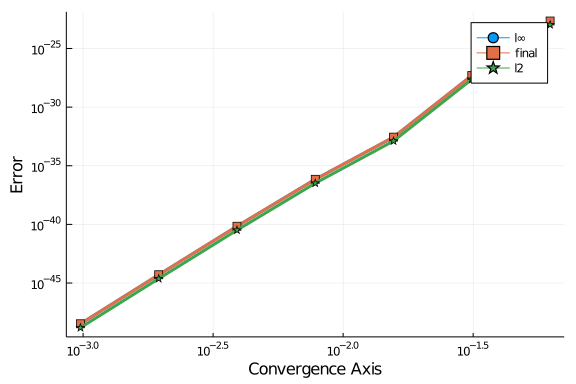

DifferentialEquations.jl includes Feagin's explicit Runge-Kutta methods of orders 10/8, 12/10, and 14/12. These methods have such high order that it's pretty much required that one uses numbers with more precision than Float64. As a prerequisite reference on how to use arbitrary number systems (including higher precision) in the numerical solvers, please see the Solving Equations in With Chosen Number Types notebook.

## Investigation of the Method's Error

We can use Feagin's order 16 method as follows. Let's use a two-dimensional linear ODE. Like in the Solving Equations in With Chosen Number Types notebook, we change the initial condition to BigFloats to tell the solver to use BigFloat types.

````julia

using DifferentialEquations
const linear_bigα = big(1.01)
f(u,p,t) = (linear_bigα*u)

# Add analytical solution so that errors are checked
f_analytic(u0,p,t) = u0*exp(linear_bigα*t)
ff = ODEFunction(f,analytic=f_analytic)
prob = ODEProblem(ff,big(0.5),(0.0,1.0))
sol = solve(prob,Feagin14(),dt=1//16,adaptive=false);
````


````
retcode: Success
Interpolation: 3rd order Hermite
t: 17-element Array{Float64,1}:
 0.0
 0.0625
 0.125
 0.1875
 0.25
 0.3125
 0.375
 0.4375
 0.5
 0.5625
 0.625
 0.6875
 0.75
 0.8125
 0.875
 0.9375
 1.0
u: 17-element Array{BigFloat,1}:
 0.50
 0.532579987953539129415175692266310012757570127936767465729988951844872703
1384926
 0.567282887137183768410176093811331902816684984885556550153431181534165966
2084392
 0.604247026395540457858840348261076470751584579123060668349121048671882781
8716904
 0.643619748077397554810695151333134437286938781958375274884622802079377793
549762
 0.685557995355440557982096349246370736930808950070979750802507189818563351
642024
 0.730228937815705933608434940588601030880998724704814215187999930588230616
9718902
 0.777810637810428680311119693945339493753691675945670302006794689942184819
812709
 0.828492760230425386904283967004764522632796405328715089108453503441096967
5378266
 0.882477328526228669757698486772395431354193449529466082277853631417758596
1942936
 0.939979529991540515340224856861894727292044008413711564360467630700841985
3257788
 1.001228573518936040932179654581424903118245024943528049619445960282439336
451516
 1.066468603246908246544672423846706082660227135054504931710469065776180175
33485
 1.135959671740132190447259472795962527154069506739201242159983984002811333
382739
 1.209978776582131731617034761065124311009358614495571372335128166979326800
445978
 1.288820964512299462579706253102020998553494397009716401282671347081826473
196884
 1.372800507508458259187784036450083092262707343306282981254591926965493411
372691
````


````julia

println(sol.errors)
````


````
Dict{Symbol,BigFloat}(:l∞ => 2.19751040342660991781470263264956056068365936
7683780324635801610297349872909655e-23,:final => 2.197510403426609917814702
632649560560683659367683780324635801610297349872909655e-23,:l2 => 1.0615015
97814768635894514677590712762248364686527596359902826841740549975688161e-23
)
````


Compare that to machine $\epsilon$ for Float64:

````julia

eps(Float64)
````


````
2.220446049250313e-16
````


The error for Feagin's method when the stepsize is 1/16 is 8 orders of magnitude below machine $\epsilon$! However, that is dependent on the stepsize. If we instead use adaptive timestepping with the default tolerances, we get

````julia

sol =solve(prob,Feagin14());
println(sol.errors); print("The length was $(length(sol))")
````


````
Dict{Symbol,BigFloat}(:l∞ => 1.54573888394314096254653759860975921981641479
0728029220638828884206395861982752e-09,:final => 1.545738883943140962546537
598609759219816414790728029220638828884206395861982752e-09,:l2 => 8.9250668
70202330409924421192162193462506388332261074725109949218067763405137993e-10
)
The length was 3
````


Notice that when the stepsize is much higher, the error goes up quickly as well. These super high order methods are best when used to gain really accurate approximations (using still modest timesteps). Some examples of where such precision is necessary is astrodynamics where the many-body problem is highly chaotic and thus sensitive to small errors.

## Convergence Test

The Order 14 method is awesome, but we need to make sure it's really that awesome. The following convergence test is used in the package tests in order to make sure the implementation is correct. Note that all methods have such tests in place.

````julia

using DiffEqDevTools
dts = 1.0 ./ 2.0 .^(10:-1:4)
sim = test_convergence(dts,prob,Feagin14())
````


````
DiffEqDevTools.ConvergenceSimulation{DiffEqBase.ODESolution{BigFloat,1,Arra
y{BigFloat,1},Array{BigFloat,1},Dict{Symbol,BigFloat},Array{Float64,1},Arra
y{Array{BigFloat,1},1},DiffEqBase.ODEProblem{BigFloat,Tuple{Float64,Float64
},false,DiffEqBase.NullParameters,DiffEqBase.ODEFunction{false,typeof(Main.
##WeaveSandBox#257.f),LinearAlgebra.UniformScaling{Bool},typeof(Main.##Weav
eSandBox#257.f_analytic),Nothing,Nothing,Nothing,Nothing,Nothing,Nothing,No
thing,Nothing,Nothing,Nothing,Nothing},Base.Iterators.Pairs{Union{},Union{}
,Tuple{},NamedTuple{(),Tuple{}}},DiffEqBase.StandardODEProblem},OrdinaryDif
fEq.Feagin14,OrdinaryDiffEq.InterpolationData{DiffEqBase.ODEFunction{false,
typeof(Main.##WeaveSandBox#257.f),LinearAlgebra.UniformScaling{Bool},typeof
(Main.##WeaveSandBox#257.f_analytic),Nothing,Nothing,Nothing,Nothing,Nothin
g,Nothing,Nothing,Nothing,Nothing,Nothing,Nothing},Array{BigFloat,1},Array{
Float64,1},Array{Array{BigFloat,1},1},OrdinaryDiffEq.Feagin14ConstantCache{
BigFloat,Float64}},DiffEqBase.DEStats}}(DiffEqBase.ODESolution{BigFloat,1,A
rray{BigFloat,1},Array{BigFloat,1},Dict{Symbol,BigFloat},Array{Float64,1},A
rray{Array{BigFloat,1},1},DiffEqBase.ODEProblem{BigFloat,Tuple{Float64,Floa
t64},false,DiffEqBase.NullParameters,DiffEqBase.ODEFunction{false,typeof(Ma
in.##WeaveSandBox#257.f),LinearAlgebra.UniformScaling{Bool},typeof(Main.##W
eaveSandBox#257.f_analytic),Nothing,Nothing,Nothing,Nothing,Nothing,Nothing
,Nothing,Nothing,Nothing,Nothing,Nothing},Base.Iterators.Pairs{Union{},Unio
n{},Tuple{},NamedTuple{(),Tuple{}}},DiffEqBase.StandardODEProblem},Ordinary
DiffEq.Feagin14,OrdinaryDiffEq.InterpolationData{DiffEqBase.ODEFunction{fal
se,typeof(Main.##WeaveSandBox#257.f),LinearAlgebra.UniformScaling{Bool},typ
eof(Main.##WeaveSandBox#257.f_analytic),Nothing,Nothing,Nothing,Nothing,Not
hing,Nothing,Nothing,Nothing,Nothing,Nothing,Nothing},Array{BigFloat,1},Arr
ay{Float64,1},Array{Array{BigFloat,1},1},OrdinaryDiffEq.Feagin14ConstantCac
he{BigFloat,Float64}},DiffEqBase.DEStats}[retcode: Success
Interpolation: 3rd order Hermite
t: [0.0, 0.0009765625, 0.001953125, 0.0029296875, 0.00390625, 0.0048828125,
 0.005859375, 0.0068359375, 0.0078125, 0.0087890625  …  0.9912109375, 0.992
1875, 0.9931640625, 0.994140625, 0.9951171875, 0.99609375, 0.9970703125, 0.
998046875, 0.9990234375, 1.0]
u: BigFloat[0.50, 0.5004934073532741442240167407783486492180603021615841294
52202794115660211219599, 0.500987301608180818440355281223188950584910597683
3766213492949239260841368026092, 0.5014816832452017142719825709983542121453
3336316613095293438972188206055292586, 0.5019765527452926697413863031219664
328338088601822445017121888607974310367490053, 0.50247191058988413716521501
79563239002143316649080207098547071166987523430816898, 0.502967757260881651
5106435191675246046427648760687772460544794831604624949834855, 0.5034640932
406662992139192389830628016370303392435659971381052766108783597241391, 0.50
396091901209518746154563970525241120918072457951989067083504574325947816539
15, 0.504458235058501913934559188511648417802868424125759953366000451921798
6099443769  …  1.3606681506044349509999505354431852352163391999270684367421
06414044679239515405, 1.362010877946183268827001169225864534157243515073039
951153177861472631409617242, 1.36335493031101930838372463784595682752195537
609659291992754149268935330476256, 1.36470030900649533914994667058892723740
3312989133498476567243275650792209901316, 1.3660470153414539424145962795447
72708050551524408051147344999020270553111340215, 1.367395050626029284574375
015655225687307700620914621502414819287823171439227302, 1.36874441617164839
1688936077411190219324498098498429005876504282210656625474981, 1.3700951132
91032425293813214601928520794629811024108089775792586183724683573052, 1.371
447143298197959472340593110913203812626370594321605117950295569839313271375
, 1.37280050750845825918780601155411735836188549033294491231479506286094526
5969766], retcode: Success
Interpolation: 3rd order Hermite
t: [0.0, 0.001953125, 0.00390625, 0.005859375, 0.0078125, 0.009765625, 0.01
171875, 0.013671875, 0.015625, 0.017578125  …  0.982421875, 0.984375, 0.986
328125, 0.98828125, 0.990234375, 0.9921875, 0.994140625, 0.99609375, 0.9980
46875, 1.0]
u: BigFloat[0.50, 0.5009873016081808184403552812231889505849105976869970947
216582055241988418330043, 0.50197655274529266974138630312196643283380886018
94997464536470643897825028575861, 0.502967757260881651510643519167524604642
764876079681602511069749881119893067103, 0.50396091901209518746154563970525
24112091807245940877416493974506008240426203329, 0.504956041863697037016356
8930910938780783930787757357867798953848057143406933377, 0.5059531296880823
345471746020389471304909424091056168364541340183078255553277085, 0.50695218
63652926583134503856740792313682294541010285050589346576968266665528748, 0.
507953215783031129154683858104667438830905843059054531062193869152593801987
2, 0.5089562218366775389970434828264868922469483072826175429449686273069735
423750136  …  1.34864301545859247967509602307176367401641641210475048875695
337449929440786918, 1.35130605029464067315359841454792588096269341231012308
6924207034022962413754022, 1.3539743435678414104792857791059277027193819496
29470176176029438646040014028995, 1.356647905661521606100766158464652339627
531793759463868102607480971985702621672, 1.35932674697951112518845216660562
3784669936757385516206254234939429597151648064, 1.3620108779461832688270011
69225864534157243520073188743602186030419166325630835, 1.364700309006495339
14994667058892723740331299415338282713705459498054912456936, 1.367395050626
029284574375015655225687307700625954299855029057120653933933847354, 1.37009
51132910324252938132146019285207946298160836390422151163694340862252063, 1.
372800507508458259187806011554117358361885495412387216596637263939057644809
585], retcode: Success
Interpolation: 3rd order Hermite
t: [0.0, 0.00390625, 0.0078125, 0.01171875, 0.015625, 0.01953125, 0.0234375
, 0.02734375, 0.03125, 0.03515625  …  0.96484375, 0.96875, 0.97265625, 0.97
65625, 0.98046875, 0.984375, 0.98828125, 0.9921875, 0.99609375, 1.0]
u: BigFloat[0.50, 0.5019765527452926697413863031219664328338089596679027919
888741103974398448576829, 0.50396091901209518746154563970525241120918092433
73910752677848686355143273445556, 0.505953129688082334547174602038947130490
9427099049813605553848314515187463009496, 0.5079532157830311291546838581046
674388309062457103293891502691351497465467261813, 0.50996120842930350923278
5259415024406524958042349110331141518638069250199676435, 0.5119771388823309
23641985750275520143854574772980860481510242829813108584126115, 0.514001038
5211008389138964373154846258498358689286147531125652428267236364526061, 0.5
160329388486451692230830905819969144868470465940686994015887118451172282452
837, 0.51807287149253063717412013329248710548519771111335349047947245099497
99099094199  …  1.324910628454177546699995024759245940440919035869353532178
274979609386868635781, 1.33014813993405462867526880344471252204348922373995
5282684225096368730900386558, 1.3354063558493198164900848637876127679604780
49811958588576423121371759005353977, 1.340685358046790322335041702613370942
319016635913214729849926370533428936466432, 1.34598522869683246090918314024
5165332509908446336022662937657343709867017771688, 1.3513060502946406731535
98414547925880962760896126504201689516014513211559127835, 1.356647905661521
606100766158464652339627599813198025862866692566448305652099871, 1.36201087
7946183268827001169225864534157312078314101084876138019637668867105307, 1.3
673950506260292845743750156552256873077697261945049092191653877874628467060
66, 1.372800507508458259187806011554117358361955140865683163444664161725836
562110807], retcode: Success
Interpolation: 3rd order Hermite
t: [0.0, 0.0078125, 0.015625, 0.0234375, 0.03125, 0.0390625, 0.046875, 0.05
46875, 0.0625, 0.0703125  …  0.9296875, 0.9375, 0.9453125, 0.953125, 0.9609
375, 0.96875, 0.9765625, 0.984375, 0.9921875, 1.0]
u: BigFloat[0.50, 0.5039609190120951874615456397052524112111879130152678185
972878772909801438539725, 0.50795321578303112915468385810466743883495202114
45279229156914347577732228682629, 0.511977138882330923641985750275520143860
6915110986662360617789298294706379239618, 0.5160329388486451692230830905819
96914495067305162617236525505000550159426923494, 0.520120868205351073036564
3024626851557639184785285451286948438374521217071188324, 0.5242411814762751
337774973218812134360586606206771934231862500076957565363308646, 0.52839413
52015403769607464142521774116458265525572890561728945609507560270251758, 0.
532579987953539129415176225095942661306833922007042413660746971902517988027
2659, 0.5367990003530323275101958345252554486169547480536807778674613463641
61391270671  …  1.278691378528666663061419567734810219225057268467188197890
749511286039814682961, 1.28882096451229946257972559447843216250288715170826
8911920429452719237031672889, 1.2990307954353467102700618873848859068511184
7286542819859803450631324042075354, 1.3093215069852207083608767825998856173
05680877664407188219768945081296125363463, 1.319693739885146473355596260460
075276820407682877165061218322278576772888141989, 1.33014813993405462867526
8803444712522700344601505102906797926571988117634577709, 1.3406853580467903
22335041702613370942986414700099829148697106600907447993876335, 1.351306050
294640673153598414547925881640827460343653263042386265204459670148168, 1.36
201087794618326882700116922586453484617428790917305214715458105432837901989
4, 1.3728005075084582591878060115541173590617414861285190771349018784370260
32283726], retcode: Success
Interpolation: 3rd order Hermite
t: [0.0, 0.015625, 0.03125, 0.046875, 0.0625, 0.078125, 0.09375, 0.109375, 
0.125, 0.140625  …  0.859375, 0.875, 0.890625, 0.90625, 0.921875, 0.9375, 0
.953125, 0.96875, 0.984375, 1.0]
u: BigFloat[0.50, 0.5079532157830311291546838581046674228648435931525498190
278213939882467623443407, 0.51603293884864516922308309058199688204679557555
37640078345474392168602557520595, 0.524241181476275133777497321881213386612
0487057078897985952628075072800031634668, 0.5325799879535391294151762250959
425943293258372491737121300708996931105182686892, 0.54105143508537636149437
50093333620112324860397855474272871650047471573253335466, 0.549657632711281
6769034687550989237307955190439443562958216377582793355171347836, 0.5584007
242307674626882271691434832264014636154224009359108553180731368099218107, 0
.56728288713718376841017722890892910914534927957669258403882463243694705413
29958, 0.576306333560029601749846103643822584449515926861513757846110140307
5168130161427  …  1.1910336808448971384801387451313626311041821234303624933
41676788830879226337858, 1.209978776582131731617051708708410892779229149607
19360099713235492900284779981, 1.229225221188223144617416241361990712052620
148424773445644365505495011922745439, 1.24877780804833135875651382983940481
9440872534223897340978037770853624093056804, 1.2686414067932693723301711234
73022743877631147466907756310015221824454321458462, 1.288820964512299462579
725594478429731261988424253379253261167688863620014837669, 1.30932150698522
0708360876782599883106227194078928307355592757175919985164258564, 1.3301481
3993405462867526880344470992985954682818207565575624581067560987566062, 1.3
513060502946406731535984145479232050719649354675944552369964535610982815942
27, 1.372800507508458259187806011554114596757211232433432893362855858032659
14211007], retcode: Success
Interpolation: 3rd order Hermite
t: [0.0, 0.03125, 0.0625, 0.09375, 0.125, 0.15625, 0.1875, 0.21875, 0.25, 0
.28125  …  0.71875, 0.75, 0.78125, 0.8125, 0.84375, 0.875, 0.90625, 0.9375,
 0.96875, 1.0]
u: BigFloat[0.50, 0.5160329388486451692230830905761645510166025236059793420
81272221990055728561679, 0.532579987953539129415176225083903894641931169817
6330530726315794171525645034893, 0.5496576327112816769034687550802866340567
114355433590002071694871709322410405931, 0.56728288713718376841017722888328
28270073935705216193322632159538121017711969774, 0.585473310815890461621019
6190827662219055210008829792702890722633372001092380584, 0.6042470263955404
578588421618108943195685209948140048324759492077870732303989337, 0.62362273
76428912250695033937265522498285111444862489660878884721013969830771631, 0.
643619748077397554810697726960708152129622579985972873985637448596666363180
053, 0.66425798020280820325088307482585132534106704873625388888034286900680
76152641046  …  1.033333846504426712082580354960107935043970613756493163451
1294626091384818214, 1.0664686032469082465446852271794933182809166964255378
32438762276651139095129374, 1.100665855046623660308919551395610359208286716
684431112070414408183611765253205, 1.13595967174013219044727424686007597453
6172903481653049159364319427066929995183, 1.1723852156432053491987697297701
67158307196511889785786439894918782978322870963, 1.209978776582131731617051
708325497527117244553498434756316642412641437610370797, 1.24877780804833135
8756513829430099007097842940139504429315922973879445769691784, 1.2888209645
1229946257972559404143259768018368155787883476891071715795301279543, 1.3301
48139934054628675268802978666438630864641254421813595879534440847470751688,
 1.372800507508458259187806011057611283394590006590596578199873499201906331
611072], retcode: Success
Interpolation: 3rd order Hermite
t: [0.0, 0.0625, 0.125, 0.1875, 0.25, 0.3125, 0.375, 0.4375, 0.5, 0.5625, 0
.625, 0.6875, 0.75, 0.8125, 0.875, 0.9375, 1.0]
u: BigFloat[0.50, 0.5325799879535391294151756922663100127575701279367674657
299889518448727031384926, 0.56728288713718376841017609381133190281668498488
55565501534311815341659662084392, 0.604247026395540457858840348261076470751
5845791230606683491210486718827818716904, 0.6436197480773975548106951513331
34437286938781958375274884622802079377793549762, 0.685557995355440557982096
349246370736930808950070979750802507189818563351642024, 0.73022893781570593
36084349405886010308809987247048142151879999305882306169718902, 0.777810637
810428680311119693945339493753691675945670302006794689942184819812709, 0.82
849276023042538690428396700476452263279640532871508910845350344109696753782
66, 0.882477328526228669757698486772395431354193449529466082277853631417758
5961942936, 0.9399795299915405153402248568618947272920440084137115643604676
307008419853257788, 1.00122857351893604093217965458142490311824502494352804
9619445960282439336451516, 1.0664686032469082465446724238467060826602271350
5450493171046906577618017533485, 1.1359596717401321904472594727959625271540
69506739201242159983984002811333382739, 1.209978776582131731617034761065124
311009358614495571372335128166979326800445978, 1.28882096451229946257970625
3102020998553494397009716401282671347081826473196884, 1.3728005075084582591
87784036450083092262707343306282981254591926965493411372691]], Dict{Any,Any
}(:l∞ => BigFloat[3.3543545459629930177501679382781291302012408187338947472
46416797762893693012556e-49, 5.07977773973643850037988739563364757867015516
067866884666732578123388975047482e-45, 6.9650533073686584465398166666312934
86902250519752824131061460869466635839790668e-41, 6.99855995795909600274703
1148778557831077884643242480170494801380170765753974579e-37, 2.761604674257
899176583497342905526511107065867988065457455490380825745507598647e-33, 4.9
650607496729548374201289866032526435726391756486604232601712118906759519607
09e-28, 2.19751040342660991781470263264956056068365936768378032463580161029
7349872909655e-23],:final => BigFloat[3.35435454596299301775016793827812913
0201240818733894747246416797762893693012556e-49, 5.079777739736438500379887
39563364757867015516067866884666732578123388975047482e-45, 6.96505330736865
8446539816666631293486902250519752824131061460869466635839790668e-41, 6.998
559957959096002747031148778557831077884643242480170494801380170765753974579
e-37, 2.7616046742578991765834973429055265111070658679880654574554903808257
45507598647e-33, 4.96506074967295483742012898660325264357263917564866042326
0171211890675951960709e-28, 2.197510403426609917814702632649560560683659367
683780324635801610297349872909655e-23],:l2 => BigFloat[1.557658061895966325
846207347700821566122250234951867982385249845278493662676944e-49, 2.3604116
57197547333498547223212880765989953910523198376084992961121455787643313e-45
, 3.24060760516074676637178554271828070823716806609832930426777898390162348
7961701e-41, 3.264565979149024498598621687244084221464920048688554495210368
172485686228822379e-37, 1.2947776667473864852636114197311110560713898649841
76915402703871046417929063523e-33, 2.35148503019100306142594944698233564880
1181524332244933545614443786091245762492e-28, 1.061501597814768635894514677
590712762248364686527596359902826841740549975688161e-23]), 7, Dict(:dts => 
[0.0009765625, 0.001953125, 0.00390625, 0.0078125, 0.015625, 0.03125, 0.062
5]), Dict{Any,Any}(:l∞ => 14.2933275461038524350008931328481604055650481625
4374715376150534187461411604701,:final => 14.293327546103852435000893132848
16040556504816254374715376150534187461411604701,:l2 => 14.30280974051840423
232019057634315242594313233119811212889763182960978082577156), [0.000976562
5, 0.001953125, 0.00390625, 0.0078125, 0.015625, 0.03125, 0.0625])
````


For a view of what's going on, let's plot the simulation results.

````julia

using Plots
gr()
plot(sim)
````





This is a clear trend indicating that the convergence is truly Order 14, which
is the estimated slope.


## Appendix

 This tutorial is part of the SciMLTutorials.jl repository, found at: <https://github.com/SciML/SciMLTutorials.jl>.
 For more information on doing scientific machine learning (SciML) with open source software, check out <https://sciml.ai/>.

To locally run this tutorial, do the following commands:
```
using SciMLTutorials
SciMLTutorials.weave_file("ode_extras","02-feagin.jmd")
```

Computer Information:
```
Julia Version 1.4.2
Commit 44fa15b150* (2020-05-23 18:35 UTC)
Platform Info:
  OS: Linux (x86_64-pc-linux-gnu)
  CPU: Intel(R) Core(TM) i7-9700K CPU @ 3.60GHz
  WORD_SIZE: 64
  LIBM: libopenlibm
  LLVM: libLLVM-8.0.1 (ORCJIT, skylake)
Environment:
  JULIA_LOAD_PATH = /builds/JuliaGPU/DiffEqTutorials.jl:
  JULIA_DEPOT_PATH = /builds/JuliaGPU/DiffEqTutorials.jl/.julia
  JULIA_CUDA_MEMORY_LIMIT = 2147483648
  JULIA_NUM_THREADS = 8

```

Package Information:

```
Status `/builds/JuliaGPU/DiffEqTutorials.jl/tutorials/ode_extras/Project.toml`
[f3b72e0c-5b89-59e1-b016-84e28bfd966d] DiffEqDevTools 2.27.0
[0c46a032-eb83-5123-abaf-570d42b7fbaa] DifferentialEquations 6.15.0
[961ee093-0014-501f-94e3-6117800e7a78] ModelingToolkit 3.20.0
[76087f3c-5699-56af-9a33-bf431cd00edd] NLopt 0.6.0
[2774e3e8-f4cf-5e23-947b-6d7e65073b56] NLsolve 4.4.1
[429524aa-4258-5aef-a3af-852621145aeb] Optim 1.0.0
[1dea7af3-3e70-54e6-95c3-0bf5283fa5ed] OrdinaryDiffEq 5.42.7
[91a5bcdd-55d7-5caf-9e0b-520d859cae80] Plots 1.6.3
[37e2e46d-f89d-539d-b4ee-838fcccc9c8e] LinearAlgebra
[2f01184e-e22b-5df5-ae63-d93ebab69eaf] SparseArrays
```
