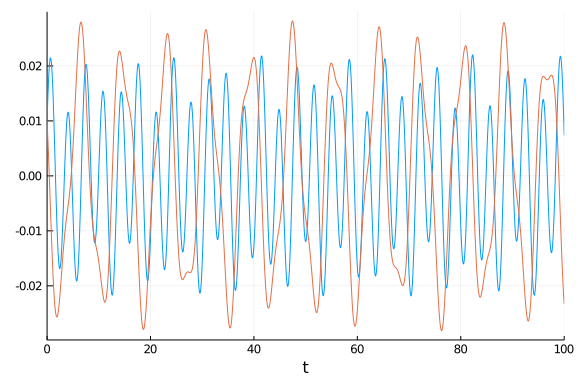
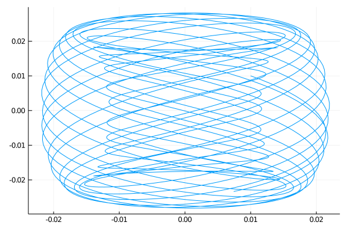

### Setup

In this tutorial we will show how to use Optim.jl to find the maxima and minima of solutions. Let's take a look at the double pendulum:

````julia
#Constants and setup
using OrdinaryDiffEq
initial = [0.01, 0.01, 0.01, 0.01]
tspan = (0.,100.)

#Define the problem
function double_pendulum_hamiltonian(udot,u,p,t)
    α  = u[1]
    lα = u[2]
    β  = u[3]
    lβ = u[4]
    udot .=
    [2(lα-(1+cos(β))lβ)/(3-cos(2β)),
    -2sin(α) - sin(α+β),
    2(-(1+cos(β))lα + (3+2cos(β))lβ)/(3-cos(2β)),
    -sin(α+β) - 2sin(β)*(((lα-lβ)lβ)/(3-cos(2β))) + 2sin(2β)*((lα^2 - 2(1+cos(β))lα*lβ + (3+2cos(β))lβ^2)/(3-cos(2β))^2)]
end

#Pass to solvers
poincare = ODEProblem(double_pendulum_hamiltonian, initial, tspan)
````


````
ODEProblem with uType Array{Float64,1} and tType Float64. In-place: true
timespan: (0.0, 100.0)
u0: [0.01, 0.01, 0.01, 0.01]
````


````julia
sol = solve(poincare, Tsit5())
````


````
retcode: Success
Interpolation: specialized 4th order "free" interpolation
t: 193-element Array{Float64,1}:
   0.0
   0.08332584852065579
   0.24175300587841853
   0.4389533535703127
   0.6797301355043014
   0.9647629621490508
   1.3179425637594349
   1.7031226016307728
   2.0678503967116617
   2.4717899847517866
   ⋮
  95.8457309586563
  96.3577910122243
  96.92913461915474
  97.44679415429573
  97.96248479179103
  98.51183391850897
  99.0608253308051
  99.58284388126884
 100.0
u: 193-element Array{Array{Float64,1},1}:
 [0.01, 0.01, 0.01, 0.01]
 [0.00917068738040534, 0.0066690004553842845, 0.012420525490765832, 0.00826
6408515192912]
 [0.007673275265972518, 0.00037461737897660346, 0.016442590227730366, 0.004
636827483318282]
 [0.0061259744192393014, -0.007305450189721184, 0.01996737108423187, -0.000
33649798308967233]
 [0.0049661106627111465, -0.01630851653373806, 0.021440659476204688, -0.006
705037098400459]
 [0.004795568331019467, -0.026238103489235838, 0.018824325208837592, -0.013
913364556753717]
 [0.006054679825355352, -0.037124551879080515, 0.010055702788069582, -0.021
038127478647355]
 [0.007900784412908595, -0.04667606960847389, -0.002673581831574413, -0.025
183036272033735]
 [0.008276510489473131, -0.05278433365633968, -0.012731546444725274, -0.025
25804037623959]
 [0.005523496816741225, -0.055252504144926044, -0.01684388188262178, -0.021
898963191274146]
 ⋮
 [-0.01488675115478854, 0.042332758272484804, 0.013628283258009553, 0.01802
9082291418783]
 [-0.008190258536392677, 0.0544226798044097, 0.009448013826703633, 0.017740
06800908162]
 [0.004124711787696242, 0.056748788205059394, -0.005154187391921515, 0.0175
9698310394298]
 [0.013079718118471311, 0.04807704307739497, -0.013770661225089886, 0.01828
6648610391705]
 [0.01531604024144831, 0.0316309595575519, -0.008956991644883512, 0.0171184
0404984504]
 [0.011115490017374378, 0.009929018220630217, 0.0072974814212210725, 0.0103
53371812537737]
 [0.005713878919291268, -0.011787427051187304, 0.02050806401368939, -0.0023
104589058526802]
 [0.0042114397261269225, -0.029911199361470082, 0.01875044642290467, -0.015
65071229490751]
 [0.005741239607321662, -0.04165385985159511, 0.007413270184092719, -0.0233
48978525280305]
````


In time, the solution looks like:

````julia
using Plots; gr()
plot(sol, vars=[(0,3),(0,4)], leg=false, plotdensity=10000)
````





while it has the well-known phase-space plot:

````julia
plot(sol, vars=(3,4), leg=false)
````





### Local Optimization

Let's fine out what some of the local maxima and minima are. Optim.jl can be used to minimize functions, and the solution type has a continuous interpolation which can be used. Let's look for the local optima for the 4th variable around `t=20`. Thus our optimization function is:

````julia
f = (t) -> sol(t,idxs=4)
````


````
#1 (generic function with 1 method)
````


`first(t)` is the same as `t[1]` which transforms the array of size 1 into a number. `idxs=4` is the same as `sol(first(t))[4]` but does the calculation without a temporary array and thus is faster. To find a local minima, we can simply call Optim on this function. Let's find a local minimum:

````julia
using Optim
````


````
Error: ArgumentError: Package Optim not found in current path:
- Run `import Pkg; Pkg.add("Optim")` to install the Optim package.
````


````julia
opt = optimize(f,18.0,22.0)
````


````
Error: UndefVarError: optimize not defined
````


From this printout we see that the minimum is at `t=18.63` and the value is `-2.79e-2`. We can get these in code-form via:

````julia
println(opt.minimizer)
````


````
Error: UndefVarError: opt not defined
````


````julia
println(opt.minimum)
````


````
Error: UndefVarError: opt not defined
````


To get the maximum, we just minimize the negative of the function:

````julia
f = (t) -> -sol(first(t),idxs=4)
opt2 = optimize(f,0.0,22.0)
````


````
Error: UndefVarError: optimize not defined
````


Let's add the maxima and minima to the plots:

````julia
plot(sol, vars=(0,4), plotdensity=10000)
scatter!([opt.minimizer],[opt.minimum],label="Local Min")
````


````
Error: UndefVarError: opt not defined
````


````julia
scatter!([opt2.minimizer],[-opt2.minimum],label="Local Max")
````


````
Error: UndefVarError: opt2 not defined
````


Brent's method will locally minimize over the full interval. If we instead want a local maxima nearest to a point, we can use `BFGS()`. In this case, we need to optimize a vector `[t]`, and thus dereference it to a number using `first(t)`.

````julia
f = (t) -> -sol(first(t),idxs=4)
opt = optimize(f,[20.0],BFGS())
````


````
Error: UndefVarError: BFGS not defined
````


### Global Optimization

If we instead want to find global maxima and minima, we need to look somewhere else. For this there are many choices. A pure Julia option is BlackBoxOptim.jl, but I will use NLopt.jl. Following the NLopt.jl tutorial but replacing their function with out own:

````julia
import NLopt, ForwardDiff
````


````
Error: ArgumentError: Package NLopt not found in current path:
- Run `import Pkg; Pkg.add("NLopt")` to install the NLopt package.
````


````julia

count = 0 # keep track of # function evaluations

function g(t::Vector, grad::Vector)
  if length(grad) > 0
    #use ForwardDiff for the gradients
    grad[1] = ForwardDiff.derivative((t)->sol(first(t),idxs=4),t)
  end
  sol(first(t),idxs=4)
end
opt = NLopt.Opt(:GN_ORIG_DIRECT_L, 1)
````


````
Error: UndefVarError: NLopt not defined
````


````julia
NLopt.lower_bounds!(opt, [0.0])
````


````
Error: UndefVarError: NLopt not defined
````


````julia
NLopt.upper_bounds!(opt, [40.0])
````


````
Error: UndefVarError: NLopt not defined
````


````julia
NLopt.xtol_rel!(opt,1e-8)
````


````
Error: UndefVarError: NLopt not defined
````


````julia
NLopt.min_objective!(opt, g)
````


````
Error: UndefVarError: NLopt not defined
````


````julia
(minf,minx,ret) = NLopt.optimize(opt,[20.0])
````


````
Error: UndefVarError: NLopt not defined
````


````julia
println(minf," ",minx," ",ret)
````


````
Error: UndefVarError: minf not defined
````


````julia
NLopt.max_objective!(opt, g)
````


````
Error: UndefVarError: NLopt not defined
````


````julia
(maxf,maxx,ret) = NLopt.optimize(opt,[20.0])
````


````
Error: UndefVarError: NLopt not defined
````


````julia
println(maxf," ",maxx," ",ret)
````


````
Error: UndefVarError: maxf not defined
````


````julia
plot(sol, vars=(0,4), plotdensity=10000)
scatter!([minx],[minf],label="Global Min")
````


````
Error: UndefVarError: minx not defined
````


````julia
scatter!([maxx],[maxf],label="Global Max")
````


````
Error: UndefVarError: maxx not defined
````


## Appendix

 This tutorial is part of the DiffEqTutorials.jl repository, found at: <https://github.com/JuliaDiffEq/DiffEqTutorials.jl>

To locally run this tutorial, do the following commands:
```
using DiffEqTutorials
DiffEqTutorials.weave_file("ode_extras","03-ode_minmax.jmd")
```

Computer Information:
```
Julia Version 1.4.2
Commit 44fa15b150* (2020-05-23 18:35 UTC)
Platform Info:
  OS: Linux (x86_64-pc-linux-gnu)
  CPU: Intel(R) Core(TM) i7-9700K CPU @ 3.60GHz
  WORD_SIZE: 64
  LIBM: libopenlibm
  LLVM: libLLVM-8.0.1 (ORCJIT, skylake)
Environment:
  JULIA_DEPOT_PATH = /builds/JuliaGPU/DiffEqTutorials.jl/.julia
  JULIA_CUDA_MEMORY_LIMIT = 536870912
  JULIA_PROJECT = @.
  JULIA_NUM_THREADS = 4

```

Package Information:

```
Status `/builds/JuliaGPU/DiffEqTutorials.jl/tutorials/ode_extras/Project.toml`
[961ee093-0014-501f-94e3-6117800e7a78] ModelingToolkit 3.11.0
[2774e3e8-f4cf-5e23-947b-6d7e65073b56] NLsolve 4.4.0
[1dea7af3-3e70-54e6-95c3-0bf5283fa5ed] OrdinaryDiffEq 5.41.0
[91a5bcdd-55d7-5caf-9e0b-520d859cae80] Plots 1.5.0
[37e2e46d-f89d-539d-b4ee-838fcccc9c8e] LinearAlgebra
[2f01184e-e22b-5df5-ae63-d93ebab69eaf] SparseArrays
```
