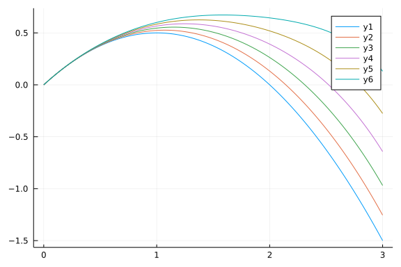
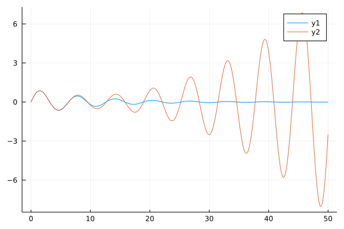

## Prelims

In the previous tutorial, *Mixed Symbolic/Numerical Methods for Perturbation Theory - Algebraic Equations*, we discussed how to solve algebraic equations using **Symbolics.jl**. Here, our goal is to extend the method to differential equations. First, we import the following helper functions that were introduced in *Mixed Symbolic/Numerical Methods for Perturbation Theory - Algebraic Equations*.

```julia
using Symbolics, SymbolicUtils

def_taylor(x, ps) = sum([a*x^i for (i,a) in enumerate(ps)])
def_taylor(x, ps, p₀) = p₀ + def_taylor(x, ps)

function collect_powers(eq, x, ns; max_power=100)
    eq = substitute(expand(eq), Dict(x^j => 0 for j=last(ns)+1:max_power))

    eqs = []
    for i in ns
        powers = Dict(x^j => (i==j ? 1 : 0) for j=1:last(ns))
        push!(eqs, substitute(eq, powers))
    end
    eqs
end

function solve_coef(eqs, ps)
    vals = Dict()

    for i = 1:length(ps)
        eq = substitute(eqs[i], vals)
        vals[ps[i]] = Symbolics.solve_for(eq ~ 0, ps[i])
    end
    vals
end
```

```
solve_coef (generic function with 1 method)
```


## The Trajectory of a Ball!

In the first two examples, we applied the perturbation method to algebraic problems. However, the main power of the perturbation method is to solve differential equations (usually ODEs, but also occasionally PDEs). Surprisingly, the main procedure developed to solve algebraic problems works well for differential equations. In fact, we will use the same two helper functions, `collect_powers` and `solve_coef`. The main difference is in the way we expand the dependent variables. For algebraic problems, the coefficients of $\epsilon$ are constants; whereas, for differential equations, they are functions of the dependent variable (usually time).

As the first ODE example, we have chosen a simple and well-behaved problem, which is a variation of a standard first-year physics problem: what is the trajectory of an object (say, a ball or a rocket) thrown vertically at velocity $v$ from the surface of a planet? Assuming a constant acceleration of gravity, $g$, every burgeoning physicist knows the answer: $x(t) = x(0) + vt - \frac{1}{2}gt^2$. However, what happens if $g$ is not constant? Specifically, $g$ is inversely proportional to the distant from the center of the planet. If $v$ is large and the projectile travels a large fraction of the radius of the planet, the assumption of constant gravity does not hold anymore. However, unless $v$ is large compared to the escape velocity, the correction is usually small. After simplifications and change of variables to dimensionless, the problem becomes

$$
  \ddot{x}(t) = -\frac{1}{(1 + \epsilon x(t))^2}
  \,,
$$

with the initial conditions $x(0) = 0$, and $\dot{x}(0) = 1$. Note that for $\epsilon = 0$, this equation transforms back to the standard one. Let's start with defining the variables

```julia
n = 2
@variables ϵ t y[0:n](t) ∂∂y[0:n]
```

```
4-element Vector{Any}:
 ϵ
 t
  Symbolics.Num[y₀(t), y₁(t), y₂(t)]
  Symbolics.Num[∂∂y₀, ∂∂y₁, ∂∂y₂]
```


Next, we define $x$.

```julia
x = def_taylor(ϵ, y[2:end], y[1])
```

```
y₀(t) + ϵ*y₁(t) + y₂(t)*(ϵ^2)
```


We need the second derivative of `x`. It may seem that we can do this using `Differential(t)`; however, this operation needs to wait for a few steps because we need to manipulate the differentials as separate variables. Instead, we define dummy variables `∂∂y` as the placeholder for the second derivatives and define

```julia
∂∂x = def_taylor(ϵ, ∂∂y[2:end], ∂∂y[1])
```

```
∂∂y₀ + ϵ*∂∂y₁ + ∂∂y₂*(ϵ^2)
```


as the second derivative of `x`. After rearrangement, our governing equation is $\ddot{x}(t)(1 + \epsilon x(t))^{-2} + 1 = 0$, or

```julia
eq = ∂∂x * (1 + ϵ*x)^2 + 1
```

```
1 + (∂∂y₀ + ϵ*∂∂y₁ + ∂∂y₂*(ϵ^2))*((1 + ϵ*(y₀(t) + ϵ*y₁(t) + y₂(t)*(ϵ^2)))^2
)
```


The next two steps are the same as the ones for algebraic equations (note that we pass `0:n` to `collect_powers` because the zeroth order term is needed here)

```julia
eqs = collect_powers(eq, ϵ, 0:n)
```

```
3-element Vector{Any}:
                                                     1 + ∂∂y₀
                                1 + ∂∂y₀ + ∂∂y₁ + 2∂∂y₀*y₀(t)
 1 + ∂∂y₀ + ∂∂y₂ + ∂∂y₀*(y₀(t)^2) + 2∂∂y₀*y₁(t) + 2∂∂y₁*y₀(t)
```


and,

```julia
vals = solve_coef(eqs, ∂∂y)
```

```
Dict{Any, Any} with 3 entries:
  ∂∂y₁ => 2.0y₀(t)
  ∂∂y₂ => 2.0y₁(t) - (3.0(y₀(t)^2))
  ∂∂y₀ => -1.0
```


Our system of ODEs is forming. Now is the time to convert `∂∂`s to the correct **Symbolics.jl** form by substitution:

```julia
D = Differential(t)
subs = Dict(∂∂y[i] => D(D(y[i])) for i in eachindex(y))
eqs = [substitute(first(v), subs) ~ substitute(last(v), subs) for v in vals]
```

```
3-element Vector{Symbolics.Equation}:
 Differential(t)(Differential(t)(y₁(t))) ~ 2.0y₀(t)
 Differential(t)(Differential(t)(y₂(t))) ~ 2.0y₁(t) - (3.0(y₀(t)^2))
 Differential(t)(Differential(t)(y₀(t))) ~ -1.0
```


We are nearly there! From this point on, the rest is standard ODE solving procedures. Potentially we can use a symbolic ODE solver to find a closed form solution to this problem. However, **Symbolics.jl** currently does not support this functionality. Instead, we solve the problem numerically. We form an `ODESystem`, lower the order (convert second derivatives to first), generate an `ODEProblem` (after passing the correct initial conditions), and, finally, solve it.

```julia
using ModelingToolkit, DifferentialEquations

sys = ODESystem(eqs, t)
sys = ode_order_lowering(sys)
states(sys)
```

```
6-element Vector{Any}:
 y₁ˍt(t)
 y₂ˍt(t)
 y₀ˍt(t)
 y₁(t)
 y₂(t)
 y₀(t)
```


```julia
# the initial conditions
# everything is zero except the initial velocity
u0 = zeros(2n+2)
u0[3] = 1.0   # y₀ˍt

prob = ODEProblem(sys, u0, (0, 3.0))
sol = solve(prob; dtmax=0.01)
```

```
retcode: Success
Interpolation: automatic order switching interpolation
t: 302-element Vector{Float64}:
 0.0
 0.0009990005004983772
 0.010989005505482149
 0.020989005505482147
 0.03098900550548215
 0.04098900550548215
 0.05098900550548215
 0.060989005505482155
 0.07098900550548215
 0.08098900550548215
 ⋮
 2.920989005505464
 2.930989005505464
 2.9409890055054637
 2.9509890055054635
 2.9609890055054633
 2.970989005505463
 2.980989005505463
 2.9909890055054627
 3.0
u: 302-element Vector{Vector{Float64}}:
 [0.0, 0.0, 1.0, 0.0, 0.0, 0.0]
 [9.976696651635089e-7, -9.96091672587352e-10, 0.9990009994995016, 3.322518
3183212947e-10, -2.488196097577267e-13, 0.0009985014994983792]
 [0.00012031590433746151, -1.313675024660254e-6, 0.9890109944945178, 4.4112
24493041101e-7, -3.6163136458534604e-9, 0.010928626384482389]
 [0.00043745619814322776, -9.069307488622044e-6, 0.9790109944945178, 3.0659
81129291793e-6, -4.777432914805544e-8, 0.02076873632942756]
 [0.0009503986908478969, -2.891919290301644e-5, 0.9690109944945178, 9.84292
0408498354e-6, -2.253405719858556e-7, 0.030508846274372736]
 [0.0016571433824514696, -6.62992778592017e-5, 0.9590109944945178, 2.271996
227591275e-5, -6.846158733026939e-7, 0.04014895621931791]
 [0.0025556902729539453, -0.0001264323265297471, 0.9490109944945178, 4.3625
12872052407e-5, -1.6271927847283168e-6, 0.04968906616426308]
 [0.0036440393623553254, -0.0002143301206684335, 0.9390109944945177, 7.4466
44173132131e-5, -3.3058347541908906e-6, 0.05912917610920825]
 [0.004920190650655609, -0.0003347956596102526, 0.9290109944945177, 0.00011
713192329729352, -6.022377301729108e-6, 0.06846928605415342]
 [0.006382144137854795, -0.0004924253602714071, 0.9190109944945177, 0.00017
348959540742975, -1.0125651195304294e-5, 0.0777093959990986]
 ⋮
 [0.22471192394104525, 2.8247253103418704, -1.9209890055054843, 2.240961476
3951557, 1.8060647625748494, -1.3450993796364734]
 [0.1976175041144319, 2.814507114834879, -1.9309890055054844, 2.24307344453
3601, 1.8342621940922712, -1.3643592696915283]
 [0.17013688648671746, 2.8027476697776446, -1.9409890055054844, 2.244912539
151441, 1.8623497674202474, -1.3837191597465832]
 [0.14226807105790193, 2.789410746307444, -1.9509890055054844, 2.2464748882
70665, 1.8903118892738933, -1.403179049801638]
 [0.11400905782798529, 2.7744596885439723, -1.9609890055054844, 2.247756599
913262, 1.9181326019464422, -1.422738939856693]
 [0.08535784679696758, 2.757857411389343, -1.9709890055054844, 2.2487537621
01221, 1.94579557902807, -1.4423988299117478]
 [0.05631243796484875, 2.7395663983280887, -1.9809890055054844, 2.249462442
856531, 1.9732841211027194, -1.4621587199668027]
 [0.026870831331628833, 2.7195486992271602, -1.9909890055054844, 2.24987869
0201181, 2.000581151422923, -1.4820186100218575]
 [-6.521976042861373e-14, 2.6999999999999384, -2.0000000000000218, 2.249999
999999993, 2.024999999999945, -1.5000000000000422]
```


Finally, we calculate the solution to the problem as a function of `ϵ` by substituting the solution to the ODE system back into the defining equation for `x`. Note that `𝜀` is a number, compared to `ϵ`, which is a symbolic variable.

```julia
X = 𝜀 -> sum([𝜀^(i-1) * sol[y[i]] for i in eachindex(y)])
```

```
#16 (generic function with 1 method)
```


Using `X`, we can plot the trajectory for a range of $𝜀$s.

```julia
using Plots

plot(sol.t, hcat([X(𝜀) for 𝜀 = 0.0:0.1:0.5]...))
```




As expected, as `𝜀` becomes larger (meaning the gravity is less with altitude), the object goes higher and stays up for a longer duration. Of course, we could have solved the problem directly using as ODE solver. One of the benefits of the perturbation method is that we need to run the ODE solver only once and then can just calculate the answer for different values of `𝜀`; whereas, if we had used the direct method, we would need to run the solver once for each value of `𝜀`.

## A Weakly Nonlinear Oscillator

For the next example, we have chosen a simple example from a very important class of problems, the nonlinear oscillators. As we will see, perturbation theory has difficulty providing a good solution to this problem, but the process is instructive. This example closely follows the chapter 7.6 of *Nonlinear Dynamics and Chaos* by Steven Strogatz.

The goal is to solve $\ddot{x} + 2\epsilon\dot{x} + x = 0$, where the dot signifies time-derivatives and the initial conditions are $x(0) = 0$ and $\dot{x}(0) = 1$. If $\epsilon = 0$, the problem reduces to the simple linear harmonic oscillator with the exact solution $x(t) = \sin(t)$. We follow the same steps as the previous example.

```julia
n = 2
@variables ϵ t y[0:n](t) ∂y[0:n] ∂∂y[0:n]
x = def_taylor(ϵ, y[2:end], y[1])  
∂x = def_taylor(ϵ, ∂y[2:end], ∂y[1])  
∂∂x = def_taylor(ϵ, ∂∂y[2:end], ∂∂y[1])
```

```
∂∂y₀ + ϵ*∂∂y₁ + ∂∂y₂*(ϵ^2)
```


This time we also need the first derivative terms. Continuing,

```julia
eq = ∂∂x + 2*ϵ*∂x + x
eqs = collect_powers(eq, ϵ, 0:n)
vals = solve_coef(eqs, ∂∂y)
```

```
Dict{Any, Any} with 3 entries:
  ∂∂y₁ => -2.0∂y₀ - y₁(t)
  ∂∂y₂ => -2.0∂y₁ - y₂(t)
  ∂∂y₀ => -y₀(t)
```


Next, we need to replace `∂`s and `∂∂`s with their **Symbolics.jl** counterparts:

```julia
D = Differential(t)
subs1 = Dict(∂y[i] => D(y[i]) for i in eachindex(y))
subs2 = Dict(∂∂y[i] => D(D(y[i])) for i in eachindex(y))
subs = subs1 ∪ subs2
eqs = [substitute(first(v), subs) ~ substitute(last(v), subs) for v in vals]
```

```
3-element Vector{Symbolics.Equation}:
 Differential(t)(Differential(t)(y₁(t))) ~ -y₁(t) - (2.0Differential(t)(y₀(
t)))
 Differential(t)(Differential(t)(y₂(t))) ~ -y₂(t) - (2.0Differential(t)(y₁(
t)))
 Differential(t)(Differential(t)(y₀(t))) ~ -y₀(t)
```


We continue with converting 'eqs' to an `ODEProblem`, solving it, and finally plot the results against the exact solution to the original problem, which is $x(t, \epsilon) = (1 - \epsilon)^{-1/2} e^{-\epsilon t} \sin((1- \epsilon^2)^{1/2}t)$,

```julia
sys = ODESystem(eqs, t)
sys = ode_order_lowering(sys)
```

```
Model ##ODESystem#1982 with 6 equations
States (6):
  y₁ˍt(t)
  y₂ˍt(t)
  y₀ˍt(t)
  y₁(t)
⋮
Parameters (0):
```


```julia
# the initial conditions
u0 = zeros(2n+2)
u0[3] = 1.0   # y₀ˍt

prob = ODEProblem(sys, u0, (0, 50.0))
sol = solve(prob; dtmax=0.01)

X = 𝜀 -> sum([𝜀^(i-1) * sol[y[i]] for i in eachindex(y)])  
T = sol.t
Y = 𝜀 -> exp.(-𝜀*T) .* sin.(sqrt(1 - 𝜀^2)*T) / sqrt(1 - 𝜀^2)    # exact solution

plot(sol.t, [Y(0.1), X(0.1)])
```




The figure is similar to Figure 7.6.2 in *Nonlinear Dynamics and Chaos*. The two curves fit well for the first couple of cycles, but then the perturbation method curve diverges from the true solution. The main reason is that the problem has two or more time-scales that introduce secular terms in the solution. One solution is to explicitly account for the two time scales and use an analytic method called *two-timing*.
